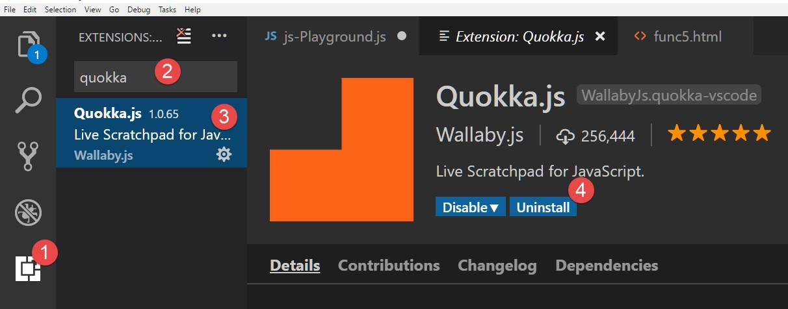
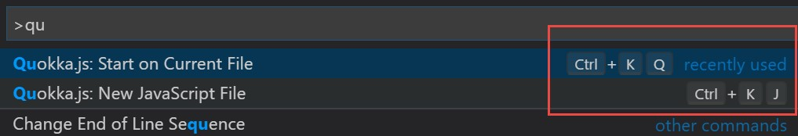
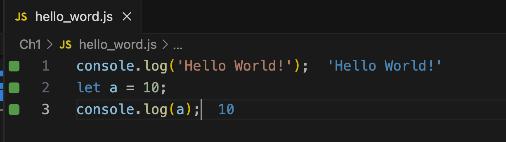
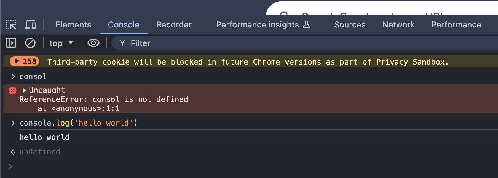
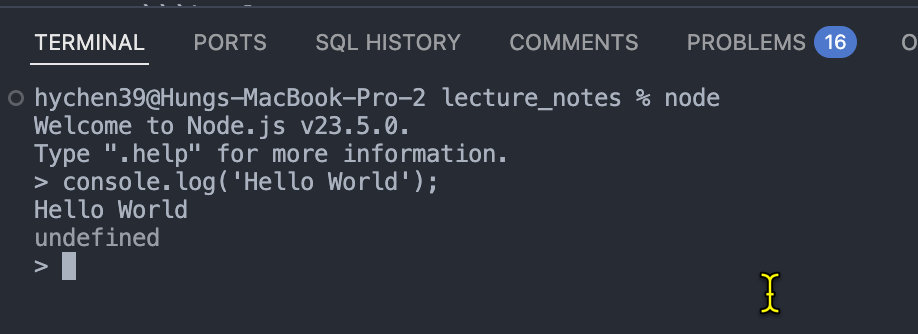

<style>
.horizontal-list {
  display: flex;
  flex-direction: row;
}

.horizontal-list li {
  margin-right: 40px; /* adds spacing between each list item */
}

</style>

# Chapter 1 Getting started with JavaScript (JS)

### Learning Objectives

- Set up your environment: Installing Node.js, Visual Studio Code, and Quokka.js plugin
- Run JS code in the console and HTML page
- Add JS to a web page using internal, external, and inline JS
- Know when browsers fetch and execute JS code

## Set up your environment: Installing Node.js, VSCode and Quokka.js plugin

### Setup your environment: Installing Node.js, VSCode and Quokka.js plugin 

- Node.js is a JS runtime that allows you to run JS code outside of a browser.
  - Download and install [Node.js](https://nodejs.org/en/)

- Visual Studio Code (VSCode) is a popular code editor.
  - Download and install [Visual Studio Code (VSCode) for windows](https://code.visualstudio.com/download)

- Quokka.js is a VSCode plugin that allows you to see the result of your JS code immediately as you type.


### Install Quokka.js extension in VSCode

Download and install Quokka.js extension in VSCode.

Search for Quokka.js in the VSCode extension marketplace and install it.



---

Quokka shortcuts:
* Cmd/Ctrl+K,Q:  Start/restart Quokka on an existing file.
* Cmd/Ctrl+K,J:  To open a new Quokka file for JS. 



---


Active the Quokka to see the result of your JS code immediately as you type.



## Run JS code in console

### How does the browser understand JS?

- JS is an interpreted language: the computer understands it while running it.
- Each browser embeds a JS engine that interprets and executes JS code.
  - Implementation of the ECMAScript standard (spec).
  - The current standard is ECMAScript 2024 (ES 15 edition, or ES15 in short).
- Different browsers might have different JS engines that add additional features to the standard.


### Run JS code in the browser console

- Run JS statements directly in the browser console.
- Open the browser console by pressing `F12` or `Ctrl+Shift+I`.

Scenarios:
- quickly test a JS statement, or
- debug or modify your page.



### Run JS code in the Node.js environment

- Run JS code in the Node.js environment.
- Open the terminal and type `node` to enter the Node.js environment.
- Type JS statements directly in the Node.js environment.
- Or, run a JS file by typing `node filename.js`.




## Add JS code to a web page

- Add JS code to a web page to make it interactive.
- There are three ways to add JS to a web page:

1. Internal(Direct): Add JS code within the `<script>` tag in the HTML file.
2. External: Add JS code in an external file and link it to the HTML file.
3. Inline: Add JS code directly to the attribute of an HTML element.

### Inline JS

- Add JS code directly to the `onXXX` attribute of an HTML element.
- The JS code is executed when the event occurs.
  - Example: `onclick`, `onmouseover`, `onchange`, etc.

```html
...
<body>
  <p>Welcome to my first web page!</p>
  <button onclick="alert('Hello World!')">Click me</button>
</body>
...
```


### Disadvantages of inline JS

When JS code are getting longer and complex:
- Mixing HTML and JS code makes the code difficult to read and maintain.
- Being difficult to reuse the JS code in multiple HTML files.


### Internal JS

- Move the complex JS code to a separate `<script>` tag in the HTML file.

```html
  <body>
     <script>
      function displayMessage(name) {
        let message = 'Hello, ' + name + '!';
        alert(message);
      }
    </script>

    <p>Welcome to my first web page!</p>

    <button onclick="displayMessage('John')">Click me</button>

    <script>
      alert('Message from internal JS!');
    </script>
  </body>
```

---

For the above code:
- The order of execution of the JS code is from top to bottom. 
  - define the `displayMessage()` function first, 
  - then, show the alert message in the second `<script>` tag.
- The browser executes the JS code when it encounters the `<script>` tag.
- `alert()` is a JS function that displays a dialog box with a message.


### Disadvantages of internal JS
- The JS code is still mixed with the HTML code.
- The JS code is not reusable in multiple HTML files.


### External JS

- Move the JS code to an external file and link it to the HTML file.

- Reasons to separate JS code from the HTML file:
  - Avoid very lengthy HTML pages caused by inline JS codes.
  - Reuse JS code in multiple HTML files.
  - Create your own JS library independent of the HTML files.

--- 

To link an external JS file to an HTML file, use the `<script>` tag with the `src` attribute.

```html
<script src="your_script.js"></script>
```
Notes:
1. filename is case sensitive.
2. specify the relative or the absolute path of the file.

Example: 
- [Code Samples](https://github.com/PacktPublishing/JavaScript-from-Beginner-to-Professional/tree/main/Chapter%2001/Code%20Samples)


## Lab 01

See the [lab_01_01](lab_01_01.md) file for the lab instructions.

## Summary

In this chapter, 
- you learned how to set up your environment by installing Node.js, Visual Studio Code, and the Quokka.js plugin. 
- You also learned how to run JS code in the browser console and 
  - add JS to a web page using internal, external, and inline JS.


## Advanced reading: Control when the browsers fetch and execute the JS code

Q: When does the browser fetch and execute the JS code?

Use the `defer` and `async` attributes in the `<script>` tag to control when the browser fetches and executes the JS code.


<ul style="display: flex; gap: 10px; list-style: none; padding: 0;">
  <li> <span style="color:green"> Green </span> : parser</li>
  <li> <span style="color:red"> Red </span> :fetch</li>
  <li> <span style="color:blue"> Blue </span>: execute</li>
</ul>  

---

`<script>`: blocking parsing to fetch JS code  -> run JS code -> Continue parsing


`<script defer>`: (fetching while parsing) -> run JS code after parsing the HTML content.

`<script async>`: (fetching while parsing) -> block parsing to run JS code as soon as it is fetched -> continue parsing.

`type="module"` attribute will not be discussed here since it beyond the scope of the chapter. 


<script>
    // add the following script at the end of your marp slide file.
    const h2s = document.querySelectorAll('h2');
    h2s.forEach(function(h2, idx){
        h2.innerHTML = `<span class="small-font">${idx + 1}.</span> ${h2.innerHTML}`
    })
</script>