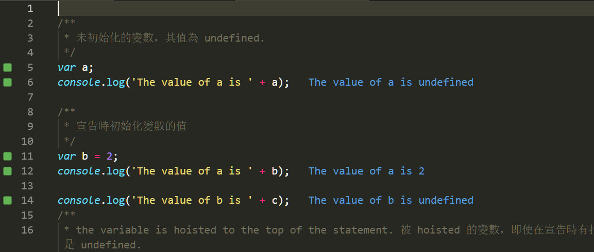
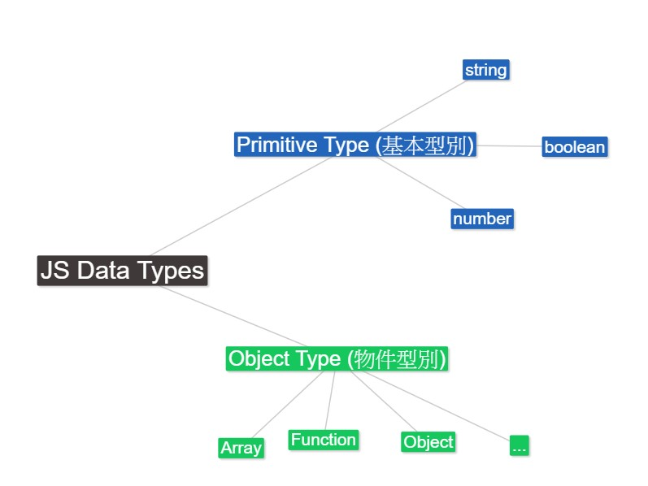
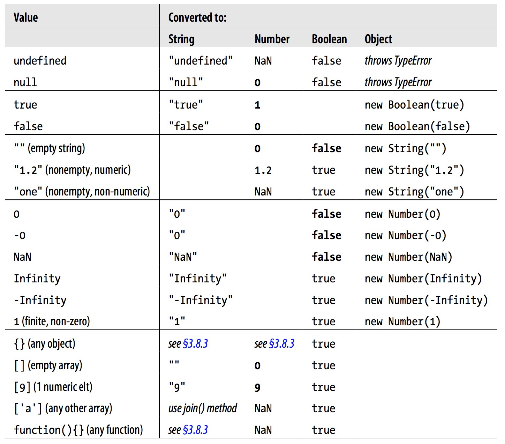
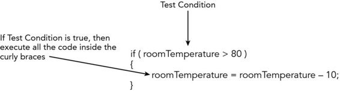
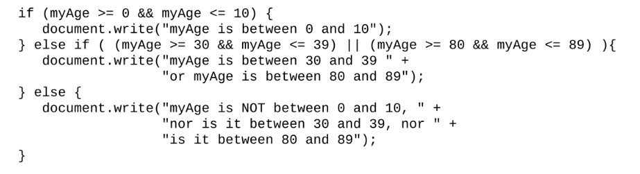

---
export_on_save:
  html: true
---

@import "..css/main.css"
<script>
 document.getElementsByTagName("h1")[0].style.counterReset = "h1ctr 0";  
</script>


# Chapter 1 Getting started with JavaScript

## Setup your environment: Installing Node.js, VSCode and Quokka.js plugin 

Node.js is a JavaScript runtime that allows you to run JavaScript code outside of a browser.
- Download and install [Node.js](https://nodejs.org/en/)

Visual Studio Code (VSCode) is a popular code editor.
- Download and install [Visual Studio Code (VSCode) for windows](https://code.visualstudio.com/download)

Quokka.js is a VSCode plugin that allows you to see the result of your JavaScript code immediately as you type.


## Install Quokka.js plugin in VSCode

Download and install Quokka.js plugin in VSCode.

Search for Quokka.js in the VSCode extension marketplace and install it.


Quokka shortcuts:
* Cmd/Ctrl+K,Q:  Start/restart Quokka on an existing file.
* Cmd/Ctrl+K,J:  To open a new Quokka file for JavaScript. 

Active the Quokka to see the result of your JavaScript code immediately as you type.


## How does the browser understand JavaScript?

- JavaScript is an interpreted language. The computer understands it while running it.
- The browser has a JavaScript engine that interprets and executes JavaScript code.
- The browser's JavaScript engine is an implementation of the ECMAScript standard.
  - The current standard is ECMAScript 2018 (ES9).
- The ECMAScript standard is a the basic specification for JavaScript. 
- Different browsers might have different JavaScript engines that add additional features to the standard.

## Run JS code in the browser console

You can run JavaScript code directly in the browser console.


## Adding JavaScript to a web page

There are three ways to add JavaScript to a web page:
1. Internal(Direct) JavaScript: Add JavaScript code within the `<script>` tag in the HTML file.
2. External JavaScript: Add JavaScript code in an external file and link it to the HTML file.
3. Inline JavaScript: Add JavaScript code directly to the attribute of an HTML element.

### Internal JavaScript

```html
<!DOCTYPE html>
<html>
  <head>
    <title>Hello World</title>
  </head>
  <body>
    <h1>Hello World</h1>
    <p>Welcome to my first web page!</p>

    <script>
      alert('Hello World!');
    </script>

    <script>
      alert('Hello World! 2');
    </script>
  </body>
</html>
```

- The order of execution of the JavaScript code is from top to bottom. 
- The browser executes the JavaScript code when it encounters the `<script>` tag.
- `alert()` is a JavaScript function that displays a dialog box with a message.
- The browser displays a dialog box with the message "Hello World!" when the page loads.
  - Then, it renders the HTML content of the page.

### Extension: When the browsers fetch and execute the JavaScript code

Use the `defer` and `async` attributes in the `<script>` tag to control when the browser fetches and executes the JavaScript code.

The default behavior of `<script>` is to block the rendering of the page until the browser fetches and executes the JavaScript code.

`<script defer>`: The browser fetches the JavaScript code while parsing the HTML content. It executes the JavaScript code after the HTML content is parsed.

`<script async>`: The browser fetches the JavaScript code while parsing the HTML content. It executes the JavaScript code as soon as it is fetched.


## Linking an external file to our web page

Reasons to separate JavaScript code from the HTML file:
- avoid very lengthy HTML pages caused by inline JavaScript codes.
- reuse JavaScript code in multiple HTML files.
- Create your own JavaScript library independent of the HTML files.

To link an external JavaScript file to an HTML file, use the `<script>` tag with the `src` attribute.

```html
<script type="text/javascript" src="your_script.js"></script>
```
Notes:
1. filename is case sensitive.
2. specify the relative or the absolute path of the file.

Example: 
- [Code Samples](https://github.com/PacktPublishing/JavaScript-from-Beginner-to-Professional/tree/main/Chapter%2001/Code%20Samples)

## Lab 01

See the [lab_01_01](lab_01_01.md) file for the lab instructions.

## 頁面載入的順序
HTML 頁面的內容是由上至下依序讀取內容。

當遇到資源時，例如 stylesheets, image, 或者 script 時，瀏覽器會產生其他的平行的請求去要求這些資源。

### 進階閱讀資料: How a webpage is loaded and displayed  

* Image 和 stylesheets 為 blocking resources，表示當這些資源被抓取時，瀏覽器仍可同時繼續剖析頁面其他部分。
* Scrip 標籤一般被視為 blocking resource，瀏覽器必須執行完 script 後才能繼續剖析頁面的其他部分。
對於外部的 js，你可以使用 defer 屬性，讓頁面剖析完成後再執行。參考 script 標籤說明。

參考資料: [How a webpage is loaded and displayed](https://varvy.com/pagespeed/display.html)

## Browser 執行 JS 的方式

有兩種方式可以執行你的 JS 執行方式:
* 載入時執行:  HTML 頁面的內容是由上至下依序讀取內容。在載入過程中遇到 `<script>` 標籤, 會執行內部的 JS codes.
* 事件觸發執行: 點擊 HTML 上的元素後, 觸發事件後執行 JS Code. 例如，點擊頁面上的按鈕後執行 JS code。


## Lab02: 點擊頁面按鈕, 執行 JS code

在輸入盒輸入文字後, 按下按鈕 Click Me. 瀏覽器會出現對話框, 內容顯示在輸入盒輸入的內容.

@import "lab/lab_01_02.html" {code_block=true }

在 `<script>`標籤中定義一個 JS Function (函數):

1. 取得 HTML 文件內的輸入盒元素. 輸入盒元素的 ID 為 `input`.
2. 取得輸入盒元素內的值
3. 使用 `window` 物件的 `alert()` 顯示內容.

在 `<button>` 元素:
* 在 `onClick` 事件屬性上註冊一個 JS Function. 當該元素的 `Click` 事件被觸發時, 會執行該 JS Function.


## JS 程式碼的撰寫慣例
參考課本 10-8，了解以下觀念: 
- 關鍵字、
- 特殊字元
- 識別字(區分大小寫)
- 分號的用途
- 註解
- 識別字(Identifier))命名規則

##	JS 變數宣告

- 變數用來儲存程式執行過程中的值
- 利用 `var` 關鍵字宣告變數
- 宣告變數時，若沒有指派值，則該變數的值為 `undefined`

Ref: 
* [Grammar and types, developer.mozilla.org](https://developer.mozilla.org/en-US/docs/Web/JavaScript/Guide/Grammar_and_Types#Declarations)


### Demo

@import "lab/lab_01_03.js" {code_block=true}

輸入完成後, 在 VSCode 中按下快速鍵 Ctrl+k,q 啟動 Quokka.



注意: 藍色的字是 Quokka 顯示的結果, 不是我們輸入的內容.

JS 指令說明:

- `console` 物件代表瀏覽器的控制台(Browser Console). 在 Chrome 瀏覽器中, 點選滑鼠右鍵, 選擇 "檢查" , 會在下方出現開發者工具, 點選控制檯面板( Console), 出現命令提示符號 `>`. 之後可以輸入 JS 和 Browser 互動.
- `console.log()` 是 `console` 物件的方法, 在 Browser Console 中顯示文字. 


## 資料的型別

- 儲存在變數中的資料是具有型別的
- 動態型別(Dynamic Typed): JS 會自動判斷變數中資料的型別。
- 於變數宣告時，我們不必特別宣告變數內的資料型別。JS 是一種弱型別(或者動態型別的程式語言)
- 遇到不同形態變數運算時, 例如: 字串與數字相加, JS 會依內部規則, 自動轉換資料型態.




範例: 變數中的不同資料型態
```js
var foo = 42;    // foo 目前是數字
var foo = 'bar'; // foo 目前是字串
var foo = true;  // foo 目前是布林值
```


進階閱讀:
* 更完整的資料型態，參考: [Standard built-in objects](https://developer.mozilla.org/en-US/docs/Web/JavaScript/Reference/Global_Objects)


## 資料型別的自動轉換
- 不同資料型態進行運算, 如數字加字串資料, JS 會自動進行資料型態的轉換(Implicit Conversion). 
- 你也可以執行明確的轉換(Explicit Conversion).

範例: 自動轉換範例

@import "lab/lab_01_04.js" {code_block=true}

四則運算時的自動轉換規則
- 加法運算子:
    - 加法運算子可以進行 1)字串連結及 2)數字相加。
    - 只有當兩個運算元皆為數字型態時，才會執行數字的加法。 
    - 使用 + 進行運算，當兩個運算元型態不一致時, 若有其中一個為 string，JavaScript 會自動把另一個運算元的型態自動轉成 string。
- 其他的四則運算子， 如 -,*,/, JS 會試著將字串轉成數字。


JS 的自動資料型態轉換規則整理:

Ref: http://tusharm.com/articles/Javascript-Interview-Question/type-conversions.png

## 練習 01_01

@import "practices/practice_01_01.md"

參考檔案: practices\practice_01_01.html

## 資料的型別判斷、運算、指派

基本觀念複習
- 運算子(operator) vs 運算元(operand): 使用運算子對運算元進行運算，得到結果。
- 5 +  3 // 5和3為運算元，+ 為運算子  

運算子的類型:
- 單元(Unary)運算子: 只需一個運算子即可輸出結果，例如: x++
- 二元(Binary)運算子: 需要兩個運算子才可進行運算，例如:  1+2
- 三元(Ternary)運算子: 需要三個運算元才可進行運算，JS 中只有一個。例如 `10>5? "x": "y"`  

參考:
- 11-3-1 算術運算子
- 11-3-2 遞增/遞減算術運算子
- 11-3-3 邏輯運算子
    - || 及  && 用於非 Boolean 資料型態時相當於 if else.
    - Expr1 || Expr2: 如果 expr1 可以轉換為 true，就返回 expr1; 否則返回 expr2
    - Expr1 && Expr2: 如果 expr1 可以轉換為 false，就返回 expr1; 否則返回 expr2
- 11-3-4 比較運算子
- 11-3-5 位元運算子

範例: 位元運算子; 三元運算子 

@import "lab/lab_01_05.js" {code_block class="line-numbers"}


## 指派運算子: 指派值給變數

兩種指派方法: 
1. 直接指派: 例如 `var a = 3`;
2. 運算後指派: 
   - 變數與右方的運算子進行運算，運算結果在指派給變數。
   - 例如  `x += 5` (表示 `x = x+5`)。
   - 進行運算的運算子要出現在指派運算子的左方, 表示先運算, 再指派。
    - `a *= 5` 表示 a*5 之後再指派給 a.

參考課本 11-3 了解更多的運算子。

## 練習 01_02

@import "practices/practice_01_02.md"

## 程式的執行流程控制

### 條件判斷: if, if..else..

依照條件決定執行的內容

**If Statement** 
執行 A 或 不執行
- Test Condition: 測試條件
- Code block: 條件成立後所要執行的程式碼.
  
範例: If statement


**If Else Statement**
執行 A, 否則執行 B

範例: If Else statement


**If else if statement**
執行 A, 否則執行 B, 否則執行 C, ...

範例: If Else If statement


## 迴圈: for
重複執行相同的工作


## 練習 01_03

@import "practices/practice_01_03.md"


