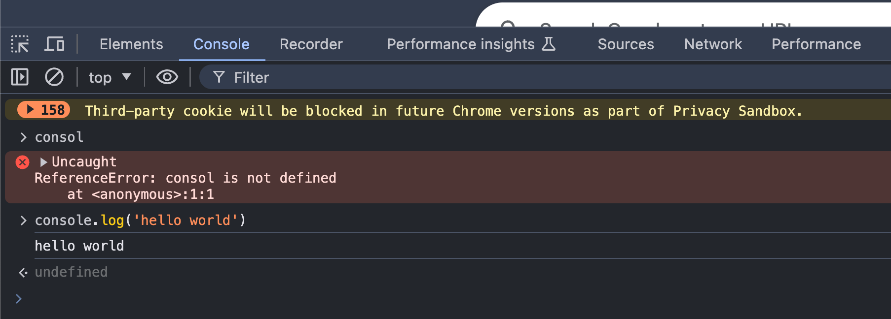

<style>
.horizontal-list {
  display: flex;
  flex-direction: row;
}

.horizontal-list li {
  margin-right: 40px; /* adds spacing between each list item */
}

</style>

# Chapter 1 Getting started with JavaScript

### Learning Objectives

- Set up your environment: Installing Node.js, Visual Studio Code, and Quokka.js plugin
- Run JavaScript code in the browser console
- Add JavaScript to a web page using internal, external, and inline JavaScript
- Know when browsers fetch and execute JavaScript code

## 1.1 Set up your environment: Installing Node.js, VSCode and Quokka.js plugin

### Setup your environment: Installing Node.js, VSCode and Quokka.js plugin 

Node.js is a JavaScript runtime that allows you to run JavaScript code outside of a browser.
- Download and install [Node.js](https://nodejs.org/en/)

Visual Studio Code (VSCode) is a popular code editor.
- Download and install [Visual Studio Code (VSCode) for windows](https://code.visualstudio.com/download)

Quokka.js is a VSCode plugin that allows you to see the result of your JavaScript code immediately as you type.

---

### Install Quokka.js extension in VSCode

Download and install Quokka.js extension in VSCode.

Search for Quokka.js in the VSCode extension marketplace and install it.


---

Quokka shortcuts:
* Cmd/Ctrl+K,Q:  Start/restart Quokka on an existing file.
* Cmd/Ctrl+K,J:  To open a new Quokka file for JavaScript. 


---


Active the Quokka to see the result of your JavaScript code immediately as you type.


## 1.2 Run JavaScript code in the browser

### How does the browser understand JavaScript?

- JavaScript is an interpreted language: the computer understands it while running it.
- The browser has a JavaScript engine that interprets and executes JavaScript code.
- The browser's JavaScript engine is an implementation of the ECMAScript standard.
  - The current standard is ECMAScript 2024 (ES 15 edition, or ES15 in short).

- The ECMAScript standard is a the basic specification for JavaScript. 
- Different browsers might have different JavaScript engines that add additional features to the standard.


### Run JS code in the browser console

You can run JavaScript code directly in the browser console.




### Adding JavaScript to a web page

There are three ways to add JavaScript to a web page:
1. Internal(Direct) JavaScript: Add JavaScript code within the `<script>` tag in the HTML file.
2. External JavaScript: Add JavaScript code in an external file and link it to the HTML file.
3. Inline JavaScript: Add JavaScript code directly to the attribute of an HTML element.

### Internal JavaScript

```html
<!DOCTYPE html>
<html>
  <head>
    <title>Hello World</title>
  </head>
  <body>

    <script>
      alert('Hello World!');
    </script>

    <h1>Hello World</h1>
    <p>Welcome to my first web page!</p>

    <script>
      alert('Hello World! 2');
    </script>
  </body>
</html>
```

---

For the above code:
- The order of execution of the JavaScript code is from top to bottom. 
- The browser executes the JavaScript code when it encounters the `<script>` tag.
- `alert()` is a JavaScript function that displays a dialog box with a message.
- The browser displays a dialog box with the message "Hello World!" when the page loads.
  - Then, it renders the HTML content of the page.


### Advanced reading: Control when the browsers fetch and execute the JavaScript code

Use the `defer` and `async` attributes in the `<script>` tag to control when the browser fetches and executes the JavaScript code.


<ul class="horizontal-list">
  <li>Green: parser</li>
  <li>Red: fetch</li>
  <li>Blue: execute</li>
</ul>  

`type="module"` attribute will not be discussed here because it beyond the scope of the chapter. 

---

The default behavior of `<script>` is to block the rendering of the page until the browser fetches and executes the JavaScript code.

`<script defer>`: The browser fetches the JavaScript code while parsing the HTML content. It executes the JavaScript code after the HTML content is parsed.

`<script async>`: The browser fetches the JavaScript code while parsing the HTML content. It executes the JavaScript code as soon as it is fetched.

### External JavaScript

Reasons to separate JavaScript code from the HTML file:
- avoid very lengthy HTML pages caused by inline JavaScript codes.
- reuse JavaScript code in multiple HTML files.
- Create your own JavaScript library independent of the HTML files.

--- 

To link an external JavaScript file to an HTML file, use the `<script>` tag with the `src` attribute.

```html
<script type="text/javascript" src="your_script.js"></script>
```
Notes:
1. filename is case sensitive.
2. specify the relative or the absolute path of the file.

Example: 
- [Code Samples](https://github.com/PacktPublishing/JavaScript-from-Beginner-to-Professional/tree/main/Chapter%2001/Code%20Samples)


## 1.3 Lab 01

See the [lab_01_01](lab_01_01.md) file for the lab instructions.

## Summary

In this chapter, 
- you learned how to set up your environment by installing Node.js, Visual Studio Code, and the Quokka.js plugin. 
- You also learned how to run JavaScript code in the browser console and 
  - add JavaScript to a web page using internal, external, and inline JavaScript.
