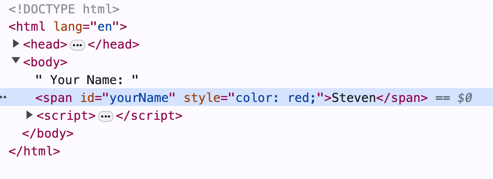

  # Lab01: Your first JavaScript program

Author an HTML page to show the entered name in red after the user enters his/her name in a dialog box.

Assume the HTML page has a `span` element with the id `yourName`. 

Overview of the steps to complete the lab:
1. When the page loads, display a dialog box to prompt the user to enter his/her name. Store the name in a variable.
2. Get the `span` element with the id `yourName`.
3. Modify the content of the `span` element to display the name entered by the user.
4. Apply the CSS style to the `span` element to display the name in red.


Steps in detail:

Step 0: Create an HTML file:

```html
<!DOCTYPE html>
<html>
  <head>
    <title>Lab01: Your first JavaScript program</title>
  </head>
  <body>
    <span id="yourName"></span>
    <script>
        // Your JavaScript code goes here
    </script>
  </body>
```

Step 1: Display a dialog box to prompt the user to enter his/her name and save it to a variable.

Use the `window.prompt()` function to display a dialog box.

```javascript
var name = prompt('Enter your name:');
```

Step 2: Get the `span` element with the id `yourName`.

Use the `document.getElementById()` function to get the `span` element by its `id` attribute.

```javascript
var span = document.getElementById('yourName');
```

Step 3: Modify the content of the `span` element.

Use the `innerHTML` property to modify the content of the `span` element.

```javascript
span.innerHTML = name;
```

Step 4: Apply the CSS style to the `span` element.

Set the `style.color` property to red. It is equivalent to applying the inline CSS style `color: red;`.

```javascript
// <span style="color: red;"></span>
span.style.color = 'red';
```

The rendered page:




**Concept Clarification**: What is an attribute of an HTML element?
- Attributes are defined in HTML markup. (You may think of them as static properties.)
- They reflect the initial state of the element.
- The type is always a string.
- Accessed and modified via `element.getAttribute()` and `element.setAttribute()`.

**Concept Clarification**: What is a property of an HTML element?
- Properties belong to the DOM object.
- Properties allow various types.
- They reflect the current state of the element.
- Accessed and modified via `element.propertyName`.


  
