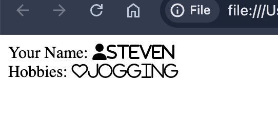

# Chapter 1 Practice

Covered concepts:
1. Linking an external file to your web page.
2. Write comments in JavaScript.
3. Use the `window.prompt()` function to display a dialog box.
4. Use the `document.getElementById()` function to get an element by its `id` attribute.
5. Modify DOM object properties.

## Practice 1

Consider the following HTML page:

```html
<!DOCTYPE html>
<html>
<head>
    <title>Practice 1</title> 
    
    <body>
        Your Name: <span id="name"></i>  </span><br>
        Hobbies: <span id="hobbies"></i>  </span><br>
    </body>
    
</html>
```

1. Add the following external JavaScript code to include the `fontawesome` library in your HTML page.

```html
 <script src="https://kit.fontawesome.com/4ee6223866.js" crossorigin="anonymous"></script>
```

2. Add an in-file JavaScript code to apply CSS classes to the `span` elements.
   - The `name` element should have the `fa-solid fa-user` class.
   - The `hobbies` element should have the `fa-regular fa-heart` class.

3. Create an external JavaScript file to ask the user for their name and hobbies.
   - After the user enters their name and hobbies, update the `name` and `hobbies` elements with the user's inputs. 
   - Write a comment about the intention for each line of code.
   - Should use meaningful variable names.

4. Include the external JavaScript file to your HTML page.

Artifacts to submit:
1. The modified HTML file.
2. The created external JavaScript file.
3. A screenshot of the rendered HTML page.

Sample screenshot:




  
