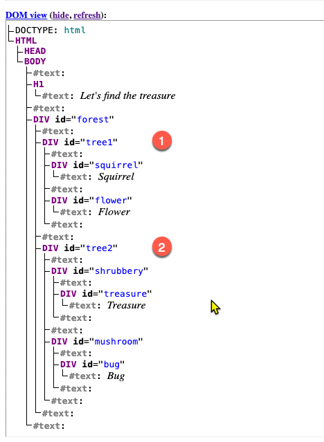
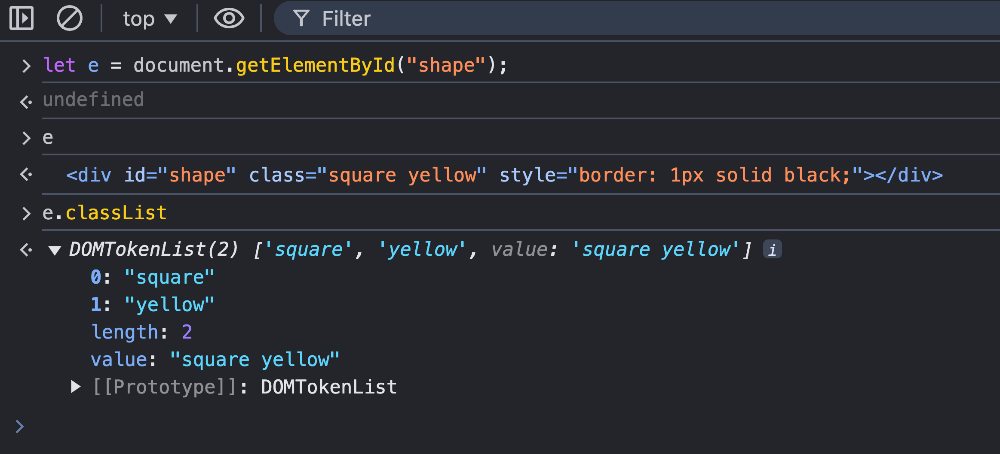
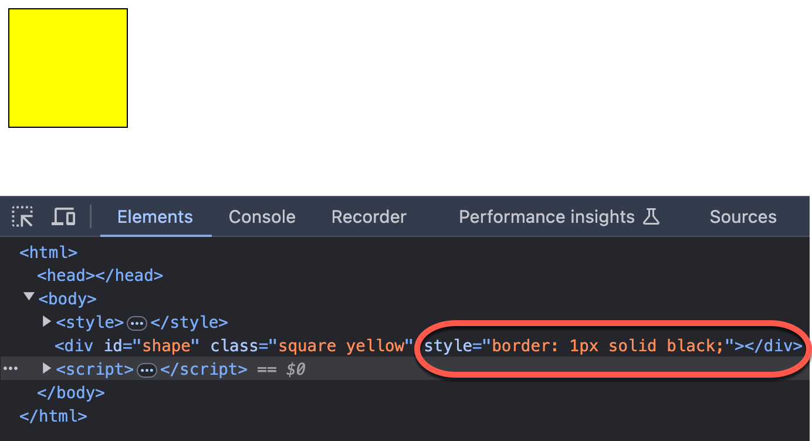
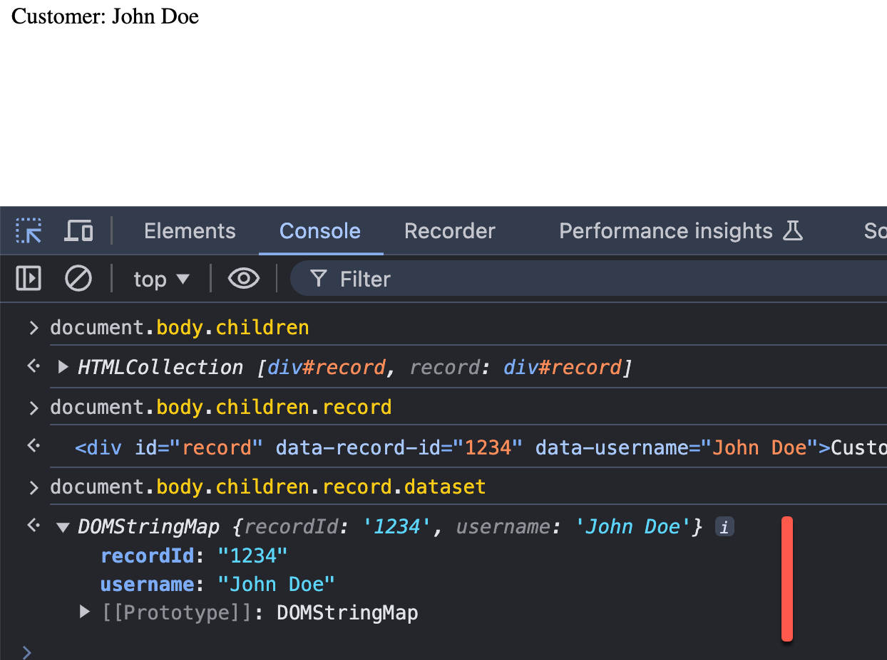
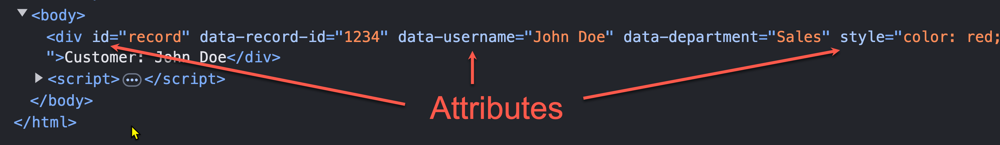
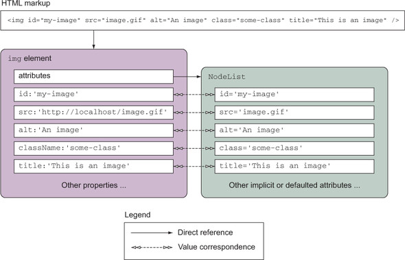
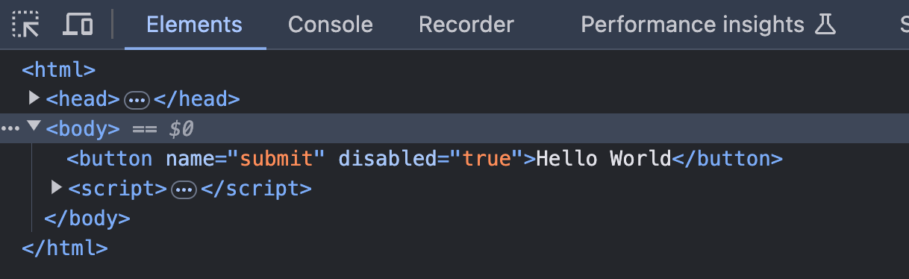
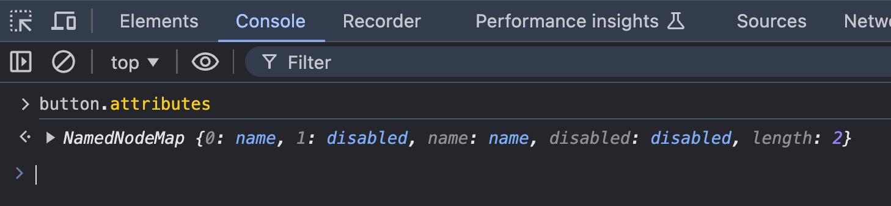
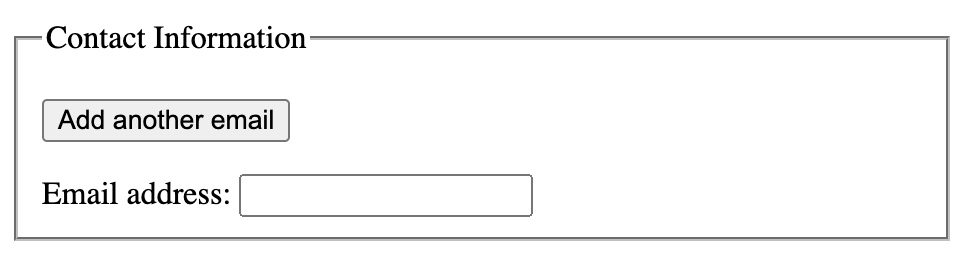

<style>
    .columns {
    display: flex;
  }
  .column {
    flex: 1;
    padding: 10px;
  }
  .column.large{
    flex: 2;
  }
  .small-font {
    font-size: 0.8em;
  }

  section > header,
section > footer {
  position: absolute;
  left: auto;
  right: 90px;
  height: 20px;
}

header {
  top: 30px;
}

footer {
  bottom: 30px;
}

</style>

# Chapter 10 Dynamic element manipulation using the DOM 

Topics in this chapter:

1. navigate the DOM and select the elements (Review)
2. add and change attributes and values to elements
3. add style to elements
4. add new elements to the DOM
5. events and event listeners 

## Basic DOM traversing 

Review the section of "Navigating the DOM" in Chapter 9.

## Access the elements in the HTMLCollection object

- HTMLCollection object is a collection of HTML elements (the child of the node class).
- often returned by DOM methods that query or manipulate a group of elements in the document, 
  - such as `document.getElementsByTagName()` or `document.getElementsByClassName()`.
- You can access the elements in the HTMLCollection object by the **index** or the **element id name**.
<!-- Using element id name as the key to access the element in the array of element objects (Supplement) -->

### Example 10-1: Use the element id name as the key to access the element in the HTMLCollection object

When you get the child elements of the body element, how do you get get the element of the id "forest"?

```html
  <body>
    <h1>Let's find the treasure</h1>
    <div id="forest">
      <div id="tree1">
        <div id="squirrel"> Squirrel </div>
        <div id="flower"> Flower </div>
      </div>
      <div id="tree2">
        <div id="shrubbery">
          <div id="treasure"> Treasure </div>
        </div>
        <div id="mushroom">
          <div id="bug"> Bug </div>
        </div>
      </div>
    </div>
  </body>
```

---

Executing following JavaScript code:

`let bodyChildren = document.body.children`

will return an HTMLCollection object (an array-like object):

```
HTMLCollection(2) [h1, div#forest, forest: div#forest]
```

- The first two elements are elements with index 0 and 1, respectively.
- The third element is the property with the key "forest".
- The `HTMLCollection` object is an array-like object 

---

So, We can access elements by index: 

```javascript
bodyChildren[1]
```

or, by the element id as the key:

```javascript
bodyChildren.forest
```

---

Q: What is the result of `document.body.children.forest.children`?

A: the returned HTMLCollection object contains two elements and two properties:

```
HTMLCollection(2) [div#tree1, div#tree2, tree1: div#tree1, tree2: div#tree2]
```




## Selecting elements

Recall that you can select elements by:
- tag name: `document.getElementsByTagName(tagName)`, returns an `HTMLCollection` object.
- class name: `document.getElementsByClassName(className)`, returns an `HTMLCollection` object.
- id: `document.getElementById(id)`, returns an element object.
- CSS selector: `document.querySelector(cssSelector)`, returns the first HTML element.
  - and `document.querySelectorAll(cssSelector)`, returns a `NodeList` object

Please review the section of "Select Page Elements" in Chapter 9.

## Modify the CSS classes of an element

- `classList` property of an element object
  - Return a live **DOMTokenList** collection of the class attributes of the element.

- `DOMTokenList` object
  - a set of space-separated tokens. 
  - provides methods to **add**, **remove**, **toggle**, and **check** if a token exists in the list.

In short, 
  - use the `classList` property to get the `DOMTokenList` object
  - use the methods of the `DOMTokenList` object to manipulate the classes of an element.
  
### Add a class

Example 10-2: Modify the CSS classes of an element by JS 
Consider the following HTML code (See full code in [`ch10/ex_10_02.html`](ex_10_02.html)). 
We want to apply the `blue` class to the shape element.

```html
<body>
    <style>
      .square {
        height: 100px;
        width: 100px;}
      .blue {
        background-color: blue;} 
      .yellow {
        background-color: yellow;}
      .hide {
        display: none;}
    </style>
    <div id="shape" class="square" ></div>
```

---

Steps:
1. Get the square element by its id.
2. Get the `DOMTokenList` object of the square element from the `classList` property.
3. Add the `blue` class to the square element.

```javascript
let shape = document.getElementById("shape");
shape.classList.add("blue");
```



### Remove classes

Use the `remove` method of the `DOMTokenList` object:

```javascript
shape.classList.remove("blue");
```

### Toggle a class

The `toggle` method adds a class to an element if it is not present and removes it if it is present. 
- return `true` if the class is in the list after the operation, otherwise `false`.


The current `<div id="shape" class="square" ></div>` does not have the class `hide`. 

After executing the following code:
```javascript
shape.classList.toggle("hide");
```

- The class `hide` will be added to the square and return `true`.
- If you execute the code again, the class `hide` will be removed and return `false`.   

## Manipulating element's in-line style

<!-- Recall that `element.classList` expose the class attributes of an element. -->

- The `htmlElement.style` property exposes the style attributes of an element.
  - return a live `CSSStyleDeclaration` object that contains the inline style attributes of the element.
- Use `htmlElement.style.<attribute_name>` to assess and set the style attributes of an element.

Example 
- `htmlElement.style.backgroundColor` to set the background color of an element.
- `htmlElement.style.color` to set the text color of an element.

---

For example, set the border of the `shape` to `1px solid red`:

```javascript
shape.style.border = "1px solid red";
```

The resultant square will have the inline style attribute `style="border: 1px solid red;"`:



## Custom data attributes: data-*

Sometime, we need to store data in the a HTML element, such the record's primary key. 
- When taking actions, these data will be used to identify the record stored in the front-end or back-end.

Use the `data-*` attributes to store extra information in the HTML elements.
- `*` is the name of the data attribute.

### Example: 10-3: Store the record and user information in the HTML elements

The `record` element contains the `recordId` and `userName` data attributes.
- `recordId=1234`
- `userName="John Doe"`

```html
<!DOCTYPE html>
<html>
  <body>
    <div id="record" data-record-id="1234" data-userName="John Doe"></div>
  </body>   
</html>
```

Note 
- the `data-` prefix is removed from the key name in the `dataset` property and 
- the key name is converted to the **camelCase**.

---




### Access and modify the custom data attributes 

Use the `dataset` property of the element object to get the custom data attributes.
  - return the `DOMStringMap` object that contains all the `data-*` attributes of the element.

The key name is the camelCase of the custom attribute name.
- `data-record-id` is converted to `recordId` key name.
- `data-userName` is converted to `userName` key name.

The property value is always a string.

---

Example: Get the value of `data-record-id` data attribute

```javascript
let record = document.getElementById("record");
let recordId = record.dataset.recordId;
```

### Add a new property to the `dataset` object

Add a new property to the `dataset` object:

```javascript
record.dataset.newProperty = "new value";
```

### Check and delete a property in the `dataset` object

Check if a key exists in the `dataset` object
- Use the `object.hasOwn(element.dataset, key)` method to check
- Since the `dataset` object is a `DOMStringMap` object  

Delete a key-value pair from the `dataset` object
- Use the `delete` operator: `delete element.dataset.keyname`
  

To see more details, please refer to [HTMLElement: dataset property - Web APIs | MDN](https://developer.mozilla.org/en-US/docs/Web/API/HTMLElement/dataset).

## Lab 01: Apply a inline style and add a custom data attribute to an element

```js
<body>
    <div id="record" data-record-id="1234" data-userName="John Doe">
      Customer: John Doe
    </div>
    <script>
      // 1. Change the color of the record element to red.
      // 2. Add a new data attribute department="Sales" to the record element.
      // 3. Log the value of the data attribute department to the console.
    </script>
  </body>   
```
File: [lab_10_01.html](lab_10_01.html)


## Modifying other attributes

`setAttribute`, `getAttribute`, and `removeAttribute` methods are used to modify the attributes of an element dynamically.

### HTML element attributes vs DOM element properties

<!-- Before introducing the `setAttribute` and `getAttribute` methods, let's clarify the difference between the HTML element attributes and the DOM element properties. -->

Q: Element's attributes and properties are the same?

- Attribute means the HTML attribute of a tag.
- Property means the DOM property of an element object.



---

Q: Relationship between the HTML tag and the DOM element object?

- Browser create a DOM object for each HTML tag in the document. 

For example, for the following `img` tag:

```html

```

The browser will create a [HTMLImageElement object](https://developer.mozilla.org/en-US/docs/Web/API/HTMLImageElement) for the `` element. 

<div class="columns">

<div class="column large">



</div>

<div class="column">

The `img` tag attributes are bind to the `HTMLImageElement`'s properties in **bi-directional** way. 
-  attribute <-> property 

</div>
</div>

<!-- Fig Source: https://livebook.manning.com/book/jquery-in-action-third-edition/chapter-4/20 -->

---

### Manipulating the attributes of an tag

Use the `element.setAttribute()`, `element.getAttribute()`, and `element.removeAttribute` provide us an intuitive way to access and modify the tag's attributes.

The syntax of the `setAttribute` method is:

```javascript
element.setAttribute(name, value);
```
- If the attribute already exists, the value is updated; 
- otherwise a new attribute is added with the specified name and value.

---

The syntax of the `getAttribute` method is:

```javascript
element.getAttribute(name);
```

The syntax of the `removeAttribute` method is:

```javascript
element.removeAttribute(name);
```

### Example 10-4: Modify the attributes of an element using the setAttribute, getAttribute, and removeAttribute methods

With the following HTML code, set the `name` and `disabled` attributes of the button element:
- `name="submit"`
- `disabled="true"`

```html
<html>
    <style>
    button {
        height: 30px;
        width: 100px;
        margin: 1em;
    }
    </style>
    <button>Hello World</button>
</html>
```

---

The following code set the `name` and `disabled` attributes of the button element:

```javascript
let button = document.querySelector("button"); 
button.setAttribute("name", "submit");
button.setAttribute("disabled", "true");
```



### Get all attributes of a tag

- use the `element.attributes` property that returns a `NamedNodeMap` object, 
  - which is an array-like object.




### Review Questions


1. What is the relationship between the HTML tag and the DOM element object?
2. When you want to add the `font-size: 16px` style to an element, what options do you have?
   <!-- - Use the `style` property of the HTMLElement object.
   - Use the `setAttribute` method to set the `style` attribute of the element. -->


## Creating new elements and adding them to the DOM

You can create a new element and add it to the DOM to create a new content dynamically.
- because the DOM elements and HTML document are bound each other.

Scenario:
- you allow a user to add more than one email addresses to the form. 
- When the user clicks the "Add Email" button, a new input element will be added to the form.


### Steps to create a new element and add it to the DOM

1. Create a new element using the `document.createElement` method.
2. Set the attributes of the new element using the `setAttribute` method or the `HTMLElement`'s properties.
3. Find the parent element where you want to add the new element. 
4. Then, use the `appendChild` method of the parent element to add the new element.

### Example 10-5: Add a new email text input element to the form when the user clicks the "Add Email" button

Click the "Add another email" button to add a new email input element to the form.
```html 
<fieldset>
        <legend>Contact Information</legend>
        <p> <button onclick="addEmail()">Add another email</button> </p>
        <form>
            <div id="emailList">
                <label for="email1">Email address:</label>
                <input type="email" id="email1" name="email1" />
            </div>
        </form>
</fieldset>
```



<!-- When a user click the "Add another email" button, the `addEmail()` function will be executed to add a new email input element to the form. -->

---

The logical steps:
1. Get the total number of email input elements in the form so that we can assign a unique id to the new email input element.
2. Find the parent element where we want to add the new email input element.
3. Create a new label element and set its `for` attribute to the new email input element's id.
4. Create a new input element and set its `type`, `id`, and `name` attributes.
5. Append the new label and input elements to the parent element.

---

Step 1. Get the total number of email input elements in the form so that we can assign a unique id to the new email input element.

```javascript
// Use the css selector to get all email input elements
// Select all input elements with the type of email whose parent is the emailList div element.
let emailList = document.querySelectorAll("#emailList > input[type=email]");
let emailCount = emailList.length;
```


Step 2. Find the parent element where we want to add the new email input element.

```javascript
let parentElement = emailList.parentElement;
```

---

Step 3. Create a new label element and set its `for` attribute to the new email input element's id.

```javascript
let newLabel = document.createElement("label");
newLabel.htmlFor = "email" + (emailCount + 1);
// or newLabel.setAttribute("for", "email" + (emailCount + 1));
newLabel.innerHTML = "<br/> Email address " + (emailCount + 1) + ":";
```

---

Step 4. Create a new input element and set its `type`, `id`, and `name` attributes.

```javascript
let newEmail = document.createElement("input");
newEmail.type = "email"; 
newEmail.id = "email" + (emailCount + 1);
newEmail.name = "email" + (emailCount + 1);
//or newEmail.setAttribute("type", "email");
```

Step 5. Append the new label and input elements to the parent element.

```javascript
parentElement.appendChild(newLabel);
parentElement.appendChild(newEmail);
```


---

The complete code:

```javascript
<script>
        function addEmail() {
            // Step 1. Get the total email inputs
            let emailList = document.querySelectorAll("#emailList > input[type=email]");
            let emailCount = emailList.length;

            // Step 2 Find the parent element where we want to add the new email input element.
            let parentElement = document.getElementById("emailList");

            // Step 3 Create the label for the new email input field
            let newLabel = document.createElement("label");
            // Set the label attributes
            newLabel.htmlFor = "email" + (emailCount + 1);
            newLabel.innerHTML = "<br/> Email address " + (emailCount + 1) + ":";
            
            // Step 4 Create the email input field
            let newEmail = document.createElement("input");
            // set element attributes
            newEmail.type = "email";
            newEmail.id = "email" + (emailCount + 1);
            newEmail.name = "email" + (emailCount + 1);
            
            // Step 5 Append the new label and email input field to the emailList
            document.getElementById("emailList").appendChild(newLabel);
            document.getElementById("emailList").appendChild(newEmail);
        }
    </script>
```

See the full code in [`ch10/ex_10_05.html`](ex_10_05.html).

### Lab 02: Insert a new element to the specific position in the DOM

Based on the example 10_05, write a script to create a `h1` element with the text "JavaScript is fun!" and insert it before the `fieldset` element.

Method 1:
- Create a new `h1` element and set its text content to "JavaScript is fun!"
- Use the `before` method to insert the new `h1` element before the `fieldset` element.
  - Study the `before` of the `Node` object from the [MDN Web Docs]() to help you.

---

Alternatively, 
- Get the first child of the body element (the `fieldset` element) 
- Then, use the `insertBefore` method of the **parent element** to insert the new element before the `fieldset` element.
  - Study the `insertBefore` method of the `Node` object from the [MDN Web Docs](https://developer.mozilla.org/en-US/docs/Web/API/Node/insertBefore) to help you.


## Event Model

Events represent that something has happened in the browser.

Events can be:
- Windows or DOM events (click, mouseover, keydown, drag-and-drop, scroll etc.), indicating the user's interaction with the window or the DOM
- API events (read client-side file, fetch resources from a server, timer, etc.), notifying developers that asynchronous operations have been completed.

Ref: [Event handling (overview) - Event reference | MDN](https://developer.mozilla.org/en-US/docs/Web/Events/Event_handlers)

### Example 10-6: the button click event (DOM event)


source: https://dotnettutorials.net/wp-content/uploads/2020/05/word-image-28.png?ezimgfmt=ngcb8/notWebP


## Event listener

Event listeners are functions that listen for events and execute code when the event occurs.
- Event listeners are call-back functions.

The function signature of the event listener is:

```javascript
functionName(event) {
    // code to execute when the event occurs
}
```

## Event Object 

The browser will pass (inject) an `Event` object to the event listener function when the event occurs.

The `Event` object tell us two basic things:
- the event type
- the target element that triggers the event (event target)

Depend on the event type, the `Event` object may have more properties. For example, 
- a [mouse event](https://developer.mozilla.org/en-US/docs/Web/API/MouseEvent) includes the coordinate of the mouse pointer.
- a [keyboard event](https://developer.mozilla.org/en-US/docs/Web/API/KeyboardEvent) include the key code of the key that is pressed.

To see the full list of the event types, please refer to 
- [Event reference | MDN](https://developer.mozilla.org/en-US/docs/Web/Events)
- [Event - Web APIs | MDN](https://developer.mozilla.org/en-US/docs/Web/API/Event)


## Register an event listener to an DOM element

There are three ways to register an event listener to an element:
- Setting the event **handler attribute** of the HTML tag (inline event handler)
- Setting the event **handler property** of the DOM element
- Calling the `addEventListener()` method of the DOM element

Let discuss when to use which method.

## Use the inline event handler: Write javascript code in the `onXYZ` attribute of the HTML tag

When you want to execute a simple code when the event occurs, you can use the inline event handler.

You write javascript code in the `onXYZ` attribute of the HTML tag, such as `onclick`, `onmouseover`, `onkeydown`, etc.

### Example 10-7: Inline event handler

```html
<!DOCTYPE html>
<html>
    <head>
    </head>
    <body>
        <a href="#" onclick="alert('Hello, world!');">Click me to say hello.</a> <br/>
        <a href="#" onclick="sayHello(this, event);"> Click me to invoke a function.</a> <br/>
    </body>

    <script>
        function sayHello(trigger,event) {
            // alert('Hello, world!');
            console.log('Hello, world!');
            console.log('this: ', trigger);
            console.log('event type: ', event.type);
            console.log('event target: ', event.target);
        }
    </script>
</html>
```
---

The first `<a>` tag will show an alert message "Hello, world!" when the user clicks the link.

The second `<a>` tag will execute the `sayHello` function with two arguments when the user clicks the link.

The first argument is the `this` keyword, which refers to the element running the inline event handler.
- the `this` is equal to `event.target` in the `sayHello` function.

The second argument is the `event` object.

<!-- ### Implicitly converted inline event handler

The browser will implicitly convert the code in the inline event handler to a function and register it to the element's event listener.

The converted event listener function will have the following pattern:

```javascript
function(event) { 
  with(document) {
    with(this.form || {}) { 
      with(this) {
        // code in the inline event handler
      } 
    }
}
```

That means you can access trigging element (`this`), form data, `document`, and `event` objects in the inline event handler.

---

So, the above code is equivalent to the following code:

```html
<!DOCTYPE html>
<html>
    <head>
    </head>
    <body>
        <a href="#">Click me to say hello.</a> <br/>
        <a href="#"> Click me to invoke a function.</a> <br/>
    </body>

    <script>
        function sayHello(trigger,event) {
            ...
        }
        document.body.children[0].onclick = function(event){
          with(document) {
            with(this.form || {}) { 
              with(this) {
                alert('Hello, world!');
              } 
            }
          }
        }
        document.body.children[2].onclick = function(event){
          with(document) {
            with(this.form || {}) { 
              with(this) {
                sayHello(this, event);
              } 
            }
          }
        }
    </script>
</html>
``` -->

### Disadvantages

Use the inline event handler a lot will make your code hard to maintain and debug, because 
1. The JS code is mixed with the HTML code.
2. Cannot centrally assign the event listeners to the elements.
3. When multiple tags use the same event handler, you need to assign the event handler to each tag one by one, which is very inconvenient. 
4. Cannot programmatically and dynamically add or remove the event listeners.

Setting the event handler property of the DOM element is a better way to register the event listener.

## Setting the event handler property of the DOM element to register the event listener

Recall that each HTML element has a corresponding DOM object.

The HTML element has a set of event handler attributes. Similarly, the DOM object has a set of event handler properties, such as `onclick`, `onmouseover`, `onkeydown`, etc., all in lowercase.

You can register an event listener to the DOM element by assigning a function to the event handler property.

### Example 10-8: Setting the event handler property of the DOM element

We rewrite the previous example and separate the javascript code from the HTML code.

```html
<!DOCTYPE html>
<html>
    <head>
    </head>
    <body>
        <a href="#">Click me to say hello.</a> <br/>
        <a href="#">Click me to invoke a function.</a> <br/>

        <script src="ex_10_08.js"></script>
    </body>
</html>
```

---

```javascript
const allAnchors = document.querySelectorAll('a');
let firstAnchor = document.querySelectorAll('a')[0]
let secondAnchor = document.querySelectorAll('a')[1]

// Assign the onclick event handler

firstAnchor.onclick = function(event) {
  console.log('Event type:', event.type);
  console.log('Event target:', event.target);
  window.alert('You clicked the first anchor element');
}

secondAnchor.onclick = function(event) {
    console.log('Hello, World!');
    console.log('Event type:', event.type);
    console.log('Event target:', event.target);
}
```

### Example 10-9: Assign the same listener function to multiple elements

```html 
<html>
    <head>
    </head>
    <body>
        <div>
            <input type="checkbox" id="cb1" name="flavor" value="10" data-flavor="vanilla">
            <label for="cb1">Vanilla</label>
            <input type="checkbox" id="cb2" name="flavor" value="20" data-flavor="strawberry">
            <label for="cb2">Strawberry</label>
        </div>
        <script>
            // define the listener function
            function logValueData(e){
                console.log(e.target.value);
                console.log(e.target.dataset.flavor);
            }
            // assign the listener function 
            const checkboxes = document.getElementsByName('flavor');
            checkboxes.forEach(checkbox => {
                checkbox.onclick = logValueData;
            });
        </script>
    </body>
</html>
```


### Advantages

- The code is separated from the HTML code.
- You can centrally assign the event listeners to the elements.
- You can assign the same listener function to multiple elements.

### Limitations

- You cannot assign multiple event listeners to the same event type of the same element.
  - e.g. you cannot assign two different functions to the `onclick` event of the same element.
- You cannot specify the advanced event options when assigning the event listener.
  - Options such as `capture`, `once`, and `passive`.
  - These advanced options will be covered in the next chapter. 

The `addEventListener` method of the DOM element provides a solution to these limitations.

## Calling the `addEventListener()` method of the DOM element to register the event listener

The third way to register an event listener to an element is to call the element's `addEventListener` method.

The [syntax of the `addEventListener` method](https://developer.mozilla.org/en-US/docs/Web/API/EventTarget/addEventListener) is:

```javascript
addEventListener(type, listener)
addEventListener(type, listener, options)
addEventListener(type, listener, useCapture)
```

The last two syntaxes will be discussed in the next chapter.


### Parameters for the `addEventListener` method:

`type` parameter:
- the event type, such as `click`, `mouseover`, `keydown`, etc. 
- No `on` prefix is needed.
- See the full list of the event types at [Event reference | MDN](https://developer.mozilla.org/en-US/docs/Web/Events)

`listener` parameter:
- the **event listener function** that will be executed when the event occurs. 
- Or, an **object** with a `handleEvent` method.


### Example 10-10: Using the `addEventListener` method to register the event listener

Rewrite the previous example and use the `addEventListener` method to register two event listeners for each anchor element.

```html
...
<script>
    // define the listener function
    function logValueData(e){...}
    function secondListener(e){...}
    // assign the listener function 
    const checkboxes = document.getElementsByName('flavor');
    checkboxes.forEach(checkbox => {
        checkbox.addEventListener('click', logValueData);
        checkbox.addEventListener('click', secondListener);
    });
</script>
```

See the full code in [`ch10/ex_10_10.html`](ex_10_10.html).

## Summary 

In this chapter, we have learned:
- Add and remove classes to an element using the `classList` property.
- Modify the in-line style of an element using the `style` property.
- Access and modify the custom data attributes of an element using the `dataset` property.
- Modify the attributes of an element using the `setAttribute`, `getAttribute`, and `removeAttribute` methods.
- Create new elements and add them to the DOM.
- Event model and event handling.
- Three ways to register event listeners to DOM elements: inline event handlers, setting event handler properties, and calling the `addEventListener()` method.


