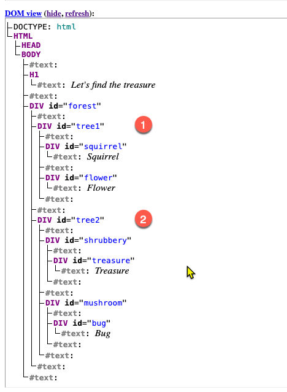
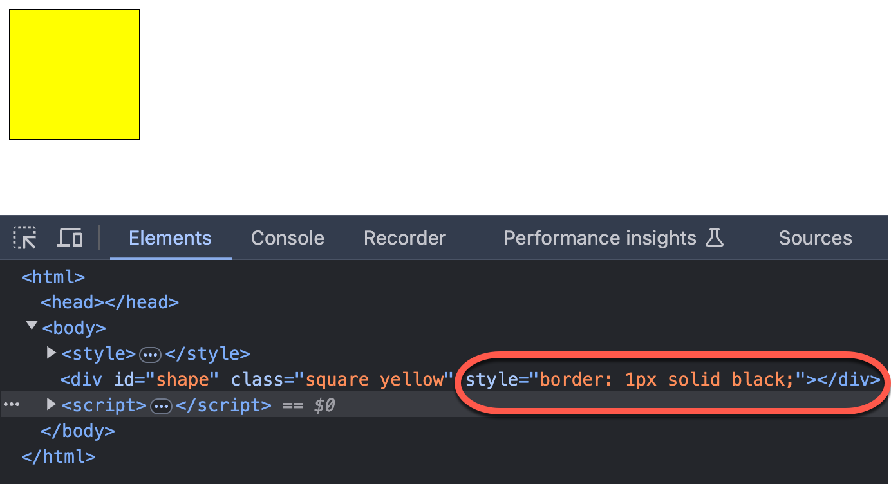
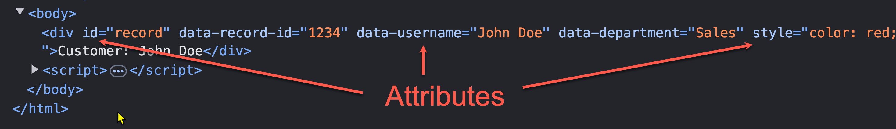

<style>
    .columns {
    display: flex;
  }
  .column {
    flex: 1;
    padding: 10px;
  }
  .column.large{
    flex: 2;
  }
  .small-font {
    font-size: 0.8em;
  }

  section > header,
section > footer {
  position: absolute;
  left: auto;
  right: 90px;
  height: 20px;
}

header {
  top: 30px;
}

footer {
  bottom: 30px;
}

</style>

# Chapter 10 Dynamic element manipulation using the DOM 

Topics in this chapter:

1. navigate the DOM and select the elements (Review)
2. add and change attributes and values to elements
3. add style to elements
4. add new elements to the DOM
5. events and event listeners (TBD: Move to part 2)

## Basic DOM traversing 

Review the section of "Navigating the DOM" in Chapter 9.

## Access the elements in the HTMLCollection object

- HTMLCollection object is a collection of HTML elements (the child of the node class).
- often returned by DOM methods that query or manipulate a group of elements in the document, 
  - such as `document.getElementsByTagName()` or `document.getElementsByClassName()`.
- You can access the elements in the HTMLCollection object by the **index** or the **element id name**.
<!-- Using element id name as the key to access the element in the array of element objects (Supplement) -->

### Example 10-1: Use the element id name as the key to access the element in the HTMLCollection object

When you get the child elements of the `<body>` element, how do you get get the element of the id "forest"?

```html
  <body>
    <h1>Let's find the treasure</h1>
    <div id="forest">
      <div id="tree1">
        <div id="squirrel"> Squirrel </div>
        <div id="flower"> Flower </div>
      </div>
      <div id="tree2">
        <div id="shrubbery">
          <div id="treasure"> Treasure </div>
        </div>
        <div id="mushroom">
          <div id="bug"> Bug </div>
        </div>
      </div>
    </div>
  </body>
```

---

Executing following JavaScript code:

`let bodyChildren = document.body.children`

will return an HTMLCollection object (an array-like object):

```
HTMLCollection(2) [h1, div#forest, forest: div#forest]
```

- The first two elements are elements with index 0 and 1, respectively.
- The third element is the property with the key "forest".
- The `HTMLCollection` object is an array-like object 

---

So, We can access elements by index: 

```javascript
bodyChildren[1]
```

or, by the element id as the key:

```javascript
bodyChildren.forest
```

---

Q: What is the result of `document.body.children.forest.children`?

A: the returned HTMLCollection object contains two elements and two properties:

```
HTMLCollection(2) [div#tree1, div#tree2, tree1: div#tree1, tree2: div#tree2]
```




## Selecting elements

Recall that you can select elements by:
- tag name: `document.getElementsByTagName(tagName)`, returns an `HTMLCollection` object.
- class name: `document.getElementsByClassName(className)`, returns an `HTMLCollection` object.
- id: `document.getElementById(id)`, returns an element object.
- CSS selector: `document.querySelector(cssSelector)`, returns the first HTML element.
  - and `document.querySelectorAll(cssSelector)`, returns a `NodeList` object

Please review the section of "Select Page Elements" in Chapter 9.

## Modify the CSS classes of an element

- use the `classList` property to get the `DOMTokenList` object
  - Return a live collection of the class attributes of the element.
- use the methods of the `DOMTokenList` object to manipulate the classes of an element.
  - a set of space-separated tokens. 
  - provides methods to **add**, **remove**, **toggle**, and **check** if a token exists in the list.

  
### Add a class

- Use the `add` method of the `DOMTokenList` object to add one or many classes to an element.
- The `add` method takes one or more class names as arguments and adds them to the element's class list.

```js
add(token1)
add(token1, token2)
add(token1, token2, /* …, */ tokenN)
```

#### Example 10-2: Modify the CSS classes of an element by JS 

- Consider the following HTML code (See full code in [`ch10/ex_10_02.html`](ex_10_02.html)). 
- We want to apply the `blue` class to the shape element `<div id="shape">`.

```html
<body>
    <style>
      .square {
        height: 100px;
        width: 100px;}
      .blue {
        background-color: blue;} 
      .yellow {
        background-color: yellow;}
      .hide {
        display: none;}
    </style>
    <div id="shape" class="square" ></div>
```

---

Steps:
1. Get the shape element by its id.
2. Access the shape element's `classList` property to get the `DOMTokenList` object 
3. Use the `DOMTokenList` object's `add()` to add the `blue` class to the shape element.

```javascript
let shape = document.getElementById("shape");
shape.classList.add("blue");
```


### Remove classes

Use the `remove` method of the `DOMTokenList` object:

```javascript
shape.classList.remove("blue");
```

### Toggle a class

The `toggle` method adds a class to an element if it is not present and removes it if it is present. 
- return `true` if the class is in the list after the operation, otherwise `false`.

#### Example: Toggle the hide CSS class 

The current `<div id="shape" class="square" ></div>` does not have the class `hide`. 

After executing the following code:
```javascript
shape.classList.toggle("hide");
```

- The class `hide` will be added to the square and return `true`.
- If you execute the code again, the class `hide` will be removed and return `false`.   

## Manipulating element's in-line style

<!-- Recall that `element.classList` expose the class attributes of an element. -->

- The HTMLElement's `style` property exposes the style attributes of an element.
  - return a live `CSSStyleDeclaration` object that contains the inline style attributes of the element.
- Use `htmlElement.style.<attribute_name>` to assess and set the style attributes of an element.
  - `htmlElement.style.backgroundColor` to set the background color of an element.
  - `htmlElement.style.color` to set the text color of an element.

### Example: Set the inline style: border

For example, set the border of the `shape` element to `1px solid red`:

```javascript
shape.style.border = "1px solid red";
```



## Custom data attributes: data-*

Use Case:
- Store data in the a HTML element, such the record's primary key. 
  - These data will be sent to the backend or used in the front-end.

Use the `data-*` attributes to store extra information in the HTML elements.
- `*` is the name of the data attribute.
- Multiple words can be connected by `-` (dash) mark. (dash-style names)
- Any ASCII capital letters (A to Z) are converted to lowercase.

### Example: 10-3: Store the record and user information in the HTML elements

Set the `record` element contain the `record-id` and `user-name` data attributes.
- `record-id=1234`
- `user-name="John Doe"`

```html
<!DOCTYPE html>
<html>
  <body>
    <div id="record" data-record-id="1234" data-user-name="John Doe"></div>
  </body>   
</html>
```

The resultant `record.dataset` will return a Map object:

```
{"recordId":"1234","userName":"John Doe"}
```

- Note the Map key names are different from the names in `data-*` attributes.


### Access and modify the custom data attributes 

Use the `dataset` property of the element object to get the custom data attributes.
  - return the `DOMStringMap` object that contains all the `data-*` attributes of the element.

The key name is the camelCase of the custom attribute name.
- `data-record-id` is converted to `recordId` key name.
- `data-user-name` is converted to `userName` key name.

The property value is always a string.

### Example: Get the value of `data-record-id` data attribute

Since `element.dataset` is a Map object, you can either use 
- the dot notation or 
- the bracket notation 
to access the value.

```javascript
let record = document.getElementById("record");
// Use the dot notation
let recordId = record.dataset.recordId;
// Use the bracket notation
let recordId = record.dataset["recordId"];
```

### Add a new property to the `dataset` object

Add a new property to the `dataset` object:

```javascript
record.dataset.newProperty = "new value";
```

### Check and delete a property in the `dataset` object

Check if a key exists in the `dataset` object
- Use the `in` operator: `"keyname" in element.dataset`
- Use the `hasOwnProperty` method: `element.dataset.hasOwnProperty("keyname")`

Delete a key-value pair from the `dataset` object
- Use the `delete` operator: `delete element.dataset.keyname`
  

To see more details, please refer to [HTMLElement: dataset property - Web APIs | MDN](https://developer.mozilla.org/en-US/docs/Web/API/HTMLElement/dataset).

## Lab 01: Apply a inline style and add a custom data attribute to an element


```js
<body>
    <div id="record" data-record-id="1234" data-userName="John Doe">
      Customer: John Doe
    </div>
    <script>
      // 1. Change the color of the record element to red.
      // 2. Log the attribute 'data-userName' to the console.
      // 3. Add a new data attribute `data-department="Sales"` to the <div id="record">.
      // 4. Log the value of the data attribute department to the console.
    </script>
  </body>   
```
File: [lab_10_01.html](lab_10_01.html)

- Note to the second data attribute. It uses the camelCase style, not the dash-style name.
- Be careful with its converted key name in the `DOMStringMap` object.

## Modifying tag attributes using xxxAttribute methods

Element object provides a set of xxxAttribute methods to access and modify the attributes of an element.:
- `setAttribute`, `getAttribute`, and `removeAttribute` 

Q: Why do we need these methods after we can modify the HTML page through the element's properties?

To anser this question, we need to:
- clarify the difference between the HTML element attributes and the DOM element properties.
- know the **bi-directional** and **one-directional** binding between the HTML element attributes and the DOM element properties.

### HTML element attributes vs DOM element properties

<!-- Before introducing the `setAttribute` and `getAttribute` methods, let's clarify the difference between the HTML element attributes and the DOM element properties. -->

Q: Element's attributes and properties are the same?

- Attribute means the HTML attribute of a tag.
- Property means the DOM property of an element object.



### Bi-directional binding between the HTML element attributes and the DOM element properties

- Browser create a DOM Node object for each HTML tag in the document. 
- Their properties are bi-directionally bound.
  - Change one will change the other and vice versa.

### Example: The bi-directional binding between the `` tag and the HTMLImageElement object

For the following `img` tag:

```html

```

The bound DOM element object is [HTMLImageElement object](https://developer.mozilla.org/en-US/docs/Web/API/HTMLImageElement)object.

<div class="columns">

<div class="column large">


</div>

<div class="column">

The `img` tag attributes are bind to the `HTMLImageElement`'s properties in **bi-directional** way. 
-  attribute <-> property 

</div>
</div>

<!-- Fig Source: https://livebook.manning.com/book/jquery-in-action-third-edition/chapter-4/20 -->

### Single-directional binding

A few attributes are bound to the properties of the DOM element object in **one-directional** way.
- attribute -> property
- Change the attribute will change the property, but not vice versa.

Examples of the one-directional binding:
- `checked`, `value` attributes of the `<input>` tag.
- your non-standard attributes (custom data attributes) 


### Example: The one-directional binding attributes

Consider the following `input` tag:

```html
<body>
    <input id="name" type="text" id="name" value="John Doe" my-attribute="Hello World" />
  
    <script>
        // value attribute is single-directional binding.
        let input_name = document.getElementById("name");
        input_name.value = "Jane Smith"; 
        console.log(input_name.value); // Jane Smith
        console.log(input_name.getAttribute("value")); // John Doe
    </script>
    </body>
```

The input tag's `value` attribute is different from the input element's `value` property now.


See the full code in [`ch10/ex_10_04.html`](ex_10_04.html).

### When to use the xxxAttribute methods?

Use when:
- Modify the HTML tag attributes with the single-directional binding.
- Modify your non-standard attributes (custom data attributes)

### setAttribute()

The syntax of the `setAttribute` method is:

```javascript
element.setAttribute(name, value);
```
- If the attribute already exists, the value is updated; 
- otherwise a new attribute is added with the specified name and value.

### getAttribute() and removeAttribute()

The syntax of the `getAttribute` method is:

```javascript
element.getAttribute(name);
```

The syntax of the `removeAttribute` method is:

```javascript
element.removeAttribute(name);
```

### Example 10-4: Modify the attributes of an element using the setAttribute methods

With the following HTML code, set the `name` and `disabled` attributes of the button element:
- `name="submit"`
- `disabled="true"`

```html
<html>
    <button>Hello World</button>
</html>
```

```javascript
let button = document.querySelector("button"); 
button.setAttribute("name", "submit");
button.setAttribute("disabled", "true");
```
---


### Get all attributes of a tag

- Use the `element.attributes` property that returns a `NamedNodeMap` object, 
  - which is an array-like object.


### Review Questions


1. What is the relationship between the HTML tag and the DOM element object?
2. When you want to add the `font-size: 16px` style to an element, what options do you have?
   <!-- - Use the `style` property of the HTMLElement object.
   - Use the `setAttribute` method to set the `style` attribute of the element. -->
<details>
<summary>Answer</summary>

Q1 Ans:

- bi-directional or one-directional binding between the HTML tag and the DOM element object.

Q2 Ans:

- Use the `style` property of the HTMLElement object.
  - `element.style.fontSize = "16px";`

- Use the `setAttribute` method to set the `style` attribute of the element.
  - `element.setAttribute("style", "font-size: 16px");`
 
</details>


## Creating new elements and adding them to the DOM

You can create a new element and add it to the DOM to create a new content dynamically.
- because the DOM elements and HTML document are bound each other.

### Scenario: Add a new email input element to the form

- You allow a user to add more than one email addresses to the form. 
- When the user clicks the "Add Email" button, a new input element will be added to the form.


### Steps to create a new element and add it to the DOM

1. Create a new element using the `document.createElement` method.
2. Set the attributes of the new element using the `setAttribute` method or the `HTMLElement`'s properties.
3. Find the parent element where you want to add the new element. 
4. Then, use the `appendChild` method of the parent element to add the new element.

### Example 10-5: Add a new email text input element to the form when the user clicks the "Add Email" button

Click the "Add another email" button to add a new email input element to the form.
```html 
<fieldset>
        <legend>Contact Information</legend>
        <p> <button onclick="addEmail()">Add another email</button> </p>
        <form>
            <div id="emailList">
                <label for="email1">Email address:</label>
                <input type="email" id="email1" name="email1" />
            </div>
        </form>
</fieldset>
```


<!-- When a user click the "Add another email" button, the `addEmail()` function will be executed to add a new email input element to the form. -->

---

The logic steps to implement the requirement are:
1. Get the total number of email input elements in the form so that we can assign a unique id to the new email input element.
2. Find the parent element where we want to add the new email input element.
3. Create a new label element and set its `for` attribute to the new email input element's id.
4. Create a new input element and set its `type`, `id`, and `name` attributes.
5. Append the new label and input elements to the parent element.

---

Step 1. Get the total number of email input elements in the form so that we can assign a unique id to the new email input element.

```javascript
// Use the css selector to get all email input elements
// Select all input elements with the type of email whose parent is the emailList div element.
// Return a NodeList object.
let emailList = document.querySelectorAll("#emailList > input[type=email]");
// Get the total number of email input elements
let emailCount = emailList.length;
```


Step 2. Find the parent element where we want to add the new email input element.

```javascript
let parentElement = emailList.parentElement;
```

---

Step 3. Create a new label element and set its `for` attribute to the new email input element's id.

```javascript
let newLabel = document.createElement("label");
newLabel.htmlFor = "email" + (emailCount + 1);
// or newLabel.setAttribute("for", "email" + (emailCount + 1));
newLabel.innerHTML = "<br/> Email address " + (emailCount + 1) + ":";
```

---

Step 4. Create a new input element and set its `type`, `id`, and `name` attributes.

```javascript
let newEmail = document.createElement("input");
newEmail.type = "email"; 
newEmail.id = "email" + (emailCount + 1);
newEmail.name = "email" + (emailCount + 1);
//or newEmail.setAttribute("type", "email");
```

Step 5. Append the new label and input elements to the parent element.

```javascript
parentElement.appendChild(newLabel);
parentElement.appendChild(newEmail);
```


---

The complete code:

```javascript
<script>
        function addEmail() {
            // Step 1. Get the total email inputs
            let emailList = document.querySelectorAll("#emailList > input[type=email]");
            let emailCount = emailList.length;

            // Step 2 Find the parent element where we want to add the new email input element.
            let parentElement = document.getElementById("emailList");

            // Step 3 Create the label for the new email input field
            let newLabel = document.createElement("label");
            // Set the label attributes
            newLabel.htmlFor = "email" + (emailCount + 1);
            newLabel.innerHTML = "<br/> Email address " + (emailCount + 1) + ":";
            
            // Step 4 Create the email input field
            let newEmail = document.createElement("input");
            // set element attributes
            newEmail.type = "email";
            newEmail.id = "email" + (emailCount + 1);
            newEmail.name = "email" + (emailCount + 1);
            
            // Step 5 Append the new label and email input field to the emailList
            document.getElementById("emailList").appendChild(newLabel);
            document.getElementById("emailList").appendChild(newEmail);
        }
    </script>
```

See the full code in [`ch10/ex_10_05.html`](ex_10_05.html).

### Lab 02: Insert a new element to the specific position in the DOM

Based on the example 10_05, write a script to create a `h1` element with the text "JavaScript is fun!" and insert it before the `fieldset` element.

Method 1:
- Create a new `h1` element and set its text content to "JavaScript is fun!"
- Use the `before` method of the `fieldset` element to insert the new `h1` element before the `fieldset` element.
  - Study the `before` of the `Node` object from the [MDN Web Docs]() to help you.
- Hint: the `element.before()` will find the parent element of the `element` and append the new element to the parent element before the `element`.


---

Alternatively, 
- Get the first child of the body element (the `fieldset` element) 
- Find the parent element of the `fieldset` element.
- Then, use the `insertBefore` method of the **parent element** to insert the new element.
  - Study the `insertBefore` method of the `Node` object from the [MDN Web Docs](https://developer.mozilla.org/en-US/docs/Web/API/Node/insertBefore) to help you.


## Summary 

In this chapter, we have learned:
- Add and remove classes to an element using the `classList` property.
- Modify the in-line style of an element using the `style` property.
- Access and modify the custom data attributes of an element using the `dataset` property.
- Modify the attributes of an element using the `setAttribute`, `getAttribute`, and `removeAttribute` methods.
- Create new elements and add them to the DOM.
- Event model and event handling.
- Three ways to register event listeners to DOM elements: inline event handlers, setting event handler properties, and calling the `addEventListener()` method.

<script>
    // add the following script at the end of your marp slide file.
    const h2s = document.querySelectorAll('h2');
    h2s.forEach(function(h2, idx){
        h2.innerHTML = `<span class="small-font">${idx + 1}</span> ${h2.innerHTML}`
    })
</script>


