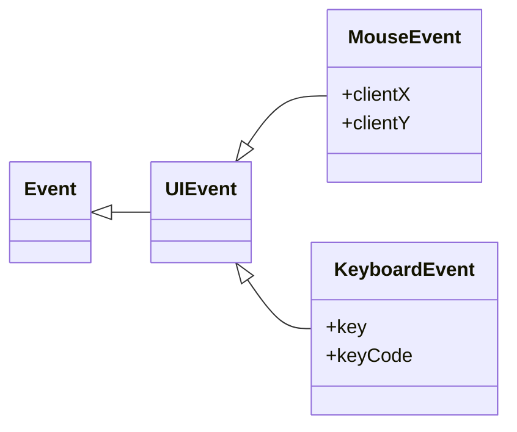

<style>
    .columns {
    display: flex;
  }
  .column {
    flex: 1;
    padding: 10px;
  }
  .column.large{
    flex: 2;
  }
  .small-font {
    font-size: 0.8em;
  }

  section > header,
section > footer {
  position: absolute;
  left: auto;
  right: 90px;
  height: 20px;
}

header {
  top: 30px;
}

footer {
  bottom: 30px;
}

</style>

# Chapter 10 Dynamic element manipulation using the DOM: Part 2 Event Model and Event Listeners

## Learning Objectives

- Understand the event model in the browser
- Understand the event object
- Understand the event listener
- Understand how to register an event listener to a DOM element

## Event Model

Events represent that something has happened in the browser.

Events can be:
- Windows or DOM events (click, mouseover, keydown, drag-and-drop, scroll etc.), indicating the user's interaction with the window or the DOM
- API events (read client-side file, fetch resources from a server, timer, etc.), notifying developers that asynchronous operations have been completed.

Ref: [Event handling (overview) - Event reference | MDN](https://developer.mozilla.org/en-US/docs/Web/Events/Event_handlers)

### Example 10-6: the button click event (DOM event)


source: https://dotnettutorials.net/wp-content/uploads/2020/05/word-image-28.png?ezimgfmt=ngcb8/notWebP


## Event listener

Event listeners are functions that listen for events and execute code when the event occurs.
- Event listeners are call-back functions.

The function signature of the event listener is:

```javascript
functionName(event) {
    // code to execute when the event occurs
}
```

## Event Object 

The browser will pass (inject) an `Event` object to the event listener function when the event occurs.

The `Event` object tell us two basic things:
- the event type
- the target element that triggers the event (event target)

### Event Types

Depend on the event type, the `Event` object may have more properties. For example, 
- a [mouse event](https://developer.mozilla.org/en-US/docs/Web/API/MouseEvent) includes the coordinate of the mouse pointer.
- a [keyboard event](https://developer.mozilla.org/en-US/docs/Web/API/KeyboardEvent) include the key code of the key that is pressed.

The inheritance hierarchy of the `Event` object is: 

<!-- Enable Mermaid rendering by adding the `mermaid` directive -->
<!-- Ensure your Marp environment supports Mermaid -->



---

To see the full list of the event types, please refer to 
- [Event reference | MDN](https://developer.mozilla.org/en-US/docs/Web/Events)
- [Event - Web APIs | MDN](https://developer.mozilla.org/en-US/docs/Web/API/Event)


## Register an event listener to an DOM element

There are three ways to register an event listener to an element:
- Setting the event **handler attribute** of the HTML tag (inline event handler)
- Setting the event **handler property** of the DOM element
- Calling the `addEventListener()` method of the DOM element

Let discuss when to use which method.

## Use the inline event handler: Write javascript code in the `onXYZ` attribute of the HTML tag

When you want to execute a simple code when the event occurs, you can use the inline event handler.

You write javascript code in the `onXYZ` attribute of the HTML tag, such as `onclick`, `onmouseover`, `onkeydown`, etc.

### Example 10-7: Inline event handler

```html
<!DOCTYPE html>
<html>
    <head>
    </head>
    <body>
        <a href="#" onclick="alert('Hello, world!');">Click me to say hello.</a> <br/>
        <a href="#" onclick="sayHello(this);"> Click me to invoke a function.</a> <br/>
    </body>

    <script>
        function sayHello(trigger) {
            // alert('Hello, world!');
            console.log('Hello, world!');
            console.log('this: ', trigger);
            console.log('event type: ', event.type);
            console.log('event target: ', event.target);
        }
    </script>
</html>
```
---

The first `<a>` tag will show an alert message "Hello, world!" when the user clicks the link.

The second `<a>` tag will execute the `sayHello` function with a argument when the user clicks the link.

The argument `this` refers to the element running the inline event handler.
- the `this` is equal to `event.target` in the `sayHello` function.


### Implicitly converted inline event handler

The browser will implicitly convert the code in the inline event handler to a function and register it to the element's event listener.

The converted event listener function will have the following pattern:

```javascript
function(event) { 
  with(document) {
    with(this.form || {}) { 
      with(this) {
        // code in the inline event handler
      } 
    }
}
```

That means you can access trigging element (`this`), form data, `document`, and `event` objects in the inline event handler.

---

So, the inline event handler in the second `<a>` tag is equivalent to the following code:

```js
function sayHello(trigger) {
    ...
}
document.body.children[2].onclick = function(event){
  with(document) {
    with(this.form || {}) { 
      with(this) {
        // Can access the variables: event, document, this.form, this
        sayHello(this);
      } 
    }
  }
}
```

### Disadvantages

Use the inline event handler a lot will make your code hard to maintain and debug, because 
1. The JS code is mixed with the HTML code.
2. Cannot centrally assign the event listeners to the elements.
3. When multiple tags use the same event handler, you need to assign the event handler to each tag one by one, which is very inconvenient. 
4. Cannot programmatically and dynamically add or remove the event listeners.

Setting the event handler property of the DOM element is a better way to register the event listener.

## Setting the event handler property of the DOM element to register the event listener

Recall that each HTML element has a corresponding DOM object.

The HTML element has a set of event handler attributes. 

Similarly, the DOM object has a set of event handler properties, such as `onclick`, `onmouseover`, `onkeydown`, etc., all in lowercase.

You can register an event listener to the DOM element by assigning a function to the event handler property.

### Example 10-8: Setting the event handler property of the DOM element

We rewrite the previous example and separate the javascript code from the HTML code.

```html
<!DOCTYPE html>
<html>
    <head>
    </head>
    <body>
        <a href="#">Click me to say hello.</a> <br/>
        <a href="#">Click me to invoke a function.</a> <br/>

        <script src="ex_10_08.js"></script>
    </body>
</html>
```

---

```javascript
const allAnchors = document.querySelectorAll('a');
let firstAnchor = document.querySelectorAll('a')[0]
let secondAnchor = document.querySelectorAll('a')[1]

// Assign the onclick event handler (a callback function) 

firstAnchor.onclick = function(event) {
  console.log('Event type:', event.type);
  console.log('Event target:', event.target);
  window.alert('You clicked the first anchor element');
}

secondAnchor.onclick = function(event) {
    console.log('Hello, World!');
    console.log('Event type:', event.type);
    console.log('Event target:', event.target);
}
```

### Example 10-9: Assign the same listener function to multiple elements

```html 
<html>
    <head>
    </head>
    <body>
        <div>
            <input type="checkbox" id="cb1" name="flavor" value="10" data-flavor="vanilla">
            <label for="cb1">Vanilla</label>
            <input type="checkbox" id="cb2" name="flavor" value="20" data-flavor="strawberry">
            <label for="cb2">Strawberry</label>
        </div>
        <script>
            // define the listener function
            function logValueData(e){
                console.log(e.target.value);
                console.log(e.target.dataset.flavor);
            }
            // assign the listener function 
            const checkboxes = document.getElementsByName('flavor');
            checkboxes.forEach(checkbox => {
                checkbox.onclick = logValueData;
            });
        </script>
    </body>
</html>
```

---

Notes:
- `document.getElementsByName('flavor')` returns a `NodeList` object that contains all the elements with the name `flavor`.
- The `NodeList` object provides the `forEach` method to iterate through the elements in the list.
  - However, the `HTMLCollection` object does not.
  - Convert the `HTMLCollection` object to an array using the `Array.from()` method or the spread operator (`...`) if you want to use the `forEach` method.

### Advantages

- The code is separated from the HTML code.
- You can centrally assign the event listeners to the elements.
- You can assign the same listener function to multiple elements for reusing the code.

### Limitations

- You cannot assign multiple event listeners to the same event type of the same element.
  - e.g. you cannot assign two different functions to the `onclick` event of the same element.
- You cannot specify the advanced event options when assigning the event listener.
  - Options such as `capture`, `once`, and `passive`.
  - These advanced options will be covered in the next chapter. 

The `addEventListener` method of the DOM element provides a solution to these limitations.

## Calling the `addEventListener()` method of the DOM element to register the event listener

The third way to register an event listener to an element is to call the element's `addEventListener` method.

The [syntax of the `addEventListener` method](https://developer.mozilla.org/en-US/docs/Web/API/EventTarget/addEventListener) is:

```javascript
addEventListener(type, listener)
addEventListener(type, listener, options)
addEventListener(type, listener, useCapture)
```

The last two syntaxes will be discussed in the next chapter.


### Parameters for the `addEventListener` method:

`type` parameter:
- the event type, such as `click`, `mouseover`, `keydown`, etc. 
- No `on` prefix is needed.
- See the full list of the event types at [Event reference | MDN](https://developer.mozilla.org/en-US/docs/Web/Events)

`listener` parameter:
- the **event listener function** that will be executed when the event occurs. 
- Or, an **object** with a `handleEvent` method.


### Example 10-10: Using the `addEventListener` method to register the event listener

Rewrite the previous example and use the `addEventListener` method to register two event listeners for each anchor element.

```html
...
<script>
    // define the listener function
    function logValueData(e){...}
    function secondListener(e){...}
    // assign the listener function 
    const checkboxes = document.getElementsByName('flavor');
    checkboxes.forEach(checkbox => {
        checkbox.addEventListener('click', logValueData);
        checkbox.addEventListener('click', secondListener);
    });
</script>
```

See the full code in [`ch10/ex_10_10.html`](ex_10_10.html).

## Summary

- Create new elements and add them to the DOM.
- Event model and event handling.
- Three ways to register event listeners to DOM elements: inline event handlers, setting event handler properties, and calling the `addEventListener()` method.

<script>
    // add the following script at the end of your marp slide file.
    const h2s = document.querySelectorAll('h2');
    h2s.forEach(function(h2, idx){
        h2.innerHTML = `<span class="small-font">${idx + 1}</span> ${h2.innerHTML}`
    })
</script>