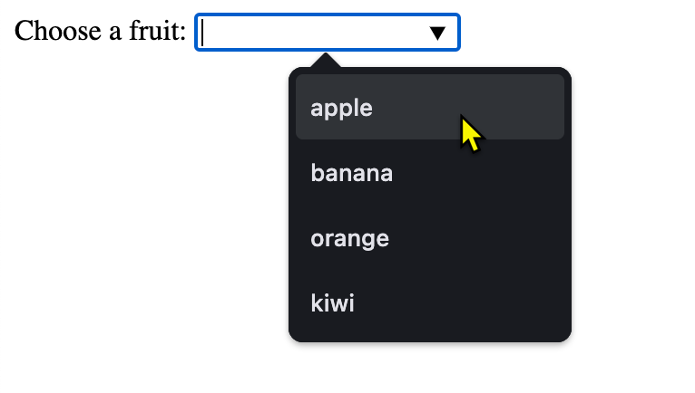
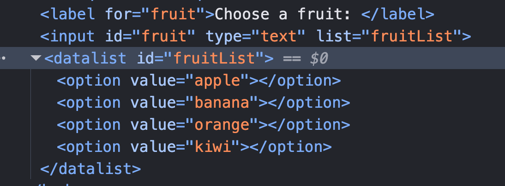
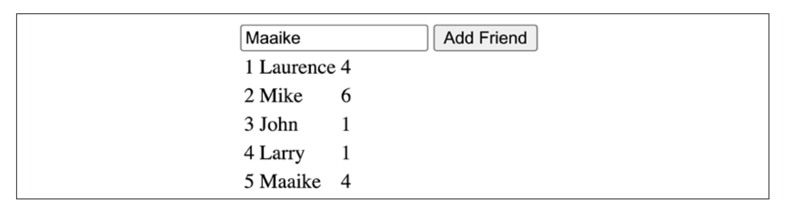

# Chapter 10 Practices

## Practice 10.1

Given the list of values about fruits: ["apple", "banana", "orange", "kiwi"], use the JavaScript only to create a text that provides a list of default fruit names. 

You must use the `<input type="text" list="...">`  and `<datalist id="...">` tags to create a list of fruits.

Here is the empty HTML document to start with:

```html
<!DOCTYPE html>
<html lang="en">
<head>
    <title>Practice 10.1 </title>
</head>
<body>
</body>
</html>
```

The expected output is:



which has the following element structure:



## Practice 10.2

Interactive voting system

Create a voting system that allows users to vote for their friends.



The user can add a new friend to the list by entering the name of the friend in the text box and clicking the "Add" button. 

The added friend will be displayed in the table with three columns. The first column is serial number, the second column is the name of the friend, and the third column is the vote count.

The user can vote for a friend by clicking the friend's name or the row of the friend in the table. The vote count will be increased by one.

Use the following HTML code to start with:

```html
<!DOCTYPE html>
<html>
    <head>
    </head>
    <body>
        <div>
            <title>Vote your friends</title>
            <div id="message">Vote your friends</div>
            <input type="text" id="addFriend">
            <input type="button" id="addNew" value="Add Friend">
        </div>
        <table id="output"></table>
    <script>
    </script>
    </body>
</html>
```

Hint:
- Add a table row (`<tr>`) to the table (`<table>`) when a new friend is added.
- The table row should contain three table data (`<td>`) elements. 