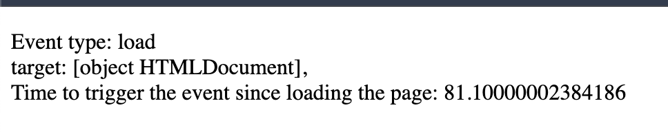
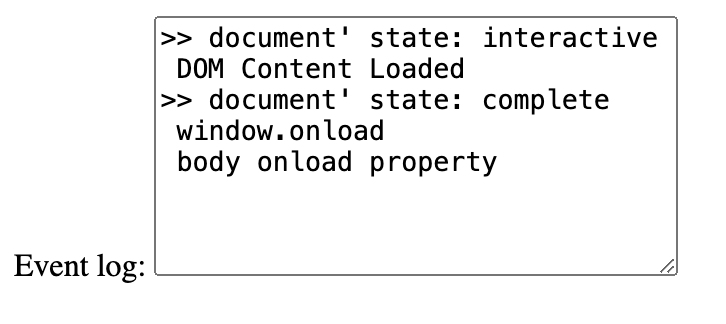

<style>
    .columns {
    display: flex;
  }
  .column {
    flex: 1;
    padding: 10px;
  }
  .column.large{
    flex: 2;
  }
  .small-font {
    font-size: 0.8em;
  }

  section > header,
section > footer {
  position: absolute;
  left: auto;
  right: 90px;
  height: 20px;
}

header {
  top: 30px;
}

footer {
  bottom: 30px;
}
</style>

# Chapter 11 Interactive Content and Event Listeners

## Topics

This chapter will explore various browser events that can be used to create interactive web pages, including:

- window events
- mouse events 
- DOM event flow 
- onchange and onblur events
- Key events 
- Drag and drop events
- Form submission 

## Introduction

Recall that an event is a signal that something has happened in the browser.

Majorly, there are two types of events:
- **window and documents** events: happens when users interact with the browser window or document
- **API** events: happens when developers interact with the browser API and the asynchronous operations are completed.

--- 

Also recall the ways to register event listeners:
- inline event handlers
  - set the `onXXX` attribute of a tag
- Setting the `onXXX` property of an element
- call element's `addEventListener()` method

## Window Events

Window object generates lots types of events to notify the developer about state changes, 
- The purpose is to allow developers to interact with the browser window and document.

These event types are such as:
- window `load` and `beforeunload` events: when browser loads a page or when a user is going to close or leave the current page
- `clipboard` events: when users initiate copy, cut, and paste actions
- `network` events: when the browser is offline or online 
- `focus` events: when an element get focus or lose focus )
- and many more, see [Window - Web APIs | MDN](https://developer.mozilla.org/en-US/docs/Web/API/Window#events)


### The `load` event of the `window` object

The window fires the `load` event when the browser finishes loading the entire page, including all images, scripts, and other resources.
- the browser guarantee that all the elements in the page are loaded and ready to be manipulated.


<!-- Source: [Understanding Page Load Time](https://docs.newrelic.com/docs/browser/new-relic-browser/page-load-timing-resources/page-load-timing-process/) -->

--- 

If you try to manipulate the elements before the `load` event is fired, you may get unexpected results, 
- such as `null` or `undefined` values because the DOM is not fully loaded.


### Add a listener function to the `load` event of the `window` object

Since there is no HTML tag for the `window` object, you can only register the listener function by 
- setting the `onload` property of the `window` object or 
- call the `addEventListener()` method of the `window` object.

Code snippets to register the listener function to the `load` event of the `window` object:
```javascript
addEventListener("load", (event) => {});

onload = (event) => {};
```

### Example 10-1: Register a listener function to window's `load` event

```html
<body>
    <p id="display"></p>
    
    <script>
        function initPage(event){
            let message = `Event type: ${event.type} 
                <br/> target: ${event.target}, 
                <br/> Time to trigger the event 
                since loading the page: ${event.timeStamp} milliseconds`;
                
            document.getElementById("display").innerHTML = message;
            console.log(event);
        }
        window.onload = initPage;
    </script>
</body>
```

---

Outputs:




See the complete example in [ex_11_1.html](ex_11_01.html)

---

Notes:
- `event.timeStamp`: return the number of milliseconds elapsed from the beginning of the time origin to the event being created. 
  - In the case of the `load` event, the time origin is the time when the browser starts to load the page.


### The `DOMContentLoaded` event of the `document` object

THe `DOMContentLoaded` event of the `document` object is fired before the `load` event of the window object.
- fired when the initial HTML document has been completely loaded and parsed, **without waiting for stylesheets, images, and subframes to finish loading**.

<!-- When you don't wait for the stylesheets, images, and subframes to finish loading, listen to the `DOMContentLoaded` event to manipulate the DOM. -->


---

Event sequence in summary:
  - `document.DOMContentLoaded` > `window load event` (or its alias: `document.body load event`)
  - The document.body load event is an alias of the window load event.

ref: [HTMLElement: load event - Web APIs | MDN](https://developer.mozilla.org/en-US/docs/Web/API/HTMLElement/load_event)

<!-- Src: [重新認識 JavaScript 番外篇 (6) - 網頁的生命週期 - iT 邦幫忙::一起幫忙解決難題，拯救 IT 人的一天](https://ithelp.ithome.com.tw/articles/10197335) -->


### Add a listener function to the `DOMContentLoaded` event of the `document` object


```js
document.addEventListener("DOMContentLoaded", yourCallbackFunction);
```

### Example 10-2: Register a listener function to the `DOMContentLoaded` event of the `document` object

```html
<script>
    const eventLog = document.getElementById('eventLog');
    // monitor the window's load event 
    window.addEventListener('load', (e) => {
        eventLog.value += " window.onload \n";
        console.log(e);
    });

    // Monitor the DOM content state of the document
    document.addEventListener('DOMContentLoaded', (e) => {
        eventLog.value += " DOM Content Loaded \n";
    })
</script>
```
---

Result:



See the complete example in [ex_11_2.html](ex_11_2.html)

### Review Questions

1. When the DOM content is loaded without waiting for stylesheets, images, and subframes to finish loading, which event is fired? 
   A. `load` event of the `window` object
   B. `DOMContentLoaded` event of the `document` object
   D. `load` event of the `document.body` object

## Mouse Events model

### Mouse click events 

Events in order when clicking a mouse button:
1. `mousedown`: click on top of an element without releasing the mouse button
2. `mouseup`: release the mouse button
3. `click`: user clicks on an element


---

For the `dblclick` event, the browser needs two cycles of the `mousedown`, `mouseup`, and `click` events to trigger the `dblclick` event.

Source: [Javascript MouseEvent Tutorial with Examples | o7planning.org](https://o7planning.org/12293/javascript-mouseevent)

### Mouse movement events 

- `mouseenter`: Enter the target element (not considering its children)
- `mouseleave`: Leave the target element (not considering its children)
- `mouseover` event: Moving mouse over the **target** element or its **children**
  - tell you that you have moved over the current element (a new element is entered).


---

- `mouseout` events: Moving mouse out of the **target** element or its **children**
  -  Tell you that you have move out the current element.


--- 

The sequence of the mouse events when the mouse moves over the target and its child elements:


See the demo in [Moving the mouse: mouseover/out, mouseenter/leave](https://javascript.info/mousemove-mouseover-mouseout-mouseenter-mouseleave#mouseout-when-leaving-for-a-child)


### Example 10-3: Register a listener function to the mousemove event

```javascript
parent.onmousemove = function(event){
    console.log("Mouse move event");
    moveCount++;
    moveCountDisplay.innerHTML = moveCount;
}
```

See the complete example in [ex_11_03.html](ex_11_03.html)

### Mouse Position: various coordinates


---

The mouse event provides four type coordinates to indicate the mouse position:
- offsetX and offsetY: the mouse position relative to the top-left corner of the **target element**
- clientX and clientY: the mouse position relative to the top-left corner of the **viewport of the window**
- pageX and pageY: the mouse position relative to the top-left corner of the entire **page** that is scrollable  
- screenX and screenY: the mouse position relative to the top-left corner of the **screen**


<!-- <figcaption>  Page, client, and screen coordinates for mouse position. <br/> -->

<!-- source: https://o7planning.org/12293/javascript-mouseevent  -->

### Lab 01

See [Lab 11-1](lab_11_01.md) for a step-by-step guide to complete the lab.

## DOM Event Flow

This section will cover the important concept of the DOM event flow:
- event propagation, 
- event bubbling, 
- event capturing, and 
- event delegation.

### Why these concepts are important?

- help you understand how the browser handles the event when it is triggered
- help you decide **where to register** the event listener to handle the event
  - the target element, its ancestors, or its descendants
- Allow you to handle the event before it reaches the target element or after it leaves the target element
  - e.g. to prevent the default behavior of the event (the link is not followed when clicked) or 
  - to stop the event propagation (the event is not propagated to the parent element)
  
### Event Propagation in the DOM

The event propagates from top to bottom (the target element) and then bubbles up from the bottom to the top.
- Since the DOM is a tree structure, 

No event propagation is involved for the window object or other API objects.


### Event capturing, target, and bubbling phases

The DOM event propagation comprises three phases in sequence: capturing, target, and bubbling.


---

Phase 1: Capturing
- The browser propagates the event from the root element (window object) to the target element.
- Along the path, the browser invokes the event handlers of the ancestors of the target element.

Phase 2: Target
- The second phase is that the browser invokes the event handler of the target element.

Phase 3: Bubbling
- The browser propagates the event from the target element to the root element (window object).

<!-- source: [Bubbling and capturing](https://javascript.info/bubbling-and-capturing) -->

### Example 10-4: Demonstrate the event propagation: Capturing, Target, and Bubbling

We have the following HTML structure:

```html
<div id="eventPropagate">
    <form class="listener">FORM
        <div >DIV
            <p>P</p>
        </div>
    </form>
</div>
```
---

When you click the `<p>` element within the form, the event propagates as follows:

1. Capturing Phase: HTML > BODY > DIV > FORM > DIV > P (Top to Targe)
2. Target Phase: P (Target)
3. Bubbling Phase: P > DIV > FORM > DIV > BODY > HTML (Target to Top)

See the complete example in [ex_11_4.html](ex_11_04.html)


### The application of the event propagation: Event Delegation pattern 

- Implement the **Event Delegation** pattern: 
  - Register a single event listener to the parent element to handle the events for all its children

- Its benefit: Save the lines of code and improve the performance of the web page.
  - put a single handler on their common ancestor, instead of assigning a handler to each of them.


### The scenario of using the Event Delegation pattern

Consider the following example from [Event delegation, javascript.inf.](https://javascript.info/event-delegation):

- You have a menu with three buttons: Save, Load, and Search.
- How many event listeners do you need to handle the click event for the three buttons?

```html
<div id="menu">
  <button data-action="save">Save</button>
  <button data-action="load">Load</button>
  <button data-action="search">Search</button>
</div>
```
[ex_11_5.html](ex_11_05.html)

---

- Use the Event Delegation pattern: Just one event listener
- Register a single event listener to the parent element `menu` to handle the click event for its three children.


- see the complete example in [ex_11_5.html](ex_11_05.html).
- Additionally, you can read the article [Event delegation, javascript.inf.](https://javascript.info/event-delegation) for more details. 


### Lab 02

See [Lab 11-2: Prevent the default behavior.](lab_11_02.md) for a step-by-step guide to complete the lab.


## onblur/onfocus and onchange events for the `input` element

### The `onblur` and `onfocus` events

The `onblur` event is fired when the input element loses focus. 

In contrast, the `onfocus` event is fired when the input element gets focus.

### Example 10-6: Change the background color of the input element when it gets focus or loses focus


For any input elements inside the form:
- When the input element gets focus, the background color changes to yellow.
- When the input element loses focus, the background color changes to white.

Register the `focus` and `blur` events to the form element to handle the events for all its children.
- invoke the handler function in the **capturing phase**.

--- 

The JavaScript code for this example:
```javascript
const form = document.getElementById('myForm');
    form.addEventListener('focus', function(event) {
        // set the tag's style attribute
        event.target.style.backgroundColor = 'yellow';
    }, true);
    form.addEventListener('blur', function(event) {
        event.target.style.backgroundColor = '';
    }, true);
```
- The third argument of the `addEventListener()` is set to `true` to register the event listener in the capturing phase.

See full example in [ex_11_6.html](ex_11_06.html)

### The `onchange` event of the `input` element

The `onchange` event is fired when the value of an input element changes and the element loses focus.

### Example 10-7: Generate the full name when the fields change in the form

- Whenever the value of the first name or last name field changes, the full name is displayed in the output field.

- Listen to the `change` event of the form element.


---

The JavaScript code for this example:

```javascript
   const form = document.getElementById('myForm');
    form.onchange = function (event) {
        const output = document.getElementById('output');
        const firstName = document.getElementById('firstName').value;
        const lastName = document.getElementById('lastName').value;
        output.innerHTML = `${firstName} ${lastName}`;
    };
```

See full example in [ex_11_7.html](ex_11_7.html)


## Key Events

Let you capture the key pressed by the user and perform the necessary operations.

### The `keydown`, `keyup`, and `keypress` events

The `keydown` event is fired when a key is pressed down.

The `keyup` event is fired when a key is released.

Both of the two events emit the `KeyboardEvent` object.

The `keypress` event is fired when a key is pressed down and released. 


https://o7planning.org/12319/javascript-keyboardevent

---


Warning: 
- The [`keypress` event](https://developer.mozilla.org/en-US/docs/Web/API/Element/keypress_event) has been deprecated in the latest version of the JavaScript.

### Get the pressed key or code

The `KeyboardEvent` object provides:
- `key` property: returns the **character value** of the key pressed
  - e.g. Press b key, returns "b"; Press shift+b key, returns "B"
  - Press left control key, returns "Control"

- `code` property: returns the **physical key** pressed
  - e.g. Press b key, returns "KeyB"; Press shift+b key, returns "KeyB"
  - Press left control key, returns "ControlLeft"

### keyboardEvent event and  keyboardEvent.key property

When user presses a key, the browser generates a `KeyboardEvent` object.

The `key` property of the `KeyboardEvent` object returns the **character value** of the key pressed.

If the pressed key has a **printed representation**, the returned value is a non-empty Unicode character string containing the printable representation of the key.
- Press b key, returns "b"
- Press shift+b key, returns "B"

---

If the pressed key is a **control or special character**, the returned value is one of the pre-defined key values.
- Press Enter key, returns "Enter"
- Press Backspace key, returns "Backspace"
- See the complete list of pre-defined key values in [Key values for keyboard events - Web APIs | MDN](https://developer.mozilla.org/en-US/docs/Web/API/UI_Events/Keyboard_event_key_values#editing_keys)

If the key cannot be identified, the returned value is Unidentified.

### keyboardEvent.code property

The `KeyboardEvent.code` property returns the pressed **physical key**. 

It is not affected by the keyboard layout or the state of the modifier keys.

For example:
- Press b key, returns "KeyB"
- Press left-shift and b key, returns "ShiftLeft" and "KeyB" (two events are generated)

### Example 10-8: Display the key and code values when a key is pressed

Enter any keys in the input field, the key and code values of the pressed key are displayed on the page.


---

The JavaScript code for this example:

```javascript
const input = document.querySelector("input");
    const keyLog = document.getElementById("keyCodeLog");
    const charLog = document.getElementById("charCodeLog");

    input.addEventListener("keydown", logKey);

    function logKey(e) {
        keyLog.textContent += ` ${e.code}`;
        charLog.textContent += ` ${e.key}`;
    }
    function clearLogs() {
        keyLog.textContent = "";
        charLog.textContent = "";
    }
```

See the complete example in [ex_11_8.html](ex_11_8.html)

### Example 10-9: Allow only numbers to be entered in the input field, no spaces, alphabets, or special characters

- The example allows only numbers to be entered in the input field. 
- Exceptional keys include Backspace, Delete, ArrowLeft, and ArrowRight for editing. 


---

The JavaScript code to validate the input field:

```javascript
// Add the keydown event listener to the input field
input.addEventListener("keydown", isNumberKey);

 // function to check if the key pressed is a number
function isNumberKey(event) {
    const exceptionKeys = ['Backspace', 'Delete', 'ArrowLeft', 'ArrowRight'];

    if ((isNaN(event.key) && !exceptionKeys.includes(event.code)) || event.code =='Space') {
            // prevent the default behavior of the keydown event, and stop the event propagation
            event.preventDefault();
            // stop the event propagation
            event.stopPropagation();
    }
}
```

--- 

First, the `keydown` event is registered to the input field. When a key is pressed, the `isNumberKey` function is invoked.

The `isNumberKey` function checks if the pressed key is a number. 

If the key is not a number, the `preventDefault()` method is called to prevent the default action of the key.
- That is, the key is not entered in the input field.

See the complete example in [ex_11_9.html](ex_11_09.html)

### Notes to the deprecated `keycode` and `charcode` properties

The `keycode` and `charcode` properties have been deprecated in the latest version of the JavaScript.
- Do not use them.
- Use the `key` property instead.

<!-- `keycode` represents a system and implementation dependent numerical code, such as ASCII code.
- All keys have `keycode` values, including the function keys, arrow keys, and control keys that do not generate character values.

`charcode` is the returned the Unicode value of a character key when the key is pressed. 
- These keys are the alphabetical, numerical, and punctuation keys. -->

### Review Questions

- What the events should you listen to if you want to show a list of suggestions when the user types in an input field?
  A. `keydown`, `keyup`, or `keypress`
  B. `blur` and `focus`
  C. `change`

<!-- Ans: use `keydown`, `keyup`, or `keypress` events to capture the key pressed. the `change` event is suitable too.
 -->

- You want to know if the user presses the left control key. Which property of the `keyboardEvent` object should you use?
  A. `keyboardEvent.key`
  B. `keyboardEvent.code`

<!-- Ans: use `keyboardEvent.code` to get the physical key pressed. -->

## Drag and Drop Events (Drag and Drop API)

### The model of the drag and drop operation:


<!-- Source: https://jenkov.com/tutorials/html5/drag-and-drop.html -->

### Steps to perform drag and drop operations

1. Set the element as draggable
   - set the `draggable` attribute of the HTML element to `true`.

2. Listen to the drag events on the dragged element
   - when dragging starts, the browser fires the `dragstart` event on the dragged element.
     - Prepare the data to be transferred in the `dataTransfer` object of the `dragstart` event.
     - Use `dataTransfer.setData()` to set the data.
   - when dragging ends, the browser fires the `dragend` event on the dragged element.
     - Alter the dragged element if necessary after the drag operation.

---

3. Listen to the drag events on the drop target
   - When the dragged element is dragged over an valid droppable element, the browser fires `dragenter`, `dragover`, and `dragleave` events on the element.
   - When the dragged element is dropped on the droppable element, the browser fires the `drop` event on the element.
     - Retrieve the data from the `dataTransfer` object of the `drop` event and perform the necessary operations.
     - Use `dataTransfer.getData()` to retrieve the data.
4. Qualified drop target
   - An element must listen to the `dragover` and `drop` events to become a valid drop target.

### Demo: The series of drag and drop events


see [demo_drag_and_drop.html](demo_drag_drop_events.html)

### The `dataTransfer` object

The [DataTransfer object](https://developer.mozilla.org/en-US/docs/Web/API/DataTransfer) is used to hold any data transferred between contexts, such as a drag and drop operation, or clipboard read/write. 

It may hold one or more data items with different data types.
- e.g. drag and drop one or multiple files.

--- 

Use `setData()` method to set the data to be transferred. The syntax:

```javascript
dataTransfer.setData(format, data);
```
- format: a **string** representing the format of the data, such as "text/plain", "text/html", or "text/uri-list".
- data:  a **string** representing the data to be transferred.

---

Use `getData()` method to retrieve the data transferred. The syntax:

```javascript
dataTransfer.getData(format);
```
- format: a string representing the format of the data, such as "text/plain", "text/html" or "text/uri-list".

### Example 10-10: Drag and drop an image

User can drag the doggy image to the drop area in the upper part of the page.

When the image is dropped on the drop area, the image is displayed in the drop area.

<div class="columns">
<div class="column">
Before dropping:


</div>

<div class="column">
After dropping:


</div>
</div>


---
We have the following HTML structure:

```html
<body>
<div class="drop-zone" id="drop-zone">
    Drag and drop an image here
</div>
<button onclick="reset()">Reset</button>

<div id="sourceImg">
    
</div>
```

- We have set the `draggable` attribute of the image element to `true` to make it draggable.

#### Steps overview

The steps to implement the drag and drop operation:

S1. Make the image draggable by setting the `draggable` attribute to `true`.

S2. Make the drop area `<div id="drop-zone">` be a valid drop target by listening to the `dragover` and `drop` events.
   - When the `drop` event occurs, retrieve the id of the dragged image and append the image to the drop area as a child element.
   - When `dragover` event occurs, prevent the default behavior of the event to allow the `drop` event to fire.
     - The default behavior of the dragover event is to disallow dropping. 

---

S3. Set the tag id of the dragged image `` to the `dataTransfer` object in the `dragstart` event.
   - In the handler function for the `dragstart` event, set id of the dragged image to the `dataTransfer` object.

### Step 1: Make the image draggable

Set the `draggable` attribute of the image element to `true` to make it draggable:

```html
<div id="sourceImg">
    
</div>
```


### Step 2: Make the drop area `<div id="drop-zone">` be a valid drop target

Step 2: Register the handler functions to the `dragover` and `drop` events of the target element respectively:

```javascript
const dropZone = document.getElementById("drop-zone");
    dropZone.ondragover = function (event) {
        // Browser emits the dragover event every few hundred milliseconds
        // We prevent the default behavior 
        // of the dragover event to allow the drop event to fire
        console.log('dragover');
        event.preventDefault();
    };

    // Register the handler function to the drop event
    dropZone.ondrop = function (event) {
        console.log('drop');
        // get the data being dragged from the dataTransfer object
        const data = event.dataTransfer.getData("text/plain");
        // get the element being dragged
        const draggedElement = document.getElementById(data);
        // append the dragged element as a child to the drop zone
        dropZone.appendChild(draggedElement);
    };
```

#### Step 3: Set the tag id of the dragged image to the `dataTransfer` object

Step 3: Register the handler function to the `dragstart` event of the image element:

```javascript
// Register the handlers to dragstart event to prepare the data to transfer
    const dogImg = document.getElementById("dogImg");
    dogImg.ondragstart = function (event) {
        // set the data to transfer
        console.log('dragstart: ', event.target.id);
        event.dataTransfer.setData("text/plain", event.target.id);
    };
```

See the complete example in [ex_11_10.html](ex_11_10.html)

## Form Submission

Form submission is a fundamental aspect of web development, allowing users to send data to a server for processing.

### Setup a form

To create a form, use the `<form>` element and include various input elements, such as text fields, radio buttons, checkboxes, and submit buttons.

Set:
- the `action` attribute: the URL of the server-side script that will process the form data.
  - or the redirect URL after the form is submitted.
- the `method` attribute: the HTTP method used to send the form data, such as `GET` or `POST`.

---

```html
<body>
     <form id="exampleForm" 
        action="https://formtester.goodbytes.be/post.php" 
        method="post">
        <label for="name">Name:</label>
        <input type="text" id="name" name="name" required>
        <br>
        <label for="email">Email:</label>
        <input type="email" id="email" name="email" required>
        <br>
        <input type="submit" value="Submit">
    </form>
</body>
```

### Listen to the form submission event

- The form submission event is fired when the user submits the form by clicking the submit button: 
  - the input element with the `type="submit"` attribute.

You can perform:
- validation, 
- data processing, or
- other operations 
before the form is submitted in the form submission event handler.

### Get the form data from the form element

Use the `FormData(formElementObject)` to create a new `FormData` object from the existing form element.  

The `FormData` object provides methods to retrieve the form data, such as `get()`, `getAll()`, and `entries()`.
- store a set of key-value pair of the form data.
- the `name` attribute of the input element is the key, and the `value` attribute is the value.

### Example 10-11: Construct a `FormData` object from the form data

When the user submits the form, the form data is displayed in the console.

```javascript
const form = document.getElementById("exampleForm");
    form.addEventListener("submit", function (event) {
        event.preventDefault();
        const formData = new FormData(form);
        for (const [key, value] of formData.entries()) {
            console.log(key + ': ' + value);
        }
    });
```

---


### Example 10-12: Validate the form data before submission

When the user submits the form, the form data is validated. If the form data is invalid, the form is not submitted.

```javascript
const form = document.getElementById("exampleForm");

form.addEventListener("submit", function (event) {
    event.preventDefault();
    // validate the form data
    const name = form.elements["name"].value;
    const email = form.elements["email"].value;
    if (name === "" || email === "") {
        alert("Please fill in all fields.");
        return false;  // return false to prevent the form submission
    }
    // submit the form
    form.submit();
});
```

----

In the above example:
- return `false` to prevent the form submission.
- call the `submit()` method of the form element to submit the form.

See the complete example in [ex_11_11.html](ex_11_11.html)

### Review Questions

- What is the purpose of the `FormData` object in JavaScript? (Select all that apply)
  A. To store the form data in a key-value pair
  B. To create a new form element
  C. To submit the form data to the server

<!-- Ans: A. To store the form data in a key-value pair -->

- What can you do in the form submission event handler? (Select all that apply)
  A. Validate the form data
  B. Process the form data
  C. Prevent the form submission
  D. Call fetch() to send the form data to the server

<!-- Ans: A, B, C, D -->


## Summary

This chapter has covered the following topics:
- window events
- mouse events
- DOM event flow
- onchange and onblur events for the input element
- key events
- drag and drop events
- form submission
- Event Delegation pattern

The knowledge of these topics is essential for creating interactive web pages and web applications.

<script>
    // add the following script at the end of your marp slide file.
    const h2s = document.querySelectorAll('h2');
    h2s.forEach(function(h2, idx){
        h2.innerHTML = `<span class="small-font">${idx + 1}</span> ${h2.innerHTML}`
    })
</script>