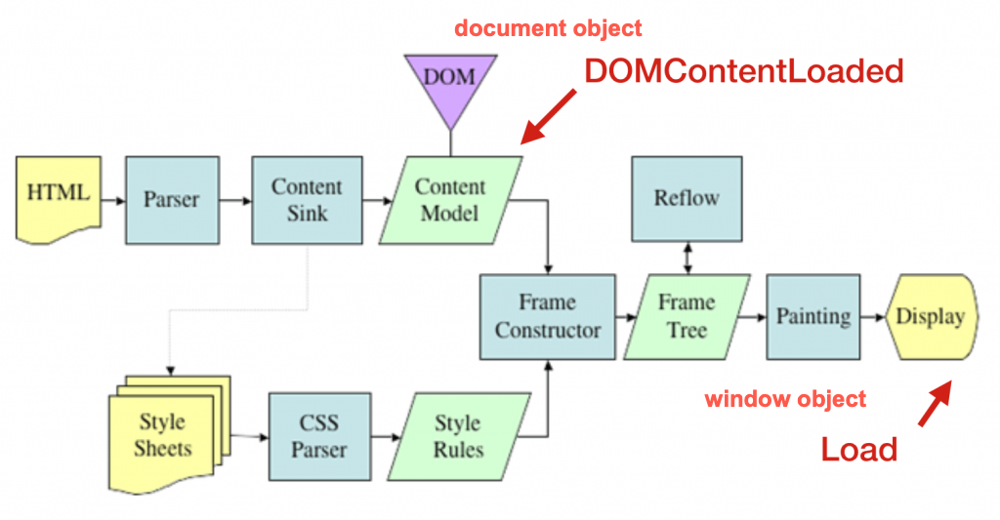
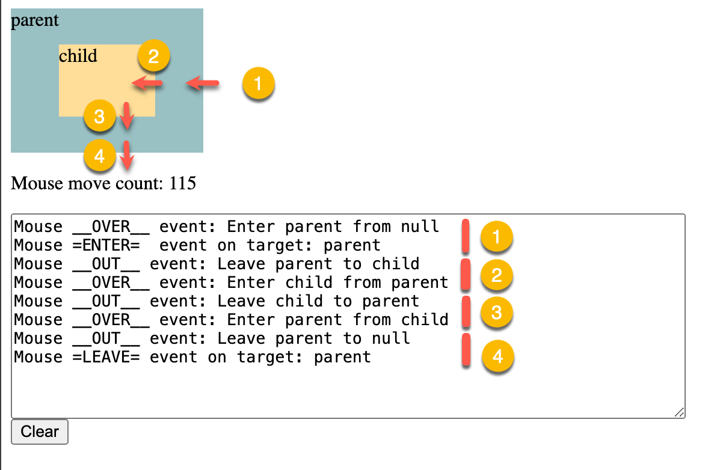
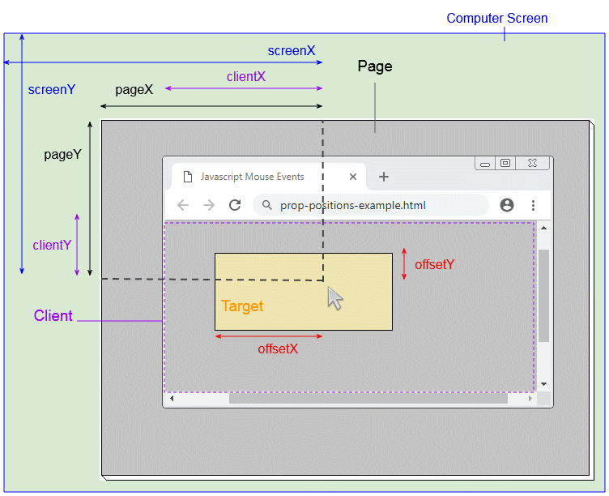

# Chapter 11 Interactive Content and Event Listeners

Topics:

- window events
- mouse events 
- DOM event flow 
- onchange and onblur events
- Key events 
- Drag and drop events
- Form submission 

## Introduction

This chapter will explore various browser events that can be used to create interactive web pages.

Recall that an event is a signal that something has happened in the browser.

Majorly, there are two types of events:
- window and documents events: happens when users interact with the browser window or document
- API events: happens when developers interact with the browser API and the asynchronous operations are completed.

Also recall the ways to register event listeners:
- inline event handlers
- Setting the `on` property of an element
- call element's `addEventListener()` method

## Window Events

Window object generates lots types of events to notify the developer about state changes, such as 
- when browser loads a page or when a user is going to close or leave the current page (window load and beforeunload events) 
- when users initiate copy, cut, and paste actions (clipboard events)
- when the browser is offline or online (network events)
- when an element get focus or lose focus (focus events)
- and many more, see [Window - Web APIs | MDN](https://developer.mozilla.org/en-US/docs/Web/API/Window#events)

### The `load` event

One of the common used events is the `load` event of the window object. 

The window fires the `load` event when the browser finishes loading the entire page, including all images, scripts, and other resources.

After the `load` event is fired, the browser guarantee that all the elements in the page are loaded and ready to be manipulated.

Otherwise, if you try to manipulate the elements before the `load` event is fired, you may get unexpected results, such as `null` or `undefined` values because the DOM is not fully loaded.

<figure>


<figcaption> The `load` event is fired when the browser finishes loading the entire page. 

Source: [Understanding Page Load Time](https://medium.com/@webjojo/understanding-page-load-time-86c1978e7b5)

</figcaption>

</figure>

Since no HTML tag for the `window` object, you can only register the listener function by 
- setting the `onload` property of the `window` object or 
- call the `addEventListener()` method of the `window` object.

```javascript
addEventListener("load", (event) => {});

onload = (event) => {};
```

### Example 10-1: Register a listener function to window's `load` event

```html
<body>
    <p id="display"></p>
    
    <script>
        function initPage(event){
            let message = `Event type: ${event.type} 
                <br/> target: ${event.target}, 
                <br/> Time to trigger the event since loading the page: ${event.timeStamp}`;
                
            document.getElementById("display").innerHTML = message;
            console.log(event);
        }
        window.onload = initPage;
    </script>
</body>
```

See the complete example in [ex_11_1.html](ex_11_1.html)

### The `DOMContentLoaded` event

THe `DOMContentLoaded` event is fired before the `load` event.

When you don't wait for the stylesheets, images, and subframes to finish loading, listen to the `DOMContentLoaded` event to manipulate the DOM.


<figure>



<figcaption> The `DOMContentLoaded` event is fired when the initial HTML document has been completely loaded and parsed, without waiting for stylesheets, images, and subframes to finish loading. <br /> 

Src: [重新認識 JavaScript 番外篇 (6) - 網頁的生命週期 - iT 邦幫忙::一起幫忙解決難題，拯救 IT 人的一天](https://ithelp.ithome.com.tw/articles/10197335)

</figcaption>

</figure>

The way to register the listener function to the `DOMContentLoaded` event:

```
document.addEventListener("DOMContentLoaded", callbackFunction);
```

### Example 10-2: Register a listener function to the `DOMContentLoaded` event

```html
<body>
    <div class="event-log">
        <label for="eventLog">Event log:</label>
        <textarea
          readonly
          class="event-log-contents"
          rows="8"
          cols="30"
          id="eventLog"></textarea>
      </div>
      <script>
        const eventLog = document.getElementById('eventLog');

        // Monitor the document's state
        document.addEventListener('readystatechange', (e) => {
            eventLog.value += `>> document' state: ${document.readyState} \n`
        })


        // monitor the window's load event 
        window.addEventListener('load', (e) => {
            eventLog.value += " window.onload \n";
            console.log(e);
        });

        // Monitor the document's body onload property
        // The event is triggered when the document's body is loaded
        document.body.onload = (e) => {
            eventLog.value += " body onload property \n";
        }

        // Monitor the DOM content state of the document
        document.addEventListener('DOMContentLoaded', (e) => {
            eventLog.value += " DOM Content Loaded \n";
        })

      </script>
</body>
```

Result:


Notes:
1. The `DOMContentLoaded` event is fired in the `interactive` state of the document.
2. The `load` event is fired in the `complete` state of the document.
3. The `DOMContentLoaded` event is fired before the `load` event.

See the complete example in [ex_11_2.html](ex_11_2.html)


## Mouse Events

### Mouse click events

Events in order when clicking a mouse button:
1. mousedown: click on top of an element without releasing the mouse button
2. mouseup: release the mouse button
3. click: user clicks on an element

For the `dblclick` event, the browser needs two cycles of the mousedown, mouseup, and click events to trigger the `dblclick` event.


Source: [Javascript MouseEvent Tutorial with Examples | o7planning.org](https://o7planning.org/12293/javascript-mouseevent)

### Mouse movement events

- Moving mouse over the target element and its children: `mouseover` event
- Enter and leave the target element: `mouseenter` and `mouseleave` events
- Enter and leave the target element and its children: `mouseover` and `mouseout` events





### Example 10-3: Register a listener function to the mousemove event

```javascript
parent.onmousemove = function(event){
    console.log("Mouse move event");
    moveCount++;
    moveCountDisplay.innerHTML = moveCount;
}
```

See the complete example in [ex_11_3.html](ex_11_3.html)

### Mouse Position

The mouse event provides four type coordinates to indicate the mouse position:
- offsetX and offsetY: the mouse position relative to the top-left corner of the target element
- pageX and pageY: the mouse position relative to the top-left corner of the entire page that is scrollable  
- clientX and clientY: the mouse position relative to the top-left corner of the viewport of the window
- screenX and screenY: the mouse position relative to the top-left corner of the screen

<figure>


<figcaption>  Page, client, and screen coordinates for mouse position. <br/>

source: https://o7planning.org/12293/javascript-mouseevent 

</figcaption>
</figure>

## DOM Event Flow

This section will cover the important concept of the DOM event flow: event propagation, event bubbling, event capturing, and event delegation.

### Event Propagation

For the window object or other API objects, the browser responds to the triggered event simply by invoking corresponding handlers.
No event propagation is involved for them. 

However, for the document object, the situation becomes more complicated because the document object is a tree structure.

The event propagates for the target element to other elements. 

The DOM event propagation comprises three phases in sequence: capturing, target, and bubbling.

Phase 1: Capturing
- The browser propagates the event from the root element to the target element.
- Along the path, the browser invokes the event handlers of the ancestors of the target element.

Phase 2: Target
- The second phase is that the browser invokes the event handler of the target element.

Phase 3: Bubbling
- The browser propagates the event from the target element to the root element.

<figure>


<figcaption> The DOM event flow. <br/>

source: [Bubbling and capturing](https://javascript.info/bubbling-and-capturing)
</figcaption>

</figure>

### Example 10-4: Demonstrate the event propagation: Capturing, Target, and Bubbling

Given the following HTML structure:

```html
<body>
<div id="eventPropagate">
    <form>FORM
        <div>DIV
            <p>P</p>
        </div>
    </form>
</div>
<p class="noListener">
    <textarea id="display" class="noListener" cols="50" rows="10"></textarea> <br/>
    <button class="noListener" onclick="document.getElementById('display').value = ''">Clear</button>
</p>
<script>...</script>
</body>
```

When you click the `<p>` element within the form, the browser will propagate the event in the following order:

1. Capturing Phase: HTML > BODY > DIV > FORM > DIV > P 
2. Target Phase: P
3. Bubbling Phase: P > DIV > FORM > DIV > BODY > HTML


In this example, the elements with the class `noListener` does not register event listener.

Part of the JavaScript code to register the listener functions:

```javascript
 for (let elem of elementsWithListeners) {
        elem.addEventListener("click",
            (e) => {
                const msg = `V_Capturing: Target: ${e.target.tagName}, currentTarget: ${e.currentTarget.tagName}`;
                display.value += msg + "\n";
                // console.log(`Capturing: ${elem.tagName}, event phase ${e.eventPhase}`), true)
            }, true);
        elem.addEventListener("click", (e) => {
            const msg = `^Bubbling: Target: ${e.target.tagName}, currentTarget: ${e.currentTarget.tagName}`;
            // console.log(`Bubbling: ${elem.tagName}`)
            display.value += msg + "\n";
        });
    }
```

See the complete example in [ex_11_4.html](ex_11_4.html)

### The application of the event propagation: Event Delegation pattern 

The event propagation allow developers to implement the Event Delegation pattern.

Event delegation is a technique to register a single event listener to a parent element to handle events for all its children.

The idea is that when a lot of elements are handled in a similar way, we put a single handler on their common ancestor, instead of assigning a handler to each of them.

Consider the following example from [Event delegation, javascript.inf.](https://javascript.info/event-delegation):

```html
<div id="menu">
  <button data-action="save">Save</button>
  <button data-action="load">Load</button>
  <button data-action="search">Search</button>
</div>
```

We can register a single event listener to the parent element `menu` to handle the click event for its three children, not the three event listeners for the child buttons.

If you are interested in the event delegation pattern, see the complete example in [ex_11_5.html](ex_11_5.html).
Additionally, you can read the article [Event delegation, javascript.inf.](https://javascript.info/event-delegation) for more details. 


## onblur/onfocus and onchange events for the `input` element

### The `onblur` and `onfocus` events

The `onblur` event is fired when the input element loses focus. 

In contrast, the `onfocus` event is fired when the input element gets focus.

### Example 10-6: Change the background color of the input element when it gets focus or loses focus


When user clicks the email field, the field's background color changes to yellow.

When user leave the email to the Phone field, the email field's background color changes to white and the Phone field's background color changes to yellow.

We use the Event Delegation pattern where a single event listener is registered to the parent element `form`.

Both the `focus` and `blur` events invoke the handler function in the capturing phase so that 
the field's background color changes before the cursor moves to the next field.

```javascript
const form = document.getElementById('myForm');
    form.addEventListener('focus', function(event) {
        event.target.style.backgroundColor = 'yellow';
    }, true);
    form.addEventListener('blur', function(event) {
        event.target.style.backgroundColor = '';
    }, true);
```

See full example in [ex_11_6.html](ex_11_6.html)

### The `onchange` event

The `onchange` event is fired when the value of an input element changes and the element loses focus.

### Example 10-7: Generate the full name when the first name and last name fields change

User enters the first name and last name in the input fields. 

When the user leaves the either field, the full name is generated and displayed.


The JavaScript code for this example:

```javascript
   const form = document.getElementById('myForm');
    form.onchange = function (event) {
        const output = document.getElementById('output');
        const firstName = document.getElementById('firstName').value;
        const lastName = document.getElementById('lastName').value;
        output.innerHTML = `${firstName} ${lastName}`;
    };
```

See full example in [ex_11_7.html](ex_11_7.html)


## Key Events

### The `keydown`, `keyup`, and `keypress` events

The `keydown` event is fired when a key is pressed down.

The `keyup` event is fired when a key is released.

Both of the two events emit the `KeyboardEvent` object.

The `keypress` event is fired when a key is pressed down and released. 
- Warning: The [`keypress` event](https://developer.mozilla.org/en-US/docs/Web/API/Element/keypress_event) has been deprecated in the latest version of the JavaScript.


https://o7planning.org/12319/javascript-keyboardevent

### keyboardEvent.key

When user presses a key, the browser generates a `KeyboardEvent` object.

The `key` property of the `KeyboardEvent` object returns the character value of the key pressed.

If the pressed key has a printed representation, the returned value is a non-empty Unicode character string containing the printable representation of the key.
- Press b key, returns "b"
- Press shift+b key, returns "B"

If the pressed key is a control or special character, the returned value is one of the pre-defined key values.
- Press Enter key, returns "Enter"
- Press Backspace key, returns "Backspace"
- See the complete list of pre-defined key values in [Key values for keyboard events - Web APIs | MDN](https://developer.mozilla.org/en-US/docs/Web/API/UI_Events/Keyboard_event_key_values#editing_keys)

If the key cannot be identified, the returned value is Unidentified.

### keyboardEvent.code

The `code` property of the `KeyboardEvent` object returns the pressed physical key. 
It is not affected by the keyboard layout or the state of the modifier keys.

For example:
- Press b key, returns "KeyB"
- Press shift+b key, returns "KeyB"

### Example 10-8: Display the key and code values when a key is pressed

Enter any keys in the input field, the key and code values of the pressed key are displayed on the page.


The JavaScript code for this example:

```javascript
const input = document.querySelector("input");
    const keyLog = document.getElementById("keyCodeLog");
    const charLog = document.getElementById("charCodeLog");

    input.addEventListener("keydown", logKey);

    function logKey(e) {
        keyLog.textContent += ` ${e.code}`;
        charLog.textContent += ` ${e.key}`;
    }
    function clearLogs() {
        keyLog.textContent = "";
        charLog.textContent = "";
    }
```

See the complete example in [ex_11_8.html](ex_11_8.html)

### Example 10-9: Allow only numbers to be entered in the input field, no spaces, alphabets, or special characters


The JavaScript code to validate the input field:

```javascript
input.addEventListener("keydown", isNumberKey);
 // check if the key pressed is a number
function isNumberKey(event) {
    const value = event.key;
    console.log(value === ' ');
    const exceptionKeys = ['Backspace', 'Delete', 'ArrowLeft', 'ArrowRight'];
    if (isNaN(event.key) && exceptionKeys.includes(event.code) === false || value === ' ') {
        // prevent the default behavior of the keydown event, but not stop the event propagation
        event.preventDefault();
        // stop the event propagation
        event.stopPropagation();
    }
}
```

First, the `keydown` event is registered to the input field. When a key is pressed, the `isNumberKey` function is invoked.

The `isNumberKey` function checks if the pressed key is a number. If the key is not a number, the `preventDefault()` method is called to prevent the default action of the key.
That is, the key is not entered in the input field.

See the complete example in [ex_11_9.html](ex_11_9.html)

### Note to the `keycode` and `charcode` properties

The `keycode` and `charcode` properties have been deprecated in the latest version of the JavaScript.
- Do not use them.
- Use the `key` property instead.

`keycode` represents a system and implementation dependent numerical code, such as ASCII code.
- All keys have `keycode` values, including the function keys, arrow keys, and control keys that do not generate character values.

`charcode` is the returned the Unicode value of a character key when the key is pressed. 
- These keys are the alphabetical, numerical, and punctuation keys.


## Drag and Drop Events

### The Drag and Drop API

To perform drag and drop operations, you must perform the three steps:
1. Set the draggable element as draggable by setting the `draggable` attribute to `true`.
2. When dragging starts and ends, the browser fires the `dragstart` and `dragend` events on the dragged element. 
   - The data to be trasferred is set in the `dataTransfer` object of the `dragstart` event.
   - Use `dataTransfer.setData()` to set the data.
3. When the dragged element is dragged over an valid droppable element, the browser fires `dragenter`, `dragover`, and `dragleave` events on the element.
4. When the dragged element is dropped on the droppable element, the browser fires the `drop` event on the element.
   - Retrieve the data from the `dataTransfer` object of the `drop` event and perform the necessary operations.
   - Use `dataTransfer.getData()` to retrieve the data.

Note:
- An element must listen to the `dragover` and `drop` events to become a valid drop target.


Source: https://jenkov.com/tutorials/html5/drag-and-drop.html


### The `dataTransfer` object

The [DataTransfer object](https://developer.mozilla.org/en-US/docs/Web/API/DataTransfer) is used to hold any data transferred between contexts, such as a drag and drop operation, or clipboard read/write. 

It may hold one or more data items, each of one or more data types.

Use `setData()` method to set the data to be transferred. The syntax:

```javascript
dataTransfer.setData(format, data);
```
- format: a string representing the format of the data, such as "text/plain", "text/html", or "text/uri-list".
- data:  a string representing the data to be transferred.

Use `getData()` method to retrieve the data transferred. The syntax:

```javascript
dataTransfer.getData(format);
```
- format: a string representing the format of the data, such as "text/plain", "text/html" or "text/uri-list".

### Example 10-10: Drag and drop an image

User can drag the doggy image to the drop area in the upper part of the page.

When the image is dropped on the drop area, the image is displayed in the drop area.

Before dropping:


After dropping:


We have the following HTML structure:

```html
<body>
<div class="drop-zone" id="drop-zone">
    Drag and drop an image here
</div>
<button onclick="reset()">Reset</button>

<div id="sourceImg">
    
</div>
```
We have set the `draggable` attribute of the image element to `true` to make it draggable.

The steps to implement the drag and drop operation:
1. Register handler function to the `dragover` and `drop` events of the drop area `<div id="drop-zone">`.
   - In the handler function for the `drop` event, retrieve the id of the dragged image and append the image to the drop area.
   - In the handler function for the `dragover` event, prevent the default behavior of the event to allow the `drop` event to fire.
2. Register handler function to the `dragstart` event of the image element ``.
   - In the handler function for the `dragstart` event, set id of the dragged image to the `dataTransfer` object.


Step 1: Register the handler function to the `dragover` and `drop` events of the drop area:

```javascript
const dropZone = document.getElementById("drop-zone");
    dropZone.ondragover = function (event) {
        // Browser emits the dragover event every few hundred milliseconds
        // We prevent the default behavior of the dragover event to allow the drop event to fire
        console.log('dragover');
        event.preventDefault();
    };
    // Register the handler function to the drop event
    dropZone.ondrop = function (event) {
        console.log('drop');
        // get the data being dragged from the dataTransfer object
        const data = event.dataTransfer.getData("text/plain");
        // get the element being dragged
        const draggedElement = document.getElementById(data);
        // append the dragged element to the drop zone
        dropZone.appendChild(draggedElement);
    };
```

Step 2: Register the handler function to the `dragstart` event of the image element:

```javascript
// Register the handlers to dragstart event to prepare the data to transfer
    const dogImg = document.getElementById("dogImg");
    dogImg.ondragstart = function (event) {
        // set the data to transfer
        console.log('dragstart: ', event.target.id);
        event.dataTransfer.setData("text/plain", event.target.id);
    };
```

See the complete example in [ex_11_10.html](ex_11_10.html)

## Form Submission

Test any html form with the following link: https://formtester.goodbytes.be/