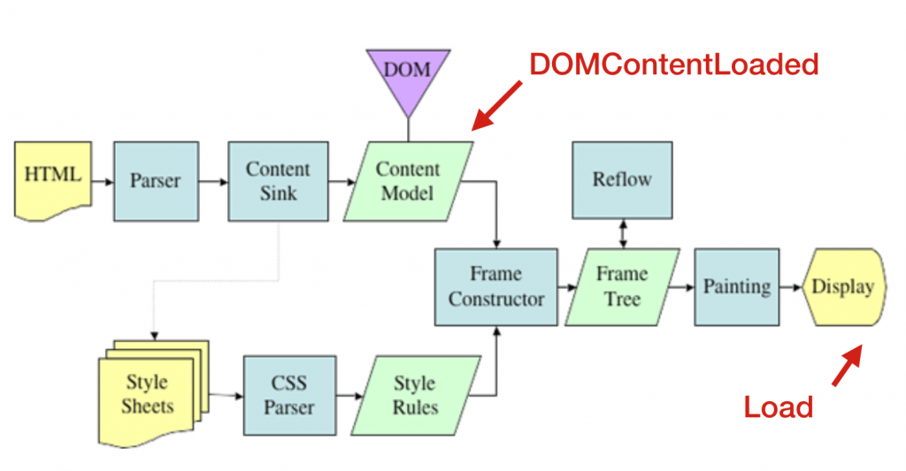
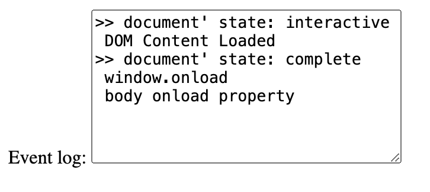
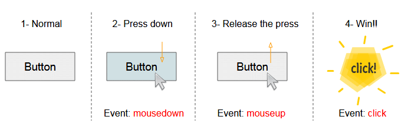
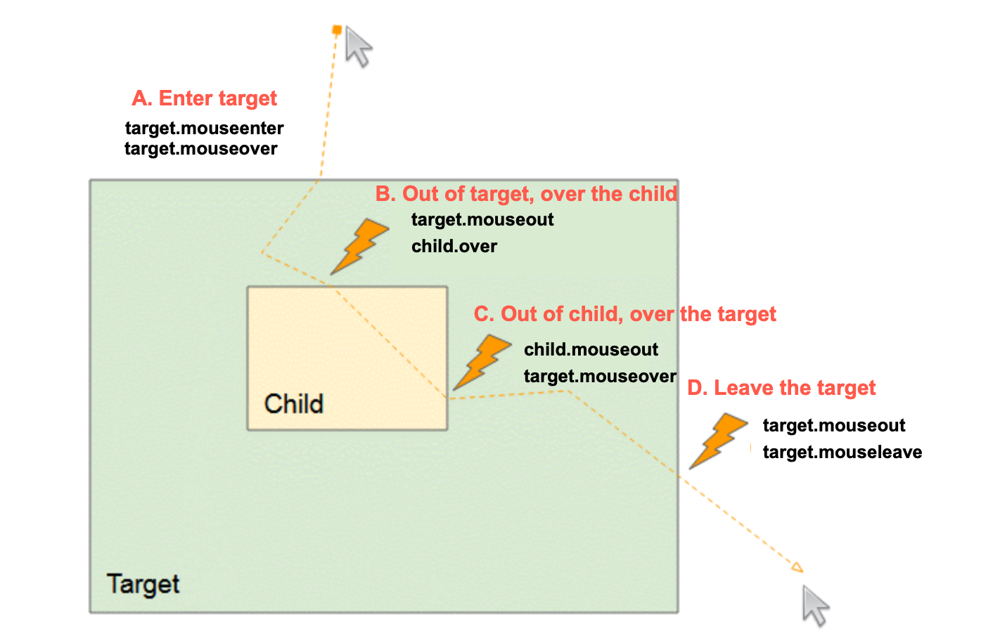
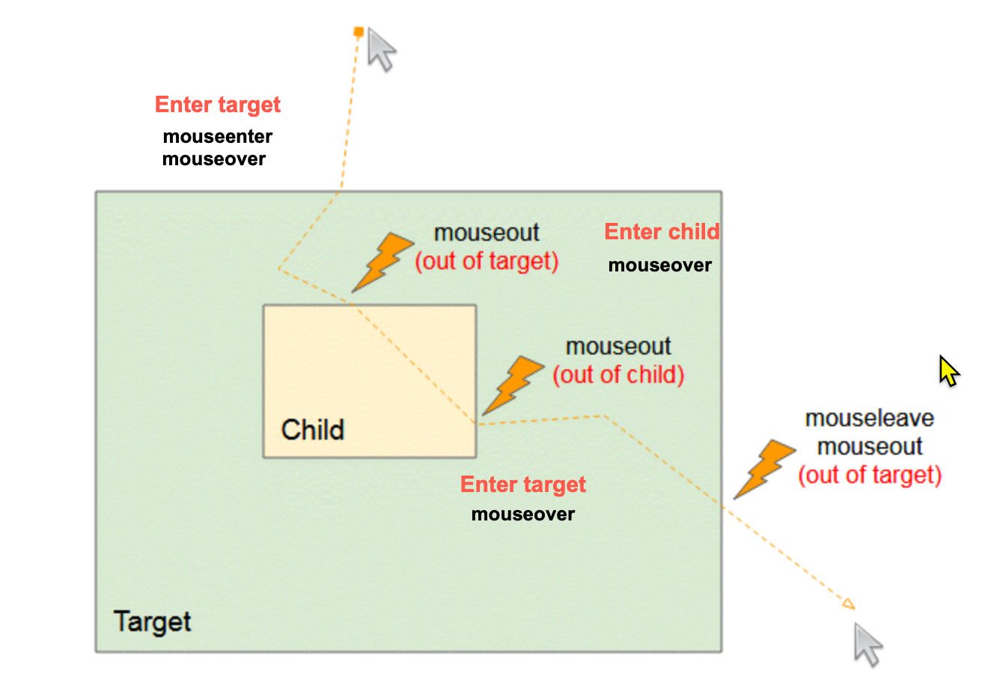
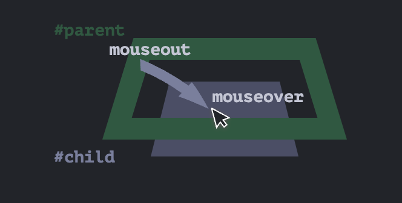
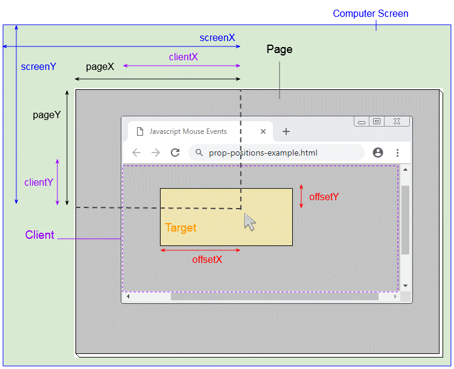

<style>
    .columns {
    display: flex;
  }
  .column {
    flex: 1;
    padding: 10px;
  }
  .column.large{
    flex: 2;
  }
  .small-font {
    font-size: 0.8em;
  }

  section > header,
section > footer {
  position: absolute;
  left: auto;
  right: 90px;
  height: 20px;
}

header {
  top: 30px;
}

footer {
  bottom: 30px;
}
</style>

# Chapter 11 Interactive Content and Event Listeners

## Topics

This chapter will explore various browser events that can be used to create interactive web pages, including:

- Part 1: Window and Document Events
 - window and  mouse events 
- Part 2: DOM Event Flow
  - DOM event flow 
- Part 3: Drag and Drop Events
  - Drag and drop events
- Part 4: Input Events and Form Submission
  - onchange and onblur events, Key events, Form submission

## Events and Event Listeners

### Events 

Recall that an event is a signal that something has happened in the browser.

Majorly, there are two types of events:
- **window and documents** events: happens when users interact with the browser window or document
- **API** events: happens when developers interact with the browser API and the asynchronous operations are completed.

### Event Listeners

Also recall the ways to register event listeners:
- inline event handlers
  - set the `onxxx` attribute of a tag. 
  - e.g. `<button onclick="...">`
- Setting the `onxx` property of an element. 
  - e.g. `element.onclick = function(){}`
- call element's `addEventListener()` method
  - e.g. `element.addEventListener("click", function(){})`

## Window Events

Window object generates lots types of events to notify the developer about state changes, 
- The purpose is to allow developers to interact with the browser window and document.

These event types are such as:
- window `load` and `beforeunload` events: when browser loads a page or when a user is going to close or leave the current page
- `clipboard` events: when users initiate copy, cut, and paste actions
- `network` events: when the browser is offline or online 
- `focus` events: when an element get focus or lose focus )
- and many more, see [Window - Web APIs | MDN](https://developer.mozilla.org/en-US/docs/Web/API/Window#events)

We will cover the `window.load` event and the `document.DOMContentLoaded` event in this section.

### The `load` event of the `window` object (`window.onload`)

The window fires the `load` event when the browser finishes loading the entire page, including all images, scripts, and other resources.
- guarantees that all the elements in the page are loaded and ready to be manipulated.


<!-- Source: [Understanding Page Load Time](https://docs.newrelic.com/docs/browser/new-relic-browser/page-load-timing-resources/page-load-timing-process/) -->

### What if you try to manipulate before the `load` event is fired?

If you try to manipulate the elements before the `load` event is fired, you may get unexpected results, 
- such as `null` or `undefined` values because the DOM is not fully loaded.


### Add a listener function to the `load` event of the `window` object

Since there is no HTML tag for the `window` object, you can only register the listener function by 
- setting the `onload` property of the `window` object or 
- call the `addEventListener()` method of the `window` object.

Code snippets to register the listener function to the `load` event of the `window` object:
```javascript
window.addEventListener("load", (event) => {});
// or
window.onload = (event) => {};
```

### Example 10-1: Initialize the page when the page is loaded

```html
<body>
    
    <script>
        function initPage(event){
            let message = `Event type: ${event.type} 
                <br/> target: ${event.target}, 
                <br/> Time to trigger the event 
                since loading the page: ${event.timeStamp} milliseconds`;
                
            document.getElementById("display").innerHTML = message;
            console.log(event);
        }

        window.onload = initPage;
    </script>

    <p id="display"></p>
</body>
```

---

Outputs:


Notes:
- `event.timeStamp`: return the number of milliseconds elapsed from the beginning of the time origin to the event being created. 
  - In the case of the `load` event, the time origin is the time when the browser starts to load the page.

See the complete example in [ex_11_1.html](ex_11_01.html)

You can try to run the `initPage()` function before the `<p>` element to see what happens.

### The `DOMContentLoaded` event of the `document` object

THe `DOMContentLoaded` event of the `document` object is fired before the `window.load` event 
- fired when the initial HTML document has been completely loaded and parsed, **without waiting for stylesheets, images, and subframes to finish loading**.

<!-- When you don't wait for the stylesheets, images, and subframes to finish loading, listen to the `DOMContentLoaded` event to manipulate the DOM. -->



<!-- ---

Event sequence in summary:
  - `document.DOMContentLoaded` > `window load event` (or its alias: `document.body load event`)
  - The document.body load event is an alias of the window load event.

ref: [HTMLElement: load event - Web APIs | MDN](https://developer.mozilla.org/en-US/docs/Web/API/HTMLElement/load_event)

Src: [重新認識 JavaScript 番外篇 (6) - 網頁的生命週期 - iT 邦幫忙::一起幫忙解決難題，拯救 IT 人的一天](https://ithelp.ithome.com.tw/articles/10197335) -->


### Add a listener function to the `DOMContentLoaded` event of the `document` object

Since the `document` object does not have the `DOMContentLoaded` property, you can only register the listener function by the `addEventListener()` method of the `document` object.

```js
document.addEventListener("DOMContentLoaded", yourCallbackFunction);
```

### Example 10-2: Register the listener functions to `widnow.load` and `document.DOMContentLoaded` events

```html
<script>
    const eventLog = document.getElementById('eventLog');
    // monitor the window's load event 
    window.addEventListener('load', (e) => {
        eventLog.value += " window.onload \n";
        console.log(e);
    });

    // Monitor the DOM content state of the document
    // Triggered before the window's load event
    document.addEventListener('DOMContentLoaded', (e) => {
        eventLog.value += " DOM Content Loaded \n";
    })
</script>
```
---

Result:



See the complete example in [ex_11_2.html](ex_11_2.html)

### Review Questions

When the DOM content is loaded without waiting for stylesheets, images, and sub-frames to finish loading, which event is fired? 
   A. `load` event of the `window` object
   B. `DOMContentLoaded` event of the `document` object
   C. `load` event of the `document.body` object

<details>
<summary>Answer</summary>

B. `document` 物件的 `DOMContentLoaded` 事件

</details>

## Mouse Events models

The mouse event models include:
- Mouse click events
- Mouse movement events
- Mouse coordinates

### Mouse Single click events
Triggered events in order when clicking a mouse button:
1. `mousedown`: click on top of an element without releasing the mouse button
2. `mouseup`: release the mouse button
3. `click`: user clicks on an element



Fig source: [Javascript MouseEvent Tutorial with Examples | o7planning.org](https://o7planning.org/12293/javascript-mouseevent)

### Mouse Double click events

For the `dblclick` event, the browser needs two cycles of the single click events to trigger the `dblclick` event.


### Code snippets to listen to the single and double click events

To listen to the single and double click events on an element, you can use 
- the `onclick` and `ondblclick` properties of the element, or
- the `addEventListener()` method of the element.


```javascript
// register the listener function to the click event
element.onclick = function(event){
    ...}
element.addEventListener("click", function(event){
    ...});
// register the listener function to the double click event
element.ondblclick = function(event){
   ...}
element.addEventListener("dblclick", function(event){
    ...});
```

### Mouse movement events 

Mouse movement events are triggered when the mouse enter, leave, or move over an element.

Assume that
- the Target Element (target) is the element that is registered with the event listener function.
- the Child Element (child) is a child element of the target element.

The mouse events are triggered in different cases:

Case A: the mouse enters the target element, triggering:
- `target.mouseenter` event: the mouse enters the target element
- `target.mouseover` event: the mouse enters the visible area of the target element.

---

Case B: the mouse enters the child element, triggering:
- `target.mouseout` event: the mouse not in the visible area of the target element
- `child.mouseover` event: the mouse is in the visible area of the child element.
  - `child.mouseenter` event will not be triggered because the child element is not registered with the event listener function.

Case C: the mouse leaves the child element and enters the target element again, triggering:
- `child.mouseout` event: the mouse is not in the visible area of the child element
  - `child.mouseleave` event will not be triggered because the child element is not registered with the event listener function.
- `target.mouseover` event: the mouse is in the visible area of the target element. 

---

Case D: the mouse leaves the target element entirely, triggering:
- `target.mouseout` event: the mouse is not in the visible area of the target element
- `target.mouseleave` event: the mouse leaves the target element.

--- 



<!-- - `mouseenter`: Enter the target element (not considering its children)
- `mouseleave`: Leave the target element (not considering its children)
- `mouseover` event: Moving mouse over the **target** element or its **children**
  - tell you that you have moved over the current element (a new element is entered).

 -->

<!-- ---

- `mouseout` events: Moving mouse out of the **target** element or its **children**
  -  Tell you that you have move out the current element.

 -->


### Mouse Event summary

- `mouseenter`: Enter the target element (not considering its children)
- `mouseleave`: Leave the target element (not considering its children)
- `mouseover`: Mouse is over the visible area of the target element or its children
  - the event in the child node bobbles up to the target element
- `mouseout`: Mouse is out of the visible area of the target element or its children
  - the event in the child node bobbles up to the target element

<!-- --- 

The sequence of the mouse events when the mouse moves over the target and its child elements:


See the demo in [Moving the mouse: mouseover/out, mouseenter/leave](https://javascript.info/mousemove-mouseover-mouseout-mouseenter-mouseleave#mouseout-when-leaving-for-a-child) -->

### Demo: the difference in the mouse events

- `mouseover` vs. `mouseenter`
  - See [Mouseout when leaving for a child](https://javascript.info/mousemove-mouseover-mouseout-mouseenter-mouseleave#mouseout-when-leaving-for-a-child)
- `mouseout` vs. `mouseleave`
  - [mouseenter and mouseleave](https://javascript.info/mousemove-mouseover-mouseout-mouseenter-mouseleave#events-mouseenter-and-mouseleave)
  
- Can also see the demo in [ex_11_3.html](ex_11_03.html)


### Mouse Position: various coordinates

Four types of coordinates are used to indicate the mouse position:
- element, client(viewport), page, and screen coordinates



---

The mouse event provides four type coordinates to indicate the mouse position:
- Element coordinates: offsetX and offsetY: the mouse position relative to the top-left corner of the **target element**
- Client (viewport) coordinates: clientX and clientY: the mouse position relative to the top-left corner of the **viewport of the window**
- Page coordinates: pageX and pageY: the mouse position relative to the top-left corner of the entire **page** that is scrollable  
- Screen coordinate: screenX and screenY: the mouse position relative to the top-left corner of the **screen**


<!-- <figcaption>  Page, client, and screen coordinates for mouse position. <br/> -->

<!-- source: https://o7planning.org/12293/javascript-mouseevent  -->

### Lab 01

See [Lab 11-1](lab_11_01.md) for a step-by-step guide to complete the lab.


## Summary

This chapter has covered the following topics:
- window events
- mouse events


<script src="../h2_numbering.js"></script>