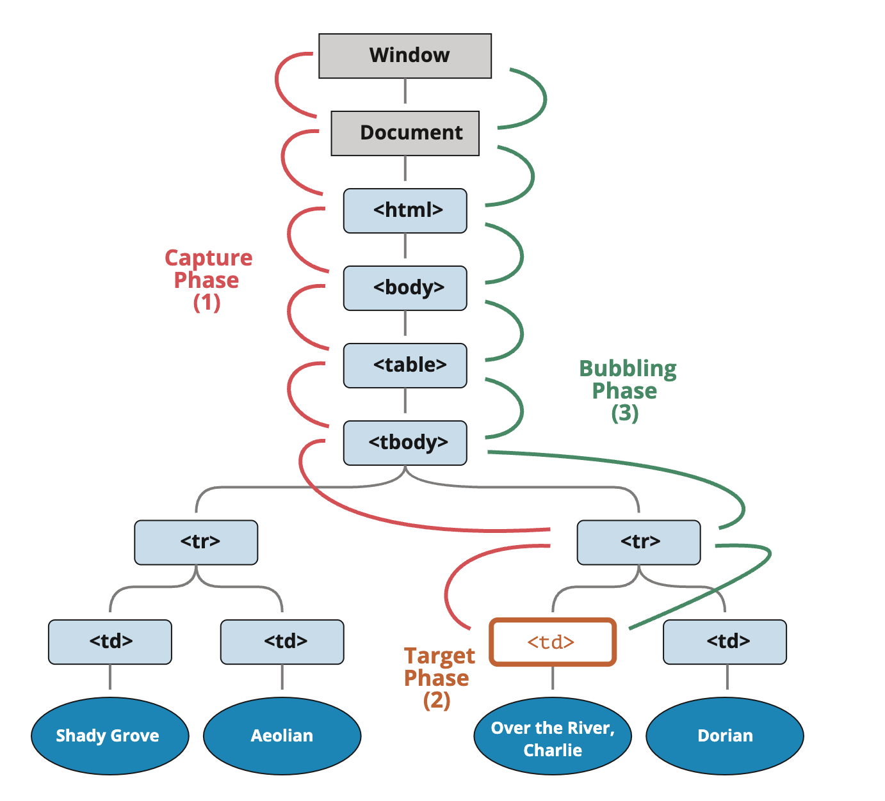

<style>
    .columns {
    display: flex;
  }
  .column {
    flex: 1;
    padding: 10px;
  }
  .column.large{
    flex: 2;
  }
  .small-font {
    font-size: 0.8em;
  }

  section > header,
section > footer {
  position: absolute;
  left: auto;
  right: 90px;
  height: 20px;
}

header {
  top: 30px;
}

footer {
  bottom: 30px;
}
</style>

# Chapter 11 Interactive Content and Event Listeners: Part 2

## DOM Event Flow

This section will cover the important concept of the DOM event flow:
- event propagation, 
- event bubbling, 
- event capturing, and 
- event delegation.

### Why these concepts are important?

- help you understand how the browser handles the event when it is triggered
- help you decide **where to register** the event listener to handle the event
  - the target element, its ancestors, or its descendants
- Allow you to handle the event before it reaches the target element or after it leaves the target element
  - e.g. to prevent the default behavior of the event (the link is not followed when clicked) or 
  - to stop the target element to execute its listeners.
  
## Event Propagation in the DOM

The event propagates from top (the `window` object) to bottom (the target element) and then bubbles up from the bottom to the top.
- Since the DOM is a tree structure, 

The event propagation includes three phases:
- Capturing
- Target
- Bubbling


### Event capturing, target, and bubbling phases

The DOM event propagation comprises three phases in sequence: capturing, target, and bubbling.




---

Phase 1: Capturing
- The browser propagates the event from the  window object (root element) to the target element.
- Along the path, the browser invokes the event handlers of the ancestors of the target element.

Phase 2: Target
- The second phase is that the browser invokes the event handler of the target element.

Phase 3: Bubbling
- The browser propagates the event from the target element to the window object (root element).
  - the event handlers of the ancestors of the target element are invoked in reverse order.

<!-- source: [Bubbling and capturing](https://javascript.info/bubbling-and-capturing) -->

### Example 10-4: Demonstrate the event propagation: Capturing, Target, and Bubbling

We have the following HTML structure:

```html
<div id="eventPropagate">
    <form class="listener">FORM
        <div >DIV
            <p>P</p>
        </div>
    </form>
</div>
```
---

When you click the `<p>` element within the form, the event propagates as follows:

1. Capturing Phase: HTML > BODY > DIV > FORM > DIV > P (Top to Targe)
2. Target Phase: P (Target)
3. Bubbling Phase: P > DIV > FORM > DIV > BODY > HTML (Target to Top)

See the complete example in [ex_11_4.html](ex_11_04.html)


## Event Delegation pattern: application of the event propagation

- Event Delegation pattern: 
  - Register a single event listener to the parent element to handle the events for all its children

- Benefit
  - Save the lines of code and improve the performance of the web page.
    - put a single handler on their common ancestor, instead of assigning a handler to each of them.


### The scenario of using the Event Delegation pattern

Consider the following example from [Event delegation, javascript.inf.](https://javascript.info/event-delegation):

- Assume you have a menu with three buttons: Save, Load, and Search.
- How many event listeners do you need to handle the click event for the three buttons?

```html
<div id="menu">
  <button data-action="save">Save</button>
  <button data-action="load">Load</button>
  <button data-action="search">Search</button>
</div>
```
[ex_11_5.html](ex_11_05.html)

---

- Use the Event Delegation pattern: Just one event listener
- Register a single event listener to the parent element `menu` to handle the click event for its three children.


- see the complete example in [ex_11_5.html](ex_11_05.html).
- Additionally, you can read the article [Event delegation, javascript.inf.](https://javascript.info/event-delegation) for more details. 


## Lab 02

Intercept and prevent the execution of the element's listener

See [Lab 11-2_2](lab_11_02_2.md) for a step-by-step guide to complete the lab.

<!-- See [Lab 11-2: Prevent the default behavior.](lab_11_02.md) for a step-by-step guide to complete the lab. -->


<script>
    // add the following script at the end of your marp slide file.
    const h2s = document.querySelectorAll('h2');
    h2s.forEach(function(h2, idx){
        h2.innerHTML = `<span class="small-font">${idx + 1}</span> ${h2.innerHTML}`
    })
</script>