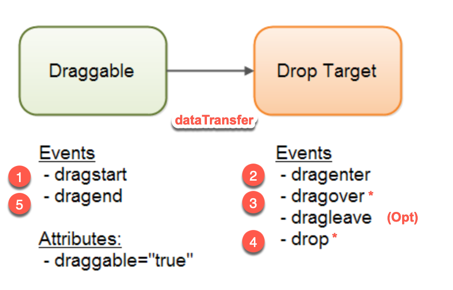
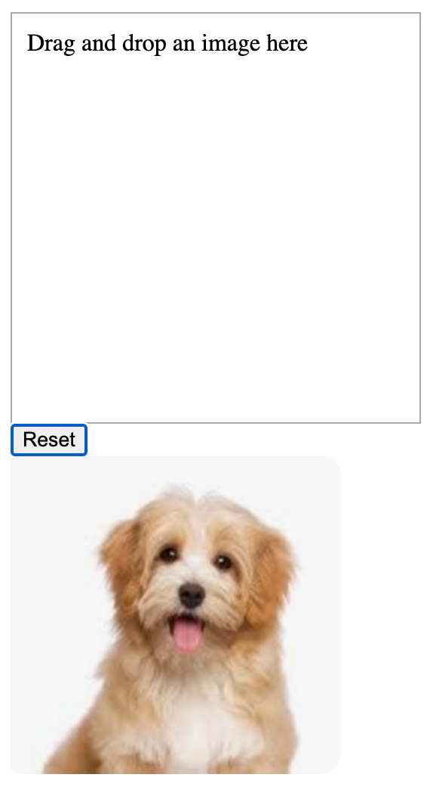

<style>
    .columns {
    display: flex;
  }
  .column {
    flex: 1;
    padding: 10px;
  }
  .column.large{
    flex: 2;
  }
  .small-font {
    font-size: 0.8em;
  }

  section > header,
section > footer {
  position: absolute;
  left: auto;
  right: 90px;
  height: 20px;
}

header {
  top: 30px;
}

footer {
  bottom: 30px;
}

table {
  font-size: 20px;
}
</style>

# Chapter 11 Interactive Content and Event Listeners: Part 3

## Drag and Drop Events (Drag and Drop API)

Use the Drag and Drop API to implement drag and drop operations in web applications.

### The sequence of the drag and drop events

Assume the `source` element is a draggable element and the `target` element is a droppable element.

When the `source` element is dragged over the `target` element, the browser fires the following events in order:

--- 


<!-- Source: https://jenkov.com/tutorials/html5/drag-and-drop.html -->

---


| Source Element | Target Element | Description |
| --- | --- | --- |
| dragstart | - | Fired when the source element starts being dragged. |
| drag | - | Fired while the source element is being dragged. |
| - | dragenter | Fired when the source enters the boundary of the target element. |
| - | dragover | Fired when the source is over the visible area of the target element. |
| - | dragleave | Fired when the source leaves the boundary of the target element. |
| - | drop | Fired when the source is dropped on the target element. |
| dragend | - | Fired when the drag operation ends (mouse button released or ESC key pressed). |


## Passing the data between the source and target elements

In drag and drop events, data is placed into the [DataTransfer object](https://developer.mozilla.org/en-US/docs/Web/API/DataTransfer) to pass information to the target element.

The `dataTransfer` object provides the following methods:
- `setData(format, data)`: Sets the data to be transferred.
  - format: The format of the data, such as `text/plain`, `text/html`, or `text/uri-list`.
- `getData(format)`: Retrieves the transferred data.
- `clearData(format)`: Clears the transferred data.

### When to use these methods

- Typically, use `setData()` in the `source.dragstart` event to set the data to be transferred.
- Use `getData()` in the `target.drop` event to retrieve the transferred data.

## Steps to perform drag and drop operations

1.Set the source element as draggable
  - Set the HTML element's `draggable` attribute to `true`.

2.Listen to `dragstart` and `dragend` events on the source element
- When dragging starts, the browser fires the `dragstart` event on the dragged element.
  - In the `dragstart` event, prepare the data to be transferred using the `dataTransfer` object.
  - Use `dataTransfer.setData()` to set the data.
- When dragging ends, the browser fires the `dragend` event on the dragged element.
  - If needed, modify the dragged element after the drag operation ends.

---

3.Listen to drag events: `dragenter`, `dragover`, `dragleave` and `drop` on the target element
  - When the dragged element enters a droppable element, the browser fires the `dragenter`, `dragover`, and `dragleave` events in order on that element.

3.1 In the `dragover` handler:
- Use `event.preventDefault()` to ensure the `drop` event can be triggered.
  - The default behavior is to disallow dropping.
  - When the dragged element is dropped, the `drop` event is fired on the target element.

---

3.2 In the `drop` handler:
- Use `event.preventDefault()` to prevent the browser's default behavior.
  - The default behavior is to disallow dropping.
- Use `dataTransfer.getData()` to retrieve the data and perform the corresponding operation.

4.Conditions for becoming a drop target
  - An element must listen to both the `dragover` and `drop` events to become a valid drop target.


### Demo: The series of drag and drop events


see [demo_drag_and_drop.html](demo_drag_drop_events.html)


## Example 11-10: Drag and drop an image

User can drag the doggy image to the drop area in the upper part of the page.

When the image is dropped on the drop area, the image is displayed in the drop area.

<div class="columns">
<div class="column">
Before dropping:



</div>

<div class="column">
After dropping:


</div>
</div>


### HTML structure

We have the following HTML structure:

```html
<body>
<div class="drop-zone" id="drop-zone">
    Drag and drop an image here
</div>
<button onclick="reset()">Reset</button>

<div id="sourceImg">
    
</div>
```

- We have set the `draggable` attribute of the image element to `true` to make it draggable.

### Steps overview

The steps to implement the drag and drop operation:

S1. Make the image draggable by setting the `draggable` attribute to `true`.

S2. Make the drop area `<div id="drop-zone">` be a valid drop target by listening to the `dragover` and `drop` events.
   - When `dragover` event occurs, prevent the default behavior of the event to allow the `drop` event to fire.
     - The default behavior of the dragover event is to disallow dropping. 
   - When the `drop` event occurs, retrieve the id of the dragged image and append the image to the drop area as a child element.

---

S3. Set the tag id of the dragged image `` to the `dataTransfer` object in the `dragstart` event.
   - In the handler function for the `dragstart` event, set id of the dragged image to the `dataTransfer` object.

### Step 1: Make the image draggable

Set the `draggable` attribute of the image element to `true` to make it draggable:

```html
<div id="sourceImg">
    
</div>
```


### Step 2: Make the drop area `<div id="drop-zone">` be a valid drop target

Step 2: Register the handler functions to the `dragover` and `drop` events of the target element respectively:

```javascript
const dropZone = document.getElementById("drop-zone");

dropZone.ondragover = function (event) {
    // Browser emits the dragover event every few hundred milliseconds
    // We prevent the default behavior 
    // of the dragover event to allow the drop event to fire
    console.log('dragover');
    event.preventDefault();
};
```

---

```javascript

// Register the handler function to the drop event
dropZone.ondrop = function (event) {
    event.preventDefault();
    console.log('drop');
    // get the data being dragged from the dataTransfer object
    const data = event.dataTransfer.getData("text/plain");
    // get the element being dragged
    const draggedElement = document.getElementById(data);
    // append the dragged element as a child to the drop zone
    dropZone.appendChild(draggedElement);
};
```

### Step 3: Set the tag id of the dragged image to the `dataTransfer` object

Register the handler function to the `dragstart` event of the image element:

```javascript
// Register the handlers to dragstart event to prepare the data to transfer
    const dogImg = document.getElementById("dogImg");
    dogImg.ondragstart = function (event) {
        // set the data to transfer
        console.log('dragstart: ', event.target.id);
        event.dataTransfer.setData("text/plain", event.target.id);
    };
```

See the complete example in [ex_11_10.html](ex_11_10.html)


## Summary

- The Drag and Drop API enables interactive drag-and-drop operations in web applications.
- The drag-and-drop process involves a sequence of events: `dragstart`, `drag`, `dragenter`, `dragover`, `dragleave`, `drop`, and `dragend`.
- The `dataTransfer` object is used to pass data from the source to the target during drag-and-drop.
  - Use `setData()` in the `dragstart` event to store data, and `getData()` in the `drop` event to retrieve it.
- To make an element a valid drop target, handle both `dragover` (with `event.preventDefault()`) and `drop` events.

<script src="../h2_numbering.js"></script>
