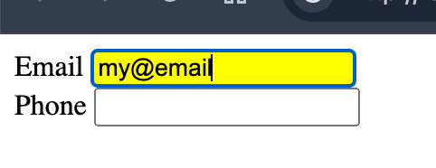

<style>
    .columns {
    display: flex;
  }
  .column {
    flex: 1;
    padding: 10px;
  }
  .column.large{
    flex: 2;
  }
  .small-font {
    font-size: 0.8em;
  }

  section > header,
section > footer {
  position: absolute;
  left: auto;
  right: 90px;
  height: 20px;
}

header {
  top: 30px;
}

footer {
  bottom: 30px;
}
</style>

# Chapter 11 Interactive Content and Event Listeners: Part 4

## onblur/onfocus and onchange events for the `input` element

### The `onblur` and `onfocus` events

The `onblur` event is fired when the input element loses focus. 

In contrast, the `onfocus` event is fired when the input element gets focus.

### Example 10-6: Change the background color of the input element when it gets focus or loses focus


For any input elements inside the form:
- When the input element gets focus, the background color changes to yellow.
- When the input element loses focus, the background color changes to white.

Register the `focus` and `blur` events to the form element to handle the events for all its children.
- invoke the handler function in the **capturing phase**.

--- 

The JavaScript code for this example:
```javascript
const form = document.getElementById('myForm');
    form.addEventListener('focus', function(event) {
        // set the tag's style attribute
        event.target.style.backgroundColor = 'yellow';
    }, true);
    form.addEventListener('blur', function(event) {
        event.target.style.backgroundColor = '';
    }, true);
```
- The third argument of the `addEventListener()` is set to `true` to register the event listener in the capturing phase.

See full example in [ex_11_6.html](ex_11_06.html)

### The `onchange` event of the `input` element

The `onchange` event is fired when the value of an input element changes and the element loses focus.

### Example 10-7: Generate the full name when the fields change in the form

- Whenever the value of the first name or last name field changes, the full name is displayed in the output field.

- Listen to the `change` event of the form element.


---

The JavaScript code for this example:

```javascript
   const form = document.getElementById('myForm');
    form.onchange = function (event) {
        const output = document.getElementById('output');
        const firstName = document.getElementById('firstName').value;
        const lastName = document.getElementById('lastName').value;
        output.innerHTML = `${firstName} ${lastName}`;
    };
```

See full example in [ex_11_7.html](ex_11_7.html)

## Key Events

Let you capture the key pressed by the user and perform the necessary operations.

### The `keydown`, `keyup`, and `keypress` events

The `keydown` event is fired when a key is pressed down.

The `keyup` event is fired when a key is released.

Both of the two events emit the `KeyboardEvent` object.

The `keypress` event is fired when a key is pressed down and released. 


https://o7planning.org/12319/javascript-keyboardevent

---


Warning: 
- The [`keypress` event](https://developer.mozilla.org/en-US/docs/Web/API/Element/keypress_event) has been deprecated in the latest version of the JavaScript.

### Get the pressed key or code

The `KeyboardEvent` object provides:
- `key` property: returns the **character value** of the key pressed
  - e.g. Press b key, returns "b"; Press shift+b key, returns "B"
  - Press left control key, returns "Control"

- `code` property: returns the **physical key** pressed
  - e.g. Press b key, returns "KeyB"; Press shift+b key, returns "KeyB"
  - Press left control key, returns "ControlLeft"

### keyboardEvent event and  keyboardEvent.key property

When user presses a key, the browser generates a `KeyboardEvent` object.

The `key` property of the `KeyboardEvent` object returns the **character value** of the key pressed.

If the pressed key has a **printed representation**, the returned value is a non-empty Unicode character string containing the printable representation of the key.
- Press b key, returns "b"
- Press shift+b key, returns "B"

---

If the pressed key is a **control or special character**, the returned value is one of the pre-defined key values.
- Press Enter key, returns "Enter"
- Press Backspace key, returns "Backspace"
- See the complete list of pre-defined key values in [Key values for keyboard events - Web APIs | MDN](https://developer.mozilla.org/en-US/docs/Web/API/UI_Events/Keyboard_event_key_values#editing_keys)

If the key cannot be identified, the returned value is Unidentified.

### keyboardEvent.code property

The `KeyboardEvent.code` property returns the pressed **physical key**. 

It is not affected by the keyboard layout or the state of the modifier keys.

For example:
- Press b key, returns "KeyB"
- Press left-shift and b key, returns "ShiftLeft" and "KeyB" (two events are generated)

### Example 10-8: Display the key and code values when a key is pressed

Enter any keys in the input field, the key and code values of the pressed key are displayed on the page.


---

The JavaScript code for this example:

```javascript
const input = document.querySelector("input");
    const keyLog = document.getElementById("keyCodeLog");
    const charLog = document.getElementById("charCodeLog");

    input.addEventListener("keydown", logKey);

    function logKey(e) {
        keyLog.textContent += ` ${e.code}`;
        charLog.textContent += ` ${e.key}`;
    }
    function clearLogs() {
        keyLog.textContent = "";
        charLog.textContent = "";
    }
```

See the complete example in [ex_11_8.html](ex_11_8.html)

### Example 10-9: Allow only numbers to be entered in the input field, no spaces, alphabets, or special characters

- The example allows only numbers to be entered in the input field. 
- Exceptional keys include Backspace, Delete, ArrowLeft, and ArrowRight for editing. 


---

The JavaScript code to validate the input field:

```javascript
// Add the keydown event listener to the input field
input.addEventListener("keydown", isNumberKey);

 // function to check if the key pressed is a number
function isNumberKey(event) {
    const exceptionKeys = ['Backspace', 'Delete', 'ArrowLeft', 'ArrowRight'];

    if ((isNaN(event.key) && !exceptionKeys.includes(event.code)) || event.code =='Space') {
            // prevent the default behavior of the keydown event, and stop the event propagation
            event.preventDefault();
            // stop the event propagation
            event.stopPropagation();
    }
}
```

--- 

First, the `keydown` event is registered to the input field. When a key is pressed, the `isNumberKey` function is invoked.

The `isNumberKey` function checks if the pressed key is a number. 

If the key is not a number, the `preventDefault()` method is called to prevent the default action of the key.
- That is, the key is not entered in the input field.

See the complete example in [ex_11_9.html](ex_11_09.html)

### Notes to the deprecated `keycode` and `charcode` properties

The `keycode` and `charcode` properties have been deprecated in the latest version of the JavaScript.
- Do not use them.
- Use the `key` property instead.

<!-- `keycode` represents a system and implementation dependent numerical code, such as ASCII code.
- All keys have `keycode` values, including the function keys, arrow keys, and control keys that do not generate character values.

`charcode` is the returned the Unicode value of a character key when the key is pressed. 
- These keys are the alphabetical, numerical, and punctuation keys. -->

### Review Questions

- What the events should you listen to if you want to show a list of suggestions when the user types in an input field?
  A. `keydown`, `keyup`, or `keypress`
  B. `blur` and `focus`
  C. `change`

<!-- Ans: use `keydown`, `keyup`, or `keypress` events to capture the key pressed. the `change` event is suitable too.
 -->

- You want to know if the user presses the left control key. Which property of the `keyboardEvent` object should you use?
  A. `keyboardEvent.key`
  B. `keyboardEvent.code`

<!-- Ans: use `keyboardEvent.code` to get the physical key pressed. -->

## Form Submission

Form submission is a fundamental aspect of web development, allowing users to send data to a server for processing.

### Setup a form

To create a form, use the `<form>` element and include various input elements, such as text fields, radio buttons, checkboxes, and submit buttons.

Set:
- the `action` attribute: the URL of the server-side script that will process the form data.
  - or the redirect URL after the form is submitted.
- the `method` attribute: the HTTP method used to send the form data, such as `GET` or `POST`.

---

```html
<body>
     <form id="exampleForm" 
        action="https://formtester.goodbytes.be/post.php" 
        method="post">
        <label for="name">Name:</label>
        <input type="text" id="name" name="name" required>
        <br>
        <label for="email">Email:</label>
        <input type="email" id="email" name="email" required>
        <br>
        <input type="submit" value="Submit">
    </form>
</body>
```

### Listen to the form submission event

- The form submission event is fired when the user submits the form by clicking the submit button: 
  - the input element with the `type="submit"` attribute.

You can perform:
- validation, 
- data processing, or
- other operations 
before the form is submitted in the form submission event handler.

### Get the form data from the form element

Use the `new FormData(formElementObject)` constructor to create a new `FormData` object from the existing form element.  

The `FormData` object provides methods to retrieve the form data, such as `get()`, `getAll()`, and `entries()`.
- store a set of key-value pair of the form data.
- the `name` attribute of the input element is the key, and the `value` attribute is the value.

### Example 11-11: Construct a `FormData` object from the form data

When the user submits the form, the form data is displayed in the console.

```javascript
const form = document.getElementById("exampleForm");
    form.addEventListener("submit", function (event) {
        event.preventDefault();
        const formData = new FormData(form);
        for (const [key, value] of formData.entries()) {
            console.log(key + ': ' + value);
        }
    });
```

---


### Example 11-12: Validate the form data before submission

When the user submits the form, the form data is validated. If the form data is invalid, the form is not submitted.

S1. Create a validation function to check if the name and email fields are empty.

```js
function validate(formData) {
            const name = formData.get('name');
            const email = formData.get('email');
            if (name === "" || email === "") {
                alert("Name and email are required.");
                return false;  // return false to prevent the form submission
            } else 
            return true;  // return true to allow the form submission
        }
```
---

S2. Validate the form data in the form submission event handler.

```js
form.addEventListener('submit', function(event) {
            const form = document.getElementById('exampleForm');
            const formData = new FormData(form);
            if (!validate(formData)) {
                event.preventDefault();  // prevent the form submission
            } else {
                form.submit();  // allow the form submission
                alert("Form submitted successfully.");
            }
        });
```

---

Notes to the `form.submit()` method:
- The JS will create a new `FormData` object from the form data and send the `FormData` object to the server when the form is submitted.
- If you want to modify the `FormData` object before submission, you can listen to the `formdata` event of the form element.
- See [HTMLFormElement: formdata event - Web APIs | MDN](https://developer.mozilla.org/en-US/docs/Web/API/HTMLFormElement/formdata_event)

See the complete example in [ex_11_11.html](ex_11_11.html)

### Review Questions

- What is the responsibility of the `FormData` object in JavaScript? (Select all that apply)
  A. To store the form data in a key-value pair
  B. To create a new form element
  C. To submit the form data to the server

<!-- Ans: A. To store the form data in a key-value pair
Incorrect options:
- C. The HTMLFormElement object is used to submit the form data to server. 
-->


- What can you do in the form submission event handler? (Select all that apply)
  A. Validate the form data
  B. Process the form data
  C. Prevent the form submission
  D. Call fetch() to send the form data to the server

<!-- Ans: A, B, C, D -->


<script>
    // add the following script at the end of your marp slide file.
    const h2s = document.querySelectorAll('h2');
    h2s.forEach(function(h2, idx){
        h2.innerHTML = `<span class="small-font">${idx + 1}</span> ${h2.innerHTML}`
    })
</script>