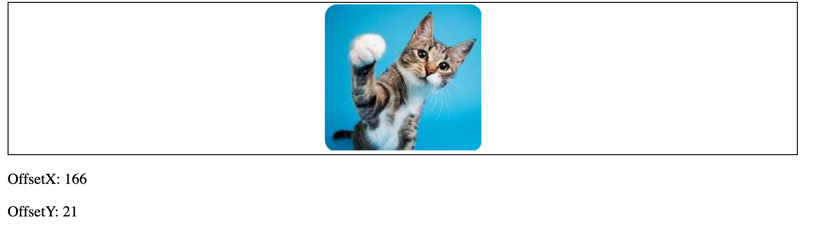
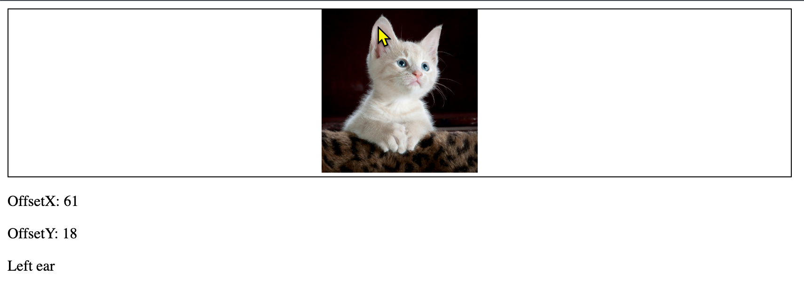

# Step-by-Step Guide to Complete lab_11_01.html

In this lab, you will learn how to interact with HTML elements using JavaScript. You will change the image source when the mouse enters and leaves a box, display the mouse offset coordinates, and detect if the mouse is over a specific image area.





## Step 1: Set Up the HTML Structure
Ensure your HTML structure is correctly set up. You should have a div with the class box containing an img element and another div to display the offset coordinates and messages.

```html
<!DOCTYPE html>
<html lang="en">
<head>
    <meta charset="UTF-8">
    <meta name="viewport" content="width=device-width, initial-scale=1.0">
    <title>Mouse Events Lab</title>
</head>
<body>
    <div class="box">
        
    </div>
    <div>
        <p>OffsetX: <span id="OffsetX"></span></p>
        <p>OffsetY: <span id="OffsetY"></span></p>
        <p id="message"></p>
    </div>
    <script>
        // JavaScript code will go here
    </script>
</body>
</html>
```

## Step 2: Change the Image Source on Mouse Enter and Leave
Add event listeners to change the image source when the mouse enters and leaves the box.

```js
let imgBox = document.querySelector('.box');

imgBox.addEventListener('mouseenter', function() {
    console.log('mouse enter');
    imgBox.firstElementChild.src = 'assets/pexels-pixabay-45201.jpg';
});

imgBox.addEventListener('mouseleave', function() {
    console.log('mouse leave');
    imgBox.firstElementChild.src = 'assets/cat_2.jpg';
});
```
These images are available in the `assets` folder.

## Step 3: Display Mouse Offset Coordinates

Add an event listener to display the mouse offset coordinates when moving over the image.

```js
let img = document.querySelector('img');
img.addEventListener('mousemove', function(e) {
    document.getElementById('OffsetX').innerText = e.offsetX;
    document.getElementById('OffsetY').innerText = e.offsetY;
})
```

## Step 4: Detect Mouse Over a Specific Area
Add an event listener to detect if the mouse is over the left ear of the cat (coordinates (50,5) to (75,30)).

```js
img.addEventListener('mousemove', function(e) {
    let message = document.getElementById('message');
    if (e.offsetX >= 50 && e.offsetX <= 75 && e.offsetY >= 5 && e.offsetY <= 30) {
        message.innerText = 'Mouse is over the left ear!';
    } else {
        message.innerText = '';
    }
});
```

## Step 5: Combine All JavaScript Code
Ensure all the JavaScript code is placed within the `<script>` tag in your HTML file.


## Review Questions

1. Describe the sequence of events that occur when the mouse enters the box, over the cat image, and leaves the box.
2. How can you determine if the mouse is over a specific image area? What kind of coordinates are used?
3. What event should you use to detect the cursor over the cat image's left ear?