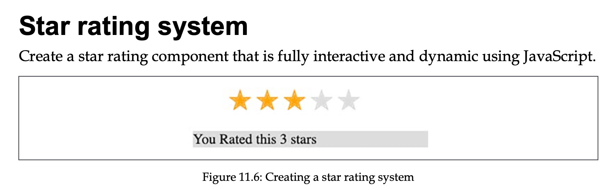
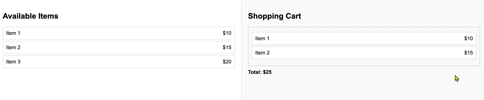

# Practices for Chapter 11

## Practice 11.1 

Create a start rating component.



Create a component that displays a star rating. 
When the user clicks on a star, the clicked start and all the stars before it should be filled with a color. 

For example, if the user clicks on the 3rd star, the first 3 stars should be filled with a color.

In addition, the component should display the message "You rated this {rating} stars".

You can use the following HTML and CSS as a starting template:

```html
<head>
    <meta charset="UTF-8">
    <meta name="viewport" content="width=device-width, initial-scale=1.0">
    <title>Star Rater</title>
    <style>
        .stars ul {
            list-style-type: none;
            padding: 0;
        }

        .star {
            font-size: 2em;
            color: #ddd;
            display: inline-block;
        }

        .orange {
            color: orange;
        }

        .output {
            background-color: #ddd;
        }
    </style>
</head>

<body>
    <ul class="stars">
        <li class="star">&#10029;</li>
        <li class="star">&#10029;</li>
        <li class="star">&#10029;</li>
        <li class="star">&#10029;</li>
        <li class="star">&#10029;</li>
    </ul>
    <div class="output"></div>
    <script>
    </script>
</body>

</html>
```


## Practice 11.2 Drag-and-Drop items to buy

Create two areas in the page. The left area shows a list of items and their prices. The right area is the shopping cart.



The user should be able to drag and drop items from the left area to the right area. When an item is dropped in the shopping cart, the total price should be updated.

The user should also be able to drag and drop items out of the shopping cart to remove them. The total price should be updated accordingly.


html template:

```html
<!DOCTYPE html>
<html lang="en">
<head>
  <meta charset="UTF-8">
  <meta name="viewport" content="width=device-width, initial-scale=1.0">
  <title>Shopping Cart</title>
  <style>
    body {
      font-family: Arial, sans-serif;
      display: flex;
      margin: 0;
      padding: 0;
      height: 100vh;
    }
    .container {
      display: flex;
      width: 100%;
    }
    .left-area, .right-area {
      flex: 1;
      padding: 20px;
      overflow-y: auto;
    }
    .left-area {
      border-right: 1px solid #ccc;
    }
    .right-area {
      background-color: #f9f9f9;
    }
    .item {
      display: flex;
      justify-content: space-between;
      padding: 10px;
      margin: 5px 0;
      border: 1px solid #ccc;
      background-color: #fff;
      cursor: grab;
    }
    .item.dragging {
      opacity: 0.5;
    }
    .cart {
      border: 2px dashed #ccc;
      min-height: 100px;
      padding: 10px;
    }
    .cart-item {
      margin: 5px 0;
    }
    .total {
      font-weight: bold;
      margin-top: 10px;
    }
  </style>
</head>
<body>
  <div class="container">
    <div class="left-area">
      <h2>Available Items</h2>
      <div class="item" draggable="true" data-price="10">Item 1 <span>$10</span></div>
      <div class="item" draggable="true" data-price="15">Item 2 <span>$15</span></div>
      <div class="item" draggable="true" data-price="20">Item 3 <span>$20</span></div>
    </div>

    <div class="right-area">
      <h2>Shopping Cart</h2>
      <div class="cart"></div>
      <div class="total">Total: $0</div>
    </div>
  </div>
  <script>
   
  </script>
</body>
</html>
```