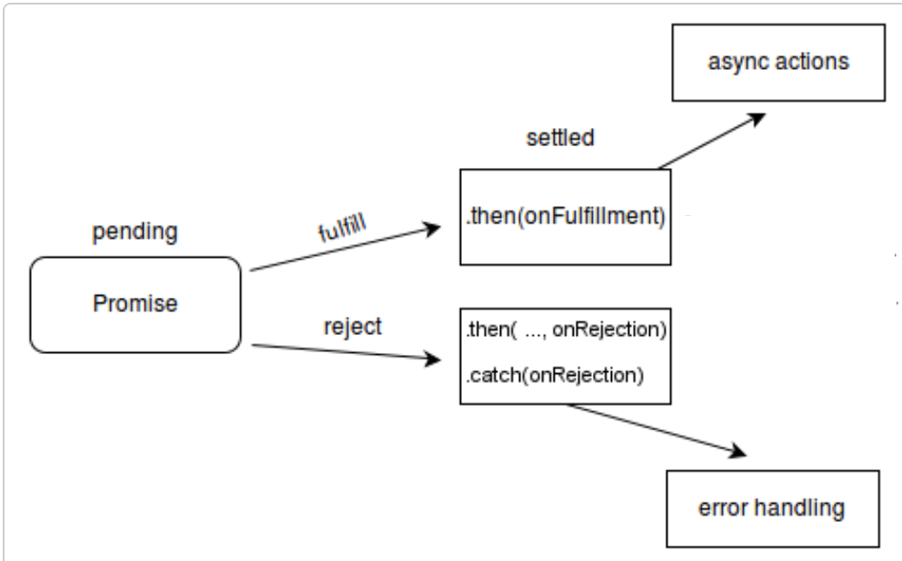

<style>
    .columns {
    display: flex;
  }
  .column {
    flex: 1;
    padding: 10px;
  }
  .column.large{
    flex: 2;
  }
  .small-font {
    font-size: 0.8em;
  }

  section > header,
section > footer {
  position: absolute;
  left: auto;
  right: 90px;
  height: 20px;
}

header {
  top: 30px;
}

footer {
  bottom: 30px;
}
</style>

# Chapter 13 Concurrency 

## Introducing Concurrency

Concurrency is whenever things are happening "at the same time" or in parallel. 

JS is a single-threaded language, and it can only execute one task at a time.

The quick switching between tasks can give the illusion of concurrency, even though the single-thread characteristic.
- e.g. Ask the browser to get the user's geographical location while continue console log messages.

### Example 13-1: Get the user's geographical location

An example of async operation: getting the user's geographical location.
```javascript
console.log('Start');
// get the user's geographical location
navigator.geolocation.getCurrentPosition(
  position => console.log(position),   // callback function invoked by the Web API
  err => console.log(err)
);
console.log('Finish');
```

---

When you run the above code in the browser, you will see the following output:

```
Start
Finish
// the user's geographical location or an error message
```


## JS Engine and Browser

An interesting question arises from the above example:
- Who executes the task of getting the user's geographical location?
- Is it the JS engine or the browser? Other engine in the Browser. 

## JS engine and the browser are two different runtime environments.
A browser contains multiple engines to handle different tasks.
JavaScript Engine use Web APIs to use the services provided by the different engines.


<!-- Fig Source: https://www.youtube.com/watch?v=eiC58R16hb8 -->

---

The browser is implemented to have the multi-threaded capability.

So, the important concept to keep in mind: 
- JS engine and the browser are two different runtime environments.


## Asynchronous Programming

In JavaScript, concurrency is achieved through the use of asynchronous programming.

There are three ways to write asynchronous code in JavaScript:
- Callbacks
- Promises
- Async/Await

We will discuss each of them in the following slides.

## Callbacks 

Callbacks are functions passed as arguments to other functions.
- They are invoked by other functions. 

An typical example of using callbacks is the `setTimeout` function.
- the `setTimeout` function is a Web API provided by the browser.

### Example 13-2: Use the `setTimeout` function to delay the execution of a function

```javascript
console.log('Hi there!'); 
function greeting(waitTimeSeconds) {
    console.log(`Sorry for the wait ${waitTimeSeconds} seconds.`)
}
setTimeout(greeting, 2000, 2); // async call; Execute the greeting function after 2 seconds
console.log('Please wait'); 
```

The outputs of the above code are:
```
Hi there!
Please wait
Sorry for the wait 2 seconds.
```

### Callback Hell

The disadvantage of using callbacks is the callback hell.
- A callback function calls another function that takes a callback function as an argument.
  - The second callback function calls a third function that takes a callback function as an argument.
    - continue nesting...

The nested callbacks make the code **hard to read and maintain**.

### Example 13-3 : Write a function that logs messages every second for four seconds.

```javascript
// ex_13_03.js
function startTimeouts() {
    setTimeout(() => { // first callback
        console.log('First timeout');
        setTimeout(() => { // second callback
            console.log('Second timeout');
            setTimeout(() => { // third callback
                console.log('Third timeout');
                setTimeout(() => { // fourth callback
                    console.log('Fourth timeout');
                    // Continue nesting if needed
                }, 1000);
            }, 1000);
        }, 1000);
    }, 1000);
}

// Call the function
startTimeouts();
```

---

The output of the above code is:
```
First timeout
Second timeout
Third timeout
Fourth timeout
```

To avoid the callback hell, we can use Promises or Async/Await (covered later).

## Lab 13-1

[Lab: Understanding Callback Hell in JavaScript](lab_01.md)

## Why Promises?

Promises are a better way to handle asynchronous tasks than callbacks.
- avoid from the callback hell.


## Promises: How do they work?

An async function returns a **Promise** object when it completes its task.
- (or the async function resolves the task and return the promise object as the result.)
- Then, the Promise object is placed in a special place called the **Microtask Queue** in JS engine. 
- The **JS Engine** will find a suitable time to execute the callbacks associated with the promise object.


## Use the Promise object 

A Promise object has three states: Pending, Fulfilled, and Rejected.



---

- Pending: The initial state of the promise object.
  - implying that the async task is not completed yet.
- Fulfilled: The promise object is resolved. (The async task is completed successfully.)
  - implying that the async task is completed successfully.
- Rejected: The promise object is rejected. (The async task is failed.)
  - implying that the async task is failed.
- Settled: The promise object is either fulfilled or rejected.


<!-- Source: [Promise - JavaScript | MDN](https://developer.mozilla.org/en-US/docs/Web/JavaScript/Reference/Global_Objects/Promise#constructor) -->
---

Terms to know:
- Resolved promise: The promise is settled or "locked-in" to match the eventual state of another promise, and further resolving or rejecting it has no effect.
  - A Promise object can only be resolved once.
- Settled promise: A promise that is either resolved or rejected, but not pending.

<!-- <figure


<caption>Promise States <br/>

Source: [Promise - JavaScript | MDN](https://developer.mozilla.org/en-US/docs/Web/JavaScript/Reference/Global_Objects/Promise#constructor)

 </caption>

</figure> -->


## Pattern to write a function that returns a Promise object

1. Create a function that returns a Promise object.
2. Pass an function as the argument to the `Promise` constructor.
   - This is called the executor function
   - will be called when the Promise object is executed by the JS engine.
3. The executor function has two parameters: `resolve` and `reject`.
   - `resolve` is a function that resolves the promise object.
   - `reject` is a function that rejects the promise object.

```js
function asyncOperation() {
    return new Promise((resolve, reject) => {
        // code to execute the async task

        // call resolve(value) to resolve the promise object
        // call reject(reason) to reject the promise object
    });
}
```

---

4. Call the `resolve(value)` function to resolve the promise object.
   - The `value` can be another promise object.
   - The promise object will change to the fulfilled state after the `resolve` function is called.
5. Call the `reject(reason)` function to reject the promise object.
   - The `reason` is usually an error object.
   - The promise object will change to the rejected state after the `reject` function is called.


## Register handlers (or callbacks) for the Promise object


We must assign the handlers (or callback functions) to the promise object to handle the fulfilled and rejected states respectively.


Resolved Handler:
- Use the [`then` method](https://developer.mozilla.org/en-US/docs/Web/JavaScript/Reference/Global_Objects/Promise/then) of the Promise object to register the handler for the fulfilled state.

```javascript
promiseObject.then(onFulfilled_callback);
```

Rejected Handler:
- Use the [`catch` method](https://developer.mozilla.org/en-US/docs/Web/JavaScript/Reference/Global_Objects/Promise/catch) of the Promise object to register the handler for the rejected state.

```javascript
promiseObject.catch(onRejected_callback);
```

### Example 13-4: Use the Promise to rewrite the code in Example 13-3

Step 1. Create a function that returns a Promise object.

```javascript
function startTimeouts(msg) {
    return new Promise((resolve, reject) => {
        setTimeout(() => {
            console.log(msg);
            resolve();
        },  1000);
    });
}
```

--- 

Step 2. Call the startTimeouts function and register a handler for the fulfilled state.

This allow us to execute the next async task after the first async task is completed.

```javascript
startTimeouts(2)
    .then(() => startTimeouts('Second timeout'))
```

Step 3. Register a handler to execute the third async task.

```javascript
    .then(() => startTimeouts('Third timeout')) // execute and return a promise object
    .then(() => startTimeouts('Fourth timeout'))
    .catch(error => console.error('An error occurred:', error));
```

### Lab 13-2 

[Lab: Rewrite the code in Lab 13-1 using the Promise object](lab_13_02A.md)


### Example 13-5 : Use `fetch()` web API to get the data from a URL.

<!-- ex_13_04.js -->

`fetch()` return a Promise object. 

We register the handles using the `then` and `catch` methods of the Promise object.

```javascript
fetch(url)
        .then(response => {  // register a callback to handle the response
            console.log("First handler for the fetch()'s promise")
            if (!response.ok) {
                throw new Error('Network response was not ok');
            }
            // response.text() returns a promise that resolves with the response body
            return response.text();
        })
        .then(data => {
            console.log("Second handler for the response.text()'s promise");
            // data is the response body
            console.log('Data fetched:', data);
        })
        .catch(error => {
            console.error('Error fetching data:', error);
        });
```
---

The first handler check the response status.

The second handler reads the response body as text.

The third handler logs the error message to the console when the promise object is rejected.


--- 

Test your code with the url: `https://jsonplaceholder.typicode.com/posts/1`

The above code will print the response body of the URL to the console.

```
Fetching data from https://jsonplaceholder.typicode.com/posts/1
Please wait for the data to be fetched...
First handler for the fetch()'s promise
Second handler for the response.json()'s promise
Data fetched: {
  userId: 1,
  id: 1,
  title: 'sunt aut facere repellat provident occaecati excepturi optio reprehenderit',
  body: 'quia et suscipit\n' +
    'suscipit recusandae consequuntur expedita et cum\n' +
    'reprehenderit molestiae ut ut quas totam\n' +
    'nostrum rerum est autem sunt rem eveniet architecto'
}
```

## Lab 13-3: 

[Fetch data from a URL and show the first N characters of the response body](lab_13_03.md)


## Chain Promises

Promise objects are **thenable** objects 
- Each Promise object has a `then` method that can return a new Promise object.
- The `then` method returning a new Promise object can be chained with another `then` method.
- This allows developers to control the flow of the asynchronous tasks.
  - Think the chained `then` method as a sequence of operations on returned Promise objects.

---

In pattern A: 
- rejected Promise object are handled by the subsequent `then` method.
- The `catch` method is used to handle the rejected Promise object that is not handled by the `then` method.
  - The last barrier in the chain.


In pattern B:
- The rejected Promise object go to the `catch` method directly.
- The `then` methods in the chain are skipped.


<!-- Figure Source: [JavaScript Promise Chaining — Basics](https://levelup.gitconnected.com/javascript-promise-chaining-basics-e2618c5e74a9) -->


## Make a sync function to an async function


Use the `Promise` object to wrap your functions that do not support the Promise object (or not support the concurrency).

Steps to create a Promise object:
1. Create a new Promise object by calling the `Promise` constructor.
2. Pass a function as the argument to the `Promise` constructor, either an arrow function or a named function.
   - The function is called the executor function.
3. The the executor function and it has two parameters: `resolve` and `reject` parameters.
   - `resolve` is a function that resolves the promise object.
   - `reject` is a function that rejects the promise object.

---

4. Add your non-async code to the executor function.
```javascript
function executor(resolve, reject) {
  // code to execute the async task
  // your non-async or sync code
  // call resolve(value) to resolve the promise object (change the state to fulfilled)
}
```

   
### Example 13-6: Make a non-async function do the async task and return a Promise object

Assume we have a function that take lots of time to complete the task:


```javascript
/**
 *  This function is a long running task that takes a while to complete.
 * @returns 
 */
function longtimeTask() {
  console.log('== Enter the long task');
  let i = 0;
  while (i < 10000) {
    i++;
  }
  console.log('== Exit the long task');
  // Return a random number between 0 and 100
  return Math.random() * 100;
}
```

--- 

Execute the `longtimeTask` function in an async way:
- Run the non-async function in the executor function of the Promise object.

```js
console.log('Start the long running task');

// Use the Promise object to run the long running task
// When the promise is created, the long running task is started
const longtimeTaskPromise = new Promise((resolve, reject) => {
    const result = longtimeTask();
    if (result < 50) {
        reject('The result is less than 50');
    }
    resolve(result); // fulfilled 
});

// get the result of the long running task
longtimeTaskPromise
    .then(result => console.log('The result is', result))
    .catch(error => console.error('An error occurred:', error));

console.log('Please wait for the long running task to complete...');
```

---

The output of the above code is:

```
Start the long running task
== Enter the long task
== Exit the long task
Please wait for the long running task to complete...
The result is 61.054982580283635
```

<!-- readFile() using the Promise object (assignment) -->

You may interest in the following article about Promises:
[JavaScript Visualized: Promises & Async/Await](https://medium.com/@lydiahallie/javascript-visualized-promises-async-await-a3f1aad8a943)


## Wrap the non-async function in an async function

Of course, you can create an async function by returning a Promise object.

The pattern of the function that returns a Promise object is as follows:

```javascript
function myAsyncFunction() {
    return new Promise((resolve, reject) => {
        // code to execute the async task
        // call resolve(value) to resolve the promise object
        // call reject(reason) to reject the promise object
    });
}
```

### Example 13-7: Rewrite the `longtimeTask` function: Wrap it in an async function


This example rewrites the `longtimeTask` function in Example 13-6 to return a Promise object.

```javascript
function longtimeTask(){
    return new Promise((resolve, reject) => {
        console.log('== Enter the long task');
        let i = 0;
        while (i < 10000) { // still run the task in JS engine, not Web API. 
            // NOT async operation
            i++;
        }
        // Return a random number between 0 and 100
        console.log('== Exit the long task');
        const result = Math.random() * 100;
        if (result < 50) {
            reject('The result is less than 50');
        }
        resolve(result); // fulfilled 
    });
}
```
---

Call the `longtimeTask` function in an async way:

```javascript
// call the longtimeTask function
console.log('Start the long running task');

longtimeTask()
    .then(result => console.log('The result is', result))
    .catch(error => console.error('An error occurred:', error));

console.log('Please wait for the long running task to complete...');    
```


### **Misconception** in the above code:

- The `longtimeTask` function does not run asynchronously, although it returns a Promise object.
- **It run the LOOP in the JS engine, not in the Web API.** 
- Because the JS engine is single-threaded, the loop will block the execution of other tasks in the JS engine.
- To run the task asynchronously, you need to **offload the task to the Web API**.
- Replace the `while` loop with the `setTimeout` function (Web API) to run the task asynchronously.
- See [ex_13_07_1.js](./ex_13_07_1.js) for the complete code.

## Async and Await

Use the Promise object might still cause the callback hell if you have many asynchronous tasks to be run in sequence.

Use the **async/await** syntax to avoid the callback hell
- make the asynchronous code look like synchronous code.

The async/await syntax is a syntactic sugar for the Promise object.

### The async and await keywords

- Use the `async` keyword to qualify a function as an async function.
- The async function **always** returns a Promise object.
- Use the `await` keyword to qualify a function that returns a Promise object.
  - The `await` keyword waits for the Promise object to be resolved.
- Important: The `await` keyword can only be used inside an async function.

### Pattern to write an async function

Define an async function using the `async` keyword.
```javascript
async function myAsyncFunction() {
    // code to execute the async task
    // call the function that returns a Promise object
    // use the await keyword to wait for the Promise object to be resolved
    // return the result of the Promise object
}
```

---

Resolve the Promise object of the async function using the `await` keyword.

```javascript
async function caller() {
    // call the async function
    const result = await myAsyncFunction();
    // use the result of the Promise object
}
```

Important: The `await` keyword can only be used inside an async function.

---

meme about async and await.


### Example 13-8: Rewrite Example 13-6 using the async/await syntax

```javascript
// call the longtimeTask function
console.log('Start the long running task');
// Use an Immediate Invoke Function Expression (IIFE) to call the function returning a promise
(async () => {
    let result = await longtimeTask();
    console.log('The result is: ', result);
})()
console.log('Please wait for the long running task to complete...');  
```

---

`await` means wait for the promise object to be resolved.
- the `result` variable will store the fulfillment value of the promise object if the promise object is resolved.
- If the promise object is rejected, the `await` will throw an error with the rejection value of the promise object.
  - You can use the `try...catch` block to handle the error.
- The `await` keyword can only be used inside an async function.

### Example 13-9: What's wrong with the following code?

```javascript
// call the longtimeTask function
console.log('Start the long running task');

// Use an Immediate Invoke Function Expression (IIFE) to call the function returning a promise
let result = await longtimeTask();
console.log('The result is', result);
console.log('Please wait for the long running task to complete...');    
```

---

The above code will throw a syntax error because the `await` keyword can only be used inside an async function.
- Inside the async function, you write code to handle the resolved value or exception of the promise object.

```
SyntaxError: await is only valid in async functions and the top level bodies of modules
```

To fix the error, you can define a named function to wrap the code and call the function, or use an IIFE to call the function.

### Example 13-10: Fix the code in Example 13-9 by a named async function

```javascript
console.log('Start the long running task');
// Define a named async function 
async function runLongTimeTask(){
    try{
        let result = await longtimeTask();
        console.log('The result is', result);
    } catch(error){
        console.error('An error occurred:', error);
    }
}
// call the longtimeTask function
runLongTimeTask();
runLongTimeTask();
runLongTimeTask();
runLongTimeTask();
console.log('Please wait for the long running task to complete...');    
```
---

Output:
```
Start the long running task
== Enter the long async task
== Enter the long async task
== Enter the long async task
== Enter the long async task
Please wait for the long running task to complete...
== Inside the long async task
== Exit the long task
The result is 54.74726285881244
== Inside the long async task
== Exit the long task
An error occurred: The result is less than 50
== Inside the long async task
== Exit the long task
An error occurred: The result is less than 50
== Inside the long async task
== Exit the long task
The result is 78.86292440819362
```

---

In summary, why do we use the async/await syntax?
- The async/await syntax is a syntactic sugar for the Promise object.
  - JS engine unpacks the Promise object for you.
- It makes the code easier to read and maintain 
  - because it looks like synchronous code and avoid the "callback hell".
- Can use the `try...catch` block to handle the error.


### The return value of the async function

Async functions always return a Promise object [2].

If the return value of an async function is not explicitly a promise, it will be implicitly wrapped in a promise.

For example:

The code:

```javascript   
async function myAsyncFunction() {
    return 'Hello World';
}
```

is equivalent to:

```javascript
async function myAsyncFunction() {
    return Promise.resolve('Hello World');
}
```


### Use `then` method with the async function

To call the above async function without the `await` keyword, you can use the `then` method of the Promise object.

```javascript
myAsyncFunction().then(value => console.log(value));
```

See [ex_13_async_then.js](ex_13_async_then.js) for the complete code.


## JS Runtime Model and Event Loop

-  JavaScript is a single-threaded language
   -  JS can only execute one task at a time
-  A thread in this context means a path of execution

- To handle asynchronous tasks, JS employs a runtime model. 

---


---

- JS runtime model consists of the following components:
    -  Call Stack: LIFO, the code to be executed in the JS engine 
    -  Web APIs: APIs to interact with the browser. Browser and the JS engine are two different runtime environments.
    -  Callback (or Task) Queue: A queue to store the **callback functions invoked by the Web APIs** when APIs complete their asynchronous tasks.
    -  Event Loop: A loop to check the Call Stack and the Callback Queue. 
       -  The loop run tasks in the Call Stack first.
       -  If and only if the Call Stack is empty, the Event Loop will move the tasks from the Callback Queue to the Call Stack.
    -  Microtask Queue
       -  A queue to store the **promise-based function** (the promise handler). 
       -  Microtasks have higher priority than the tasks in the Callback Queue.
  


<!-- Fig source: [JavaScript Runtime Environment: Web API, Task Queue and Event Loop](https://slawinski.dev/blog/javascript-runtime-environment-web-api-task-queue-and-event-loop/) -->


### Example 13-11: Use JavaScript Visualizer 9000 to visualize the runtime process for the code in Example 13-7

[JS Visualizer 9000 - An interactive JavaScript runtime model visualizer.](https://www.jsv9000.app/)


Note: The JS Visualizer 9000 cannot accept the async/await syntax. 

## Video and Interactive Tools to help you understand the JS runtime model

[Lydia Hallie, 2024. JavaScript Visualized - Event Loop, Web APIs, (Micro)task Queue](https://www.youtube.com/watch?v=eiC58R16hb8)

[JS Visualizer 9000 - An interactive JavaScript runtime model visualizer.](https://www.jsv9000.app/)

## Summary

- Concurrency is whenever things are happening "at the same time" or in parallel.
- There are two ways to write asynchronous code in JavaScript:
  - Callbacks basis
  - Promises basis

- Callbacks are functions call by other functions.
  - The callback hell is a common problem when using callbacks to chain asynchronous tasks.

---

- Promises are a better way to handle asynchronous tasks than callbacks.
- A Promise object has three states: pending, fulfilled, and rejected.
  - We call the `resolve`  and `reject` functions to change the state of the Promise object.
- JS Engine will run the Promise-based functions  when the Promise object is settled (resolve or reject).
- Use the `then` and `catch` methods to register the handlers for the Promise object.

- Use the `async` and `await` keywords to write asynchronous code that looks like synchronous code.

# References 

1. [Promise() constructor - JavaScript | MDN](https://developer.mozilla.org/en-US/docs/Web/JavaScript/Reference/Global_Objects/Promise/Promise)

2. [async function - JavaScript | MDN](https://developer.mozilla.org/en-US/docs/Web/JavaScript/Reference/Statements/async_function)

<script>
    // add the following script at the end of your marp slide file.
    const h2s = document.querySelectorAll('h2');
    h2s.forEach(function(h2, idx){
        h2.innerHTML = `<span class="small-font">${idx + 1}</span> ${h2.innerHTML}`
    })
</script>