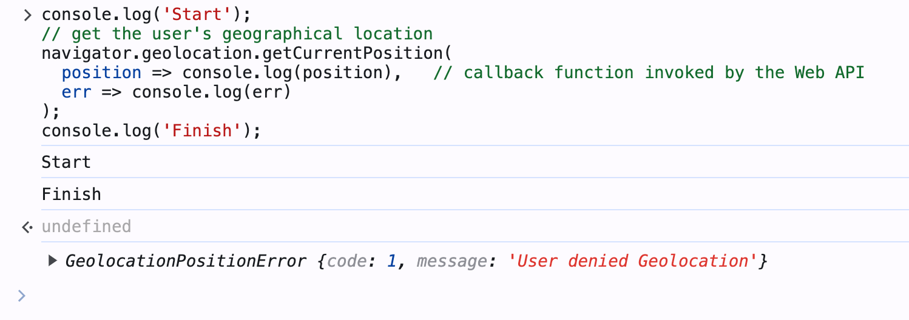
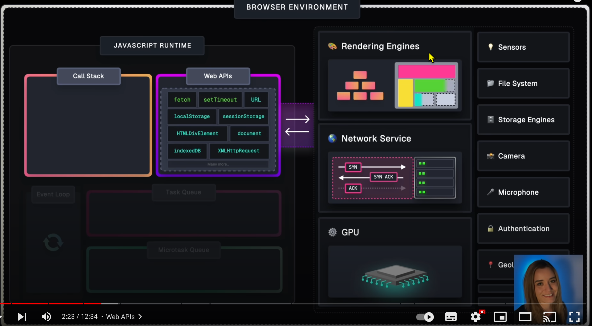
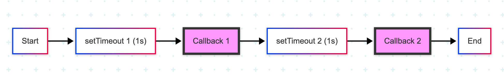
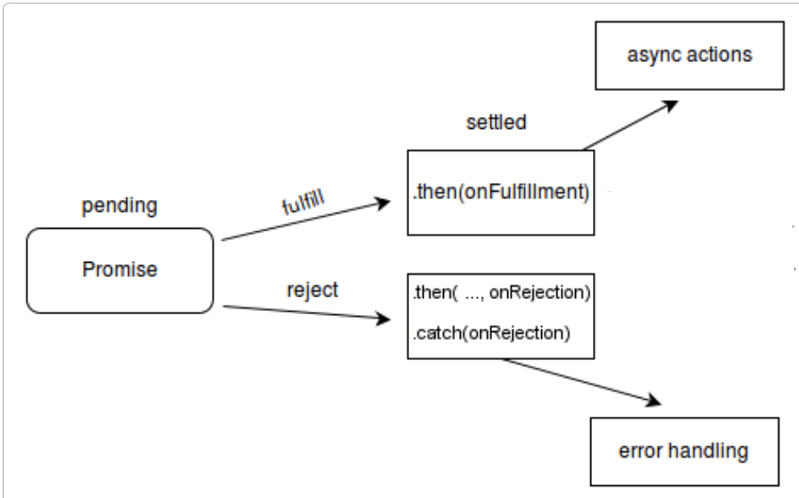
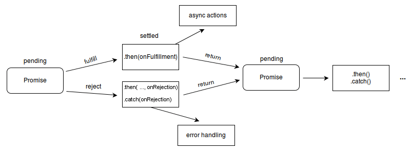
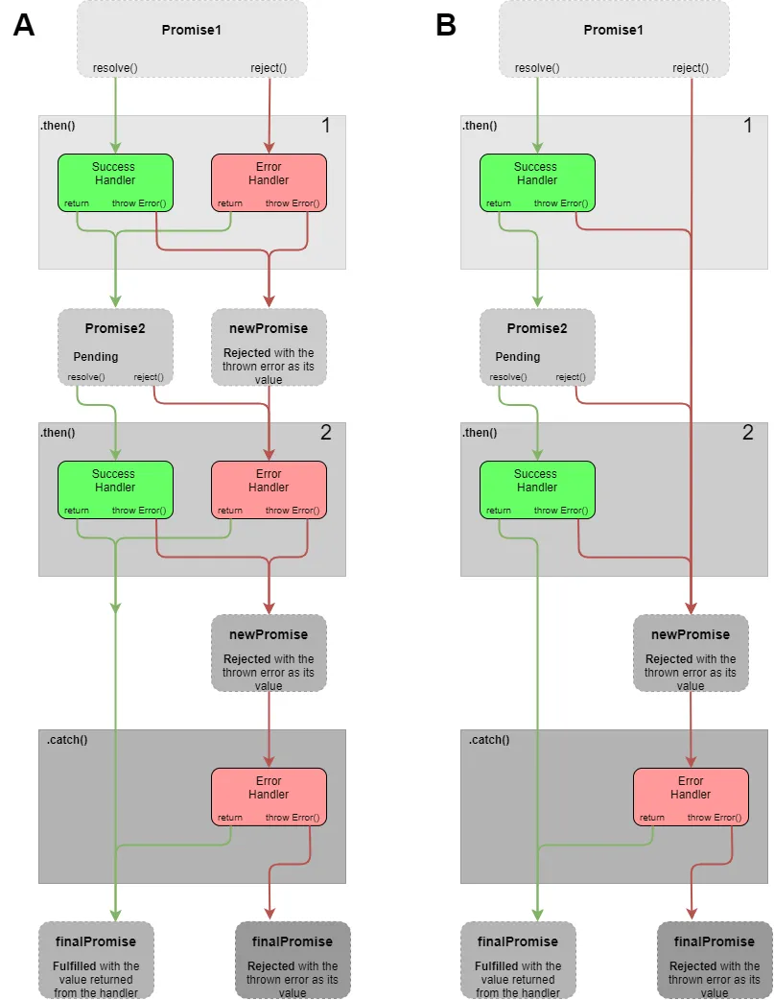

<style>
    .columns {
    display: flex;
  }
  .column {
    flex: 1;
    padding: 10px;
  }
  .column.large{
    flex: 2;
  }
  .small-font {
    font-size: 0.8em;
  }

  section > header,
section > footer {
  position: absolute;
  left: auto;
  right: 90px;
  height: 20px;
}

header {
  top: 30px;
}

footer {
  bottom: 30px;
}
</style>

# Chapter 13 Concurrency 

## Introducing Concurrency

### Concurrency
Concurrency is whenever things are happening "at the same time" or in parallel. 

JS is a single-threaded language, and it can only execute one task at a time.

The quick switching between tasks can give the illusion of concurrency, even though the single-thread characteristic.
- e.g. Ask the browser to get the user's geographical location while continue console log messages.

### Asynchronous Programming in JavaScript

Asynchronous programming is a programming paradigm that allows a program to perform tasks without blocking the main thread.
- The program can continue to execute other tasks while waiting for the async task to complete.

- The async task is executed in the background by the browser.
- The JS engine will continue to execute the next task in the main thread.

### Example 13-1: Get the user's geographical location

An example of async programming: getting the user's geographical location.
```javascript
console.log('Start');
// get the user's geographical location
navigator.geolocation.getCurrentPosition(
  position => console.log(position),   // callback function invoked by the Web API
  err => console.log(err)
);
console.log('Finish');
```

---

When you run the above code in the browser, you will see the following output:

```
Start
Finish
// the user's geographical location or an error message
```

while the `navigator.geolocation.getCurrentPosition` function run in the background, the JS engine continues to execute the next task in the main thread.



## JS Engine and Browser

An interesting question arises from the above example:
- Who executes the task of getting the user's geographical location?
- Is it the JS engine or the browser? 

## JS engine and the browser are two different runtime environments.

A browser contains multiple engines to handle different tasks.
JavaScript Engine use Web APIs to use the services provided by the different engines.



<!-- Fig Source: https://www.youtube.com/watch?v=eiC58R16hb8 -->

---

The browser is implemented to have the multi-threaded capability.

So, the important concept to keep in mind: 
- JS engine and the browser are two different runtime environments.


## Asynchronous Programming

In JavaScript, concurrency is achieved through the use of asynchronous programming.

There are three ways to write asynchronous code in JavaScript:
- Callbacks
- Promises
- Async/Await

We will discuss each of them in the following slides.

## Callbacks 

Callbacks are functions passed as arguments to other functions.
- They are invoked by other functions. 

An typical example of using callbacks is the `setTimeout` function.
- the `setTimeout` function is a Web API provided by the browser.

### Example 13-2: Use the `setTimeout` function to delay the execution of a function

While the setTimeout function is running in the background by the browser, the JS engine continues to execute the next task in the main thread:

```javascript
console.log('Hi there!'); 
function greeting(waitTimeSeconds) {
    console.log(`Sorry for the wait ${waitTimeSeconds} seconds.`)
}
setTimeout(greeting, 2000, 2); // async call; Execute the greeting function after 2 seconds
console.log('Please wait'); 
```

The outputs of the above code are:
```
Hi there!
Please wait
Sorry for the wait 2 seconds.
```

### Callback Hell

When you want to execute multiple async tasks in a sequence by using callbacks, you need to nest the callback functions.
- The first callback function calls the second callback function.
  - The second callback function calls the third callback function.
    - continue nesting...



The nested callbacks leads to a problem called **callback hell**.
- make the code **hard to read and maintain**.

### Example 13-3 : Logs messages every second for four seconds.

```javascript
// ex_13_03.js
setTimeout(() => { // first callback
    console.log('First timeout');
    setTimeout(() => { // second callback
        console.log('Second timeout');
        setTimeout(() => { // third callback
            console.log('Third timeout');
            setTimeout(() => { // fourth callback
                console.log('Fourth timeout');
                // Continue nesting if needed
            }, 1000);
        }, 1000);
    }, 1000);
}, 1000);
```

---

The output of the above code is:
```
First timeout
Second timeout
Third timeout
Fourth timeout
```

To avoid the callback hell, we can use Promises or Async/Await (covered later).

## Lab 13-1

[Lab: Understanding Callback Hell in JavaScript](lab_01.md)

## Why Promises?

Promises are a better way to handle asynchronous tasks than callbacks.
- avoid from the callback hell.


## Promises: How do they work?

An async function returns a **Promise** object when it completes its task.
- (or the async function resolves the task and return the promise object as the result.)
- Then, the Promise object is placed in a special place called the **Microtask Queue** in JS engine. 
- The **JS Engine** will find a suitable time to execute the callbacks associated with the promise object.

Recall the async function runs in the browser.

## Use the Promise object 

A Promise object has the following possible states: 
- Pending 
- Settled
  - Fulfilled or Rejected




---

- Pending: The initial state of the promise object.
  - imply the async task is not completed yet.
- Settled: The promise object is either fulfilled or rejected.
- Fulfilled: The promise object is resolved. 
  - imply that the async task is completed successfully.
- Rejected: The promise object is rejected. 
  - imply that the async task is failed.


<!-- Source: [Promise - JavaScript | MDN](https://developer.mozilla.org/en-US/docs/Web/JavaScript/Reference/Global_Objects/Promise#constructor) -->


<!-- ### Terms to know

- Resolved promise: The promise is settled or "locked-in" to match the eventual state of another promise, and further resolving or rejecting it has no effect.
  - A Promise object can only be resolved once.
- Settled promise: A promise that is either resolved or rejected, but not pending. -->

<!-- <figure



<caption>Promise States <br/>

Source: [Promise - JavaScript | MDN](https://developer.mozilla.org/en-US/docs/Web/JavaScript/Reference/Global_Objects/Promise#constructor)

 </caption>

</figure> -->


## Pattern to write an async function using the promise

1. Create a function that returns a new Promise object.
2. Pass an executor function as the argument to the `Promise` constructor.
   - the executor function will be called when the the JS engine construct the new Promise object.

---

3. The executor function has two parameters: `resolve` and `reject`.
   - `resolve` is a function that resolves the promise object.
   - `reject` is a function that rejects the promise object.

```js
function asyncOperation() {
    return new Promise((resolve, reject) => {
        // code to execute the async task

        // call resolve(value) to resolve the promise object
        // call reject(reason) to reject the promise object
    });
}
```

---

4. Call the `resolve(value)` function to resolve the promise object.
   - The `value` can be another promise object.
   - The promise object will change to the fulfilled state after the `resolve` function is called.
5. Call the `reject(reason)` function to reject the promise object.
   - The `reason` is usually an error object.
   - The promise object will change to the rejected state after the `reject` function is called.


### Example: Create a custom timeout function 

You can also use the previous patten to warp a non-promise function to a promise one:
  
```javascript
function startTimeouts(msg) {
    return new Promise((resolve, reject) => {
        setTimeout(() => {
            console.log(msg);
            resolve();
        },  1000);
    });
}
```

## How to handle the returned promise: the promise handler

- The async function returns a promise object.
- We need to register a (promise) handle to handle the settled promise (either resolved or rejected).

### Register the resolved and rejected handlers 

Resolved Handler:
- Use the [`then` method](https://developer.mozilla.org/en-US/docs/Web/JavaScript/Reference/Global_Objects/Promise/then) of the Promise object to register the handler for the fulfilled promise.

```javascript
promiseObject.then(onFulfilled_callback);
```

Rejected Handler:
- Use the [`catch` method](https://developer.mozilla.org/en-US/docs/Web/JavaScript/Reference/Global_Objects/Promise/catch) of the Promise object to register the handler for the rejected promise.

```javascript
promiseObject.catch(onRejected_callback);
```

### Example 13-4: Register a callback to handle the fulfilled promise

```javascript
let fulfilledPromise = startTimeouts(2);
fulfilledPromise.then(() => startTimeouts('Second timeout'))
```

Or, combine the two statements:

```js
startTimeouts(2).then(() => startTimeouts('Second timeout'))
```

Note: the `startTimeouts` function is wrapped in a lambda function.


### Example 13-X-3 Rewrite the nested callbacks using the Promise object

```javascript
startTimeouts(2)
    // return a promise object
    .then(() => startTimeouts('First timeout')) 
    // return another promise object
    .then(() => startTimeouts('Second timeout')) 
    .catch(error => console.error('An error occurred:', error));
```


### Lab 13-2 

[Lab: Rewrite the code in Lab 13-1 using the Promise object](lab_13_02A.md)


## Interacting with the browser with APIs

### Fetch API

Use the [Fetch API](https://developer.mozilla.org/en-US/docs/Web/API/Fetch_API) to fetch local or remote resources.
- e.g. get the data from a URL.

- The `request` object represents a resource request.
- The `response` object represents the response to the request.
- The `headers` object represents the HTTP headers of the request or response.

### Syntax of the `fetch()` function

The syntax of the `fetch()` function is as follows:

```javascript
fetch(url)
fetch(url, options)
```
- The `url` is the URL of the resource to fetch.
- the `options` is an optional object that contains the request options.
  - e.g. method, headers, body, etc.

Return value:
  - The `fetch()` function returns a Promise object that resolves to the `response` object.


### Example 13-5 : Use `fetch()` web API to get the data from a URL.

<!-- ex_13_04.js -->

`fetch()` return a Promise object. 

We register the handles using the `then` and `catch` methods of the Promise object.

```javascript
fetch(url)
        // resolve the response object from the resolved promise object
        .then(response => { 
            console.log("First handler for the fetch()'s promise")
            if (!response.ok) {
                throw new Error('Network response was not ok');
            }
            // response.text() is async fun. 
            // It returns a promise that resolves with the response body
            return response.text();
        })
```

---

Continue from the last `then` method:
```javascript
        // resolve the response body from the promise object
        .then(data => {
            console.log("Second handler for the response.text()'s promise");
            // data is the response body
            console.log('Data fetched:', data);
        })
        // catch the error from the promise object
        .catch(error => {
            console.error('Error fetching data:', error);
        });
```
<!-- ---

The first handler check the response status.

The second handler reads the response body as text.

The third handler logs the error message to the console when the promise object is rejected. -->


--- 

Test your code with the url: `https://jsonplaceholder.typicode.com/posts/1`

The above code will print the response body of the URL to the console.

```
Fetching data from https://jsonplaceholder.typicode.com/posts/1
Please wait for the data to be fetched...
First handler for the fetch()'s promise
Second handler for the response.json()'s promise
Data fetched: {
  userId: 1,
  id: 1,
  title: 'sunt aut facere repellat provident occaecati excepturi optio reprehenderit',
  body: 'quia et suscipit\n' +
    'suscipit recusandae consequuntur expedita et cum\n' +
    'reprehenderit molestiae ut ut quas totam\n' +
    'nostrum rerum est autem sunt rem eveniet architecto'
}
```

## Lab 13-3: 

[Fetch data from a URL and show the first N characters of the response body](lab_13_03.md)


## Chain Promises

Promise objects are **thenable** objects 
- Each Promise object has a `then` method that can return a new Promise object.
- The `then` method returning a new Promise object can be chained with another `then` method.
- This allows developers to control the flow of the asynchronous tasks.
  - Think the chained `then` method as a sequence of operations on returned Promise objects.

### Patterns to chain Promise objects

Two patterns to chain Promise objects:
- Pattern A: Separated error handler for each Promise object.
- Pattern B: A single error handler for all Promise objects.


### Pattern A: Separated error handler for each Promise object.

Feature: 
- Go through all the `then` methods even if a Promise object is rejected.

```javascript
promiseObject
    .then(onFulfilled_callback1, onRejected_callback1)
    .then(onFulfilled_callback2, onRejected_callback2)
    ...
    .catch(onRejected_callbackN);
```

---



---

- Rejected Promise object are handled by the `onRejected_callback` function in the `then` method.
  - must return a resolved Promise to continue the chain.
- The `catch` method is used to handle the rejected Promise object that is not handled by the `then` method.
  - The last barrier in the chain.

### Example 13-X-1:  Separated error handler for each Promise object


Assume there are three async functions: `firstTask`, `secondTask`, and `thirdTask`. 
The `secondTask` function returns a rejected Promise object.
We want to run the three tasks in sequence and handle the errors separately.

---


```js
firstTask()
    .then(result => secondTask(result), 
        () => {
            console.log('Error in second task');
        })  // The anonymous function returns a promise
    .then(result => thirdTask(result), error => {
        console.log('Error:', error);
        // return a resolved promise for the next then
        return Promise.resolve(error + 1);
    })
    .then(result => {
        console.log('All tasks completed, final result:', result);
    }, error =>{
        console.log('Error in third task', error);
    })
    .catch(error => {
        console.error('Final catch:', error);
    });
```

---

The output of the above code is:
```
'First task: resolved.'
'Second task: rejected'
[ 'Error in second task:', 2 ]
[ 'The last then, final result:', 3 ]
```


See example: [promise_chain_pattern_A.js](promise_chain_pattern_A.js)


### Pattern B: A single error handler for all Promise objects.

Feature: Any one of the rejected Promise objects stops the whole chain.

```javascript
promiseObject
    .then(onFulfilled_callback1)
    .then(onFulfilled_callback2)
    ...
    .catch(onRejected_callback);
```

- The rejected Promise object go to the `catch` method directly.
- The `onRjected_callback` function is skipped in the `then` method.

---


<!-- Figure Source: [JavaScript Promise Chaining — Basics](https://levelup.gitconnected.com/javascript-promise-chaining-basics-e2618c5e74a9) -->


### Example 13-X-2:  A single error handler for all Promise objects

Assume there are three async functions: `firstTask`, `secondTask`, and `thirdTask`.
The `secondTask` function returns a rejected Promise object.

```js
firstTask()
    .then(result => secondTask(result))
    .then(result => thirdTask(result))
    .then(result => {
        console.log('The last then. final result:', result);
    })
    .catch( error => {
        console.error('Final catch:', error);
    });
```

The output of the above code is:
```
'First task: resolved.'
'Second task: rejected'
[ 'Final catch:', 2 ]
```

See example: [promise_chain_pattern_B.js](promise_chain_pattern_B.js)


## Summary

<!-- - Concurrency is whenever things are happening "at the same time" or in parallel.
- There are two ways to write asynchronous code in JavaScript:
  - Callbacks basis
  - Promises basis

- Callbacks are functions call by other functions.
  - The callback hell is a common problem when using callbacks to chain asynchronous tasks.

---

- Promises are a better way to handle asynchronous tasks than callbacks.
- A Promise object has three states: pending, fulfilled, and rejected.
  - We call the `resolve`  and `reject` functions to change the state of the Promise object.
- JS Engine will run the Promise-based functions  when the Promise object is settled (resolve or reject).
- Use the `then` and `catch` methods to register the handlers for the Promise object.

- Use the `async` and `await` keywords to write asynchronous code that looks like synchronous code. -->

- JavaScript is single-threaded but achieves concurrency through asynchronous programming.
- Asynchronous programming allows tasks to run without blocking the main thread.
- Callbacks are the basic way to handle async tasks but can lead to "callback hell" due to nested functions.
- Promises provide a cleaner, more manageable way to handle asynchronous operations and avoid callback hell.
- Promise objects have three states: pending, fulfilled, and rejected.

---

- The `then` and `catch` methods are used to handle fulfilled and rejected promises, respectively.
- Promises can be chained to control the sequence of asynchronous tasks, with different patterns for error handling.
- The Fetch API is a modern way to interact with remote resources and returns a Promise.
- Understanding the difference between the JS engine and browser environment is crucial for working with async code.
- Using Promises and chaining improves code readability and maintainability in asynchronous JavaScript.

# References 

1. [Promise() constructor - JavaScript | MDN](https://developer.mozilla.org/en-US/docs/Web/JavaScript/Reference/Global_Objects/Promise/Promise)

2. [async function - JavaScript | MDN](https://developer.mozilla.org/en-US/docs/Web/JavaScript/Reference/Statements/async_function)

<script>
    // add the following script at the end of your marp slide file.
    const h2s = document.querySelectorAll('h2');
    h2s.forEach(function(h2, idx){
        h2.innerHTML = `<span class="small-font">${idx + 1}</span> ${h2.innerHTML}`
    })
</script>

<!-- Add this anywhere in your Markdown file -->
<script type="module">
  import mermaid from 'https://cdnjs.cloudflare.com/ajax/libs/mermaid/10.4.0/mermaid.min.js';
  mermaid.initialize({ startOnLoad: true });
</script>