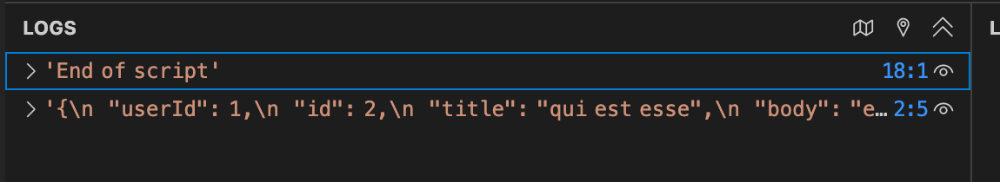

# Lab: Fetch data from a URL and show the first N characters of the response body

## Instruction 
1. Write a function `displayData` that log the first N characters of the given string to the console.
2. Use `fetch()` to get the data from the URL "https://jsonplaceholder.typicode.com/posts/2". 
   - Register the `displayData` function as the handler for the fulfilled state.
   - Register an arrow function to log the error message to the console as the handler for the rejected state.


Step 1: Write a function `displayData` that log the first N characters of the given string to the console.

```javascript
function displayData(data, n) {
    console.log(data.slice(0, n));
}
```

Step 2: Use `fetch()` to get the data from the URL "https://jsonplaceholder.typicode.com/posts/2".

```javascript
fetch("https://jsonplaceholder.typicode.com/posts/2")
    .then(response => {
        // do something with the response
    })
    .catch(error => {
        console.log(error.message);
    });
```

Step 3: Add the `displayData` function to the resolve handler. 

```javascript
fetch("https://jsonplaceholder.typicode.com/posts/2")
    .then(response => {
        // Get the response body as text
        // Return a promise that resolves with the response body
        return response.text();
    })
    .then(data => {
        displayData(data, 100);
    })
    .catch(error => {
        console.log(error.message);
    });
```

Step 4: Run the code to see the output in the console.


