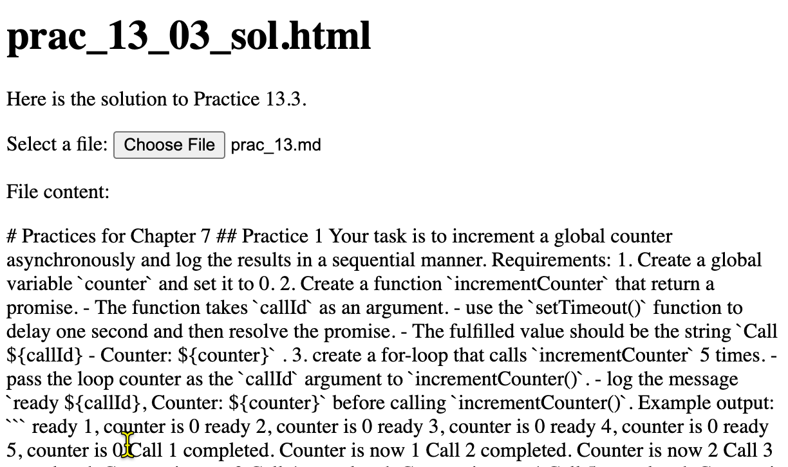

# Practices for Chapter 7

## Practice 1

Your task is to increase a global counter asynchronously and log the results in a sequential manner.

Requirements:
1. Create a global variable `counter` and set it to 0.
2. Create a function `increaseCounter` that return a promise.
   - The function takes `callId` as an argument.
   - use the `setTimeout()` function to delay one second and then resolve the promise.
   - The fulfilled value should be the string `Call ${callId} - Counter: ${counter}` .
3. create a for-loop that calls `increaseCounter` 5 times.
   - pass the loop counter as the `callId` argument to `increaseCounter()`.
   - log the message `ready ${callId}, Counter: ${counter}` before calling `increaseCounter()`.

Example output:
```
ready 1, counter is 0
ready 2, counter is 0
ready 3, counter is 0
ready 4, counter is 0
ready 5, counter is 0
Call 1 completed. Counter is now 1
Call 2 completed. Counter is now 2
Call 3 completed. Counter is now 3
Call 4 completed. Counter is now 4
Call 5 completed. Counter is now 5
```

## Practice 2

Create a for-loop to fetch data from the URL:  `"https://jsonplaceholder.typicode.com/posts/{id}";` where `{id}` is the loop counter starting from 1 to 5.

Read the response body as the JSON value. 
Log the retrieved JSON value in the console.
You must use the **async/await** syntax to fetch the data.

Example outputs:

```
Fetching data from https://jsonplaceholder.typicode.com/posts/1
Fetching data from https://jsonplaceholder.typicode.com/posts/2
Fetching data from https://jsonplaceholder.typicode.com/posts/3
Fetching data from https://jsonplaceholder.typicode.com/posts/4
Fetching data from https://jsonplaceholder.typicode.com/posts/5

{
  userId: 1,
  id: 1,
  title: 'sunt aut facere repellat provident occaecati excepturi optio reprehenderit',
  body: 'quia et suscipit\n' +
    'suscipit recusandae consequuntur expedita et cum\n' +
    'reprehenderit molestiae ut ut quas totam\n' +
    'nostrum rerum est autem sunt rem eveniet architecto'
}
{
  userId: 1,
  id: 2,
  title: 'qui est esse',
  body: 'est rerum tempore vitae\n' +
    'sequi sint nihil reprehenderit dolor beatae ea dolores neque\n' +
    'fugiat blanditiis voluptate porro vel nihil molestiae ut reiciendis\n' +
    'qui aperiam non debitis possimus qui neque nisi nulla'
}
{
  userId: 1,
  id: 3,
  title: 'ea molestias quasi exercitationem repellat qui ipsa sit aut',
  body: 'et iusto sed quo iure\n' +
    'voluptatem occaecati omnis eligendi aut ad\n' +
    'voluptatem doloribus vel accusantium quis pariatur\n' +
    'molestiae porro eius odio et labore et velit aut'
}
{
  userId: 1,
  id: 5,
  title: 'nesciunt quas odio',
  body: 'repudiandae veniam quaerat sunt sed\n' +
    'alias aut fugiat sit autem sed est\n' +
    'voluptatem omnis possimus esse voluptatibus quis\n' +
    'est aut tenetur dolor neque'
}
{
  userId: 1,
  id: 4,
  title: 'eum et est occaecati',
  body: 'ullam et saepe reiciendis voluptatem adipisci\n' +
    'sit amet autem assumenda provident rerum culpa\n' +
    'quis hic commodi nesciunt rem tenetur doloremque ipsam iure\n' +
    'quis sunt voluptatem rerum illo velit'
}
```

## Practice 3

Your task is to select a local file, read the file content, and display the content on the HTML page.

### Background knowledge

The file input element in HTML5 allows users to select files from their device.

The element's `files` property contains a list of the `File` objects selected by the user.

use `name` property to access the file name of a `File` object.

With the filenames, you can read the file content using the [`FileReader` object](https://developer.mozilla.org/en-US/docs/Web/API/FileReader).

Use `readAsText()` method of the `FileReader` object to read the file content as a text.
The method is an asynchronous operation. You must listen to the [`load` and `error` events](https://developer.mozilla.org/en-US/docs/Web/API/FileReader#events) to handle the asynchronous operation.

When the `readAsText()` method completes the file reading, the `load` event is triggered. The file content is available in the `result` property of the `FileReader` object. If an error occurs during the file reading, the `error` event is triggered.


### Requirements

1. Create an HTML file input element and give it a specific id.
2. Create a `p` element with a specific id to display the file content.
3. Create a function `readFileAsync(file)` that takes a `File` object as an argument and return a Promise object that resolves with the file content.
   - In the function, you create a FileReader object to read the file content.
   - You register a `load` event listener on the FileReader object. When the event is triggered, you resolve the promise with the file content (`fileReader.result`).
   - You register an `error` event listener on the FileReader object. When the event is triggered, you reject the promise with the error message.
4. Register a `change` event listener on the file input element. The event listener should call the `readFileAsync` function with the selected file and display the file content in the `div` element.




