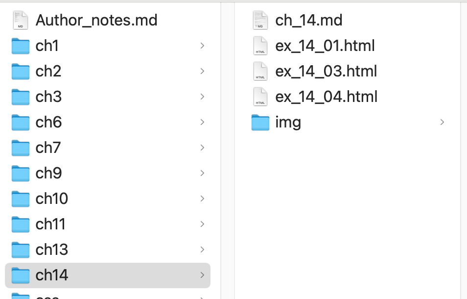

# Chapter 14 Read local files

For security reasons, you cannot read local files directly by using Javascript. 

The use must initiate the action by selecting a file(s) or dragging and dropping a file(s) into a target area.

To select one ore more files, you use the <input type="file"> form element.

To drag and drop files, you use the drag-and-drop API.

## 1. Selecting files or directories using the file input element (File Picker Dialog) 

The `<input type="file">` element allows users to select a file.

Enable the `multiple` attribute to the element to allow users to select multiple files.

```html
<input id="uploadFiles" type="file" multiple>
```

The browser will render the file input element as a button that users can click to select files.


After the user clicks the button, the browser will open a file dialog box for selecting files.

### The `files` property

After the user selects files, the browser will store the files in the `files` property of the file input element.

The `files` property is a `FileList` object that contains a list of `File` objects.

The [`FileList` ](https://developer.mozilla.org/en-US/docs/Web/API/FileList) is an array-like object that has a `length` property and can be accessed by index. Of course, you can use the `for...of` loop to iterate over the `FileList` object.

```javascript
const fileInput = document.getElementById('uploadFiles');
for (const file of fileInput.files) {
  console.log(file.name);
}
```

### The `File` object

The `File` object represents the selected file, which is a special kind of `Blob`.


The commonly used properties of the `File` object are:
- `name`: the name of the file.
- `webkitRelativePath`: the path of the file relative to the directory selected by the user if the user selects a directory.

### Example 10-1: Select files and list the file names

First, we create a file input element with the `multiple` attribute.

```html
<input id="filePicker" type="file" multiple>
```

Next, we add an event listener to the `change` event of the file input element.
In the handler function, we access the `event.target.files` property to get all the selected files.
Then, we loop through the files and display the file name and size.

```javascript
const filePicker = document.getElementById('filePicker');
    const output = document.getElementById('output');
    filePicker.onchange = function(event){
        // get the select files
        const files = event.target.files;
        // loop through the files
        for(const file of files){
            output.innerHTML += `<p>${file.name} - ${file.size} bytes</p>`;
        }
    }
```

See the full example [ex_14_01.html](ex_14_01.html).

### Selecting a directory: the `webkitdirectory` attribute

### Example 10-2: Select a directory and list the file's relative path

We need to enable the `webkitdirectory` attribute of the file input element so that the user can select a directory. If you enable the `multiple` attribute at the same time, the user can select multiple directories.


```html
<input type="file" id="filepicker" name="fileList" webkitdirectory multiple />
<output id="output"></output>
```

But, be noticed that not all browsers support selecting multiple directories.

The example in [File: webkitRelativePath property - Web APIs | MDN](https://developer.mozilla.org/en-US/docs/Web/API/File/webkitRelativePath) demonstrates how to select a directory and list the relative path of the files in the directory.

Next, we add a handler function to the `change` event of the file input element.

When the event is triggered, the handler function will access the `event.target.files` property to get all the files in the selected directory.
- The subdirectories in the selected directory will not be included in the `files` property.

Then, for each `file`, the handler function will access the `file.webkitRelativePath` property to get the relative path of the file.

The code is as follows:

```javascript
const output = document.getElementById("output");
const filepicker = document.getElementById("filepicker");

filepicker.addEventListener("change", (event) => {
  const files = event.target.files;

  for (const file of files) {
    output.textContent += `${file.webkitRelativePath}\n`;
  }
});
```

Select a directory that contains four files:


The output of the example is:


See the full example in [File: webkitRelativePath property - Web APIs | MDN](https://developer.mozilla.org/en-US/docs/Web/API/File/webkitRelativePath).


### Select files and directories

Using `<input type="file">` with the `multiple` and `webkitdirectory` attributes cannot select files and directories simultaneously.

If you want to select files and directories at the same time in your application, you must use the drag-and-drop API.

Here is the excerpt from the MDN documentation [HTMLInputElement: webkitEntries property - Web APIs | MDN](https://developer.mozilla.org/en-US/docs/Web/API/HTMLInputElement/webkitEntries):

> The read-only webkitEntries property of the HTMLInputElement interface contains an array of file system entries (as objects based on FileSystemEntry) representing files and/or directories selected by the user using an input element of type file, 
> but only if that selection was made using drag-and-drop: selecting a file in the dialog will leave the property empty.


## 2. Reading file content

### Asynchronous file reading

Once you have a `File` object, you can read the file's content to your variables using the `FileReader` object.

The `FileReader` object provides asynchronous methods to read the content of a file.

- `readAsArrayBuffer()`: read the file as an ArrayBuffer.
- `readAsText()`: read the file as text.
- `readAsDataURL()`: read the file as a data URL.
  - example of a data URL: `data:image/png;base64,iVBORw0KGgoAAAANSUhEUgAAABAAAAAQCAYAAAAf8....`


The `FileReader` object emits the following events often used when reading the file content:
- `loadstart`, `loadend`, and `load`: when the reading starts, ends, and completes.
- `progress`: when the reading progresses, firing roughly every 50 milliseconds.
- `error`: when an error occurs. 

<figure>

<figcaption>FileReader events</figcaption>
</figure>

### Accessing the results

Once the reading is completed, user the `FileReader` object's properties to access the results:
- `result`: the content of the file.
- `error`: the error message if an error occurs.

Refer to [FileReader - Web APIs | MDN](https://developer.mozilla.org/en-US/docs/Web/API/FileReader) for more information.


### Procedure to reading a file

In short, the procedure to read a file is as follows:
1. Create a `FileReader` object.
2. Add event listeners to the `FileReader` object to handle the events of `load`, `error`, etc.
   -  Access the `fileReader.result` or `fileReader.error` property to get the result or error message in the event handler.
   -  Do actions based on the result or error message.
3. Call the `readAsArrayBuffer()`, `readAsText()`, or `readAsDataURL()` method of the `FileReader` object to read the file content.

### Example 10-3: Read a text file and show the content on the page

```javascript
const filePicker = document.getElementById('filePicker');
   const output = document.getElementById('output');
   // Register the change event handler
   filePicker.onchange = function(event){
       const file = event.target.files[0];
       const reader = new FileReader();
       reader.onload = function(){
           output.innerHTML = reader.result;
       }
       // Invoke the readAsText method to read the file as text
       reader.readAsText(file);
   }
```

Outputs:


See the full example in [ex_14_03.html](ex_14_03.html).

### Example 10-3-1: Read file contents when the user selects a directory


```javascript
const filePicker = document.getElementById('filePicker');
   const output = document.getElementById('output');
   filePicker.onchange = async function(event){
       const file = event.target.files; // Array of File objects
       console.log(file);
       // Read the file contents from File objects
       const allFileContents = await Promise.all([...file].map(getFileContent));
       // Display the content of the files
       allFileContents.forEach(content => {
           const li = document.createElement('li');
           li.textContent = content.substring(0, 100);
           output.appendChild(li);
       });
   }
   function getFileContent(file){
       return new Promise((resolve, reject) => {
           const reader = new FileReader();
           reader.onload = function(event){
               resolve(event.target.result);
           }
           reader.onerror = function(event){
               reject(event.target.error);
           }
           reader.readAsDataURL(file);
       });
   }
```

See the full example in [ex_14_03_1.html](ex_14_03_1.html).

### The limitation of the FileReader

The limitation of the `FileReader` object [2]:
- FileReader can only access the contents of files that the user has explicitly selected, either using an HTML `<input type="file">` element or by drag and drop.
- It cannot be used to read a file by pathname from the user's file system. 
- To read files on the client's file system by pathname, use the [File System API](https://developer.mozilla.org/en-US/docs/Web/API/File_System_API), which requires secure contexts (HTTPS) 
- To read server-side files, use `fetch()`.

## 3. Drag and drop files and directories

### Review of the drag-and-drop API

Recall that the `<input type="file">` element only allows users to select multiple files or directories, not both at the same time. 

The developers must use the drag-and-drop API to complete this task.
- The user selects files and directories from his/her file manager and drags them to the drop zone in the page. 

The drop zone is an HTML element that listens to the `dragover`, `dragenter`, and `drop` events. 
- Recall that an element must listen to the `dragover` and `drop` to be a valid drop target. 

The `drop` event is the most important event because it is triggered when the user drops the selected files and directories into the drop zone.
- The `drop` event emits the `DragEvent` object to the handler function.

To get the select files and directories, you can access the `dragEvent.dataTransfer.files` property in the `drop` event handler.
- (Recall that the `dataTransfer` object is used to stored the data being dragged.)

The `dataTransfer.files` property is a `FileList` object that contains a list of `File` objects.

`dataTransfer.files` contains the selected files and directories.


Once you get the `FileList` object, you can read the file content using the `FileReader` object as described in the previous section.

But, to read the files in the selected directories, you must find another way to get them because the `FileReader` object cannot read the files in the directories.

One way is to read the files in the directories **recursively**.

### Convert the select files and directories to an array of file objects

To handle the selected files and directories by the drag-and-drop, you must convert them to an array of file objects.

Instead of accessing the `dataTransfer.files` property, you instead access the `dataTransfer.items` property.

The `dataTransfer.items` property is a `DataTransferItemList` object that contains a list of [`DataTransferItem` objects](https://developer.mozilla.org/en-US/docs/Web/API/DataTransferItem).

The `DataTransferItem` object provide the `webkitGetAsEntry()` method that returns a `FileSystemFileEntry` object indicating a file or `FileSystemDirectoryEntry` object indicating a directory.

The `FileSystemFileEntry` and `FileSystemDirectoryEntry` objects are based on the [File System Access API](https://developer.mozilla.org/en-US/docs/Web/API/File_System_API). 

They are subclasses of the `FileSystemEntry` object.


The following example demonstrates how to convert the selected files and directories to an array of `FileSystemEntry` objects.

```javascript
 const fileSystemEntries = [...event.dataTransfer.items]
            .filter(item => item.kind === 'file')
            .map(item => item.webkitGetAsEntry());
  console.log(fileSystemEntries);
```

- The expression `...event.dataTransfer.items` spreads the `DataTransferItemList` object into an array. 
- The `filter()` method filters the `DataTransferItem` objects that represent files. Both the dragged files and directories have the `kind` property set to `file`. 
- The `map()` method maps the `DataTransferItem` objects to `FileSystemEntry` objects. 
    - For a file, the `webkitGetAsEntry()` method returns a `FileSystemFileEntry` object.
    - For a directory, the `webkitGetAsEntry()` method returns a `FileSystemDirectoryEntry` object.

The following figure show the log of the `fileSystemEntries` array in the above code:


### Get the file objects from the `FileSystemDirectoryEntry` objects

We use the [`fileSystemDirectoryEntry.createReader()`](https://developer.mozilla.org/en-US/docs/Web/API/FileSystemDirectoryEntry/createReader) to create a reader to read the entries in this directory. 

The `createReader()` method returns a `FileSystemDirectoryReader` object.

Use the `readEntries(successCallback)` async method of the `FileSystemDirectoryReader` object reads the entries in the directory. 

The `successCallback` function will receive an array of `FileSystemEntry` objects, either `FileSystemFileEntry` or `FileSystemDirectoryEntry` when the reading is completed.

Note that, in the Chromium-based browsers, the `readEntries(successCallback)` method has the 100 entries limit. 
- If the directory has more than 100 entries, you must call the `readEntries(successCallback)` method multiple times to read all the entries.

The following code demonstrates how to read the files in the selected directories, even if the directories have more than 100 entries.

### Example 10-4: Read the files in the selected directories

In the `getDirContent` function, we continue call the `readEntries(successCallback)` method until no more entries. 

Be note that the `readEntries(successCallback)` method is an async method. We create an async arrow function to call the `readEntries(successCallback)` method and await the result.

If the returned array of entries has more than 0 entries, we push them to the `collectedEntries` array. Otherwise, we set the `stop_flag` to `true` to stop the loop.

```javascript
function getDirContent(fileSystemDirectoryEntry){
        const collectedEntries = [];
        const dirReader = fileSystemDirectoryEntry.createReader();
        return new Promise(async (resolve, reject) => {
            let stop_flag = false;
            while (!stop_flag) {
                // await the async result of the readEntries method
                let readEntries = await (() => {
                    return new Promise((resolve, reject) => {
                        dirReader.readEntries(function (entries) {
                            resolve(entries);
                        });
                    });
                })();

                if (readEntries.length > 0)
                    collectedEntries.push(...readEntries);
                else
                    stop_flag = true;
            }
            resolve(collectedEntries);
        });
}
```

We call the `getDirContent()` in the handler function of the `drop` event to read the files in the selected directories that might have more than 100 entries.

```javascript
dropZone.ondrop = async function(event){
        event.preventDefault();
        dropZone.style.backgroundColor = '';
        // console.log(event.dataTransfer.items[0].kind);
        // Convert to FileSystemEntry objects
        const fileSystemEntries = [...event.dataTransfer.items]
            .filter(item => item.kind === 'file')
            .map(item => item.webkitGetAsEntry());
        // get the files in the first directory entry only.
        // For testing only.
        const entries = await getDirContent(fileSystemEntries[0]);
        console.log(entries);
    }
```

To test the above code, we drag and drop the `ch14` directory into the drop zone.

The directory `ch14` contains many files and a subdirectory `img`:



The result of reading the `ch14` directory is:


See the full example in [ex_14_04.html](ex_14_04.html).


### Read the files in the selected directories recursively

What if the selected directories have subdirectories? 

Use a recursive function to read the files in the subdirectories.

The array of `FileSystemEntry` objects may contain both `FileSystemFileEntry` and `FileSystemDirectoryEntry` objects like the following:
```
[
  FileSystemFileEntry,
  FileSystemFileEntry,
  FileSystemDirectoryEntry,
  FileSystemFileEntry,
  FileSystemDirectoryEntry,
  ...
]
```

We want to collect all the `FileSystemFileEntry` objects in directories and subdirectories into one array.

### Example 10-5: Read the files in the selected directories recursively

We create the `getAllFiles` function to read the files in the directories recursively.

The function takes an array of `FileSystemEntry` objects as the argument and returns an array of `FileSystemFileEntry` objects.

Then, we iterate the array of `FileSystemEntry` objects:
- If the entry is a `FileSystemFileEntry` object, we push it to the `fileEntries` array.
- If the entry is a `FileSystemDirectoryEntry` object,
  - First, we get the content of the directory by calling the `getDirContent` function.
  - Next, we call the the `getAllFiles` function to read the files in the directory.
  - Third, we save the result from the recursive call to the `fileEntries` array. The action collects the recursive results.
- When the iteration is completed, we return the `fileEntries` array that contains all the `FileSystemFileEntry` objects in the directories and subdirectories.

```javascript
async function getAllFiles(fileSystemEntries){
       const fileEntries = [];
       const directories = [];
       for(const entry of fileSystemEntries){
           if(entry.isFile){
               fileEntries.push(entry);
           } else if(entry.isDirectory){
               // get the content of the directory
               const subEntries = await getDirContent(entry);
               directories.push(entry)
               // recursively call the function to get the files in the subdirectory
               const subFileEntries = await getAllFiles(subEntries);
               // Collect the files in the subdirectory
               fileEntries.push(...subFileEntries);
               directories.pop();
           }
       }
       return fileEntries;
   }
```

Execution result:

We dragged two directories `ch14` and `css` into the drop zone.

The console log shows the path the recursive function visited and the collected files in the directories and subdirectories.


See the full example in [ex_14_05.html](ex_14_05.html).

### File System Handle in File System API 

The another way to read the local files is to use the [File System API](https://developer.mozilla.org/en-US/docs/Web/API/File_System_API). The main requirement is that the application must be served over HTTPS.

The core functionality of this API includes reading files, writing or saving files, and access to directory structure.

Refer to [Recursive JavaScript method to process multiple directories drops in a Drag-n-drop upload operation](https://rinkesh-patel.medium.com/recursive-javascript-method-to-process-multiple-directories-drops-in-a-drag-n-drop-upload-operation-de503bf43336) for seeing the example of using the File System API to read the files in the directories.


## 4. Read the file content from the FileSystemFileEntry object

We have done the hard work of reading the files from the directories and subdirectories and collecting them in an array of [`FileSystemFileEntry` objects](https://developer.mozilla.org/en-US/docs/Web/API/FileSystemFileEntry).

The last step is to read the content of the files.

The `FileSystemFileEntry` object provides the `file()` async method to get the `File` object.

The syntax for it is:

```javascript
fileEntry.file(successCallback);
fileEntry.file(successCallback, errorCallback);
```

The `successCallback` function will be called with the `File` object as the argument when the `file` object is ready. 

Then you can use the `FileReader` object to read the content of the file.

The following code demonstrates wrapping calling the `fileEntry.file()` method to a promise.

```javascript
function getFile(fileEntry){
        return new Promise((resolve, reject) => {
            fileEntry.file(function(file){
                resolve(file);
            });
        });
    }
```

You can even add the code to read the file content in the `getFile` function:

```javascript
function getFileContent(fileEntry){
        return new Promise((resolve, reject) => {
            // get the file object
            fileEntry.file(function(file){
                // Read the file content
                const reader = new FileReader();
                reader.onload = function(){
                    resolve(reader.result);
                }
                reader.readAsText(file);
            });
        });
    }
```

With the `getFileContent` function, now we can convert the array of `FileSystemFileEntry` objects to an array of file content. 

```javascript
const fileContents = await Promise.all(fileEntries.map(getFileContent));
```

The `Promise.all()` method takes an array of promises and returns an array of the resolved values when all the promises are resolved.

Let us see the full example to integrate all the code snippets above.

### Example 10-6: Drag and drop files and directories and read their contents.

When the `drop` event is triggered, the handler function will:
1. Get the array of `DataTransferItem` objects from the `event.dataTransfer.items` property and convert them to an array of `FileSystemEntry` objects.
   - The `FileSystemEntry` objects represents the selected files and directories.
2. Get all files in the directories and subdirectories by calling the `getAllFiles` function taking the array of `FileSystemEntry` objects as the argument.
3. Read file content for each `FileSystemFileEntry` object by calling the `getFileContent` function.
4. Display the file content on the page.


```javascript
 dropZone.ondrop = async function(event){
        event.preventDefault();
        dropZone.style.backgroundColor = '';
        // console.log(event.dataTransfer.items[0].kind);
        // 1. Get the FileSystemEntry objects
        const fileSystemEntries = [...event.dataTransfer.items]
            .filter(item => item.kind === 'file')
            .map(item => item.webkitGetAsEntry());
        // console.log(fileSystemEntries);
        // 2. call the recursive function to get the content of the directory
        const allEntries = await getAllFiles(fileSystemEntries);
        // 3. Get the file object and read the content for each FileEntry
        const allFileContents = await Promise.all(allEntries.map(getFileContent))

        // 4. Display the content of the files
        allFileContents.forEach(content => {
            const li = document.createElement('li');
            li.textContent = content;
            output.appendChild(li);
        });

        console.log(allEntries);
    }
```

The output of the example is:


See the full example in [ex_14_06.html](ex_14_06.html).

## 5. Summary

In this chapter, we have learned the different scenarios to read the local files in the web application.
- Selecting single or multiple files using the `<input type="file" multiple>` element and reading the file content using the `FileReader` object in the WEB API.
- Select a directory using the `<input type="file" webkitdirectory>` element and reading the files in the directory using the `FileReader` object. 
- Select files and directories using the drag-and-drop API and reading the files in the directories and subdirectories recursively.
- Use the File and Directory Entries API to read the files in the directories and subdirectories when using the drag-and-drop API.
- The `FileSystemFileEntry` object represents a file and provides the `file()` method to get the `File` object.
- The `FileSystemDirectory` object represents a directory and provides the `createReader()` method to create a reader to read the entries in the directory.
- A recursive function is used to read the files in the directories and subdirectories.

## References

[1] [Using files from web applications - Web APIs | MDN](https://developer.mozilla.org/en-US/docs/Web/API/File_API/Using_files_from_web_applications)

[2] [FileReader - Web APIs | MDN](https://developer.mozilla.org/en-US/docs/Web/API/FileReader)


[3] [Recursive method to list directory files (FileSystemEntry Approach) - StackBlitz](https://stackblitz.com/edit/angular-ivy-ccd8ev?file=src%2Fapp%2Fapp.component.ts&source=post_page-----7880f2974985--------------------------------)