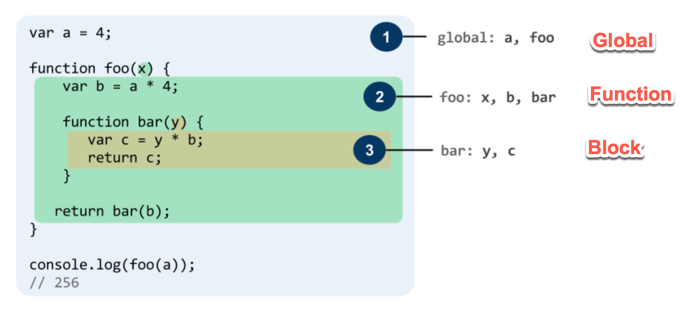
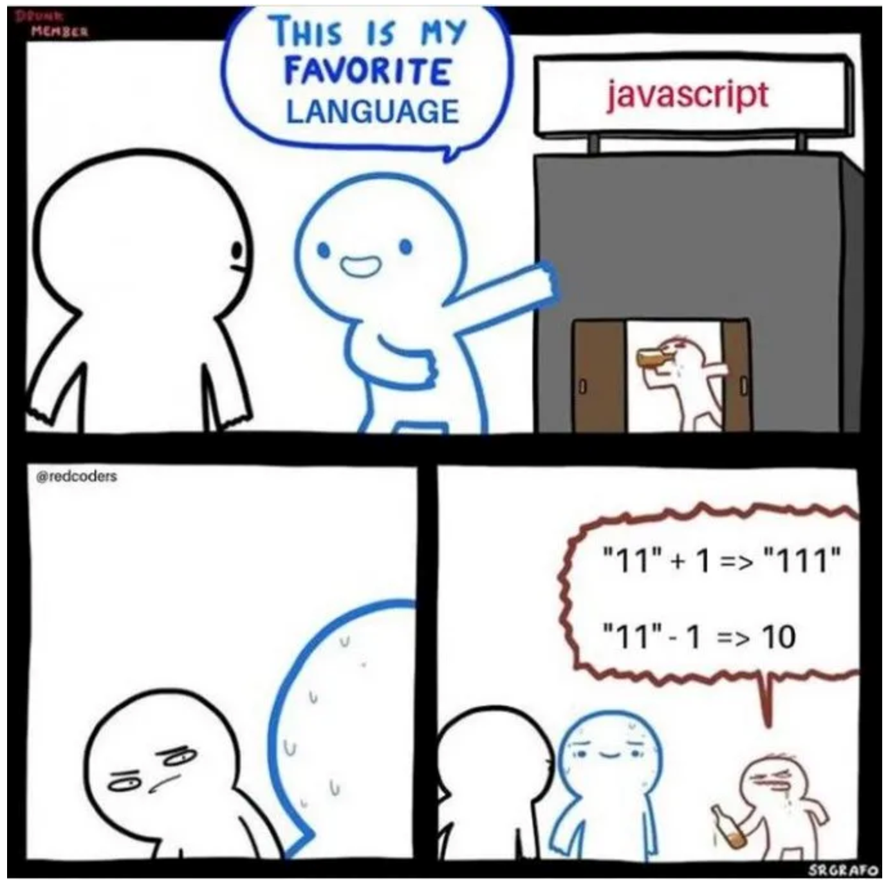

<style>
    .columns {
    display: flex;
  }
  .column {
    flex: 1;
    padding: 10px;
  }
  .column.large{
    flex: 2;
  }
  .small-font {
    font-size: 0.8em;
  }

  section > header,
section > footer {
  position: absolute;
  left: auto;
  right: 90px;
  height: 20px;
}

header {
  top: 30px;
}

footer {
  bottom: 30px;
}

</style>

# Chapter 2 JavaScript Essentials

## Lesson Overview

- Primitive data types
- string template
- null and undefined
- Data type conversion
  - Type inference and `typeof` operator
  - Implicit and explicit type conversion
- Operators
- Practical Technique: Set the default value of a variable 


## Variables

- Use variables to store values temporarily for later use.
- JS is a loosely typed (weakly) language, so you don't need to specify the data type of a variable when you declare it.
- JS determines the data type of a variable at runtime.
- Uninitialized variables have the value `undefined`.

### Declaring variables

- Declare a variable to allocate memory for it.
- You can declare a variable with different scopes using `let`, `const`, and `var`.


### Variable Scope

- Scope refers to the visibility of a variable in a program.
- Tree types of scope in JS: block, function, and global scope.



---

- Block Scope
  - Be visible only within the block in which it is declared.
  - declared using `let` and `const`.
- Function Scope
  - Be visible only within the function in which it is declared.
  - declared using `var`.
- Global Scope
  - Be visible throughout the program.
  - declared not in a block or a function (declared in the most outer scope).
  - No matter using `let`, `const`, or `var`.

### Best practice for declaring variables

- Use `let` to declare local variables in a block. (block scope).
- Use `const` to declare constants. (block scope)
- Use `var` to declare variables of the function scope.
- Initialize variables when you declare them to avoid `undefined` values.


<!-- the global variables become the properties of the window object. -->

---

Example:  Accessing variables with different scopes

```javascript
let count = 0; // global variable
function aFunction(){
  for (let i = 0; i < 10; i++) {
      var sum = 10; // function-scoped variable
      var user; // undefined variable
  }
  // accessible from outside the block
  console.log('sum(inside):', sum); 
  // undefined; accessible from outside the block.
  console.log('user: ', user); 
  // out of scope; ReferenceError: i is not defined. i is a block-scoped variable.
  console.log('i:', i);   
}

aFunction();
// accessible the global variable
console.log('count:', count); 
// Try to access the function-scoped variable; 
// out of scope; ReferenceError: sum is not defined. sum is block-scoped variable.
console.log('sum(outside):', sum); 
```
---
See full example in [ex_02_01](https://codepen.io/hychen39/pen/vYqKoaL)
 


See more: [Grammar and types - JavaScript | MDN](https://developer.mozilla.org/en-US/docs/Web/JavaScript/Guide/Grammar_and_types#declarations)


### Naming variables

Best practices:
- Use Intention-Revealing names for variables to show their purpose and make the code easier to read.
```js
let d = 0; // bad
let daysSinceCreation = 0; // good; self-explanatory
```
- Use camelCase for variable names, e.g., `ageOfBuyer`.
- Use Pronounceable names, e.g., `modificationTimestamp` instead of `modydhms`.


## Primitive data types

The primitive data type is a data type that is not an object and has no methods.

Available primitive data types:
- string, number, bigint, boolean, undefined, symbol, null
  - See [Primitive - MDN Web Docs Glossary: Definitions of Web-related terms | MDN](https://developer.mozilla.org/en-US/docs/Glossary/Primitive)
- they are all in lowercase
  - `string` is a primitive data type; `String` is an object.

### Immutability of primitive data types

- Primitive data types are **immutable**, meaning that their values cannot be changed once they are created. 
- But you can assign a new value to it.

```js
let str = "Hello";
str[0] = "h"; // Attempt to change the first character
console.log(str); // Output: "Hello" (unchanged)
```

### Primitive data types vs reference data types

The another difference between primitive and reference data types is that 
- primitive data types are stored in the **stack**, 
- while reference data types are stored in the **heap**.

<figure>


<figcaption> How JavaScript allocates memory location for different data types. <br/> Source: https://www.scientecheasy.com/2021/10/javascript-data-types.html/ </figcaption>
</figure>

### Auto-boxing of primitive data types to objects

- Primitives have no methods but still behave as if they do. 
  -  JS runtime automatically converts primitive values to objects when you call a method on them. 
  -  This is called **auto-boxing**.

Example: Convert a string to uppercase using the `toUpperCase()` method.
```js
let userName = "Alice";
// ALICE. A String wrapper object is created and then destroyed by auto-boxing.
console.log(userName.toUpperCase()); 
// Alice. The original value is not changed.
console.log(userName); 
```
---

Example: Convert a number to a string using the `toString()` method.
```js
let x = 10;
// Convert the number 10 to a base-2 string "1010"
console.log(x.toString(2));
```

See more: [Primitive - MDN Web Docs Glossary: Definitions of Web-related terms | MDN](https://developer.mozilla.org/en-US/docs/Glossary/Primitive)


### Comparing primitive data types by value

Primitives are also compared by value, not by reference.

Example of comparing by value:
```js
let x = 10; 
let y = 10;
console.log(x === y); // true. x and y have the same value but don't share the same memory location.
```

Example of comparing by reference:
```js
let a = [1, 2, 3]; 
let b = [1, 2, 3];
console.log(a === b); // false. a and b don't share the same memory location, although they have the same value.
let c = a;
console.log(a === c); // true. a and c share the same memory location.
```
[ex_02_02](https://codepen.io/hychen39/pen/vYqXYpv?)

## Summary of primitive data types
Primitive data types are:
- not objects and have no methods.
- immutable.
- stored in the stack.
- compared by value, not by reference.
- auto-boxed to objects when you call methods on them.

## `string` template

Use the string template to make your code:
- more readable
- allowing for multi-line strings
- embedding expressions in strings
- avoiding the `+` operator to concatenate strings.

---

- Use **backticks** to create a string template. 
- You can embed expressions in a string template using `${}`.

```js
let name = 'Alice';
let age = 20;
let message = `Hello, ${name}. You are ${age} years old.`;
console.log(message); // Hello, Alice. You are 20 years old.
```

The string template is more readable than using the `+` operator to concatenate strings.

```js
// Using the + operator to concatenate strings
// not recommended
let message = 'Hello, ' + name + '. You are ' + age + ' years old.';
console.log(message); // Hello, Alice. You are 20 years old.
```


## null and undefined

- `null` and `undefined` both represent an absence of value.
- `undefined` is used by **JS** to indicate an **uninitialized state**.
  - e.g. a variable that has been declared but not assigned a value.
  - e.g  a function that does not return anything.
- `null` is used by **programmers** to explicitly indicate "**no value**" or "**empty**".

Be careful with the two values:
- might cause unexpected results if you don't handle them properly.


## Data type conversion

### Type inference and `typeof` operator
- JS inferences the data type of a variable at runtime.

```js
let foo = 42;    // foo is a number
let foo = 'bar'; // foo is a string
let foo = true;  // foo is a boolean
let foo;        // foo is undefined
```

- When you want to know the data type of a variable at the runtime, use the `typeof` operator.

```js
let x = 10;
console.log(typeof x); // number
```

### Conversion between data types 

- Two different data types cannot be operated together. 
- You explicitly convert a data type to another (explicit type conversion) or 
- Let JS convert it automatically for you (implicit type conversion) according to the default rules.

- Example: What is the result of 1 + "1"?

```js
let result = 1 + "1";  // "11"
console.log(typeof result);  // string
```

- Example: What is the result of 1 - "1"?

```js
let result = 1 - "1";  // 0
console.log(typeof result);  // number
```

## Explicit type conversion

- Use the explicit type conversion to avoid unexpected results (Also showing your intention clearly).
- Data type conversion functions:
  - Use the `Number()`, `String()`, `Boolean()`, `BigInt()`, `Symbol()` functions to convert a value to a specific data type.
  - These are standard built-in functions in JS.

```js
let x = "1";
// Explicitly convert the string "1" to a number 1
let y =  1+ Number(x);  
console.log(y); // 2
```

### Convert a string to a number

- `Number()` vs `parseInt()` and `parseFloat()`

- When you want to convert a number string of base-10 to a number, use `Number()`.
  - e.g. Convert "101" to 101.

- When you want to convert a string of a specific radix to an integer or a floating-point number, use `parseInt()` and `parseFloat()`.
  - binary, octal, decimal, or hexadecimal strings => integer
  - e.g. Convert "11" to 3 in binary.
  
    
Example of using `parseInt()`:
```js
// parse the string "11" as a binary number and convert it to a decimal number
console.log(parseInt("11", 2));  // 3
// parse the string "11" as a hexadecimal number and convert it to a decimal number
console.log(parseInt("11", 16));  // 17
```

### Convert a number to a string

- Convert a number to a string of a specific base (radix) using the `toString()` method.
  - e.g. Convert the number 10 to a binary string "1010".


- Apply the `toString()` object method to convert a number to a string in a specific radix.
  - JS auto-boxes the `number` to a `Number` object when you call the `toString()` method.

```js
let x = 10;

// Wrap x in a Number object automatically and convert it to a string in binary: "1010"
console.log(x.toString(2));  // binary string "1010"

// Equivalent to the above code
console.log(Number(x).toString(2)); 
```

### Explicit conversion idioms

- You can use the **default conversion rules** of some operators to explicitly convert a value to a specific data type.
  - Save your time but make your code less readable.

- Convert to string:
  - ` x + ""`: convert x to a string. `+` is a binary operator (with two operands).
- Convert to number:
  - `+x` : convert x to a number. `+` is the unary operator: unary plus
  - `x-0` : convert x to a number. `-` is a binary operator: subtraction.
- Convert to boolean:
  - `!!x` : convert x to a boolean. `!` is the unary operator: logical NOT.

## Implicit type conversion

- JS can convert data types for you automatically when you operate or compare with two different data type values.
- The conversion rules depend on the operator or the context in which the conversion occurs.
- Introduce two most famous operators with special conversion rules: `+` and `==`.

### Conversion rules of the `+` operator

- Operator `+` (the operator with addition and string concatenation functions):
  - The `+` operator can perform two operations: **string concatenation** and **number addition**.
    - This is called **operator overloading**.
- Rules:
  - If one of the operands is a string, JS converts the other to a string and concatenates them.
  - Otherwise, JS tries to convert the non-number operand to a number and performs addition.


```js
console.log(2 + 2); // Expected output: 4

// Adding two numbers. "true" is converted to 1.
console.log(2 + true); // Expected output: 3

// Concatenating two strings. 2 is converted to "2".
console.log("2" + true); // Expected output: "2true"

// Concatenating two strings. 2 is converted to "2".
console.log(2 + "2"); // Expected output: "22"
```

Ref: [Addition (+) - JavaScript | MDN](https://developer.mozilla.org/en-US/docs/Web/JavaScript/Reference/Operators/Addition)

### Conversion rules of the equal operator `==`

- Operator `==`: Equality operator with type coercion (Also called the **loosely** equality operator)

- The `==` operator compares two values and returns `true` if they are equal.
  - If the two values have different data types, JS converts one to the other's data type.
    - This is called **type coercion**.
  - The `==` operator is not recommended because it can lead to unexpected results.
- Use the `===` operator (strict equality operator) to compare two values **without** type coercion.

### Examples of the `==` operator

```js
// true; Type Coercion: convert the string "1" to a number 1
console.log("1" == 1); 

 // true; Type coercion occurs: 
console.log(1 == "1");

// true; Type coercion occurs: convert the boolean false to a number 0
console.log(0 == false); 

// not perform type coercion between null and any other value except undefined.
console.log(0 == null); // false

//  not perform type coercion between null and any other value except undefined.
console.log(0 == undefined); // false
```
---

```js
// Explicitly convert null to boolean false before comparison
// !! is a conversion idiom to convert a value to a boolean.
// true. !!null is false -> false converted to 0 -> 0 == 0 is true
console.log(0 == !!null); 

// Explicitly convert undefined to boolean false before comparison
// !! is a conversion idiom to convert a value to a boolean.
// true. !!undefined is false -> false converted to 0 -> 0 == 0 is true
console.log(0 == !!undefined); 

// According to the ECMAScript specification, 
// null and undefined are only equal to themselves and each other. 
console.log(null == undefined); // true
```

Ref: See [Equality (==) - JavaScript | MDN](https://developer.mozilla.org/en-US/docs/Web/JavaScript/Reference/Operators/Equality) for the detailed rules of the `==` operator.

### Best Practice for comparing values

- Always use the strict equality operator `===` to compare two values without type coercion.
- **Do not rely on the default type coercion rules if you want to write clear and predictable code.**

---

Programming meme about the implicit type conversion in JS:



### Summary of the implicit conversion rules


Source: Flanagan, D. 2011, JavaScritp: The Definitive Guide, 6th Edition, p46., O'Reilly

## Operators 

- Various kinds of operators in JS:
  - Arithmetic operators: `+`, `-`, `*`, `/`, `%`(modulus) , `++` (increment), `--` (decrement), `**` (exponentiation)
  - Assignment operators: `=`, `+=`(Addition assignment) , `-=`, `*=`, `/=`, `%=`, `**=`
  - Comparison operators: `==`, `===`, `!=`, `!==`, `>`, `<`, `>=`, `<=`
  - Logical operators: `&&` (AND), `||` (OR), `!` (NOT)

---

- Pay attention to the differences between the prefix and postfix increment and decrement operators.
  - `++x` and `x++` are different.

Example:
```js
let x = 1;
// x is incremented after the value is logged.
console.log(x++); // 1; 
// x is incremented after the value is logged.
console.log(x); // 2; 

let y = 1;
// y is incremented before the value is logged.
console.log(++y); // 2; 
y is incremented before the value is logged.
console.log(y); // 2; 
```

---

Please read the section on the operators in Chapter 2 of the textbook.

See more: [Expressions and operators - JavaScript | MDN](https://developer.mozilla.org/en-US/docs/Web/JavaScript/Reference/Operators)

## Practical Technique: Set the default value of a variable when your source is `null` or `undefined`

- You often set a value to a variable according to the value of another variable.
- When the source variable is `null` or `undefined`, you want to set a default value to the target variable.
- Consider the following example:

```js
function greet(name) {
    // parameter name might be null or undefined
    let userName = name;
    console.log(`Hello, ${userName}`);
}
```

### Set default value using the `||` or `??` operators

Handling only `null` and `undefined`:  
- use the `??` operator (nullish coalescing operator) to set a default value only when the source value is `null` or `undefined`. 
  - Default a value when the source value is `null`
- The above example can be rewritten as follows:

Example: set a default to the function parameter to avoid the `null` or `undefined` value.
```js
function greet(name) {
    // parameter name might be null or undefined
    // set the default value to "Guest" when name is null or undefined
    let userName = name ?? "Guest";
    console.log(`Hello, ${userName}`);
}
```

---

Handling the falsy values `null`, `undefined`, `0`, `false`, `""`:
- use the logical OR operator `||` to set a default value when the source value is falsy. 
- falsy values are those that are considered false in a Boolean context.

Example: set a default to the function parameter to avoid the falsy values.
```js
function greet(name) {
    // parameter name might be falsy (null, undefined, empty string, 0, false)
    // set the default value to "Guest" when name is falsy
    let userName = name || "Guest";
    console.log(`Hello, ${userName}`);
}

// Test cases
greet("Alice");      // Output: Hello, Alice
greet("");           // Output: Hello, Guest
greet(null);         // Output: Hello, Guest
greet(undefined);    // Output: Hello, Guest
greet(0);           // Output: Hello, Guest
greet(false);       // Output: Hello, Guest
```
---

Ref: [The Ultimate Guide to Default Values in JavaScript: || and ?? Operators Explained](https://phillcode.io/the-ultimate-guide-to-default-values-in-javascript-and-operators-explained)

## Summary

- Declaring and naming variables
- Primitive data types: string, number, bigint, boolean, undefined, symbol, null
- null vs undefined
- Data type conversion: explicit and implicit
- Operators: arithmetic, assignment, comparison, logical

  
## Symbol data type (Optional)

- A symbol is a unique and immutable data type  
- It is often used as an object property key to avoid being overwritten by other programs.
- Be available after ES6.

### Create public and private symbols

- Create a **private** symbol by using the `Symbol('optional_description')` function.
  - Each symbol is unique, even if they have the same description.

- Create a **public** symbol by using the `Symbol.for('key')` function.
  - If a symbol with the same key already exists, it returns the existing symbol.
  - Shareable symbols are stored in the **global symbol registry.**


---

```js
//Create a private symbol
privateId = Symbol('id');

// create a public in the public symbol registry
sharedId = Symbol.for('id');

console.log(privateId === sharedId); 

// Get the symbol by key from the public symbol registry
retrievedId = Symbol.for('id');
console.log(retrievedId === sharedId);
```

Ref: [Symbol - JavaScript | MDN](https://developer.mozilla.org/en-US/docs/Web/JavaScript/Reference/Global_Objects/Symbol)

### Advanced Reading: Using the symbol data type to create private properties

Example of object properties that are overwritten by other programs:
```js
// Define an object with a property
let user = {
  name: "John Doe"
};

console.log(user.name); // Output: John Doe
```

--- 

```js 
// Later in the code or in another script, the property is overridden
user.name = "Jane Doe";

console.log(user.name); // Output: Jane Doe
```

```js
// Another example, a third-party library might modify the object
function updateUser(user) {
  // A function from a library that modifies the user object
  user.name = "Library User";
}

updateUser(user);

console.log(user.name); // Output: Library User
```
---

Example of using a symbol to create a private property:
```js
// Create a unique symbol
const uniqueName = Symbol('name');

// Define an object using the symbol as a property key
let user = {
  [uniqueName]: "John Doe"
};

console.log(user[uniqueName]); // Output: John Doe
```
---

```js
// Even if another part of the code or a library tries to set 'name' property,
//It won't affect the unique symbol property
user.name = "Jane Doe";
console.log(user.name); // Output: Jane Doe
console.log(user[uniqueName]); // Output: John Doe

// Another script or library using a symbol with the same description
// will not override the original property, as each symbol is unique
const anotherUniqueName = Symbol('name');
user[anotherUniqueName] = "Library User";

console.log(user[uniqueName]); // Output: John Doe
console.log(user[anotherUniqueName]); // Output: Library User
```

<script>
    // add the following script at the end of your marp slide file.
    const h2s = document.querySelectorAll('h2');
    h2s.forEach(function(h2, idx){
        h2.innerHTML = `<span class="small-font">${idx + 1}</span> ${h2.innerHTML}`
    })
</script>