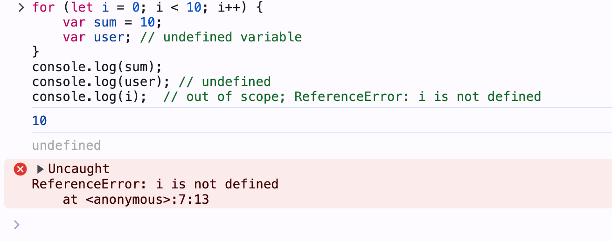
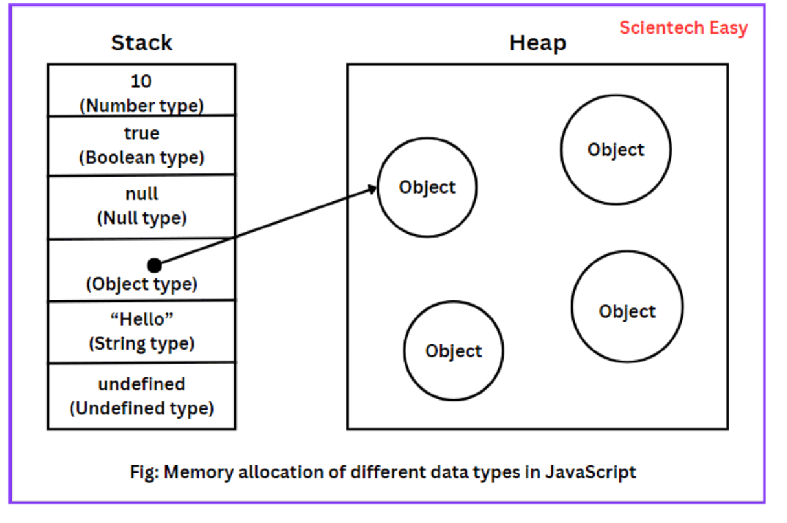
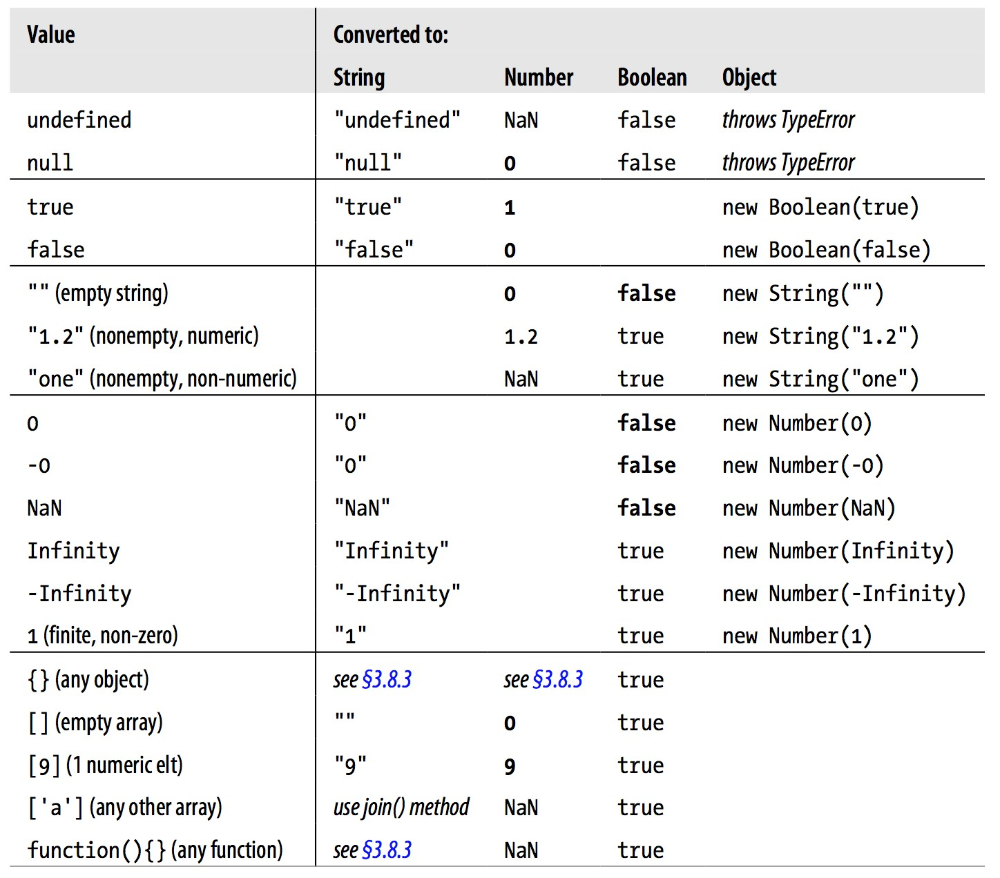

# Chapter 2 JavaScript Essentials

## 2.1 Variables

- Use variables to store values temporarily for later use.
- JS is a loosely typed (weakly) language, so you don't need to specify the data type of a variable when you declare it.
- JS determines the data type of a variable at runtime.
- Uninitialized variables have the value `undefined`.

### Declaring variables

Best practice for declaring variables:
- Use `let` to declare local variables in a block. (block scope).
- Use `const` to declare constants.
- Use `var` to declare variables of the function scope.
- Initialize variables when you declare them to avoid `undefined` values.
- Any variables that are declared outside of a function are global variables, no matter using `let`, `const`, or `var`.

---

Examples of declaring a global variable in a block:

```javascript
let count = 0; // global variable
function aFunction(){
  for (let i = 0; i < 10; i++) {
      var sum = 10;
      var user; // undefined variable
  }
  console.log(sum); // accessible from outside the block
  console.log(user); // undefined; accessible from outside the block.
  console.log(i);  // out of scope; ReferenceError: i is not defined. i is block-scoped variable. 
}
console.log(count); // accessible from outside the block
console.log(sum); // out of scope; ReferenceError: sum is not defined. sum is block-scoped variable.
```
See full example in [ex_02_01](https://codepen.io/hychen39/pen/vYqKoaL)

--- 



See more: [Grammar and types - JavaScript | MDN](https://developer.mozilla.org/en-US/docs/Web/JavaScript/Guide/Grammar_and_types#declarations)


### Naming variables

Best practices:
- Use Intention-Revealing names for variables to show their purpose and make the code easier to read.
```js
let d = 0; // bad
let daysSinceCreation = 0; // good; self-explanatory
```
- Use camelCase for variable names, e.g., `ageOfBuyer`.
- Use Pronounceable names, e.g., `modificationTimestamp` instead of `modydhms`.


## 2.2 Primitive data types

Primitive data type is a data type that is not an object and has no methods..

Available primitive data types:
- string, number, bigint, boolean, undefined, symbol, null
  - See [Primitive - MDN Web Docs Glossary: Definitions of Web-related terms | MDN](https://developer.mozilla.org/en-US/docs/Glossary/Primitive)
- they all in lowercase
  - `string` is a primitive data type; `String` is an object.

---

Primitive data types are immutable, meaning that their values cannot be changed. But, you can assign a new value to it.

```js
let x = 10;
x.toFixed(2);  // Auto-boxing: converts x to a Number object
console.log(x); // 10. x is still a primitive value. 
x = 12;  
console.log(x); // 12. Although you cannot change the value of x, you can assign a new value to x.
```

---

The another difference between primitive and reference data types is that primitive data types are stored in the stack, while reference data types are stored in the heap.

<figure>



<figcaption> How JavaScript allocates memory location for different data types. <br/> Source: https://www.scientecheasy.com/2021/10/javascript-data-types.html/ </figcaption>
</figure>

---

Primitives have no methods but still behave as if they do. This is because JS automatically converts primitive values to objects when you call a method on them. This is called **auto-boxing**.

```js
let userName = "Alice";
console.log(userName.toUpperCase()); // ALICE. A String wrapper object is created and then destroyed by auto-boxing.
console.log(userName); // Alice. The original value is not changed.
```

See more: [Primitive - MDN Web Docs Glossary: Definitions of Web-related terms | MDN](https://developer.mozilla.org/en-US/docs/Glossary/Primitive)

---

Primitives are also compared by value, not by reference.

Example of comparing by value:
```js
let x = 10; 
let y = 10;
console.log(x === y); // true. x and y have the same value but don't share the same memory location.
```

Example of comparing by reference:
```js
let a = [1, 2, 3]; 
let b = [1, 2, 3];
console.log(a === b); // false. a and b don't share the same memory location, although they have the same value.
let c = a;
console.log(a === c); // true. a and c share the same memory location.
```
[ex_02_02](https://codepen.io/hychen39/pen/vYqXYpv?)

## 2.3 `string` template

Use backticks to create a string template. You can embed expressions in a string template using `${}`.

```js
let name = 'Alice';
let age = 20;
let message = `Hello, ${name}. You are ${age} years old.`;
console.log(message); // Hello, Alice. You are 20 years old.
```
---

The string template is more readable than using the `+` operator to concatenate strings.

```js
// Using the + operator to concatenate strings
// not recommended
let message = 'Hello, ' + name + '. You are ' + age + ' years old.';
console.log(message); // Hello, Alice. You are 20 years old.
```

## 2.4 Symbol data type (Optional)

- A symbol is a unique and immutable data type  
- It is often used as an object property key to avoid from being overwritten by other programs.
- Be available after ES6.

### Create public and private symbols

- Create a **private** symbol by using the `Symbol('optional_description')` function.
  - Each symbol is unique, even if they have the same description.

- Create a **public** symbol by using the `Symbol.for('key')` function.
  - If a symbol with the same key already exists, it returns the existing symbol.
  - Shareable symbols are stored in the **global symbol registry.**


---

```js
// create a private symbol
privateId = Symbol('id');

// create a public in the public symbol registry
sharedId = Symbol.for('id');

console.log(privateId === sharedId); 

// Get the symbol by key from the public symbol registry
retrievedId = Symbol.for('id');
console.log(retrievedId === sharedId);
```

Ref: [Symbol - JavaScript | MDN](https://developer.mozilla.org/en-US/docs/Web/JavaScript/Reference/Global_Objects/Symbol)

### Advanced Reading: Using the symbol data type to create private properties

Example of object properties that are overwritten by other programs:
```js
// Define an object with a property
let user = {
  name: "John Doe"
};

console.log(user.name); // Output: John Doe
```

--- 

```js 
// Later in the code or in another script, the property is overridden
user.name = "Jane Doe";

console.log(user.name); // Output: Jane Doe
```

```js
// Another example, a third-party library might modify the object
function updateUser(user) {
  // A function from a library that modifies the user object
  user.name = "Library User";
}

updateUser(user);

console.log(user.name); // Output: Library User
```
---

Example of using a symbol to create a private property:
```js
// Create a unique symbol
const uniqueName = Symbol('name');

// Define an object using the symbol as a property key
let user = {
  [uniqueName]: "John Doe"
};

console.log(user[uniqueName]); // Output: John Doe
```
---

```js
// Even if another part of the code or a library tries to set 'name' property,
// it won't affect the unique symbol property
user.name = "Jane Doe";
console.log(user.name); // Output: Jane Doe
console.log(user[uniqueName]); // Output: John Doe

// Another script or library using a symbol with the same description
// will not override the original property, as each symbol is unique
const anotherUniqueName = Symbol('name');
user[anotherUniqueName] = "Library User";

console.log(user[uniqueName]); // Output: John Doe
console.log(user[anotherUniqueName]); // Output: Library User
```

## 2.5 null and undefined

- `null` and `undefined` both represent absence of value.
- `undefined` is used by JS to indicate an uninitialized state.
  - e.g. a variable that has been declared but not assigned a value.
  - e.g  a function that does not return anything.
- `null` is used by programmers to explicitly indicate "no value" or "empty".


## 2.6 Data type conversion

### Type inference and `typeof` operator
- JS inferences the data type of a variable at runtime.

```js
let foo = 42;    // foo is a number
let foo = 'bar'; // foo is a string
let foo = true;  // foo is a boolean
let foo;        // foo is undefined
```

- When you want to know the data type of a variable, use the `typeof` operator.

```js
let x = 10;
console.log(typeof x); // number
```

### Conversion between data types 

- Two different data types cannot be operated together. 
- You explicitly convert a data type to another (explicit type conversion) or 
- Let JS convert it automatically for you (implicit type conversion) according to the default rules.


- Example: What is the result of 1 + "1"?

```js
let result = 1 + "1";  // "11"
console.log(typeof result);  // string
```

- Example: What is the result of 1 - "1"?

```js
let result = 1 - "1";  // 0
console.log(typeof result);  // number
```

### Explicit type conversion

- Data type conversion functions:
  - Use the `Number()`, `String()`, `Boolean()`, `BigInt()`, `Symbol()` functions to convert a value to a specific data type.
  - These are standard built-in functions in JS.

```js
let x = "1";
let y =  1+ Number(x);  
console.log(y); // 2
```

### Convert a string to a number

- `Number()` vs `parseInt()` and `parseFloat()`
  - `Number()` converts a value to a number in 10 radix.
  - Use `parseInt()` and `parseFloat()` to convert a string to an integer or a floating-point number in a specific radix.

```js
// parse the string "11" as a binary number and convert it to a decimal number
console.log(parseInt("11", 2));  // 3
// parse the string "11" as a hexadecimal number and convert it to a decimal number
console.log(parseInt("11", 16));  // 17
```

### Convert a number to a string


- Apply `toString()` to convert a number to a string in a specific radix.
  - Use it when you want to convert a number to a string in a specific radix.
  - Example: Convert the number 10 to a string in binary.
  - JS auto-boxes the `number` to a `Number` object when you call the `toString()` method.

```js
let x = 10;

// Wrap x in a Number object and convert it to a string in binary: "1010"
console.log(x.toString(2));  
```

### Explicit conversion idioms

- You can use the default conversion rules of some operators to explicitly convert a value to a specific data type.
  - Save your time but make your code less readable.

- Number to string conversion:
  - ` x + ""` : convert x to a string. `+` is a binary operator.
  - `+x` : convert x to a number. `+` is the unary operator: unary plus
  - `x-0` : convert x to a number. `-` is the binary operator: subtraction.
  - `!!x` : convert x to a boolean. `!` is the unary operator: logical NOT.


### Implicit type conversion

- JS can convert data types for you automatically when you operate with two different data types.
- The conversion rules depend on the operator or the context in which the conversion occurs.
- Introduce two most famous operators with special conversion rules: `+` and `==`.

### Conversion rules of the `+` operator

- Operator `+` (addition operator):
  - The `+` operator can perform two operations: string concatenation and addition.
    - This is called **operator overloading**.
  - If one of the operands is a string, JS converts the other operand to a string and concatenates them.
  - If both operands are numbers, JS adds them.


```js
console.log(2 + 2); // Expected output: 4
console.log(2 + true); // Expected output: 3
console.log("2" + true); // Expected output: "2true"
```

Ref: [Addition (+) - JavaScript | MDN](https://developer.mozilla.org/en-US/docs/Web/JavaScript/Reference/Operators/Addition)

### Conversion rules of the `==` operator

- Operator `==`: Equality operator with type coercion (Also called the loosely equality operator)
  - The `==` operator compares two values and returns `true` if they are equal.
  - If the two values have different data types, JS converts one of them to the other's data type.
    - This is called **type coercion**.
  - The `==` operator is not recommended because it can lead to unexpected results.
  - Use the `===` operator (strict equality operator) to compare two values **without** type coercion.

### Examples of the `==` operator

```js
// true; Type Coercion: convert the string "1" to a number 1
console.log("1" == 1); 

 // true; Type coercion occurs: 
console.log(1 == "1");

// true; Type coercion occurs: convert the boolean false to a number 0
console.log(0 == false); 

// not perform type coercion between null and any other value except undefined.
console.log(0 == null); // false

//  not perform type coercion between null and any other value except undefined.
console.log(0 == undefined); // false
```
---

```js
// Explicitly convert null to boolean false before comparison
// !! is a conversion idiom to convert a value to a boolean.
// true. !!null is false -> false converted to 0 -> 0 == 0 is true
console.log(0 == !!null); 

// Explicitly convert undefined to boolean false before comparison
// !! is a conversion idiom to convert a value to a boolean.
// true. !!undefined is false -> false converted to 0 -> 0 == 0 is true
console.log(0 == !!undefined); 

// According to the ECMAScript specification, 
// null and undefined are only equal to themselves and each other. 
console.log(null == undefined); // true
```

Ref: [Equality (==) - JavaScript | MDN](https://developer.mozilla.org/en-US/docs/Web/JavaScript/Reference/Operators/Equality)

### Best Practice for using the `==` operator

- Always use the strict equality operator `===` to compare two values without type coercion.
- **Do not rely on the default type coercion rules if you want to write clear and predictable code.**

---

Programming meme about the implicit type conversion in JS:


If you are really serious about these kinds of memes, please visit:
[Javascript vs memes](https://dev.to/damxipo/javascript-versus-memes-explaining-various-funny-memes-2o8c)

### Summary of the implicit conversion rules



Source: Flanagan, D. 2011, JavaScritp: The Definitive Guide, 6th Edition, p46., O'Reilly

## 2.7 Operators 

- Various kinds of operators in JS:
  - Arithmetic operators: `+`, `-`, `*`, `/`, `%`(modulus) , `++` (increment), `--` (decrement), `**` (exponentiation)
  - Assignment operators: `=`, `+=`(Addition assignment) , `-=`, `*=`, `/=`, `%=`, `**=`
  - Comparison operators: `==`, `===`, `!=`, `!==`, `>`, `<`, `>=`, `<=`
  - Logical operators: `&&` (AND), `||` (OR), `!` (NOT)

Please read the section of operator in the Chapter 2 of the textbook.

See more: [Expressions and operators - JavaScript | MDN](https://developer.mozilla.org/en-US/docs/Web/JavaScript/Reference/Operators)

## 2.8 Practical Technique: Set the default value of a variable when your source is `null` or `undefined`

- very often, you set a value to a variable according to the value of another variable.
- When the source variable is `null` or `undefined`, you want to set a default value to the target variable.
- Consider the following example:

```js
function greet(name) {
    // parameter name might be null or undefined
    let userName = name;
    console.log(`Hello, ${userName}`);
}
```
### Set default value using the `||` or `??` operators

- use the `||` operator to set a default value when the source value is falsy. (Default a value when the source value is `null`, `undefined`, `0`, `false`, `""`) 
- use the `??` operator (nullish coalescing operator) to set a default value only when the source value is `null` or `undefined`. (Default a value when the source value is `null`)
- The above example can be rewritten as follows:

```js
function greet(name) {
    // parameter name might be null or undefined
    // set the default value to "Guest" when name is null or undefined
    let userName = name ?? "Guest";
    console.log(`Hello, ${userName}`);
}
```

Ref: [The Ultimate Guide to Default Values in JavaScript: || and ?? Operators Explained](https://phillcode.io/the-ultimate-guide-to-default-values-in-javascript-and-operators-explained)

## Summary

- Declaring and naming variables
- Primitive data types: string, number, bigint, boolean, undefined, symbol, null
- null vs undefined
- Data type conversion: explicit and implicit
- Operators: arithmetic, assignment, comparison, logical
