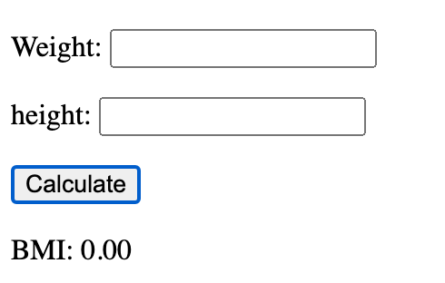
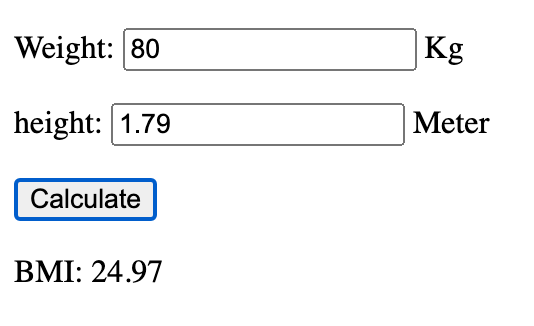

# Lab 02_01 BMI Calculator

Create an HTML page that calculates the Body Mass Index (BMI) of a person. The page should have the following elements:

- An input field for the weight in kilograms.
- An input field for the height in meters.
- A button to calculate the BMI.
- An area to display the result. The result should contain two decimal places.

The formula to calculate the BMI is:

```
BMI = weight / (height * height)
```

Write a function that calculates the BMI and return the result. 
The function should set the default value 1 to the height and default value 0 to the weight.


## Steps

### Step 1 Create the HTML page with the required elements.

```html
<body>
<div>
    <p> <label for="weight">Weight:</label> <input type="text" id="weight" /> Kg </p>
    <p> <label for="height">height:</label> <input type="text" id="height" /> Meter </p>
    <p> <button id="calculate">Calculate</button> </p>
    <p> <label for="bmi">BMI:</label> <span id="bmi"></span> </p>
</div>
</body>
```

### Step 2 Create the function to calculate the BMI.

```javascript
function calBMI(weight, height) {
        const w = Number(weight) || 0;
        const h = Number(height) || 1;
        const bmiValue = w / (h * h);
        return bmiValue.toFixed(2);
    }
```

### Step 3 Create the function to get the values from the input fields and display the result.

```javascript
 function displayBMI() {
        const weight = document.getElementById('weight').value;
        const height = document.getElementById('height').value;
        const bmi = calBMI(weight, height);
        document.getElementById('bmi').textContent = bmi;
    }
```

### Step 4 Add the event listener to the button.

Modify the button element to add the event listener.

```html
<button id="calculate" onclick="displayBMI()">Calculate</button>
```

### Step 5 Test the page.



