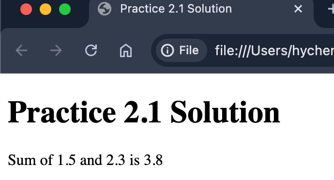

  
# Practice for Chapter 2

## Practice 2-1

Author an HTML page. Prompt the user for two numbers. 
Then, display the sum of the two numbers on the page, not in an alert box.

If the user enters nothing or a non-numeric value, default to 0.
Do not use the if statement in this practice.

The JS code can be in the HTML or external JS files.

Sample screenshot:



## Practice 2-2

Consider the following code snippet:

```js
let x = 10;
console.log(typeof !!x) 
```

What is the output of the code snippet?
Please explain why the output is the way it is.

## Practice 2-3

Explain the difference between `==` and `===` in JavaScript.

## Practice 2-4

What can the `||` operator do besides logical OR?
Illustrate with an example.

## Practice 2-5

Explain (1) how come `1 + 2 + "3"` is `"33"` in JavaScript and 
(2) how come `1 + 2 - "3"` is `0`.


  
