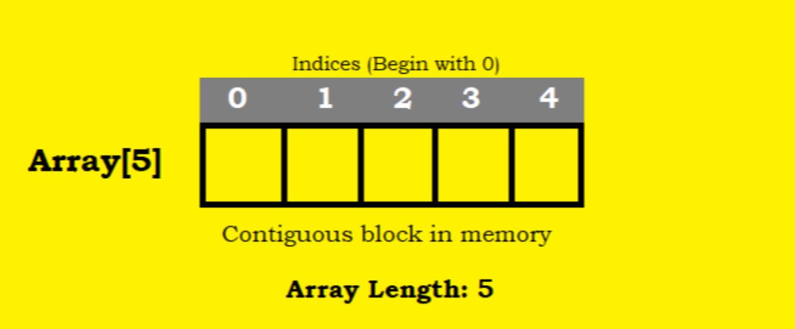
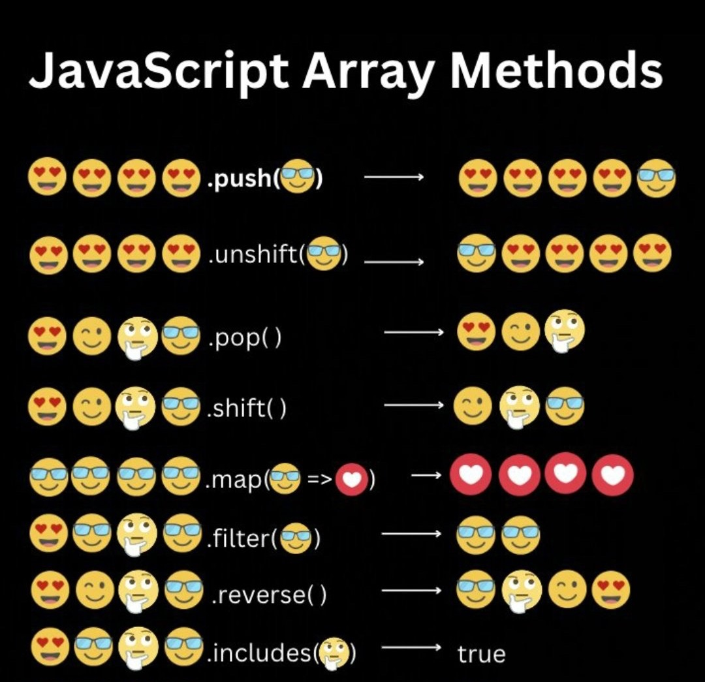
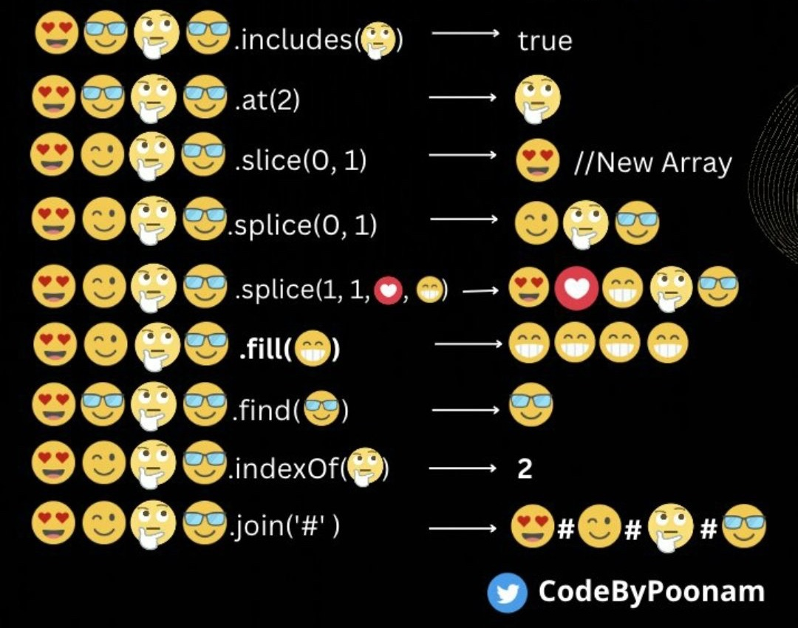
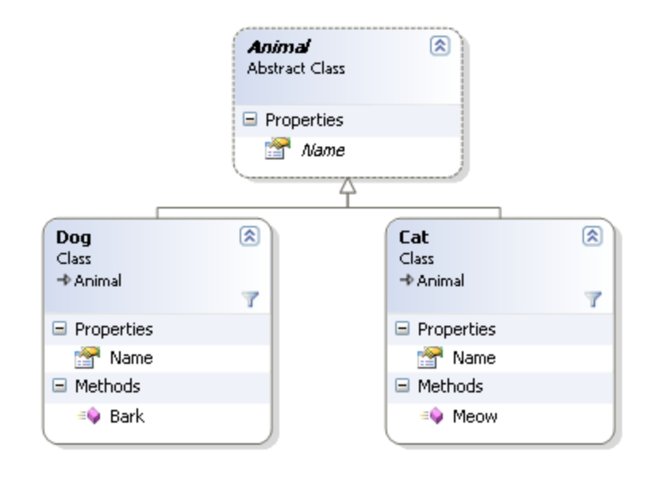
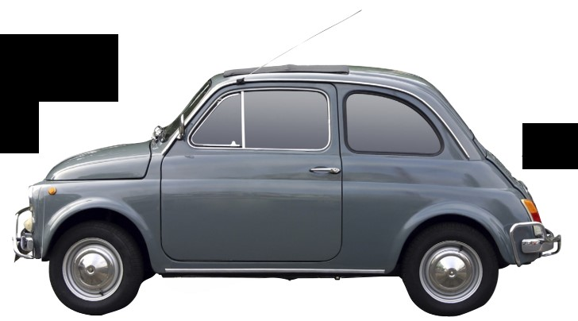
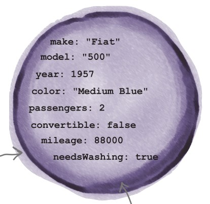
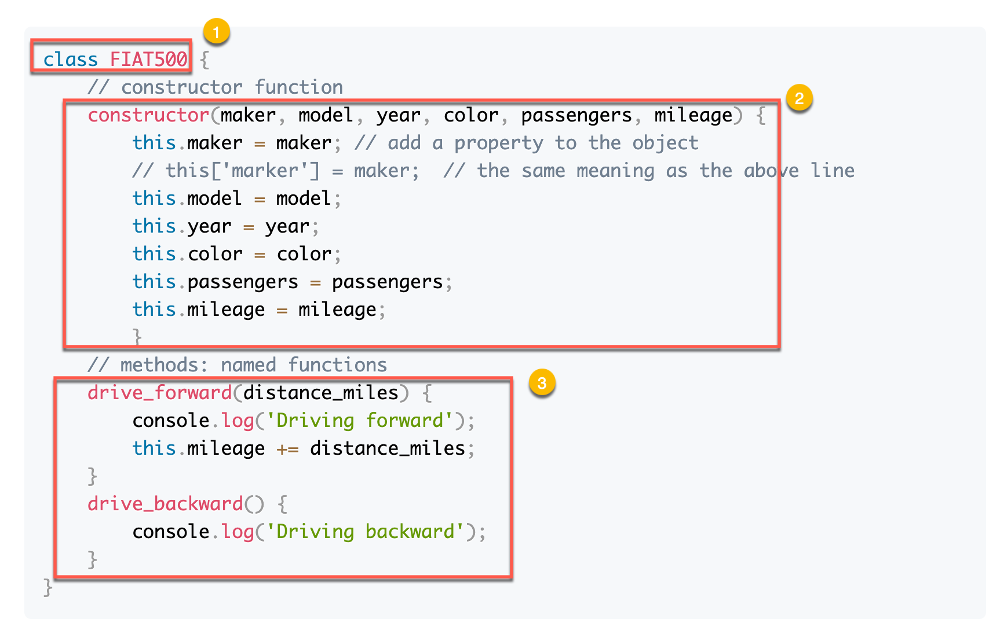
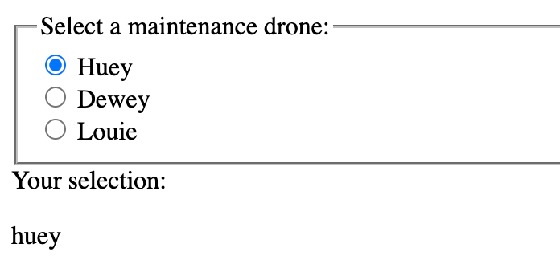
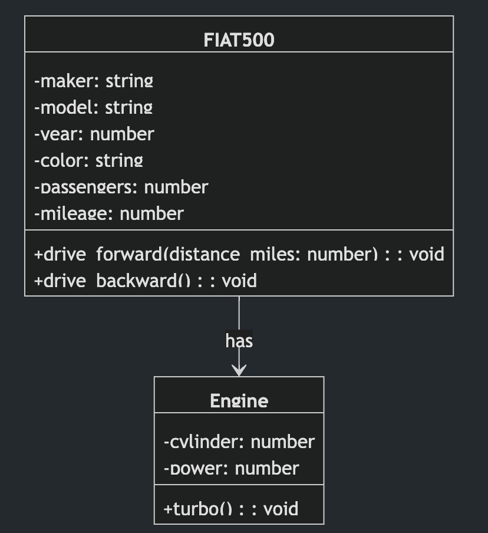
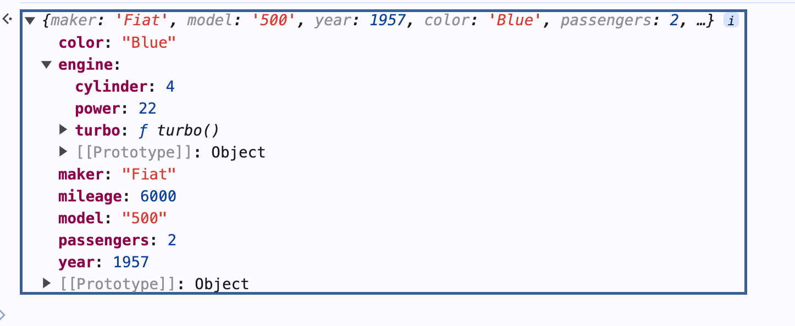

<style>
    .columns {
    display: flex;
  }
  .column {
    flex: 1;
    padding: 10px;
  }
  .column.large{
    flex: 2;
  }
  .small-font {
    font-size: 0.8em;
  }

  section > header,
section > footer {
  position: absolute;
  left: auto;
  right: 90px;
  height: 20px;
}

header {
  top: 30px;
}

footer {
  bottom: 30px;
}

</style>

# Chapter 3 Javascript Multiple Values: <br/> Arrays and Objects

## Lesson Objectives

A multiple-Value variable is the variable (or the object) that can store more than one value. 

This chapter discusses two types of multiple-value variables in JavaScript: Arrays and Objects in fundamental. 

The following topics are covered in this chapter:
- Arrays and their properties
- Array methods
- Multidimensional arrays 
- Objects
- Working with objects and arrays

## 3.1 Arrays and their properties

An array is an object that save a list of values in the memory. 
- Values are stored in the contiguous memory locations
- The values are indexed; the index starts from 0

<figure>



<figcaption>

Figure 3.1: An array is a list of values.     
Source: [JavaScript Arrays: A Beginner's Guide – TecAdmin](https://tecadmin.net/javascript-arrays/)

</figcaption>

</figure>

### Basic operations on arrays

Basic operations on arrays include:
- Creating an array
- Accessing array elements
- Modifying array elements (adding, deleting, and updating)
- Get the length of an array
- Iterating through an array

## 3.2 Creating an array

Array Literal, Array Constructor, Array.of(), Array.from()

### Array Literal
Use the array literal `[]` to create an array. 
- Ofter use when creating an empty array or an array with a list of values known in advance.

```javascript
let colors = [];   // create an empty array
let colors = ['red', 'green', 'blue'];  // create an array with three elements
```

### Add elements from an other array in the array literal: Spread Operator (ES6)

The spread operator `...` can spread the array elements into a list of elements. 

These element can be used in the array literal to create a new array. 

Example 1: Extend the `moreColors` array with the `basicColors` array.
```javascript
let basicColors = ['red', 'green', 'blue'];

// Equivalent to let moreColors = ['yellow', 'purple', 'red', 'green', 'blue'];
let moreColors = ['yellow', 'purple', ...basicColors]; 

// ['yellow', 'purple', 'red', 'green', 'blue']
console.log(moreColors);  
```


### Characteristics of the spread operator `...` 
- Copy: Copy the elements of the array when spreading.
  - Modify the original array does not affect the new array, and vice versa.
- Shallow copy: Only copy scalar or reference values of the array elements.
  - That means the nested objects are shared between the original and the new array.

Example 2: Shallow copy of the `basicColors` array.
    
```javascript
let basicColors = ['red', 'green', 'blue'];

// ...basicCopy shallowly copy of the basicColors array
let moreColors = ['yellow', 'purple', ...basicColors];

basicColors[0] = 'black';
console.log(basicColors);  // ['black', 'green', 'blue']
console.log(moreColors);  // ['yellow', 'purple', 'red', 'green', 'blue']
```

### Array constructor

- Limitation of the Array literal 
  - Be convenient to create an empty array or an array with a list of values.
- What if we want to create an array dynamically? 
  - e.g. create an array of length $n$ with all elements are `undefined`.
- Array constructor `Array(n)` is the right choice in this case.

Example 3: Create an array of length 5 with empty slots.

```javascript
// let emptyArray = Array(5);  // the new keyword is optional
let emptyArray = new Array(5);
console.log(emptyArray);  // [ <5 undefined items> ]
```

### Initialize an array with the array constructor

You can also pass a list of arguments to the array constructor to create an array with the elements.

```javascript
let basicColors = new Array('red', 'green', 'blue');
console.log(basicColors);  // ['red', 'green', 'blue']
```

The `Array()` constructor accept variable-length arguments.
So, you can copy the elements of an array to a new array using the `Array()` constructor.

Example 4: Copy an array to create a new one:
```javascript
let basicColors = ['red', 'green', 'blue'];
let moreColors = new Array(...basicColors);
console.log(moreColors);  // ['red', 'green', 'blue']
```

### The trap of the array constructor

However, be careful about the trap of the array constructor:
- Cannot create an array of single integer value.
- If only one argument is passed and it is an integer, the array constructor creates an array of length `n` with empty slots.

For example, we want to create the array `[5]` and use the following code:
```javascript
let numbers = new Array(5);  // create an array of length 5
console.log(numbers);  // [ <5 empty items> ]
```
The first statement creates an array of length 5 with empty slots, not `[5]`.

### Array.of() method: Create an array from a list of values

If you want to avoid the trap of the array constructor, use the `Array.of()` method when creating an array with a list of values.

```javascript
let numbers = Array.of(5);  // create an array with one element 5
console.log(numbers);  // [5]
let basicColors = Array.of('red', 'green', 'blue');
```

You can copy an array to create a new one using the `Array.of()` method.

```javascript
let basicColors = ['red', 'green', 'blue'];
let moreColors = Array.of('orange', 'black', ...basicColors);
console.log(moreColors);  // ['orange', 'black', 'red', 'green', 'blue']
```

See more about the `Array.of()` method in the MDN web docs: [Array.of() - JavaScript | MDN](https://developer.mozilla.org/en-US/docs/Web/JavaScript/Reference/Global_Objects/Array/of)


### Array.from() method: Convert an array-like object or an iterable object to an array

This method creates a new array by iterating an array-like object or an iterable object.

Example 5: Convert an array-like object to an array.

```javascript
let arrayLike = {0: 'red', 1: 'green', 2: 'blue', length: 3};
let colors = Array.from(arrayLike);
console.log(colors);  // ['red', 'green', 'blue']
```

We will cover this method later. 

See more about the `Array.from()` method in the MDN web docs: [Array.from() - JavaScript | MDN](https://developer.mozilla.org/en-US/docs/Web/JavaScript/Reference/Global_Objects/Array/from#description)

### Concept: Array-like object

Array-like object is an object that has the **length property** and **indexed elements**.
- It behaves like an array but does not have all the array methods.

Example 6: An array-like object `arrayLike` with the `length` property and indexed elements.
```js
let arrayLike = {
  0: 'red',
  1: 'green',
  2: 'blue',
  length: 3
};
```

--- 

Other examples of the array-like object:
- NodeList and HTMLCollection objects in DOM.
- The `arguments` object in a function.

See more in [Array - JavaScript | MDN](https://developer.mozilla.org/en-US/docs/Web/JavaScript/Reference/Global_Objects/Array)


### Concept: Iterable Object

An iterable object in JavaScript is an object that can be iterated over using a `for...of` loop.

Common Iterable Objects:
- Arrays, Strings, Maps, Sets, NodeLists (from DOM queries)

Example 7: iterating over an array using the `for...of` loop.

```js
let iterable = [10, 20, 30];

for (let value of iterable) {
  console.log(value);
}
```

## 3.3 Accessing array elements

### Access by index: the square brackets `[]`

Use the square brackets `[n]` where `n` is the index of the element after the array name to access the elements of an array
- n is an integer starting from 0
- return undefined if the index is out of the range of the array

Example 8: Accessing the first element of the `basicColors` array.

```javascript
let basicColors = ['red', 'green', 'blue'];
console.log(basicColors[0]);  // red
console.log(basicColors[-1]);  // undefined
console.log(basicColors[4]);  // undefined
```

### No out-of-bound error

- When you try to query a nonexistent property of any object, you don’t get an error; 
  - you simply get **undefined**

### Indexes other than non-negative integers

- The index of an array must be a non-negative integer.
- The non-negative integer become the **property** of the array object.
  - the square brackets `[property_name]` is used to access the property of an object, the same case as assessing an array element.

Example 9: Accessing the property of an array object.
    
```javascript
let basicColors = ['red', 'green', 'blue'];

// Access the property "-1" of the basicColors array. 
// It returns undefined because the property "-1" does not exist.
console.log(basicColors[-1]);  // undefined

console.log(basicColors[1]);  // green.
```

---

Example 10: Trap of the `[non-negative integer]`


### Quick summary for using the square brackets `[]`

- array[n]: access the n-th element of the array when n is a non-negative integer.
- array[property_name]: access the property of the array object when the property name is not a non-negative integer.
  - the non-negative integer will be converted to a number string.
  - It equivalent to `array.property_name` when the property name is a valid identifier.

```js
let basicColors = ['red', 'green', 'blue'];
basicColors[-1] = 'yellow';  // add the property "-1" to the basicColors array
console.log(basicColors[-1]);  // yellow
console.log(basicColors['-1']);  // the same as basicColors[-1]
```

## 3.4 Add, delete, and update array elements

### Add elements

- Use the assignment operator `=` to add elements to an array with an index that is out of the range of the array.
- Javascript will automatically expand the array to accommodate the new element.

Example 11: Add an element 

```javascript
let basicColors = ['red', 'green', 'blue'];
basicColors[5] = 'yellow';   // auto expand the array to accommodate the new element
console.log(basicColors);  // ['red', 'green', 'blue', <2 empty items>, 'yellow']
```

### Non-negative integer index becomes a property

Recall that use the values other than non-negative integers as the index will add the property, not the element, to the array object.

Example 12: use index values other than non-negative integers.

```javascript
let basicColors = ['red', 'green', 'blue'];
basicColors[-1] = 'yellow';   
console.log(basicColors);  // ['red', 'green', 'blue', '-1': 'yellow']
```

### Append elements to the end of the array

Example 13: Add an element to the end of the array

To append an element to the end of the array, we:
- first get the length of the array and 
- then use the length value as the index to add the element.

```javascript
let basicColors = ['red', 'green', 'blue'];
basicColors[basicColors.length] = 'yellow';  // append 'yellow' to the end of the array
console.log(basicColors);  // ['red', 'green', 'blue', 'yellow']
```

### Use the `push()` method to append elements

A more concise way to is to use the `push()` method.
- don't need to know the length of the array.

The above code can be rewritten as follows:

```javascript
let basicColors = ['red', 'green', 'blue'];
basicColors.push('yellow');  // append 'yellow' to the end of the array
console.log(basicColors);  // ['red', 'green', 'blue', 'yellow']
```

### Delete elements

- Use the `delete` operator to delete an element from an array.
- The `delete` operator set the element's value to `undefined`
  - does not change the length of the array.

Example 14: Delete the second element from the `basicColors` array.

```javascript
let basicColors = ['red', 'green', 'blue'];
delete basicColors[1];  // delete the second element
console.log(basicColors);  // ['red', <1 empty item>, 'blue']
```

### The side effect of the `delete` operator

The `delete` operator will make the array sparse because it does not alter the array's length. 

If you want to remove an element including its slot, use the `splice()` method. 
- avoiding the array becoming sparse.

The `splice()` method is a general method to insert, update, and delete elements in an array.
- `splice` means joining or connecting.


See MDN web docs: [Array.prototype.splice() - JavaScript | MDN](https://developer.mozilla.org/en-US/docs/Web/JavaScript/Reference/Global_Objects/Array/splice)

### Update elements

Assign a new value to an existing element to update it.

Example 15: Update the second element of the `basicColors` array.

```javascript
let basicColors = ['red', 'green', 'blue'];
basicColors[1] = 'yellow';  // update the second element
console.log(basicColors);  // ['red', 'yellow', 'blue']
```

## 3.5 Array methods

Some common methods for operating on arrays, including:
- Add and replacing elements: `push()`, `unshift()`, `splice()`
- Remove elements: `pop()`, `shift()`, `splice()`
- Concatenate arrays: `concat()`
- Find elements: `indexOf()`, `find()`
- Sorting: `sort()`, `reverse()`

### `push()` and `pop()` methods

- `push(val)`: append an element to the end of the array
- `pop()`: remove and return the last element from the array

```javascript
[1,2,3,4,5].push(6);  // [1,2,3,4,5,6]
let val = [1,2,3,4,5].pop();  // [1,2,3,4]
console.log(val);  // 5
``` 

### `shift()` and `unshift()` methods

- `shift()`: remove and return the first element from the array (shift all elements to the left).
- `unshift(val)`: insert an element to the beginning of the array (shift all elements to the right and put the new element at the beginning).

```javascript
[1,2,3,4,5].unshift(0);  // [0,1,2,3,4,5]
const val = [1,2,3,4,5].shift();  // [2,3,4,5]
console.log(val);  // 1
```

### `splice()` method

A general array method to add, remove, and replace elements in an array.

What the `splice()` method does on the array:
1. Remove `deleteCount` elements starting from the `start` index.
2. Insert the `item1, item2, ...` elements at the `start` index. 
   - Original elements after the `start` index are shifted to the right.
3. Update the element at the `start` index with `deleteCount` = 1

The `splice()` method modifies the original array and returns the removed elements as a new array.


---

Function signature: `arrayObject.splice(start, deleteCount, item1, item2, ...)`
- `start`: the index at which to start changing the array (inclusive).
- `deleteCount`: the number of elements to remove from the array. Set to 0 if you do not want to remove any elements.
- `item1, item2, ...`: the elements to add to the array.

Effect:
- Modify the original array.

Return:
- An array containing the deleted elements.

---

Insert and update elements:
```javascript
// Insert Fet after Jan => Insert an element at index 1
let months = ['Jan', 'March', 'April', 'June'];
months.splice(1,0,'Feb'); 
console.log(months); // ['Jan', 'Feb', 'March', 'April', 'June']

// Update the second element to February
// Delete then insert
let delElements = months.splice(1, 1, 'February');
console.log(months); // ['Jan', 'February', 'March', 'April', 'June']
console.log(delElements); // ['Feb']
```
---

Delete and insert multiple elements:

```js
// Delete the first two months 
delElements = months.splice(0, 2);
console.log(months); // ['March', 'April', 'June']
console.log(delElements); // ['Jan', 'February']

// Insert Jan and Feb at the beginning
let newMonths = ['Jan', 'Feb'];
months.splice(0, 0, ...newMonths);
console.log(months);
```
See full code in the [ex_03_splice.js](ex_03_splice.js) file.

### Concatenate arrays: `concat()` method

Concatenate two or more arrays and return a new array.

```javascript
const array1 = [1,2,3].concat([4,5,6]);  
console.log(array1);  // [1,2,3,4,5,6]
array1.concat([7,8,9]);  
```

### Find elements: `find()` method 

The `find()` method returns the first element in the provided array that satisfies the provided testing function.
- Pass a function returning boolean value to the `find()` method.

Example 16: Find the values greater than 5 in the array.

```javascript
const array1 = [5, 12, 8, 130, 44];
const firstFound = array1.find(element => element > 5);
console.log(found);  // 12
```

See more about the `find()` method in the MDN web docs: [Array.prototype.find() - JavaScript | MDN](https://developer.mozilla.org/en-US/docs/Web/JavaScript/Reference/Global_Objects/Array/find)

### Sorting: `sort()` and `reverse()` methods

Leave as the reading assignment. 

See more about the `sort()` method in the MDN web docs: [Array.prototype.sort() - JavaScript | MDN](https://developer.mozilla.org/en-US/docs/Web/JavaScript/Reference/Global_Objects/Array/sort) and the `reverse()` method in the MDN web docs: [Array.prototype.reverse() - JavaScript | MDN](https://developer.mozilla.org/en-US/docs/Web/JavaScript/Reference/Global_Objects/Array/reverse)

### Cheat Sheet 

Use the following cheat sheet to remember usages of the array methods.

<div class="columns">
  <div class="column">
    
  </div>
  <div class="column">
    
  </div>
</div>

Figure 3.2: Array methods cheat sheet
Source: [Poonam Soni@CodeByPoonam](https://x.com/CodeByPoonam/status/1650501276575100931)


### Summary for the array methods

Add and replace elements:
- `push()`: append an element to the end of the array.
- `unshift()`: insert an element to the beginning of the array.
- `splice()`: add, remove, and replace elements in an array.

Remove elements:
- `pop()`: remove and return the last element from the array.
- `shift()`: remove and return the first element from the array. 
- `splice()`: add, remove, and replace elements in an array.

Concatenate arrays:
- `concat()`: concatenate two or more arrays and return a new array.

---

Find elements:
- Find with the test function:
  - `find()`: find the first element in the array that satisfies the provided testing function.
  - `findIndex()`: find the index of the first element in the array that satisfies the provided testing function.
- Find the index:
  - `indexOf()`: find the index of the first occurrence of the element in the array.
  - `lastIndexOf()`: find the index of the last occurrence of the element in the array.
  - `findIndex()`
- Membership test:
  - `includes()`: check if the array contains the element.

---

Sorting:
- `sort()`: sort the elements of the array.
- `reverse()`: reverse the order of the elements in the array.


## 3.6 Iterating array

### Ways to iterate an array

- `for` loop: the old way to iterate an array.
- `for/of` loop: a more concise way to iterate an array.
- `forEach()` method: a functional way to iterate an array.

### for loop

Iterating an array means visiting each element of the array one by one.
- A common operation on an array.

The old way to iterate an array is to use the `for` loop with the index.
- Programmers is responsible for managing the index.
- The `for` loop is verbose and error-prone.

```javascript
let colors = ['red', 'green', 'blue'];
for (let i = 0; i < colors.length; i++) {
    console.log(colors[i]);
}
```

### for/of loop 

The `for/of` loop (ES6) is a more concise way to iterate an array.
- JavaScript engine manages the iteration.
- The index is hidden and managed by the JavaScript engine.

Rewrite the above code using the `for/of` loop.
```javascript
let colors = ['red', 'green', 'blue'];
for (let color of colors) {
    // Task to do with each element
    console.log(color);
}
```

### the current index and value while iterating an array using the `for/of` loop

The variable before the `of` keyword is the returned value of each visit.

What if you want to use the index in the `for/of` loop?
- use the [`entries()` method of the array object](https://developer.mozilla.org/en-US/docs/Web/JavaScript/Reference/Global_Objects/Array/entries) to return each element's index and value in an array.

```js
let colors = ['red', 'green', 'blue'];
for( let [idx, color] of colors.entires()) {
    console.log(`${idx}: ${color}`);
} 
```

Sample outputs:
```
0: red
1: green
2: blue
```

### forEach() method of the array object

Using the view of the functional programming can lead to a more concise way to iterate an array.

Think the `for/of` loop body block as a function that processes each element of the array.

So, instead of the body block, we can pass a function that is applied to each visited element in the array. 

<div class="columns">

<div class="column">

```js
let colors = ['red', 'green', 'blue'];

for( let [idx, color] of colors.entires()) 
{   // body block
    console.log(`${idx}: ${color}`);
} 
```

</div>

<div class="column">

```javascript
let colors = ['red', 'green', 'blue'];

colors.forEach(
// Replace the for/of body block with a function:
(color, idx) => {
    console.log(`${idx}: ${color}`);
});
```

  </div>
</div>

---

The `forEach()` method of an array object is a method that applies a function to each element of the array.
- It take a function as an argument.
- The passed function can take three arguments: 1)the current element, 2)the index, and 3)the array itself.
- In most cases, we only need the current element
  
Example 17: Rewrite the above code using the `forEach()` method.

```javascript
let colors = ['red', 'green', 'blue'];
colors.forEach((color, idx) => {
    console.log(`${idx}: ${color}`);
});
```

### Review questions for the array iteration

1. What way must you to know the array's length when iterating the array? 

2. If you already have a function and want to apply it to each element of the array, which way should you use?

## 3.7 Objects

Objects are a data structure that comprises a collection of **properties** and **methods**.
- A property is a key-value pair.
- A method is a function that can access the object's properties to perform a task.

Objects are the abstraction of real-world entities.
- Use them to model real-world entities in the program.

An object can inherit properties and methods from another object to extend its functionality.
- Be ease for developers to maintain and extend the code.

---

Example 18: The object hierarchy of Animal, Dog, and Cat.

- Dog and Cat inherit the properties and methods from the Animal object.

<!--  -->


<div class="small-font">

Fig Source: [Object-Oriented JavaScript Inheritance](https://desalasworks.com/article/object-oriented-javascript-inheritance/)


See more about objects in the MDN web docs: [JavaScript object basics - Learn web development | MDN](https://developer.mozilla.org/en-US/docs/Learn/JavaScript/Objects/Basics)

</div>


### Creating an object

There are three ways to create an object in JavaScript: 
- object literal, 
- object constructor, and 
- `Object.create()` method.

### Object literal

Use the object literal `{}` to create an object when you want to create an object declaratively.
- shortcoming: Can only create one object at a time.

Example 19: Create the car FIAT-500 

The FIAT 500 in the physical world: 



Fig source: [1]

---

Abstracting the FIAT 500 as an object:



Fig source: [1]

--- 

Create the FIAT 500 object in the JavaScript "world".

The object literal of the FIAT 500:
```javascript
let fiat500 = {
  // properties
  maker: 'Fiat', // key: value
  model: '500',
  year: 1957,
  color: 'Blue',
  passengers: 2,
  mileage: 88000,

// methods
  drive_forward: function(distance_miles) {
    console.log('Driving forward');
    // use the "this" keyword to refer to the object itself
    this.mileage += distance_miles;  
  }, // key: function() { method body } or function object

  drive_backward: function() {
    console.log('Driving backward');
  }
}
```
---

In the above object literal:
- The properties are key-value pairs separated by a colon `:`.
- The methods are key-function pairs separated by a colon `:`.
- The `this` keyword is used to refer to the object itself to access the object's properties and methods.

### Object constructor: the template to create multiple objects

Object literal is suitable for creating a single object.
- Error prone when creating multiple objects with the same properties and methods.
  - Repeatedly write the same properties and methods for each object.

Use the object constructor to create **multiple objects** from an object template (class).

The object constructor is a function that initializes the object's properties. 

Use the `class` keyword to define an object constructor in ES6.

---

Example 20: Define the FIAT500 class in ES6.

```javascript
class FIAT500 {
    // constructor function
    constructor(maker, model, year, color, passengers, mileage) {
        this.maker = maker; // add a property to the object
        // this['marker'] = maker;  // the same meaning as the above line
        this.model = model;
        this.year = year;
        this.color = color;
        this.passengers = passengers;
        this.mileage = mileage;
        }
    // methods: named functions
    drive_forward(distance_miles) {
        console.log('Driving forward');
        this.mileage += distance_miles;
    }
    drive_backward() {
        console.log('Driving backward');
    }
}
```
---

In the above code:
- The `constructor` function initializes the object's properties.
- Pass arguments to the constructor function to initialize the object's properties.
- In the constructor function, use the `this` keyword to refer to the object itself.
- Use the dot operator `.` to access the object's properties and methods.

### Steps to create a class: Summary



1. Define the class using the `class` keyword.
2. Define the `constructor` function to initialize the object's properties.
   - All required properties are defined in the constructor function.
3. Define the methods as named functions in the class definition.


### Create an object from the class

With the class definition, now we can create multiple objects of the same type using the `new` keyword.

Example 21: Create the myFiat500 and yourFIAT500 objects.

```javascript
let myFiat = new FIAT500('Fiat', '500', 1957, 'Blue', 2, 6000);
let yourFiat = new FIAT500('Fiat', '500', 1957, 'Red', 2, 80000);
```

Note:
- There are other ways to create an object, such as the `Object.create()` method.
- We will cover these methods after discussing the `prototype` concepts in Chapter 7.
- See more about the class in [Using classes - JavaScript | MDN](https://developer.mozilla.org/en-US/docs/Web/JavaScript/Guide/Using_classes)

### Accessing object properties

Use the dot operator `.` or the square brackets `[]`  with the property name (or key name) to access the object's properties.

Example 22: Log the `myFiat` object's mileage property.

```javascript
console.log(myFiat.mileage);  // 6000
// or 
console.log(myFiat['mileage']);  
```

### Add or remove objet's properties

JavaScript objects are dynamic.
- You can add, delete, and update properties (or even methods) of an object after the object is created.

When you specify a **new key-value pair** that does not exist in the object, JavaScript will add the new property to the object.

---

Example 23: Add the `fuel` property to the `myFiat` object.

```javascript
myFiat.fuel = 'gasoline';   // Add a new property
console.log(myFiat.fuel);  // gasoline
```

To remove a property from an object, use the `delete` operator.

```javascript
delete myFiat.fuel;  // remove the fuel property
console.log(myFiat);  // no fuel property in the object.
```

Output:
```js
FIAT500 {
  maker: 'Fiat',
  model: '500',
  year: 1957,
  color: 'Blue',
  passengers: 2,
  mileage: 88100 
}
```


## 3.8 Working with objects and arrays

### Array of objects

Dealing with an array of objects is a common task in JavaScript programming.
- Scenario
  - Query a list of **HTML element object** with the same class name and store them in an array of objects.
  - Have a list of **File objects** when reading files from the file input element.

### Scenario: Create your own array of objects

Example 24: Create the `cars` array that contains 2 FIAT500 objects.

<div class="columns">
<div class="column">
Using the object literals:
  
```javascript
let cars = [{
    maker: 'Fiat',
    model: '500',
    year: 1957,
    color: 'Blue',
    passengers: 2,
    mileage: 6000
  },
  {
    maker: 'Fiat',
    model: '500',
    year: 1957,
    color: 'Red',
    passengers: 2,
    mileage: 80000
  }
];
```
</div>
<div class="column large">
Or, using the FIAT500 constructor:

```javascript
let cars = [new FIAT500('Fiat', '500', 1957, 'Blue', 2, 6000),
            new FIAT500('Fiat', '500', 1957, 'Red', 2, 80000)];
```
</div>
</div>


### Scenario: Handling an array of HTML element object 

Example 25: Add a click event listener to each radio button in the HTML document below.

Show the radio button's value when the radio button is clicked. 
- the value is displayed in the `<p>` element with the `display` id.

<div class="columns">
  <div class="column large">

```html
<fieldset>
        <legend>Select a maintenance drone:</legend>
      
        <div>
          <input type="radio" id="huey" name="drone" value="huey" checked />
          <label for="huey">Huey</label>
        </div>
      
        <div>
          <input type="radio" id="dewey" name="drone" value="dewey" />
          <label for="dewey">Dewey</label>
        </div>
      
        <div>
          <input type="radio" id="louie" name="drone" value="louie" />
          <label for="louie">Louie</label>
        </div>
      </fieldset>
    <div>
       Your selection: <p id="display"></p>
    </div>
```
  </div>

  <div class="column">
    
    
  </div>
</div>


---

To do that, we need to add a click event listener to each radio button.
- First, we get all the radio buttons elements in an array.
- Then, we iterate the array and add a click event listener to each radio button.
  - The listener function gets the radio button's value and show it in the `<p>` element.

---
Here is the code:

```javascript

let drones = document.getElementsByName('drone');

// NodeList(3) [input#huey, input#dewey, input#louie], an array of input elements
console.log(drones);  

// iterate the array
drones.forEach( drone => {
    // add a click event listener to each radio button
    drone.addEventListener('click', function(e){
        // get the radio button's value
        let value = e.target.value;
        // show the value in the <p> element
        document.getElementById('display').textContent = value;
    });
})
```

See full code in the [ex_03_array_of_objects.html](ex_03_array_of_objects.html) file.

### Object having an array property

You can use an array as a property of an object.

Example 26: Create the `myFiat` object with the `gear` property as an array of values: 1, 2, 3, 4, 5, and R 

```javascript
let myFiat = {
    maker: 'Fiat',
    model: '500',
    year: 1957,
    color: 'Blue',
    passengers: 2,
    mileage: 6000,
    gear: [1, 2, 3, 4, 5, 'R']
}
```

To log the first gear value of the `myFiat` object:

```javascript
console.log(myFiat.gear[0]);  // 1
```

### Nested objects

An object can have another object as a property.

Example 27: Create the `myFiat` object with the `engine` property as an object. The `engine` object has the `cylinder` and `power` properties.

<div class="columns">
  <div class="column large">

```javascript
let myFiat = {
    maker: 'Fiat',
    model: '500',
    year: 1957,
    color: 'Blue',
    passengers: 2,
    mileage: 6000,
    engine: {
        cylinder: 4,
        power: 22,
        // engine's method
        turbo(){
            console.log('Turbo is on' + this.power * 1.2);
        }
    }
}
```

  </div>

  <div class="column">
    
  </div>


---

Constructed object:




## Summary

We have learned: 

- Data types that can store multiple values: Arrays and Objects.
- Ways to create an array: array literal, array constructor, `Array.of()` method, and `Array.from()` method.
- Methods to operate on arrays: `push()`, `pop()`, `shift()`, `unshift()`, `splice()`, `concat()`, `find()`, `sort()`, and `reverse()`.
- Ways to iterate an array: `for/of` loop, `forEach()` method, and `entries()` method.
- Ways to create an object: object literal and object constructor.
- Working with arrays and objects: array of objects, object having an array property, and nested objects.

## References 

[1] Eric T. Freeman and Elisabeth Robson, 2014. Head First JavaScript Programming: A Brain-Friendly Guide, O'Reilly Media


