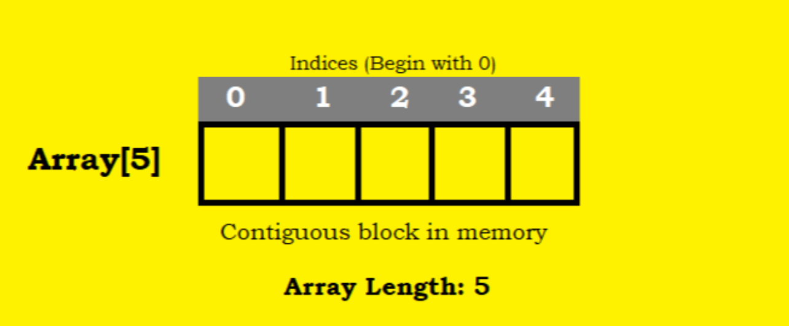

<style>
    .columns {
    display: flex;
  }
  .column {
    flex: 1;
    padding: 10px;
  }
  .column.large{
    flex: 2;
  }
  .small-font {
    font-size: 0.8em;
  }

  section > header,
section > footer {
  position: absolute;
  left: auto;
  right: 90px;
  height: 20px;
}

header {
  top: 30px;
}

footer {
  bottom: 30px;
}

</style>

# Chapter 3 Javascript Multiple Values: <br/> Part 1: Arrays 

## Lesson Objectives

A multiple-value variable is a variable (or the object) that can store more than one value. 

This part discusses arrays, which is a type of multiple-value variable in JavaScript.

The following topics are covered in this chapter:
- Arrays and their properties
- Basic operations on arrays
  - Creating an array, Accessing array elements, Iterating an array
- Array methods
  - Add and replace elements, Concatenate arrays, Sorting, Find elements


## Arrays and their properties

An array is an object that saves a list of values in the memory. 
- Values are stored in the contiguous memory locations
- The values are indexed; the index starts from 0



   
Source: [JavaScript Arrays: A Beginner's Guide – TecAdmin](https://tecadmin.net/javascript-arrays/)


## Basic operations on arrays

Basic operations on arrays include:
- Creating an array
- Accessing array elements
- Modifying array elements (adding, deleting, and updating)
- Get the length of an array
- Iterating through an array

## Creating an array

Array Literal, Array Constructor, Array.of(), Array.from()

### Array Literal
Use the array literal `[]` to create an array. 
- Often used when creating an empty array or an array with a list of values known in advance.

```javascript
let colors = [];   // create an empty array
let colors = ['red', 'green', 'blue'];  // create an array with three elements
```

### Array constructor

- Limitation of the Array literal 
  - Be convenient to create an empty array or an array with a list of values.
- What if we want to create an array dynamically? 
  - e.g. create an array of length $n$ with all elements are `undefined`.
- Array constructor `Array(n)` is the right choice in this case.

Example: Create an array of length 5 with empty slots.

```javascript
// let emptyArray = Array(5);  // the new keyword is optional
let emptyArray = new Array(5);
console.log(emptyArray);  // [ <5 undefined items> ]
```

### Initialize an array with the array constructor

Pass a list of arguments to the array constructor to create an array with the elements.

```javascript
let basicColors = new Array('red', 'green', 'blue');
console.log(basicColors);  // ['red', 'green', 'blue']
```

### The trap of the array constructor

However, be careful about the trap of the array constructor:
- Cannot create an array containing a single integer value.
- If only one argument is passed and it is an integer, the array constructor creates an array of length `n` with empty slots.

For example, we want to create the array `[5]` and use the following code:

```javascript
let numbers = new Array(5);  // create an array of length 5
console.log(numbers);  // [ <5 empty items> ]
```
The first statement creates an array of length 5 with empty slots, not `[5]`.

### Array.of() method: Create an array from a list of values

If you want to avoid the trap of the array constructor, use the `Array.of()` method when creating an array with a list of values.
- This show your intent clearly.

```javascript
let numbers = Array.of(5);  // create an array with one element 5
console.log(numbers);  // [5]
let basicColors = Array.of('red', 'green', 'blue');
```

See more about the `Array.of()` method in the MDN web docs: [Array.of() - JavaScript | MDN](https://developer.mozilla.org/en-US/docs/Web/JavaScript/Reference/Global_Objects/Array/of)


### Array.from() method: Convert an array-like object or an iterable object to an array

This method creates a new array by iterating an **array-like object** or an **iterable object**.

Example 5: Convert an array-like object to an array.

```javascript
let arrayLike = {0: 'red', 1: 'green', 2: 'blue', length: 3};
let colors = Array.from(arrayLike);
console.log(colors);  // ['red', 'green', 'blue']
```

<!-- We will cover this method later.  -->

See more about the `Array.from()` method in the MDN web docs: [Array.from() - JavaScript | MDN](https://developer.mozilla.org/en-US/docs/Web/JavaScript/Reference/Global_Objects/Array/from#description)

### Concept: Array-like object

An array-like object is an object that has the **length property** and **indexed elements**.
- It behaves like an array but does not have all the array methods.

Example 6: An array-like object `arrayLike` with the `length` property and indexed elements.

```js
let arrayLike = {
  0: 'red',
  1: 'green',
  2: 'blue',
  length: 3
};
```

--- 

Other examples of the array-like object:
- NodeList and HTMLCollection objects in DOM.
- The `arguments` object in a function.

See more in [Array - JavaScript | MDN](https://developer.mozilla.org/en-US/docs/Web/JavaScript/Reference/Global_Objects/Array)


### Concept: Iterable Object

An iterable object in JavaScript is an object that can be iterated over using a `for...of` loop.

Common Iterable Objects:
- Arrays, Strings, Maps, Sets, NodeLists (from DOM queries)

Example: Iterating over an array using the `for...of` loop.

```js
let iterable = "Javascript"

for (let value of iterable) {
  console.log(value); 
} 
// outputs: J a v a s c r i p t
```

---- 


Convert the string to a character array using the `Array.from()` method.

```js
let iterable = "Javascript"
let charArray = Array.from(iterable);
console.log(charArray);  // ['J', 'a', 'v', 'a', 's', 'c', 'r', 'i', 'p', 't']
```

### Quick Practice

- Create an array of length 100 with all elements are `undefined`.
- Create an array with the elements: `['apple', 'banana', 'orange', 'grape']`

## Accessing array elements

### Access by index: the square brackets `[]`

Use the square brackets `[n]` where `n` is the index of the element after the array name to access the elements of an array
- n is an integer starting from 0
- return undefined if the index is out of the range of the array

Example: Accessing the first element of the `basicColors` array.

```javascript
let basicColors = ['red', 'green', 'blue'];
console.log(basicColors[0]);  // red
console.log(basicColors[-1]);  // undefined
console.log(basicColors[4]);  // undefined
```

### No out-of-bound error

- When you try to query a nonexistent property of any object, you don’t get an error; 
  - you simply get **undefined**

### Indexes other than non-negative integers

- The index of an array must be a non-negative integer.
- The non-negative integer becomes the **property** of the array object.
  - the square brackets `[property_name]` is used to access the property of an object, the same case as assessing an array element.

Example: Accessing the property of an array object.
    
```javascript
let basicColors = ['red', 'green', 'blue'];
basicColor[-1] = 'Negative Value';
console.log(basicColors[-1]);  // Negative Value
```

### Quick summary for using the square brackets `[]`

- array[n]: access the n-th element of the array when n is a non-negative integer.
- array[property_name]: access the property of the array object when the property name is not a non-negative integer.
  - the non-negative integer will be converted to a number string.
  - It is equivalent to `array.property_name` when the property name is a valid identifier.

```js
let basicColors = ['red', 'green', 'blue'];
basicColors[-1] = 'yellow';  // add the property "-1" to the basicColors array
console.log(basicColors[-1]);  // yellow
console.log(basicColors['-1']);  // the same as basicColors[-1]
```

## Add, delete, and update array elements

### Add elements

- Use the assignment operator `=` to add elements to an array with an index that is out of the range of the array.
- Javascript will automatically expand the array to accommodate the new element.
- Empty slots are created between the last element and the new element.

Example: Add an element 

```javascript
let basicColors = ['red', 'green', 'blue'];
basicColors[5] = 'yellow';   // auto expand the array to accommodate the new element
console.log(basicColors);  // ['red', 'green', 'blue', <2 empty items>, 'yellow']
```
Note: there are two empty slots between the last element `green` and the new element `yellow`.

### Non-negative integer index becomes a property

Recall that using values other than non-negative integers as the index will add the property, not the element, to the array object.

Example: use index values other than non-negative integers.

```javascript
let basicColors = ['red', 'green', 'blue'];
basicColors[-1] = 'yellow';   
console.log(basicColors);  // ['red', 'green', 'blue', '-1': 'yellow']
```

### Append elements to the end of the array

Example: Add an element to the end of the array

To append an element to the end of the array, we:
- first get the length of the array and 
- then use the length value as the index to add the element.

```javascript
let basicColors = ['red', 'green', 'blue'];
basicColors[basicColors.length] = 'yellow';  // append 'yellow' to the end of the array
console.log(basicColors);  // ['red', 'green', 'blue', 'yellow']
```

### Use the `push()` method to append elements

A more concise way to is to use the `push()` method.
- don't need to know the length of the array.

The above code can be rewritten as follows:

```javascript
let basicColors = ['red', 'green', 'blue'];
basicColors.push('yellow');  // append 'yellow' to the end of the array
console.log(basicColors);  // ['red', 'green', 'blue', 'yellow']
```

---

Syntax of push()

```js
push()
push(element1)
push(element1, element2)
push(element1, element2, /* …, */ elementN)
```


### Delete elements

- Use the `delete` operator to delete an element from an array.
- The `delete` operator sets the element's value to `undefined`
  - does not change the length of the array.

Example: Delete the second element from the `basicColors` array.

```javascript
let basicColors = ['red', 'green', 'blue'];
delete basicColors[1];  // delete the second element
console.log(basicColors);  // ['red', <1 empty item>, 'blue']
```

### The side effect of the `delete` operator

The `delete` operator will make the array sparse because it does not alter its length. 

If you want to remove an element, including its slot, use the `splice()` method. 
- avoiding the array becoming sparse.

The `splice()` method is a general method to insert, update, and delete elements in an array.
- `splice` means joining or connecting.


See MDN web docs: [Array.prototype.splice() - JavaScript | MDN](https://developer.mozilla.org/en-US/docs/Web/JavaScript/Reference/Global_Objects/Array/splice)

### Update elements

Assign a new value to an existing element to update it.

Example: Update the second element of the `basicColors` array.

```javascript
let basicColors = ['red', 'green', 'blue'];
basicColors[1] = 'yellow';  // update the second element
console.log(basicColors);  // ['red', 'yellow', 'blue']
```

### Quick Practice

- Create an empty array of `dc_heroes`.
- Add the following heroes to the array: superman, batman, wonderwoman, aquaman, the flash, king shark
- delete the last two heroes from the array.
- Update the second hero to be `green lantern`.
- Print the array.

<details>
<summary> Referenced Answer </summary>

```js
let dc_heroes = [];
dc_heroes.push('superman', 'batman',
    'wonderwoman', 'aquaman', 'the flash', 'king shark');
delete dc_heroes[4];
delete dc_heroes[5];
dc_heroes[1] = 'green lantern';
console.log(dc_heroes);
```
</details>

## Iterating array

### Ways to iterate an array

Ways to visit each element of an array:
- `for` loop: the old way to iterate an array.
- `for/of` loop: a more concise way to iterate an array.
- `forEach()` method: a functional way to iterate an array.

### for loop

Iterating an array means visiting each element of the array one by one.
- A common operation on an array.

The old way to iterate an array is to use the `for` loop with the index.
- Programmers are responsible for managing the index.
- The `for` loop is verbose and error-prone.

```javascript
let colors = ['red', 'green', 'blue'];
for (let i = 0; i < colors.length; i++) {
    console.log(colors[i]);
}
```

### for/of loop 

The `for/of` loop (ES6) is a more concise way to iterate an array.
- JavaScript engine manages the iteration.
- The index is hidden and managed by the JavaScript engine.

Rewrite the above code using the `for/of` loop.
```javascript
let colors = ['red', 'green', 'blue'];
for (let color of colors) {
    // Task to do with each element
    console.log(color);
}
```

### the current index and value while iterating an array using the `for/of` loop

The variable before the `of` keyword is the returned value of each visit.

What if you want to use the index in the `for/of` loop?
- use the [`entries()` method of the array object](https://developer.mozilla.org/en-US/docs/Web/JavaScript/Reference/Global_Objects/Array/entries) to return each element's index and value in an array.

```js
let colors = ['red', 'green', 'blue'];
for( let [idx, color] of colors.entires()) {
    console.log(`${idx}: ${color}`);
} 
```

Sample outputs:
```
0: red
1: green
2: blue
```

### Quick Practice

Given the following array, log the index and value of each element in the array.

```js
let revengers = ['ironman', 'thor', 'hulk', 'black widow', 'hawk eye'];
```

You must use the `for/of` loop to iterate the array.

### forEach() method of the array object

Using the view of functional programming can lead to a more concise way to iterate an array.

Think of the `for/of` loop body block as a function that processes each array element.

So, instead of the body block, we can pass a function that is applied to each visited element in the array. 

<div class="columns">

<div class="column">

```js
let colors = ['red', 'green', 'blue'];

for( let [idx, color] of colors.entires()) 
{   // body block
    console.log(`${idx}: ${color}`);
} 
```

</div>

<div class="column">

```javascript
let colors = ['red', 'green', 'blue'];

colors.forEach(
// Replace the for/of body block with a function:
(color, idx) => {
    console.log(`${idx}: ${color}`);
});
```

  </div>
</div>

---

The `forEach()` method of an array object is a method that applies a function to each element of the array.
- It takes a function as an argument.
- The passed function can take three arguments: 1)the current element, 2)the index, and 3)the array itself.
- In most cases, we only need the current element
  
Example: Rewrite the above code using the `forEach()` method.

```javascript
let colors = ['red', 'green', 'blue'];
colors.forEach((color, idx) => {
    console.log(`${idx}: ${color}`);
});
```

### Quick Practice

Given the following arrays, print their elements in uppercase:


```js
let colors = ['red', 'green', 'blue'];
let fruits = ['apple', 'banana', 'orange'];
```

Use the `forEach()` method to complete the task.

Hints:
- First, define a function that takes an element as an argument and prints the element in uppercase.
  - Use the `String` object's `toUpperCase()` method to convert the element to uppercase.
- Then, use the `forEach()` method to apply the function to each element of the arrays.

---

<details>
<summary> Referenced Answer </summary>

```js
function printUpperCase(el) {
    console.log(el.toUpperCase());
}
colors.forEach(printUpperCase);
fruits.forEach(printUpperCase);
```
</details>


### Review questions for the array iteration

1. When iterating an array, which way may require you to know the array's length? 

2. If you already have a function and want to apply it to each array element, which way should you use it?

## Array methods

Some common methods for operating on arrays include:
- Add and replacing elements: `push()`, `unshift()`, `splice()`
- Remove elements: `pop()`, `shift()`, `splice()`
- Concatenate arrays: `concat()`
- Find elements: `indexOf()`, `find()`
- Sorting: `sort()`, `reverse()`

### `push()` and `pop()` methods

Scenario: Insert and remove elements from the end of the array.

- `push(val)`: append an element to the end of the array
  - return the new length of the array.
- `pop()`: remove and return the last element from the array
  - return the removed element.

```javascript
[1,2,3,4,5].push(6);  // [1,2,3,4,5,6]
let val = [1,2,3,4,5].pop();  // [1,2,3,4]
console.log(val);  // 5
``` 

### `shift()` and `unshift()` methods

Scenario: Insert and remove elements from the beginning of the array.

- `shift()`: remove the first element from the array (shift all elements to the left).
  - return the removed element.
- `unshift(val)`: insert an element to the beginning of the array (shift all elements to the right and put the new element at the beginning).
  - return the new length of the array.

```javascript
[1,2,3,4,5].unshift(0);  // [0,1,2,3,4,5]
const val = [1,2,3,4,5].shift();  // [2,3,4,5]
console.log(val);  // 1
```

### `splice()` method

A general array method to add, remove, and replace elements in an array.

What the `splice()` method does on the array:
1. Remove `deleteCount` elements starting from the `start` index.
2. Insert the `item1, item2, ...` elements at the `start` index. 
   - Original elements after the `start` index are shifted to the right.
3. Update the element at the `start` index with `deleteCount` = 1

The `splice()` method modifies the original array and returns the removed elements as a new array.


#### Function signature for the `splice()` method

Function signature: `arrayObject.splice(start, deleteCount, item1, item2, ...)`
- `start`: the index at which to start changing the array (inclusive).
- `deleteCount`: the number of elements to remove from the array from the `start` index (inclusive).
  - Set it to 0 if you want to insert elements.
- `item1, item2, ...`: the elements to add to the array.

Effect:
- Modify the original array.

Return:
- An array containing the deleted elements.

#### Insert elements

Scenario: Insert multiple elements at the `start` index.

```javascript
// Insert Fet after Jan => Insert an element at index 1
let months = ['Jan', 'March', 'April', 'June'];
months.splice(1,0,'Feb'); 
console.log(months); // ['Jan', 'Feb', 'March', 'April', 'June']
```

#### Update elements

- No direct update. 
- Delete then insert.

Scenario: Update two elements from the `start` index.

Ex. Update the `Feb` and `Mar` to `February` and `March`.

```js
let months = ['Jan', 'Feb', 'Mar', 'Apr'];
let delElements = months.splice(1, 2, 'February', 'March');
console.log(months); // ['Jan', 'February', 'March', 'Apr']
console.log(delElements); // ['Feb', 'Mar']
```

#### Delete elements

Delete multiple elements:

Scenario: Delete two elements from the `start` index.

```js
let months = ['Jan', 'Feb', 'Mar', 'Apr', 'Jun'];
// Delete the first two months 
delElements = months.splice(0, 2);
console.log(months); // ['Mar', 'Apr', 'Jun']
console.log(delElements); // ['Jan', 'Feb']
```

<!-- ```js
// Insert Jan and Feb at the beginning
let newMonths = ['Jan', 'Feb'];
months.splice(0, 0, ...newMonths);
console.log(months);
``` -->

See the full code in the [ex_03_splice.js](ex_03_splice.js) file.

#### Quick Practice

Given the following array: ['A', 'B', 'C'], insert values '1', '2' to the array so that you get ['A', '1', '2', 'B', 'C'].

<details>
<summary> Referenced Answer </summary>

```js
let arr = ['A', 'B', 'C'];
arr.splice(1, 0, '1', '2');
console.log(arr);  // ['A', '1', '2', 'B', 'C']
```
</details>


### Concatenate arrays: `concat()` method

Concatenate two or more arrays and return a new array.

```javascript
const array1 = [1,2,3].concat([4,5,6]);  
console.log(array1);  // [1,2,3,4,5,6]
array1.concat([7,8,9]);  
```

### Concatenate arrays: the spread operator `...` (ES6)

Use the spread operator `...` to add elements from an other array in the array literal.

The spread operator `...` can spread the array of elements into a list of elements. 
- Convert the array into a list of elements.

Use the spread operator in:
- the array literal to create a new array.
- the function call to pass the array elements as arguments.

#### Scenario: Use the spread operator in the array literal

- You have an array and want to extend it with other elements from another array.

Example: Extend the `moreColors` array with the `basicColors` array.

```javascript
let basicColors = ['red', 'green', 'blue'];

// Equivalent to let moreColors = ['yellow', 'purple', 'red', 'green', 'blue'];
let moreColors = ['yellow', 'purple', ...basicColors]; 

// ['yellow', 'purple', 'red', 'green', 'blue']
console.log(moreColors);  
```

The Array's `concat()` method can also be used to achieve the same result.

#### Scenario: Use the spread operator in the function call

- You have an array and want to insert to it with other elements from another array into it. 

Example: Insert the `basicColors` array into the `moreColors` array at index 1.

Use the splice():

```javascript
let basicColors = ['red', 'green', 'blue'];
let moreColors = ['yellow', 'purple'];
moreColors.splice(1, 0, ...basicColors);
console.log(moreColors);  // ['yellow', 'red', 'green', 'blue', 'purple']
```
`


#### Characteristics of the spread operator `...` 

- Copy: A Copy the elements of the original array when spreading.
- Shallow copy: Only copy scalar or reference values of the array elements.
  - That means the nested objects are shared between the original and the new array.

Example 2: Shallow copy of the `basicColors` array.
    
```javascript
let basicColors = ['red', 'green', 'blue'];

// ...basicCopy shallowly copy of the basicColors array
let moreColors = ['yellow', 'purple', ...basicColors];

// Modify the original array
basicColors[0] = 'black';
console.log(basicColors);  // ['black', 'green', 'blue']
// The new array is not affected
console.log(moreColors);  // ['yellow', 'purple', 'red', 'green', 'blue']
```

#### Quick Practice

Given the following arrays, use three different ways to concatenate them into a new array:

```js
let fruits = ['apple', 'banana'];
let vegetables = ['carrot', 'potato'];
```

The new array `food` should be: `['apple', 'banana', 'carrot', 'potato']`, which is an independent copy of the two arrays.

<details>
<summary> Referenced Answer </summary>

Using `concat()`:
```js
let food = fruits.concat(vegetables);
console.log(food);  // ['apple', 'banana', 'carrot', 'potato']
```

Using spread operator:
```js
let food = [...fruits, ...vegetables];
console.log(food);  // ['apple', 'banana', 'carrot', 'potato']
```

Using the splice():

```js
// splice() alters the original array. Watch out the side effect!!
fruits.splice(2, 0, ...vegetables);
// make a shallow copy of the fruits array
let food = [...fruits];
console.log(food);  // ['apple', 'banana', 'carrot', 'potato']
```

</details>


### Find elements: `find()` method 

The `find()` method returns **the first element** in the provided array that satisfies the provided testing function.
- Pass a function returning a boolean value to the `find()` method.

Example: Find the values greater than 5 in the array.

```javascript
const array1 = [5, 12, 8, 130, 44];
const firstFound = array1.find(element => element > 5);
console.log(found);  // 12
```

See more about the `find()` method in the MDN web docs: [Array.prototype.find() - JavaScript | MDN](https://developer.mozilla.org/en-US/docs/Web/JavaScript/Reference/Global_Objects/Array/find)

#### Note to the expression: `element => element > 5`

- It is a lambda function that returns a boolean value.
- A lambda function (anonymous function ) is a function without a name.
- The syntax of a lambda function
  - Single parameter with one expression: `parameter => expression`
    - the function returns the value of the expression.
  - Multiple parameters with multiple statements: `(parameter1, parameter2, ...) => { statements; return expression; }`
    - The return statement is mandatory when using multiple statements.

See more about the lambda function in the MDN web docs: [Arrow function expressions - JavaScript | MDN](https://developer.mozilla.org/en-US/docs/Web/JavaScript/Reference/Functions/Arrow_functions)

### Sorting: `sort()`

The `sort()` method sorts the elements of an array in place and returns the sorted array.
- elements are converted to strings and compared in UTF-16 code unit order.
- the default sort order is ascending.

#### Ex. Sorting an array of numbers.

what is the result? 

```javascript
let numbers = [4, 41, 2, 21, 10];
numbers.sort();
console.log(numbers);  
```
The result is: `[10, 2, 21, 4, 41]`

#### Control the sort order: define a compare function

To control the sort order, you can pass a compare function to the `sort()` method.

The compare function takes two arguments (a and b) and return a value to indicate the order of the two elements:
- a negative value if a should come before b (i.e a < b, or a-b <0 )
- a positive value if a should come after b (i.e b < a, or a-b > 0)
- Zero or NaN if a and b are equal (i.e a - b = 0)

Order control and test expressions:
- a, b, c in ascending order: a < b < c
  - first is less than or equal to second -> `return first(a) - second(b)`
- a, b, c in descending order: a > b > c
  - second is less than or equal first -> `return -(first(a) - second(b))`

See more about the `sort()` method in the MDN web docs: [Array.prototype.sort() - JavaScript | MDN](https://developer.mozilla.org/en-US/docs/Web/JavaScript/Reference/Global_Objects/Array/sort) and the `reverse()` method in the MDN web docs: [Array.prototype.reverse() - JavaScript | MDN](https://developer.mozilla.org/en-US/docs/Web/JavaScript/Reference/Global_Objects/Array/reverse)

#### Ex. Sorting an array of numbers in ascending order.

Ascending order: first is less than or equal to the second.
- a <= b: return a - b

```javascript
let numbers = [4, 41, 2, 21, 10];
numbers.sort((a, b) => a - b);
console.log(numbers);  // [2, 4, 10, 21, 41]
```

#### Ex. Sorting an array of numbers in descending order.

Descending order: first is greater than or equal to the second.
- a >= b is equivalent to: `return -(a-b)` or `return b - a`

```javascript
let numbers = [4, 41, 2, 21, 10];
numbers.sort((a, b) => b - a);
console.log(numbers);  // [41, 21, 10, 4, 2]
```

#### Quick Practice

Given the following array, sort it in descending order:

```js
let numbers = [67, 87, 123, 32, 55]
```

<details>
<summary> Referenced Answer </summary>

```js
let numbers = [67, 87, 123, 32, 55];
numbers.sort((a, b) => b - a);
console.log(numbers);  // [123, 87, 67, 55, 32]
```

### Reverse order： `reverse()`

The `reverse()` method reverses the elements of an array in place and returns reference to the reversed array.
- Note: it modifies the original array.

Leave it as the reading assignment. 


### Cheat Sheet 

Use the following cheat sheet to remember the usage of the array methods.

<div class="columns">
  <div class="column">
    
  </div>
  <div class="column">
    
  </div>
</div>

Source: [Poonam Soni@CodeByPoonam](https://x.com/CodeByPoonam/status/1650501276575100931)


### Summary of the array methods

Add and replace elements:
- `push()`: append an element to the end of the array.
- `unshift()`: insert an element to the beginning of the array.
- `splice()`: add, remove, and replace elements in an array.

Remove elements:
- `pop()`: remove and return the last element from the array.
- `shift()`: remove and return the first element from the array. 
- `splice()`: add, remove, and replace elements in an array.

Concatenate arrays:
- `concat()`: concatenate two or more arrays and return a new array.

---

Find elements:
- Find with the test function:
  - `find()`: find the first element in the array that satisfies the provided testing function.
  - `findIndex()`: find the index of the first element in the array that satisfies the provided testing function.
- Find the index:
  - `indexOf()`: find the index of the first occurrence of the element in the array.
  - `lastIndexOf()`: find the index of the last occurrence of the element in the array.
  - `findIndex()`
- Membership test:
  - `includes()`: check if the array contains the element.

---

Sorting:
- `sort()`: sort the elements of the array.
- `reverse()`: reverse the order of the elements in the array.


## Summary

We have learned: 

- Data types that can store multiple values: Arrays and Objects.
- Ways to create an array: array literal, array constructor, `Array.of()` method, and `Array.from()` method.
- Methods to operate on arrays: `push()`, `pop()`, `shift()`, `unshift()`, `splice()`, `concat()`, `find()`, `sort()`, and `reverse()`.
- Ways to iterate an array: `for/of` loop, `forEach()` method, and `entries()` method.


## References 

[1] Eric T. Freeman and Elisabeth Robson, 2014. Head First JavaScript Programming: A Brain-Friendly Guide, O'Reilly Media


<script src="../h2_numbering.js">
    // // add the following script at the end of your marp slide file.
    // const h2s = document.querySelectorAll('h2');
    // h2s.forEach(function(h2, idx){
    //     h2.innerHTML = `<span class="small-font">${idx + 1}</span> ${h2.innerHTML}`
    // })
</script>


  
