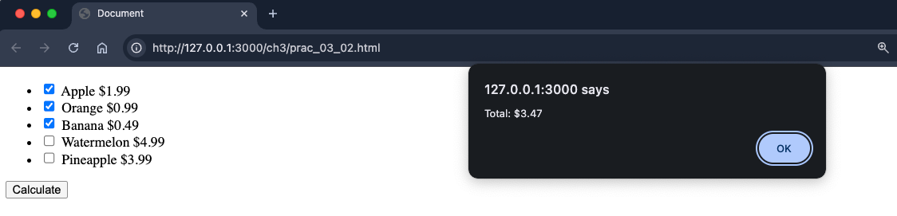
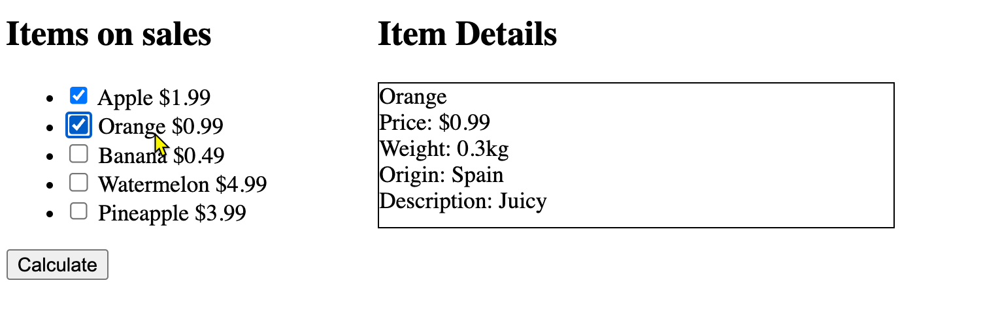

# Practices for Chapter 3

## Practice 3-1: Get the arrays of filenames and extensions

You have a list of names in the following array:

```js
let fullFilenames = ['photo.jpg', 'image.png', 'file.gif', 'pic.bmp'];
```

Please iterate through the array and create two new arrays: one for filenames without the extension and one for the extensions. The expected outputs in the console are:

```
Filenames:  photo,image,file,pic
Extensions jpg,png,gif,bmp
```

Hint: String.prototype.split(), Array.prototype.pop() and Array.prototype.shift() are useful methods to handle the filename and extension.

## Practice 3-2: Reverse a string

You have a string `Javascript is fun!`. Reverse the string and display it in the console. The expected output in the console is:

```
!nuf si tpircsavaJ
```

You can not use the for-loop statement to implement the solution.

## Practice 3-3: Filter out the palindromes

You have a list of words in the following array:

```js
let words = ['level', 'world', 'radar', 'hello', 'madam'];
```
Please iterate through the array and filter the palindromes. The expected output in the console is:

```
Palindromes: level, radar, madam
```


## Practice 3-4: Working with an array of HTMLElement objects

You have a list of items for sale in a page.

The list of items and their prices are as follows:


- Apple: $1.99
- Orange: $0.99
- Banana: $0.49
- Watermelon: $4.99
- Pineapple: $3.99

A user can select multiple items he/she wants to buy. Then, the user can click a button to calculate the total price of the selected items.

The partial HTML code for the list of items is as follows:

```html
<ul>
  <li>
    <input type="checkbox" id="apple" name="selectedItem" value="1.99">
    <label for="apple">Apple</label>
  </li>
  <li>
    <input type="checkbox" id="orange" name="selectedItem" value="0.99">
    <label for="orange">Orange</label>
  </li>
  <li>
    <input type="checkbox" id="banana" name="selectedItem" value="0.49">
    <label for="banana">Banana</label>
  </li>
  <li>
    <input type="checkbox" id="watermelon" name="selectedItem" value="4.99">
    <label for="watermelon">Watermelon</label>
  </li>
  <li>
    <input type="checkbox" id="pineapple" name="selectedItem" value="3.99">
    <label for="pineapple">Pineapple</label>
  </li>
</ul>

<button id="calculate" onclick="calculateTotal();" >Calculate</button>
```

Please write a JavaScript function `calculateTotal()` to calculate the total price of the selected items. The total price should be displayed in an alert box.

The syntax to define the function is as follows:

```js
function calculateTotal() {
  // Your code here
}
```

Example outputs:



Hint:
- You can use `document.querySelectorAll()` to get all the checkboxes.
- You can iterate through the checkboxes to calculate the total price. Or, you can use `Array.prototype.reduce()` to calculate the total price.


## Practice 3-5: Work with an array of objects

You extend the previous page by adding a detail section showing the details for the clicked item. 

For example, when a user clicks the "Apple" item, the detail section should show the apple's details. 

For each item, you provide the following details: price, weight, origin, and description.

The details for the five items are listed in the following table:

| Item       | Price | Weight | Origin | Description |
| ---------- | ----- | ------ | ------ | ----------- |
| Apple      | $1.99 | 0.2 kg | USA    | Sweet       |
| Orange     | $0.99 | 0.3 kg | Spain  | Juicy       |
| Banana     | $0.49 | 0.1 kg | Mexico | Soft        |
| Watermelon | $4.99 | 2.0 kg | Brazil | Fresh       |
| Pineapple  | $3.99 | 1.5 kg | Hawaii | Sour        |

To implement the new feature, you create a Fruit class with the previous details as properties.

Then, you create an array of Fruit objects to store the details of the five items.

The HTML is modified to include a detail section:

```html
 <div class="two-columns">
    <div class="column" id="itemsOnSales" onclick="display(event);">
      <h2>Items on sales </h2>
      <ul>
        <li>
          <input type="checkbox" id="apple" name="selectedItem" value="0">
          <label for="apple">Apple $1.99 </label>
        </li>
        <li>
          <input type="checkbox" id="orange" name="selectedItem" value="1">
          <label for="orange">Orange $0.99 </label>
        </li>
        <li>
          <input type="checkbox" id="banana" name="selectedItem" value="2">
          <label for="banana">Banana $0.49 </label>
        </li>
        <li>
          <input type="checkbox" id="watermelon" name="selectedItem" value="3">
          <label for="watermelon">Watermelon $4.99 </label>
        </li>
        <li>
          <input type="checkbox" id="pineapple" name="selectedItem" value="4">
          <label for="pineapple">Pineapple $3.99</label>
        </li>
      </ul>
    </div>
    <div class="column-large">
      <h2>Item Details</h2>
      <div id="displayDetails" class="box"></div>
    </div>
```

Pay attention to the modifications in the HTML code. 
1. The `onclick` event is added to the `itemsOnSales` div. When a user clicks an item, the click event bubbles up to the `itemsOnSales` div. Then, the `display(event)` function in the `itemsOnSales` div is called.
2. The `value` attribute of the checkbox is used to store the index of the item in the array of Fruit objects.

Modify the `calculateTotal()` function to accommodate the new feature. In addition, you need to implement the `display(event)` function to display the details of the clicked item in the detail section.

The syntax to define the `display(event)` function is as follows:

```js
function display(event) {
  // Your code here
}
```

Example outputs:



Hint: 
- the `event.target` property provides the element that triggered the event.
- You can use the `value` attribute of the checkbox to get the index of the item in the array of Fruit objects.

The css classes for the page:

```css
  .two-columns {
      display: flex;
      gap: 20px;
      width: 70%
    }

    .box {
      border: 1px solid #000;
      width: 100%;
      height: 100px;
    }

    .column-large {
      flex: 1.5;
    }

    .column {
      flex: 1;
    }
```


  
