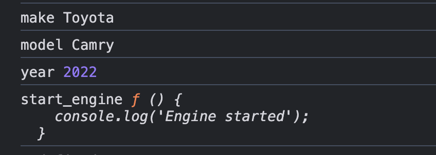
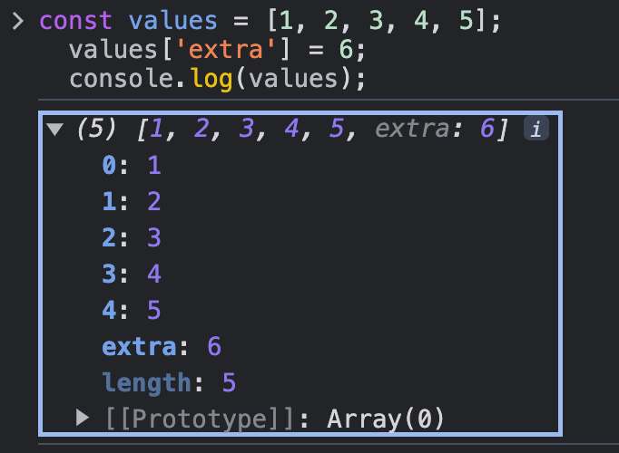

<style>
    .columns {
    display: flex;
  }
  .column {
    flex: 1;
    padding: 10px;
  }
  .column.large{
    flex: 2;
  }
  .small-font {
    font-size: 0.8em;
  }

  section > header,
section > footer {
  position: absolute;
  left: auto;
  right: 90px;
  height: 20px;
}

header {
  top: 30px;
}

footer {
  bottom: 30px;
}

</style>

# Chapter 5: Loops

## Learning Objectives

- Iterate over arrays
- Iterate over object's properties

## Introduction

- Loops are used to execute the same block of code again and again, as long as a certain condition is met.
- Traditional loops: `for`, `while`, `do...while`
- Loop related techniques: 
  - break a look: stop the loop when a certain condition is met
  - continue the next iteration: skip the current iteration and continue with the next iteration
  - nested loops: a loop inside another loop
- These techniques are left as the reading assignment for you.

---

In this chapter, we will focus on the new for loops introduced in ES6.
- `for...of` loop: iterates over the values of an iterable object
- `for...in` loop: iterates over the properties of an object

## Iterating values of an array

### Iterating

- Iterating over the values of an array means accessing each element of the array one by one.

- Consider the following array:

```js
const fruits = ['apple', 'banana', 'cherry'];
```

- How can we access each element of the array?

### Old way: for loop

- The old way to iterate over an array is to use a `for` loop.

```js
const fruits = ['apple', 'banana', 'cherry'];
for (let i = 0; i < fruits.length; i++) {
  console.log(fruits[i]);
}
```

Demerits:
- This is a bit verbose and error-prone.
- Requires an index variable, a loop condition, and an increment statement.

### New way: for...of loop

- The new way to iterate over an array is to use a `for...of` loop.

Syntax:

```js
for (const element of iterable) {
  // code block to be executed
}
```

```js
const fruits = ['apple', 'banana', 'cherry'];
for (const fruit of fruits) {
  console.log(fruit);
}
```

Merits:
- It is more concise and easier to read.
- It works with any iterable object, not just arrays.
- It does not require an index variable.

### Replace the for body with a function

- The `Array.prototype.forEach()` method can be used to iterate over the elements of an array.
- Instead of writing a `for...of` loop with a code block, we apply a function to each element of the array.

Syntax:

```js
array.forEach(function callback(currentValue, index, array) {
  // code block to be executed
});
```
[Array.prototype.forEach() - JavaScript | MDN](https://developer.mozilla.org/en-US/docs/Web/JavaScript/Reference/Global_Objects/Array/forEach)

--- 

The above example can be rewritten as follows:

```js
const fruits = ['apple', 'banana', 'cherry'];
fruits.forEach(fruit => console.log(fruit));
```

Much more concise!

### Iterable objects

- Examples of iterable objects:
  - Arrays
  - Strings
  - DOM collections (e.g., `NodeList`)
  - and more...

### Iterating over a string

- A string is an iterable object, so we can use a `for...of` loop to iterate over its characters.

```js
const str = 'hello';
for (const char of str) {
  console.log(char);
}
```

or use the `Array.prototype.forEach()` method.

But, we need to convert the string to an array first by using the `Array.from()` method.

```js
const str = 'hello';
Array.from(str).forEach(char => console.log(char));
```

### Lab 01

Consider the following html containing a list of four optional car features for a buyer to choose from.

```html
<input type="checkbox" id="f1" name="feature" value="el_park_break">Electronic Parking Brake<br>
<input type="checkbox" id="f2" name="feature" value="auto_headlights">Automatic Headlights<br>
<input type="checkbox" id="f3" name="feature" value="lane_assist">Lane Assist<br>
<input type="checkbox" id="f4" name="feature" value="blind_spot_monitor">Blind Spot Monitor<br>
```

Write a JavaScript code to iterate over the checkboxes and log the value of each checked checkbox in the console.

Hint: 
- Use the `document.querySelectorAll(input[name="feature"]:checked)` method to select the checked checkboxes.
- The :checked CSS pseudo-class selector represents any radio (`<input type="radio">`), checkbox (`<input type="checkbox">`), or option (`<option> in a <select>`) element that is checked or toggled to an on state.
  - See https://developer.mozilla.org/en-US/docs/Web/CSS/:checked


## Iterating properties of an object

### Recap: Objects

- An object is a collection of key-[value/function] pairs.
- We access an object's properties using a key.
- It can be treated as a Map data structure.

Example
```js
const car = {
  make: 'Toyota',
  model: 'Camry',
  year: 2022
  start_engine: function() {
    console.log('Engine started');
  }
};

console.log(car.make); // Toyota
console.log(car['model']); // Camry
console.log(car.start_engine); // [Function: start_engine]
```

### Some use cases of iterating over object properties

- **Accessing All Properties**: When you need to access or manipulate all properties of an object in the run time.
- **Debugging**: To log all properties and their values for debugging purposes.
- **Data Transformation**: To transform the data structure, such as converting an object to an array.
- **Validation**: To validate the properties of an object.

### Basic idea

- We need to get all the keys to iterate over the properties of an object.
- Use the key to access the value of the property.

### for/in loop

- The `for/in` loop iterates over keys of an object so that we can access the values of the properties.

Syntax:

```js
for (const key in object) {
  // code block to be executed
}
```

Example:

```js
const car = {
  make: 'Toyota',
  model: 'Camry',
  year: 2022,
  start_engine: function() {
    console.log('Engine started');
  }
};

for (const key in car) {
  console.log(key, car[key]);
}
```

Output:



### Get keys or values as an array from an object

- The `Object.keys()` method returns an array of a given object's own enumerable property names (keys).
- The `Object.values()` method returns an array of a given object's own enumerable property values.

- We can use `for/of` loop to iterate over the array of keys or values.

Example: Iterate over an object using `Object.keys()`

```js

for (const key of Object.keys(car)) {
  console.log(key, car[key]);
}
```

--- 

Example: Iterate property values using `Object.values()`

```js
for (const value of Object.values(car)) {
  console.log(value);
}
```

### Get the key-value pairs as an array from an object

- The `Object.entries()` method returns an array of a given object's own enumerable string-keyed property [key, value] pairs.
- Use `for/of` loop to iterate over the array of key-value pairs.

Example:

```js
for (const [key, value] of Object.entries(car)) {
  console.log(key, value);
}
```

### Quick Question 1


What is the output of the following code when you use the `for/of` loop to iterate over the `values` array?

```js
const values = [1, 2, 3, 4, 5];
  values['extra'] = 6;
  console.log(values);

  for (const v of values) {
    console.log(v);
  }
```

The `values` object has the following structure:



<!-- Ans: 1, 2, 3, 4, 5 -->

### Quick Question 2

What is the output of the following code when you use the `for/in` loop to iterate over the `values` array?

```js
const values = [1, 2, 3, 4, 5];
  values['extra'] = 6;
  console.log(values);

  for (const v in values) {
    console.log(v);
  }
```

<!-- Ans: 0, 1, 2, 3, 4, extra -->

### Quick Question 3

What is the output of the following code when you use the `for/in` loop to iterate over the `values` array?

```js
const values = [1, 2, 3, 4, 5];
  values['extra'] = 6;
  console.log(values);

  for (const v in values) {
    console.log(values[v]);
  }
```

<!-- Ans: 1, 2, 3, 4, 5, 6 -->

## Summary

- Iterate over the values of an array using the `for/of` loop.
  - Use the `Array.prototype.forEach()` method to apply a function to each element of an array.
- Iterate over the properties of an object using the `for/in` loop.
- Get an array of keys, values, or key-value pairs from an object using `Object.keys()`, `Object.values()`, and `Object.entries()` methods.