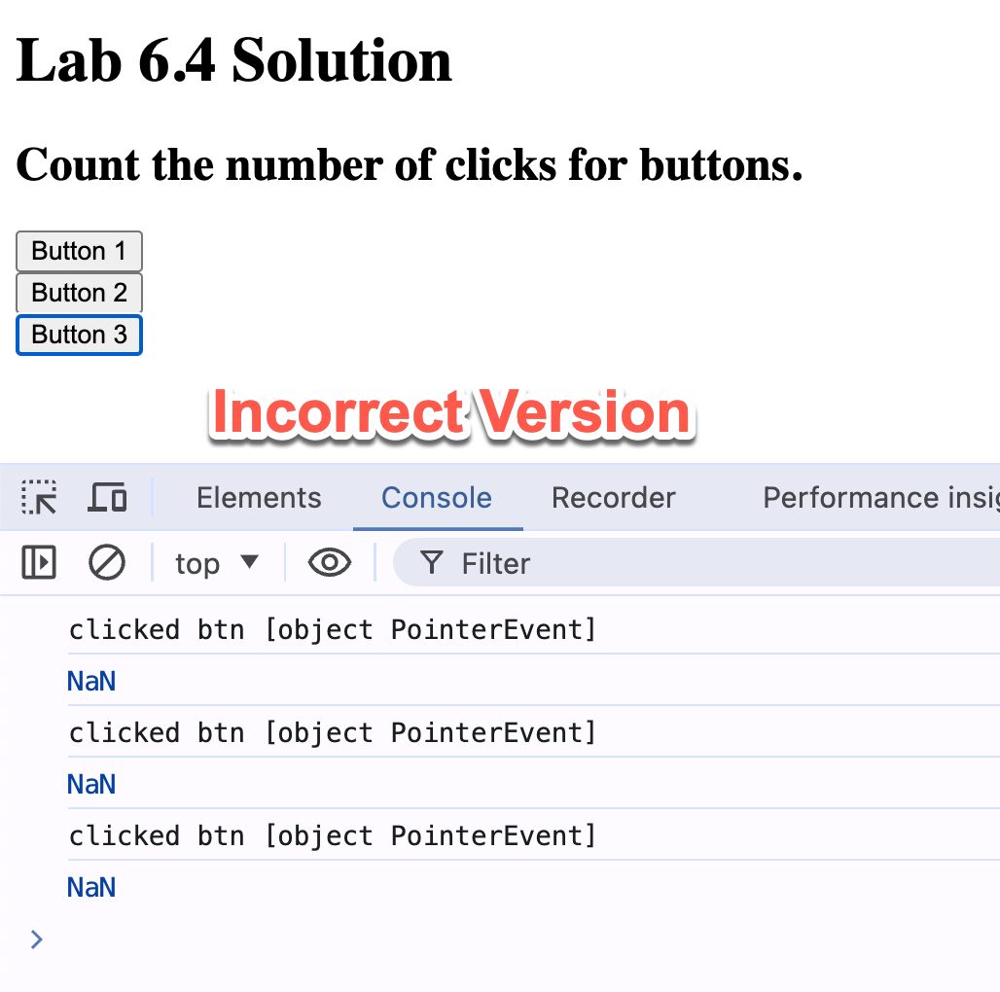

# Ch6 Functions

Cover the following topics:
- Function declaration, arguments, and return values
- Variable scope in functions
- Nested functions and closures
- Anonymous functions 
- Arrow functions
- Function callbacks

## What are functions?

- Functions are reusable blocks of code that can be called by name.
- Functions are **objects**
  - can be passed as arguments to other functions
  - can be returned by other functions
  - can be assigned to variables

**BEST PRACTICE** Do not repeat yourself. 
- If you find yourself writing the same code multiple times, consider refactoring it into a function.
- It makes your codes more readable and maintainable.

## Function declaration

- Recall that function is an object.
- You declare a function and then call it by its name.

- There are three ways to declare a function:
  - `function` statement
  - `function` expression
  - Arrow function (ES6)


### Create a function that takes two arguments and returns the sum of the two arguments.

- Use the `function` statement

```javascript
function add(a, b) {
  return a + b;
}
```

- Use the `function` expression
  - the expression in the LHS create a function object and assign it to the variable `add`.

```javascript
const add = function(a, b) {
  return a + b;
};
```

- Use the arrow function
  - a short-hand syntax for creating a function object.

```javascript
const add = (a, b) => {return a+b;};
```

  - If you have only one return statement in the function, you can omit the curly braces and the `return` keyword.

```javascript
const add = (a, b) => a+b;
```

**Concept review**: When to append a semicolon to the end of a line?
- Append a semicolon to end of a statement to avoid unexpected behavior and improve code readability.
- You don't need to append a semicolon to the end of a code blocks.
  - e.g. if, for, while, function statements.

### Lab 6.1: Write a function that takes the body weight and height of a person and returns the BMI of the person.

- The formula for BMI is `weight / (height**2)`.
- Use the `function` statement, `function` expression, and arrow function to create the function.
- Default the height to 0 if it is undefined, null, or not a number.

## Invoking a function

- Invoke a function by calling its name followed by parentheses.
- Provide the arguments in the parentheses.

```javascript
const sum = add(1, 2);
console.log(sum); // 3
```

- If you don't provide the parentheses, you are not calling the function but referencing the function object.

```javascript
add = (x, y) => x + y;
console.log(add); // Prints the function object
```


**BEST PRACTICE** Write comments for your functions.

- Describe the purpose of the function.
- Describe the arguments and return values.
- Follow the [JSDoc](https://github.com/jsdoc/jsdoc) format to allow tools to automatically generate documentation for your code.
- [How to use JSDoc - Basics & Introduction @ youtube 13:04](https://www.youtube.com/watch?v=Nqv6UkTROak)


Example:

```javascript
/**
 * Calculate the BMI of a person.
 * @param {number} weight - The body weight of the person.
 * @param {number} height - The height of the person.
 * @returns {number} The BMI of the person.
 */
const calculateBMI = (weight, height) => {
  if (height === undefined || height === null || isNaN(height)) {
    height = 0;
  }
  return weight / (height ** 2);
};
```

### Immediately-invoked Function Expressions (IIFE)

- An IIFE is a function that is immediately invoked after it is defined (self-invoking function).
- they don't pollute the global object - the variables declared inside the IIFE are not accessible outside the IIFE.
- The IIFE cannot be reinvoked after it is executed because it don't have a name (anonymous function).

The syntax of an IIFE:
```javascript
(function() {
  // code here
})();
```

Can use the arrow function in the IIFE, too: 
```javascript
(() => {
  // code here
})();
```

Pass arguments to the IIFE:
```javascript
((a, b) => {
  console.log(a + b);
})(1, 2);
```


Example: Add an event listener to a button element using an IIFE.

```javascript
<script>
    /**
     * Calculate the BMI of a person.
     * @param {number} weight - The body weight of the person.
     * @param {number} height - The height of the person.
     * @returns {number} The BMI of the person.
     */
    const calculateBMI = (weight, height) => {
      return weight / (height ** 2);
    };

     (function() {
      // Add an event listener to a button with the id 'calculateButton'
      document.getElementById('calculateButton').addEventListener('click', function() {
        const weight = parseFloat(document.getElementById('weight').value);
        const height = parseFloat(document.getElementById('height').value);
        const bmi = calculateBMI(weight, height);
        alert('Your BMI is: ' + bmi);
      });
    })();
  </script>
```


### Lab 6.2  Create a program that will randomly describe an inputted name.

Modified from the Practice exercise 6.2 in the textbook.

1. Create an array of descriptive words.
2. Create a function that takes a name and the array of descriptive words as arguments.
   2.1 Select a random value from the array using Math.random.
   2.2 return a string that describes the name.
3. Invoke the function and print the result. You may consider using the IIFE technique.

For example, the list of descriptive words is `['smart', 'funny', 'kind', 'hardworking']`. Given the name `Alice`, the program may print `Alice, your are smart`.

## Function parameters and arguments

### Parameters vs Arguments 
- Parameters are the variables in the function declaration.
- Arguments are the values passed to the function when it is called.

```javascript   
const add = (a, b) => a + b;
const sum = add(1, 2);
```

- The function `add` has two parameters `a` and `b`.
- The function is called with the arguments `1` and `2`.


### Optional parameters

- Some parameters might be optional when you invoke the function.
- You need to provide a default value for the optional parameters.
- The arguments might be fewer than the parameters.

```javascript
// The descWords parameter is optional.
function randomWord(name, descWords = ['smart', 'funny', 'kind', 'hardworking']) {
    // scale the random number to the length of the array and round down to the nearest whole number
    let randomIndex = Math.floor(Math.random() * descWords.length);
    return `${name}, you are ${words[randomIndex]}.`;
}
console.log(randomWord('Alice')); // might be: Alice, you are smart.
```

- What if you provide arguments more than parameters?
  - The extra arguments are ignored.

```javascript
const add = (a, b) => a + b;
const sum = add(1, 1, 4);
console.log(sum); // 2
```

### Pass an array to a function as a list of arguments: the spread operator ...

Consider the following scenario:
- You have an array of numbers `[1, 2, 3, 4]`.
- You have defined a function that takes four arguments and returns the maximum value of the four arguments.
    `(x, y, z, w) => Math.max(x, y, z, w)`
- How do you apply the function to the array of numbers?

Use the spread operator `...` to spread elements of an array into a list of arguments.
- the spread operator can only be used in array literals and function invocations.

Use the spread operator in the function invocation.
```javascript
const numbers = [1, 2, 3, 4];
const maxValue = (x, y, z, w) => Math.max(x, y, z, w);
const max = maxValue(...numbers); // equivalent to maxValue(1, 2, 3, 4). Result: 4
```

Use the spread operator in the array literal.
```javascript
const numbers = [1, 2, 3, 4];
const moreNumbers = [...numbers, 5, 6, 7]; // [1, 2, 3, 4, 5, 6, 7]
console.log(moreNumbers); 
```


### Rest of the parameters (ES6)

- The rest of the parameters refers the remaining arguments to a function.
  - Use the spread operator `...` in the function declaration to collect the rest of the arguments into an array.
  - An opposite operation to the spread operator used in the array literals and function invocations.
  - A function that can take variable variable number of arguments is call vararg (or variadic) function

Example: variable arguments 
- Create a function that takes a variable number of arguments and returns the max value.

```javascript
const maxValues = (...numbers) => {
    // numbers is an array
    console.log(typeof numbers); // array object
    console.log(`array size: ${numbers.length}`); 
  return Math.max(...numbers);
};
const max = maxValues(1, 2, 3, 4, 5); // 5
```

Application of the rest of the parameters: A function calls another function with arguments.

```javascript
const add = (a, b) => a + b;

function invokeFunction(func, ...args) {
  return func(...args);
}

const sum = invokeFunction(add, 1, 2); // 3
```

### Lab 6.3: Create a simple addition and multiplication calculator.

1. Create an `sum` function that takes a variable number of arguments and returns the sum of the arguments.
2. Create a `multiply` function that takes a variable number of arguments and returns the product of the arguments.
3. Yon must write a function to invoke the `sum` and `multiply` functions with the arguments provided.
4. For the inputted string "sum 1 2 3 4", your program should call the `sum` function with the arguments 1, 2, 3, and 4 and print the result.
5. For the inputted string "multiply 1 2 3 4", your program should call the `multiply` function with the arguments 1, 2, 3, and 4 and print the result.

Hint:
- Use the `split` method of String to split the inputted string into an array of strings. Then, assign them to an array of variables (array destructuring).
  - `let [operation, ...args] = str.split(" ");`
- Use the map data structure to index and store the functions if you don't want to use a switch or if-else statement.

## Variable scope in functions

- Scope defines where you can access a certain variable.
- JavaScript has two types of scope:
  - Function scope: variables declared outside of a function.
    - Use the `var` keyword to declare a variable with function scope.
  - Local scope: variables declared inside a function.
    - Use the `let` or `const` keyword to declare a variable with local scope.

Example: function and local scope
```javascript
let x = 1;  // valid in the entire script

function myFunction(p) {
  // parameter p is a local variable within the function
  let functionScopeVar = 10;   // local variable within the function
  if (true){
    let y = 20;  // local variable within the block
    var z = 30;
  }
  console.log(x); // 1
  console.log(y); // ReferenceError: y is not defined
  console.log(z); // 30
  console.log(p); //  100 because the argument 100 is passed to the function.
}

myFunction(100);
console.log(x); // 1
console.log(y); // ReferenceError: y is not defined
console.log(z); // ReferenceError: z is not defined
console.log(p); // ReferenceError: param is not defined
```

### Hoisting characteristics of `var` variable declarations

- For variables declared with `var`, their declarations are hoisted (move) to the top of the function without an initialization.

For example:

```js 
// hoisting characteristics of var
function hoisting() {
  // use of the variable `a` before declaring it.
  // Since the variable declaration is moved to the top of the function (hoisted) without initialization, the value is `undefined`.
  console.log(a); // undefined
  // Assign a value to a; Not declare a new variable
  var a = 10;
  console.log(a); // 10
}
```

## Nested functions

- A function (inner) can be defined inside another function (outer).
- Let call the former the inner function and the latter the outer function.
- Recall that functions are objects and you can declare variables inside a function (function or block scope).
- be careful of using the nested functions because of the limitation caused by the scopes of variables or functions.

Rule 1: An inner function can access the variables and parameters of the outer function.

Because the inner function is within the scope of the outer function, it can access the variables and parameters of the outer function.

```javascript
function outerFunction(x) {
  let outerVar = 10;
  function innerFunction() {
    console.log(x); // Hi, the argument passed to the outer function
    console.log(outerVar); // 10
  }
  innerFunction();
}
outerFunction('Hi');
```

Rule 2: An outer function cannot access the variables and parameters of the inner function.

Because the scopes of the variables and parameters of the inner function are limited to the inner function, the outer function cannot access them.

```javascript
function outerFunction() {
  function innerFunction() {
    // function scope starts
    let innerVar = 20;
  } // function scope ends

  console.log(innerVar); // ReferenceError: innerVar is not defined
}
outerFunction();
```

Rule 3: The scope of the inner function limits to the outer function. We cannot invoke the inner function outside the outer function.

```javascript
function outerFunction() {
  function innerFunction() {
    console.log('Inner function');
  }
}
innerFunction(); // ReferenceError: innerFunction is not defined
```


## Closures

- A closure is a function that binds to the variables of the outer function when it executes.
- The closure is a common pattern and a powerful technique in JavaScript.
- This happens commonly when you return a (nested) function from a (outer) function within which it was defined.

Example: Return a function from a function generates a closure.

```javascript
function outerFunction() {
  let outerVar = 10;
  function innerFunction() {
    console.log(outerVar);
  }
  // return the inner function object (not invoking the inner function)
  return innerFunction;
}

// aFunc and innerFunction are the same function object
const aFunc = outerFunction();

```

A question arises: Can `aFunc` access the variable `outerVar`?

We need to understand the concept of the lexical scope to answer the question.


### Lexical Scope vs Variable Scope 

- Lexical scope is the scope of a variable defined by its location in the source code.
  -  When executing, the nested functions have access to variables declared in their outer scope
  -  This means that the inner function are executed using the variable scope that was in effect when they were defined, not the one that is in effect when they are invoked.

@import "./ex_06_closure.js" {code_block class="line-numbers"}


### Lab 6.4: Count the number of clicks for buttons.

1. Create a HTML page with three buttons, each with a label to indicate the number of clicks. Give each button a unique id.
2. Create a function that returns a function as the event handler.
   - The returned function increments a counter and updates the label with the counter.
3. Add the event listener to each button 

[Demo in CodePen](https://codepen.io/hychen39/pen/gONgyvN) 


Hint:
- Need the use the closure technique to have each listener function to have its own counter.
- You may use the IIFE technique to shorten the code.

Solutions:

Step 1. Create a HTML page with three buttons.

```html
<!DOCTYPE html>
<html>
<head>
    <title>Lab 6.4 Solution</title>
</head>
<body>
    <h1>Lab 6.4 Solution</h1>
    <h2>Count the number of clicks for buttons.</h2>
    <!-- Create three buttons with labels.  -->
    <div>
        <button id="btn1">Button 1</button> <label id="lbl1"></label>
    </div>
    <div>
        <button id="btn2">Button 2</button> <label id="lbl2"></label>
    </div>
    <div>
        <button id="btn3">Button 3</button> <label id="lbl3"></label>
    </div>
    <script>
      // Add an event listener to each button that increments a counter when the button is clicked.
    </script>
</body>
</html>
```

Step 2. Create a function that returns a function as the event handler.

```javascript
 // define a function to return a function as the event handler
    counterFun = function(idx, counter){
        return function(){
            // get the label element
            var lbl = document.getElementById(`lbl${idx+1}`);
            counter ++;
            lbl.innerHTML = counter;
        }
    }
```

Step 3. Add the event listener to each button.

```javascript
// Find all the buttons in the document
var buttons = document.getElementsByTagName("button");
// Add an event listener to each button
for (let idx = 0; idx < buttons.length; idx++) {
        // get the id of the Button
        console.log(idx)
        // add the event listener to the button
        console.log(buttons[idx])
        buttons[idx].addEventListener("click", function(){
            console.log('clicked')}
        );
        buttons[idx].addEventListener("click", counterFun(idx, 0));
}
```

If you want to shorten the code, you can use the IIFE technique.
In this case, you don't need to define the `counterFun` function in the step 2.

```javascript
var buttons = document.getElementsByTagName("button");
for (let idx = 0; idx < buttons.length; idx++) {
    buttons[idx].addEventListener("click", (function(idx){
        return function(){
            var lbl = document.getElementById(`lbl${idx+1}`);
            counter ++;
            lbl.innerHTML = counter;
        }
    })(idx, 0));
}
```

Step 4. Test your page. 

Conclusion for the lab:
- Use the closure technique to create a private variable for each event listener.
- The parameters of the outer function become the private variables of the inner function.
- The parameters of the outer function are lexically scoped to the inner function.

What wrong with the following code?

```javascript
// add event listener to the buttons
    // HTML collection
    var buttons = document.getElementsByTagName("button");
    for (let idx = 0; idx < buttons.length; idx++) {
        // add the event listener to the button
        var counter = 0;
        buttons[idx].addEventListener("click", function(idx, counter){
            console.log('clicked btn ' + idx);
            counter++;
            console.log(counter);
        });
    } // end of for loop
```

When user clicks the button, the corresponding function is invoked. However, the parameters `idx` and `counter` are no longer available, because they don't have the lexical scope to the inner function.



## Function callbacks: passing a function as an argument

- A callback function is a function that is passed as an argument to another function.
- The invoking function can call the callback function.

Example: Executing a function at an interval.
- Use the built-in `setInterval()` to execute a function at a specified interval.

Example:
```javascript
function sayHello() {
  console.log('Hello');
}
setInterval(sayHello, 1000); // print 'Hello' every second
```
