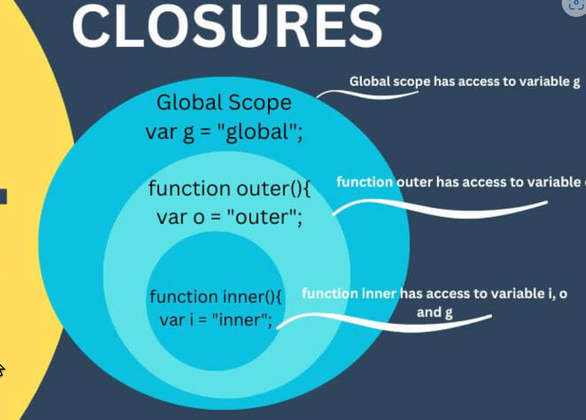
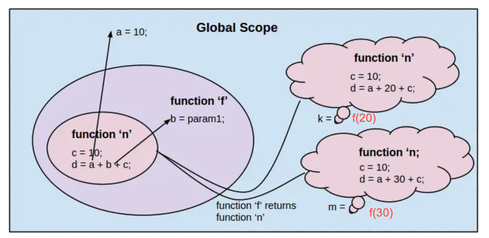

<style>
    .columns {
    display: flex;
  }
  .column {
    flex: 1;
    padding: 10px;
  }
  .column.large{
    flex: 2;
  }
  .small-font {
    font-size: 0.8em;
  }

  section > header,
section > footer {
  position: absolute;
  left: auto;
  right: 90px;
  height: 20px;
}

header {
  top: 30px;
}

footer {
  bottom: 30px;
}

</style>

# Ch6 Functions

Cover the following topics:
- Function declaration, arguments, and return values
  - named function, function expression, arrow function
- Variable scope in functions
- Nested functions and closures
- Function callbacks

## 1. What are functions?

- Functions are **reusable blocks** of code that can be called by **name**.
- Functions are **objects**
  - can be passed as arguments to other functions
  - can be returned by other functions
  - can be assigned to variables

**BEST PRACTICE** Do not repeat yourself. 
- If you find yourself writing the same code multiple times, consider refactoring it into a function.
- It makes your codes more readable and maintainable.

## 2. Function declaration

- Recall that function is an object.
- You declare a function and then call it by its name.

- There are three ways to declare a function:
  - `function` statement
  - `function` expression
  - Arrow function (ES6)

### Function statement

Create a function that takes two arguments and returns the sum of the two arguments.

- Use the `function` statement

```javascript
function add(a, b) {
  return a + b;
}
```

### Function expression
- Use the `function` expression
  - the expression in the LHS create a function object and assign it to the variable `add`.

```javascript
const add = function(a, b) {
  return a + b;
};
```

### Arrow function (ES6)

- Use the arrow function
  - a short-hand syntax to create a function object.

```javascript
const add = (a, b) => {return a+b;};
```

- If you have only one return statement in the function, you can omit the curly braces and the `return` keyword.

```javascript
const add = (a, b) => a+b;
```
---

**Concept review**: When to append a semicolon to the end of a line?
- Append a semicolon to end of a statement to avoid unexpected behavior and improve code readability.
- You don't need to append a semicolon to the end of a code blocks.
  - e.g. if, for, while, function statements.

### Lab 6.1: Write a function that takes the body weight and height of a person and returns the BMI of the person.

- The formula for BMI is `weight / (height**2)`.
- Use the `function` statement, `function` expression, and arrow function to create the function.
- Default the height to 0 if it is undefined, null, or not a number (false values) .

## 3. Invoking a function

- Invoke a function by calling its name followed by parentheses.
- Provide the arguments in the parentheses.

```javascript
const sum = add(1, 2);
console.log(sum); // 3
```

---

- If you don't provide the parentheses, you are not calling the function but referencing the function object.

```javascript
add = (x, y) => x + y;
console.log(add); // Prints the function object
```


---

**BEST PRACTICE**: Write comments for your functions.

- Describe the purpose of the function.
- Describe the arguments and return values.
- Follow the [JSDoc](https://github.com/jsdoc/jsdoc) format to allow tools to automatically generate documentation for your code.
- [How to use JSDoc - Basics & Introduction @ youtube 13:04](https://www.youtube.com/watch?v=Nqv6UkTROak)

---

Example of writing comments for a function using JSDoc format:

```javascript
/**
 * Calculate the BMI of a person.
 * @param {number} weight - The body weight of the person.
 * @param {number} height - The height of the person.
 * @returns {number} The BMI of the person.
 */
const calculateBMI = (weight, height) => {
  height = height || 0;
  return weight / (height ** 2);
};
```

### Immediately-Invoked Function Expressions (IIFE)

- An IIFE is a function that is immediately invoked after it is defined (self-invoking function).
  - Combine the function definition and invocation in a single expression.
- They don't pollute the global object - 
  - the variables declared inside the IIFE are not accessible outside the IIFE.
- The IIFE cannot be reinvoked after it is executed because it don't have a name (anonymous function).

### When to use IIFE?

- Add event listeners to elements when the page is loaded.
- Use IIFE to avoid polluting the global namespace.
- Create private properties for a function/object.

Reading: [IIFEs in JavaScript — Use cases](https://medium.com/swlh/iifes-in-javascript-use-cases-92811495d936)

### Syntax of IIFE

The syntax of an IIFE:
```javascript
(function() {
  // code here
})(arguments);
```
---

Can use the arrow function in the IIFE, too: 
```javascript
(() => {
  // code here
})();
```

Pass arguments to the IIFE:
```javascript
((a, b) => {
  console.log(a + b);
})(1, 2);
```

### Example: Add an event listener to a button element using an IIFE.

```javascript

// IIFE
 (function() {
  // define a function to calculate the BMI
  const calculateBMI = (weight, height) => {
    return weight / (height ** 2);
  };

  // Add an event listener to a button with the id 'calculateButton'
  document.getElementById('calculateButton').addEventListener('click', function() {
    const weight = parseFloat(document.getElementById('weight').value);
    const height = parseFloat(document.getElementById('height').value);
    const bmi = calculateBMI(weight, height);
    alert('Your BMI is: ' + bmi);
  });
})();
```

You can not access the `calculateBMI` function outside the IIFE.

See full example in [ex_06_iife.html](ch6/ex_06_iife.html)

---

Example: Not using the IIFE

```javascript

const calculateBMI = (weight, height) => {
    return weight / (height ** 2);
  };

/**
 * Init function. (Global object, get an extra object in the global space)
 */
function init () {
  // Add an event listener to a button with the id 'calculateButton'
  document.getElementById('calculateButton').addEventListener('click', function() {
    const weight = parseFloat(document.getElementById('weight').value);
    const height = parseFloat(document.getElementById('height').value);
    const bmi = calculateBMI(weight, height);
    alert('Your BMI is: ' + bmi);
  }
  // Invoke the function
  init();
```
The global object has extra function objects: `calculateBMI` and `init`.

### Example: Create private properties for a function/object.
Create a module that has two functions:
- `increment`: increment a counter by 1.
- `setStartValue`: set the start value of the counter.
- The counter is a private variable of the module.

---

```js
(function() {
    let counter = 0;

    function setStartValue(startValue) {
        counter = startValue;
    }
    function increment() {
        counter += 1;
        console.log(counter);
    }

    // Expose the private functions to the global or window objects publicly.
    // Use the global object to attach the module in the NODE.js environment
    // Use the window object to attach the module in the browser environment
    global.myModule = {
        increment: increment,
        setStartValue: setStartValue
    };
})();
```

--- 
Run the following code to test the module.

```js
myModule.setStartValue(10);
myModule.increment()
myModule.increment();
myModule.increment();
```

Outputs:
```
11
12
13
```


### Lab 6.2  Create a program that will randomly describe an inputted name.

Create a module that has a function that randomly describes a name.
- The module has a private array of descriptive words.
- The function takes a name as the argument.
  - Select a random value from the array of descriptive words.
  - Return a string that describes the name.

For example, the list of descriptive words is `['smart', 'funny', 'kind', 'hardworking']`. Given the name `Alice`, the program may print `Alice, your are smart`.

Hint:
- `Math.random()` returns a random number between 0 and 1.
- `Math.floor()`  returns the largest integer less than or equal to a given number.

<!-- The practice is modified from the Practice exercise 6.2 in the textbook. -->
## 4. Function parameters and arguments

### Parameters vs Arguments 
- Parameters are the variables in the function declaration.
- Arguments are the values passed to the function when it is called.

```javascript   
const add = (a, b) => a + b;
const sum = add(1, 2);
```

- The function `add` has two parameters `a` and `b`.
- The function is called with the arguments `1` and `2`.

### Flexible number of arguments

- The number of arguments passed to a function can be different from the number of parameters.
- When the number of arguments is fewer than the number of parameters, the missing parameters are assigned `undefined`.

Example:

```javascript
const add = (a, b) => a + b;
const sum = add(1); // 1 + undefined = NaN
```
- parameter `b` is `undefined` because the argument is missing.

---
- When the number of arguments is more than the number of parameters, the extra arguments are ignored.

```javascript
const add = (a, b) => a + b;
const sum = add(1, 1, 4); // 1 + 1 = 2
```

- The extra argument `4` is ignored because no extra parameter to take it.

### Optional parameters (Or default parameters)

- Some parameters might be optional when you invoke the function.
- You need to provide a default value for the optional parameters.
- Set the default value in the function declaration.

```javascript
function greet(name = 'Alice') {
  return `Hello, ${name}`;
}
console.log(greet()); // Hello, Alice
console.log(greet('Bob')); // Hello, Bob
```

--- 

Example: 
```javascript
// The descWords parameter is optional.
function randomWord(name, descWords = ['smart', 'funny', 'kind', 'hardworking']) {
    // scale the random number to the length of the array and round down to the nearest whole number
    let randomIndex = Math.floor(Math.random() * descWords.length);
    return `${name}, you are ${words[randomIndex]}.`;
}
console.log(randomWord('Alice')); // might be: Alice, you are smart.
```
- The second parameter `descWords` has a default value of `['smart', 'funny', 'kind', 'hardworking']`.
- If you don't provide the second argument, the default value is used.


### Pass an array to a function as a list of arguments: the spread operator ...

Consider the following scenario:
- You have an array of numbers `[1, 2, 3, 4]`.
- You have defined a function that takes four arguments and returns the maximum value of the four arguments.
    `(x, y, z, w) => Math.max(x, y, z, w)`
- How do you apply the function to the array of numbers?

---

Use the spread operator `...` to spread elements of an array into a list of arguments.

Use the spread operator in the function invocation.
```javascript
const numbers = [1, 2, 3, 4];
const maxValue = (x, y, z, w) => Math.max(x, y, z, w);
const max = maxValue(...numbers); // equivalent to maxValue(1, 2, 3, 4). Result: 4
```


### Rest of the parameters (ES6)

- You might not know the number of arguments passed to a function in advance.
- The feature of "Rest of the parameters" will help you to handle the variable number of arguments.
- e.g. Design a function to find the maximum value of a variable number of arguments.
- A function that can take variable variable number of arguments is call **vararg (or variadic) function**

### The syntax of the rest of the parameters

```js
function yourFunction(param1, param2, ...restOfParams) {
  // code here
}
```
- `restOfParams` is an **array** that contains the rest of the arguments passed to the function.
- Use the spread operator `...` to declare the rest of the parameters.

---

Example: variable arguments 
- Create a function that takes a variable number of arguments and returns the max value.

```javascript
const maxValues = (...numbers) => {
    // numbers is an array
    console.log(typeof numbers); // array object
    console.log(`array size: ${numbers.length}`); 
  return Math.max(...numbers);
};
const max = maxValues(1, 2, 3, 4, 5); // 5
```

### Application of the rest of the parameters: 

A function calls another function with arguments.

```javascript
const add = (a, b) => a + b;

function invokeFunction(func, ...args) {
  // args is an array. Use the spread operator to take the elements out of the array.
  return func(...args);
}

const sum = invokeFunction(add, 1, 2); // 3
```

### Lab 6.3: Create a simple addition and multiplication calculator.

1. Create an `sum` function that takes a variable number of arguments and returns the sum of the arguments.
2. Create a `multiply` function that takes a variable number of arguments and returns the product of the arguments.
3. Yon must write a function to invoke the `sum` and `multiply` functions with the arguments provided.
4. For the inputted string "sum 1 2 3 4", your program should call the `sum` function with the arguments 1, 2, 3, and 4 and print the result.
5. For the inputted string "multiply 1 2 3 4", your program should call the `multiply` function with the arguments 1, 2, 3, and 4 and print the result.

---

Hint:
- Use the `split` method of String to split the inputted string into an array of strings. Then, assign them to an array of variables (array destructuring technique).
  - `let [operation, ...args] = str.split(" ");`
- Use the map data structure to index and store the functions if you don't want to use a switch or if-else statement.

## 5. Variable scope in functions

- Scope defines where you can access a certain variable.
- JavaScript has three types of scope
  


---

  - Global scope: variables declared outside of a function.
  - Function scope: variables declared inside of a function.
    - Use the `var` keyword to declare a variable with function scope.
    - Can be accessed in the entire function.
  - Local scope: variables declared inside a block in a function.
    - Use the `let` or `const` keyword to declare a variable with local scope.


---

Example: function and local scope
```javascript
var x = 1;  // Global Scope

function myFunction(p) {
  // parameter p is function scope variable
  var functionScopeVar = 10;   // function scope variable 
  if (true){
    let y = 20;  // block scope variable
    var z = 30; // function scope variable
  }
  // leave the if block
  console.log(x); // 1 (Global)
  console.log(y); // ReferenceError: y is not defined (block scope)
  console.log(z); // 30 (Function scope)
  console.log(p); // 100 (Function scope)
}

myFunction(100);
console.log(x); // 1
console.log(y); // ReferenceError: y is not defined
console.log(z); // ReferenceError: z is not defined
console.log(p); // ReferenceError: param is not defined
```

### Hoisting characteristics of `var` variable declarations

- For variables declared with `var`, their declarations are hoisted (move) to the top of the function and is initialized with `undefined`.
- No initialization is done for the variables declared with `let` and `const`.

For example:

```js 
// hoisting characteristics of var
function hoisting() {
  // use of the variable `a` before declaring it.
  // Since the variable declaration is moved 
  // to the top of the function (hoisted) and are set to `undefined`.
  console.log(a); // undefined
  // Assign a value to a; Not declare a new variable
  var a = 10;
  console.log(a); // 10
}
```

---

Example: hoisting of `let` and `const` variables

```js
function hoisting() {
  console.log(b); // ReferenceError: Cannot access 'b' before initialization
  let b = 20;
  console.log(b); // 20
}
```
- variable `b` is hoisted to the top of the function but not initialized.
- Before the initialization, the variable is in the **temporal dead zone (TDZ)**.
- Accessing the variable in the TDZ will cause a ReferenceError.

## 6. Nested functions

- A function (inner) can be defined inside another function (outer).
  - Let call the former the **inner** function and the latter the **outer** function.

- Be careful of the variable scope and visibility issue when using nested functions.
  
```js
function outerFunction() {
  let outerVar = 10;
  ...
  function innerFunction() {
    let innerVar = 20;
    ...
  }
```

### Rules of the variable scope in nested functions

- Rule 1: An inner function can access the variables and parameters of the outer function.
- The inner function is within the scope of the outer function. 
  - So, it can access the variables and parameters of the outer function.

```javascript
function outerFunction(x) {
  let outerVar = 10;
  function innerFunction() {
    console.log(x); // Hi, the argument passed to the outer function
    console.log(outerVar); // 10
  }
  innerFunction();
}
outerFunction('Hi');
```

---

- Rule 2: An outer function cannot access the variables and parameters of the inner function.
  - The inner function is close to the outer function.

```javascript
function outerFunction() {
  function innerFunction() {
    // function scope starts
    let innerVar = 20;
  } // function scope ends

  console.log(innerVar); // ReferenceError: innerVar is not defined
}
outerFunction();
```
---

- Rule 3: The variable in the inner function has a higher priority when there is a variable with the same name in the outer function.

```javascript
function outerFunction() {
  let outerVar = 10;
  function innerFunction() {
    let outerVar = 20;
    console.log(outerVar); // 20
  }
  innerFunction();
}
outerFunction();
```

---

- Rule 4:  We cannot invoke the inner function from the outside of the outer function.
  - The inner function is only visible within the outer function.

```javascript
function outerFunction() {
  function innerFunction() {
    console.log('Inner function');
  }
}
innerFunction(); // ReferenceError: innerFunction is not defined
```


## 7. Closures

- A closure is a feature that allows inner function to access variables in the outer function even after that outer function has finished executing

<div class="columns">
<div class="column" >

</div>
<div class="column">

- outer() can access the variable g and o.
- inner() can access the variable g, o, and i

</div>
</div>

Fig Src: [Understanding Closure Functions in JavaScript: Examples and Explanation - Blog and News](https://tamdiary.com/technology/2023/understanding-closure-functions-in-javascript-examples-and-explanation/)

---

- The closure is a common pattern and a powerful feature in JavaScript.
- This happens commonly when you return a (nested) function from a (outer) function.

- Example: Return a function from a function generates a closure.

```javascript
function outerFunction() {
  let outerVar = 10;
  function innerFunction() {
    console.log(outerVar);
  }
  // return the inner function object (not invoking the inner function)
  return innerFunction;
}

// aFunc and innerFunction refer to the same function object
const aFunc = outerFunction();

```
---


A question arises: Can `aFunc` access the variable `outerVar`?
- The `outVar` is a local variable of the `outerFunction`.

We need to understand the concept of the **lexical scope** to answer the question.


### Lexical Scope and variable scope of the inner function

- **Lexical scope** is the scope of a variable defined by its location in the source code.
- That is, the variable scope is determined at the time of defining the function, not at the time of invoking the function.
-  This means that the **inner function** are executed using the **variable scope that was in effect when they were defined** (design time), not the one that is in effect when they are invoked (runtime).

---
Determine the lexical scope of the inner function in the following code.

```js
// Global variable 
const a = 10;

function f(b){
    // The return function can access the variables a, b, and c
    // variables a and b have the lexical scope to the inner function
    return function (){
        let c = 10;
        return a + b + c;
    }
}

funcN1 = f(20);
// funcN1 has the variable b = 20, a = 10
const k = funcN1();
console.log(k); // 40

funcN2 = f(30);
// funcN2 has the variable b = 30, a = 10
const m = funcN2()
console.log(m); // 50
```
Note: the parameter `b` becomes a private variable of the inner function.

---

The following figure depicts the closure in the above example.
<fig>



Fig source: [Javascript closures —An Angular approach](https://medium.com/@rama41222/javascript-closures-an-angular-approach-3764d13ca21b) </caption>

</fig>

### Lab 6.4: Count the number of clicks for buttons (Application of closures)

This lab demonstrates using the closure technique to **create a private counter for each event listener**.

1. Create a HTML page with three buttons, each with a label to indicate the number of clicks. Give each button a unique id.
2. Create a function that returns a function as the event handler.
   - The returned function increments a counter and updates the label with the counter.
3. Add the event listener to each button 


---

[Demo in CodePen](https://codepen.io/hychen39/pen/gONgyvN) 


Hint:
- Need the use the closure technique to have each listener function to have its own counter.
- You may use the IIFE technique to shorten the code.

---

Solutions:

Step 1. Create a HTML page with three buttons.

```html
    <h1>Lab 6.4 Solution</h1>
    <h2>Count the number of clicks for buttons.</h2>
    <!-- Create three buttons with labels.  -->
    <div>
        <button id="btn1">Button 1</button> <label id="lbl1"></label>
    </div>
    <div>
        <button id="btn2">Button 2</button> <label id="lbl2"></label>
    </div>
    <div>
        <button id="btn3">Button 3</button> <label id="lbl3"></label>
    </div>
    <script>
      // Add an event listener to each button that increments a counter when the button is clicked.
    </script>
```
---

Step 2. Create a function that returns a function as the event handler.

```javascript
 // define a function to return a function as the event handler
    counterFun = function(idx, counter){
        return function(){
            // get the label element
            // idx and counter are the private variables of the inner function
            // They are lexical scope to the inner function
            var lbl = document.getElementById(`lbl${idx+1}`);
            counter ++;
            lbl.innerHTML = counter;
        }
    }
```

---
Step 3. Add the event listener to each button.

```javascript
// Find all the buttons in the document
var buttons = document.getElementsByTagName("button");
// Add an event listener to each button
for (let [idx, btn] of Array.from(buttons).entries()){ 
    // get the id of the Button
    console.log(idx)
    // add the event listener to the button
    btn.addEventListener("click", counterFun(idx, 0));
}
```

--- 

- If you want to shorten the code, you can use the IIFE technique, as shown below.
  - Replace the function name with the function definition in the event listener.
- In this case, you don't need to define the `counterFun` function in the step 2.

```javascript
var buttons = document.getElementsByTagName("button");
for (let idx = 0; idx < buttons.length; idx++) {
    buttons[idx].addEventListener("click", 
    // IIFE to return a function as the event handler
    (function(idx, counter){
        return function(){
            var lbl = document.getElementById(`lbl${idx+1}`);
            counter ++;
            lbl.innerHTML = counter;
        }
    })(idx, 0)
    );
}
```

Step 4. Test your page. 

---

Conclusion for the lab:
- Use the closure technique to create a private variable for each event listener.
- The parameters of the outer function become the private variables of the inner function.
- The parameters of the outer function are lexically scoped to the inner function.

---

What wrong with the following code?

```javascript
// add event listener to the buttons
    // HTML collection
    var buttons = document.getElementsByTagName("button");
    for (let idx = 0; idx < buttons.length; idx++) {
        // add the event listener to the button
        var counter = 0;
        buttons[idx].addEventListener("click", function(){
            console.log('clicked btn ' + idx);
            counter++;
            console.log(counter);
        });
    } // end of for loop
```

---

- variable `idx` and `counter` are declared in the outer block.
- They are lexically scoped to the inner function.
- However, the `counter` is shared by all event listeners since it is declared with `var` that make it a function scope variable.

## 8. Function callbacks: passing a function as an argument

- A callback function is a function that is passed as an argument to another function.
- The invoking function can call the callback function.

Example: Executing a function at an interval.
- Use the built-in `setInterval()` to execute a function at a specified interval.

Example:
```javascript
function sayHello() {
  console.log('Hello');
}
setInterval(sayHello, 1000); // print 'Hello' every second
```

## 9. Summary

- Functions are objects in JavaScript.
- To define a function, you can use the `function` statement, `function` expression, or arrow function.
- IIFE is an expression that combine the function definition and invocation.
  - use it when 
    - to avoid polluting the global namespace
    - to create a module with private properties and public methods.
    - to add event listeners to elements when the page is loaded.
---

- Calling a function with a flexible number of arguments.
  - JS allows you to pass more or fewer arguments than the number of parameters.
  - Lang features: optional parameters, rest of the parameters, and spread operator.
- Variable are hoisted in the function scope.
  - `var` variables are hoisted to the top of the function and initialized with `undefined`.
  - `let` and `const` variables are hoisted but not initialized (Temporal Dead Zone).
- Nested functions and closures.
  - A closure is a feature that allows inner function to access variables in the outer function even after that outer function has finished executing.
  - The inner function can access the variables with the lexical scope to it. 

