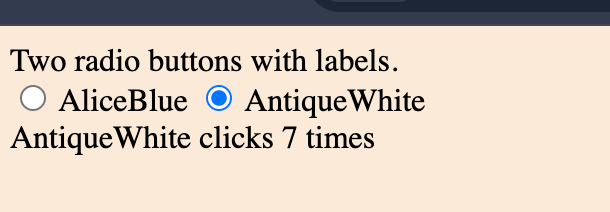

# Practices for Chapter 6


## Practice 6-1 

Explain what is the callback function in JavaScript.

Use the `setTimeout` function to illustrate the concept of a callback function.


## Practice 6-2

Explain what "closure" is in JavaScript.

Illustrate a scenario where a closure is used.


## Practice 6-3

Write a function that can take an arbitrary number of arguments and return a string that concatenates all the arguments.

For example, if the function is called with `concat("a", "b", "c")`, it should return `"abc"`.

Submit your code and a screenshot of the output.


## Practice 6-4

Apply the closure techniques. 

Consider the following code snippet:

```html
<!DOCTYPE html>
<html>
<head>
    <title>Lab 6.4 Solution</title>
</head>
<body>
    Two radio buttons with labels.
    <div>
        <input type="radio" id="radio1" name="radio" value="1" data-color="AliceBlue"> <label id="lbl1">AliceBlue </label>
        <input type="radio" id="radio2" name="radio" value="2" data-color="AntiqueWhite"> <label id="lbl2">AntiqueWhite</label>
    </div>  
    <div>
        <label id="totalClicks">0</label>
    </div>

</body>

</html>
```

You need to add a click event listener to each radio button. 

When a radio button is clicked, the body's background color should change to the color specified in the `data-color` attribute of the radio button. For example, if the user clicks the first radio button, the background color should change to `AliceBlue`. 

The event listeners for the two radio buttons have the same logic but with their counter to keep track of the number of clicks.

The following are the guided steps to complete the practice:

1. Get all the radio button elements.
2. Iterate through the radio button elements and add an event listener to each radio button.
3. When adding an event listener, create a function that returns a function so that the returned function can use the parent function's argument as a closure variable to keep track of the number of clicks.
4. In the returned function, change the body's background color to the color specified in the radio button's `data-color` attribute. Then, increment the counter by 1. Finally, update the label's text with the id `totalClicks` to show the number of clicks.

Hint:
- Use `this` to refer to the clicked radio button.
- Use `this.getAttribute("data-color")` to get the color value in the `data-color` attribute of the triggered radio button.


The example screenshot is shown below:


  
