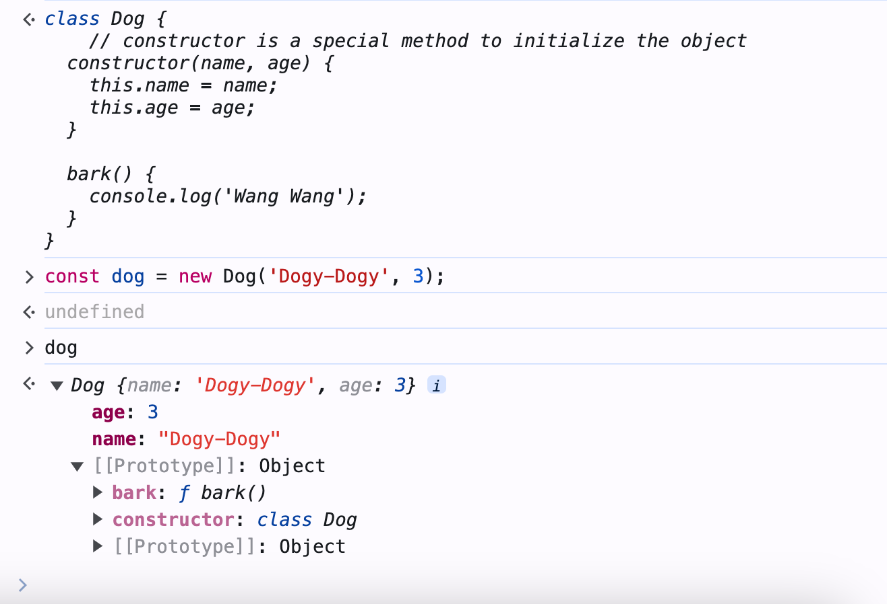
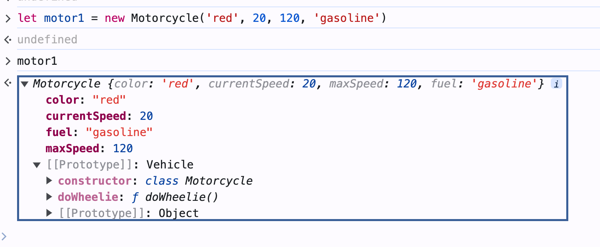
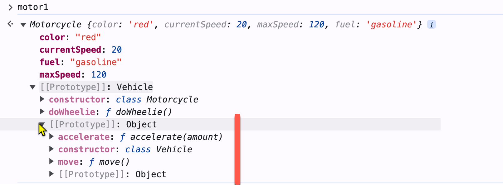

# Chapter 7 Classes 

## Review of Objects 

### Create an object
- An object contains properties and methods.
- Use object literal to create an object

Example: Create a dog object with properties `name` and `age` and a method `bark`.

```javascript
const dog = {
  name: 'Dogy-Dogy',
  age: 3,
  bark: function() {
    console.log('Wang Wang');
  }
};
```

### Access properties and methods

- To access properties and methods, Use the dot `.` or square bracket `[ ]` operators.

```javascript
// get the name
console.log(dog.name); // Dogy-Dogy
console.log(dog['age']); // 3
// call the bark method
dog.bark(); // Wang Wang
```

### Add, delete, check properties

Object's properties are dynamic. You can add or delete them. 

Example: Add and delete properties from the dog object.

```javascript
//Add a new property
dog.color = 'brown';
console.log(dog.color); // brown
// delete a property
delete dog.color;
console.log(dog.color); // undefined
```

When you want to check if a property exists in an object, you can use the `in` operator or the `hasOwnProperty` method of the object.

Example: Check if the dog object has the property `name.`

```javascript
console.log('name' in dog); // true
console.log(dog.hasOwnProperty('name')); // true
```

## Classes and Objects 

### Use a class to instantiate an object

- A class is a blueprint for creating objects.
  - An object is an instance of a class.
  - Use the class to define the properties and methods of an object.
  - Use the `class` keyword to define a class (ES6).

- Each class must have a constructor method to initialize the object.
  - The constructor method is a special method to initialize the object.
  - The constructor method has no return value.
- Use the `new` keyword with the class name to call the constructor method.

Example: Create a class `Dog` with properties `name` and `age` and a method `bark.`

```javascript
class Dog {
    // constructor is a special method to initialize the object
  constructor(name, age) {
    this.name = name;
    this.age = age;
  }

  bark() {
    console.log('Wang Wang');
  }
}
```

Use the `new` keyword with the class name to create an object from the class.

```javascript
// 1. Create a new object. 2. Initialize the object by calling the constructor. 
// 3. Assign the object to the variable dog.
const dog = new Dog('Dogy-Dogy', 3);
console.log(dog.name); // Dogy-Dogy
console.log(dog.age); // 3
dog.bark(); // Wang Wang
```



*Best Practice*: naming conventions for the class, object, and method names:
- Class name: should be nouns, in mixed case, with the first letter of each internal word capitalized
  - e.g. Dog, ImageSprite
- Object name: should be nouns, in mixed case with the first letter lowercase and the first letter of each internal word capitalized.
  - e.g. dog, imageSprite
- Method name: should be verbs, in mixed case with the first letter lowercase and the first letter of each internal word capitalized.
  - e.g. run(); runFast(); getBackground();

### Private properties, setters, and getters

- Use the `#` symbol to make a property private.
- Why use private properties?
  - Encapsulation: hide the implementation details of the class.
  - Prevent direct access to the property.
  - Add validation or logic when accessing the property.
- How to access private properties?
  - Create getter and setter methods for these private properties.

- You must declare the private properties in the class. 
  - Not required for the public properties.

Example: make the `name` and `age` properties private for the `Dog` class.

```javascript
class Dog {
    #name;
    #age;
    constructor(name, age) {
        // direct access to the private properties
        this.#name = name;
        this.#age = age;
        this.bark = function() {
            console.log('Wang Wang');
        };
    }
}
```

Add the getter and setter methods for the private properties.
- and use them in the constructor to initialize the private properties.

```javascript
class Dog {
    #name;
    #age;
    constructor(name, age) {
        // use the setter methods to initialize the private properties
        this.name = name;
        this.age = age;
        // method for the class
        this.bark = function() {
            console.log(`${this.name} Wang Wang`);
        };
    }

    get name(){
        return this.#name;
    }
    set name(name){
        this.#name = name;
    }

    get age(){
        return this.#age;
    }
    set age(age){
        // validate age not negative
        age = age < 0 ? 0 : age;
        console.log('Age is less than 0. Set to 0.');
        this.#age = age;
    }
```

Use the getter and setter methods to access the private properties.
- Use them as if they are public properties.

```javascript
const dog = new Dog('Dogy-Dogy', -1);
console.log(dog.name); // Dogy-Dogy
console.log(dog.age); // 0
// set the name through the setter method.
dog.name = 'Dogy';
console.log(dog.name); // Dogy
```

## Inheritance

- Inheritance is a mechanism to create a new class (child) from an existing class (parent).
- The parent class represents the general properties and methods of the child class.
  - e.g., a Motorcycle is a kind of vehicle. So, the Motorcycle inherits the properties and methods of the Vehicle.
  - Vehicle is the parent class. Motorcycle is the child class.

### Inherit from a parent class

- Inheriting from a parent class means the child class has all the parent's properties and methods. 
  - Also, the child class can add new properties and methods.
- e.g. All vehicles have common properties and methods
  - Properties: color, current speed, max speed
  - Methods: move, accelerate
- The motorcycle has additional properties and methods
  - Property: fuel 
  - Method: wheelie

### Process to instantiate a child class

- The child class specifies the parent class using the `extends` keyword.
- It's the child class's responsibility to instantiate its parent object. 
  - The child class must first call the parent class's constructor (`super()`) to initialize the parent's properties. 
  - Then, the child class can initialize its properties.

Example: Create the `Vehicle` class

```javascript
class Vehicle {
    // don't have the private fields. So don't have to declare them.
    // Add properties to the `this` object directly in the constructor
    constructor(color, currentSpeed, maxSpeed){
        // add properties to the `this` object
        this.color = color;
        this.currentSpeed = currentSpeed;
        this.maxSpeed = maxSpeed;
    }

    // methods
    move(){
        console.log("moving at", this.currentSpeed, "km/h");
    }

    accelerate(amount){
        this.currentSpeed += amount;
        // max speed limitation
        if (this.currentSpeed > this.maxSpeed){
            this.currentSpeed = this.maxSpeed;
        }
    }
}
```

Create the `Motorcycle` class that inherits from the `Vehicle` class.

Write the constructor for the `Motorcycle` class. 
1. Call `super()` to initialize the parent's properties.
2. Add and initialize the additional properties of the child class.

```javascript
class Motorcycle extends Vehicle{
    /**
     * constructor
     * Need to call the parent class constructor at the beginning of the child class constructor
     * @param {string} color 
     * @param {number} currentSpeed 
     * @param {number} maxSpeed 
     * @param {string} fuel: type of fuel
     */
    constructor(color, currentSpeed, maxSpeed, fuel){
        // MUST call the parent class constructor
        super(color, currentSpeed, maxSpeed);
        // Add and initialize additional properties to the `this` object
        this.fuel = fuel;
    }
}
```

Add the `wheelie` method to the `Motorcycle` class.

```javascript
class Motorcycle extends Vehicle{
    // constructor ...

    // Additional method
    doWheelie(){
        console.log("Driving on one wheel");       
    }
}
```

Refer [ex_07_inheritance.js](http://lecture_notes/ch7/ex_07_inheritance.js) for the complete code.

Instantiate the `Motorcycle` object and call its methods.

```javascript
let motor = new Motorcycle("red", 0, 200, "gasoline");

console.log(motor.color); 
motor.accelerate(30);
motor.move();
motor.doWheelie(); 
```

## Prototypes and Prototype Chain

### Prototype
- JavaScript does not have classes as in the Class-based languages like Java or C++.
- JavaScript uses "objects" to implement inheritance.
- The object that serves as the blueprint to create other objects is called a **prototype**.

Example: Check the prototype of the vehicle object.

Open the browser console, then do the following:
1. Copy the Vehicle class definition to the console to create the Vehicle class.
2. Copy the Motorcycle class definition to the console to create the Motorcycle class.
3. Create a Motorcycle object: `let motor1 = new Motorcycle('red', 0, 200, 'gasoline');`
4. Type `motor1` in the console to display the vehicle object.

<fig>



<caption>Motorcycle object `motor1`</caption>

</fig>

- The `motor1` object is a type of `Motorcycle` (The first line of the hierarchy).
- The `motor1` object has four properties: `color`, `currentSpeed`, `maxSpeed`, and `fuel`.
- But we cannot see the available methods. Expand the `[[Prototype]]` property to see the methods and the parent object.
  - `[[]]` indicates it is a hidden and internal property that is not directly accessible.
  - Use the `__proto__` property or its getter `Object.getPrototypeOf()` to access the `[[Prototype]]` property.
- The `[[Prototype]]` property tells:
  - The `Motorcycle` object is created from the `Vehicle` object plus the additional method: `doWheelie()`.



### Prototype Chain

- Continue the above example in the browser console.
- Expand the `[[Prototype]]` property of the `Vehicle` object to see its methods and parent object.
    - The `Vehicle` object is created from the `Object` object plus two additional methods: `move()` and `accelerate()`.


From the above example, we can conclude:
1. Each object has a `[[Prototype]]` property that points to its parent object.
2. The top-level parent object is the `Object` object.
   - Its `[[Prototype]]` property points to `null.`
3. That forms a chain of objects to create the target object, called the **prototype chain**.

If you want to iterate through the prototype chain, use the following code:

```javascript
let obj = motor1; // starting point of the prototype chain
do {
    console.log(obj);
} while (obj = Object.getPrototypeOf(obj)); // recursively get the parent object
```

In the above code:
- `Object.getPrototypeOf(currentObject)` returns the parent object of the current object.
  - It is a getter to the `[[Prototype]]` property: `currentObject.__proto__`.


### Advantages of Prototypes

#### Save the memory space 
- Multiple objects of the same class own property values but share the same methods.
  - Save the memory space.

In the following example:
- Two dog objects are created. 
- Each dog object has its name, breed, and color property values.
- But, since they are a kind of Dog, they have the same behavior.
  - which means they share the same methods: `bark()`
- This can save the memory space.


<fig>


<caption>Fig Source: [JavaScript Object Prototype Pro Trick](https://medium.com/@kaklotarrahul79/javascript-object-prototype-pro-trick-7e7501bf2d35) </caption>

</fig>

#### Dynamic behavior

- You can add new methods to the prototype object at runtime to expand its behavior.

- For example, we add a new method, `turbo()`, to the `Vehicle` object, which is the parent of the `Motorcycle` object.

```javascript
let motor1 = new Motorcycle("red", 10, 200, "gasoline");
let motor2 = new Motorcycle("blue", 40, 120, "diesel");

//Get the prototype of the motor1 object
let motorcyclePrototype = Object.getPrototypeOf(motor1);
// get the prototype of the motorcyclePrototype object, which is the Vehicle object
let vehiclePrototype = Object.getPrototypeOf(motorcyclePrototype);
// add the turbo() method to the Vehicle object
vehiclePrototype.turbo = function(){
     console.log("Turbo() in Vehicle prototype");
    this.currentSpeed *= 2;
};
```

- Now, when your call the `turbo()` method on the `motor1` object, it will call the `turbo()` method in the `Vehicle` object.
- Since the `Vehicle` object is the parent of the `Motorcycle` object, the `turbo()` method is also available to the `motor2` object.

```javascript
console.log("motor1 current speed: ", motor1.currentSpeed); 
motor1.turbo();
console.log("motor1 speed after turning on turbo: ",motor1.currentSpeed);

console.log("motor2 current speed: ", motor2.currentSpeed); 
motor2.turbo();
console.log("motor2 speed after turing on turbo: ",motor2.currentSpeed);
```

The output will be:

```
motor1 current speed:  10
Turbo() in Vehicle prototype
motor1 speed after turning on turbo:  20
motor2 current speed:  40
Turbo() in Vehicle prototype
motor2 speed after turning on turbo:  80
```

See [ex_07_prototype_add_method.js](./ex_07_prototype_add_method.js) for the complete code.


Final note:
- Instead of using `Object.getPrototypeOf()`, you can use the prototype property of a class (not an object) to access the class's prototype object.
  - e.g. `Vehicle.prototype` returns the prototype object of the Vehicle class.

- So, the above code can be simplified as follows:

```javascript
Vehicle.prototype.turbo = function(){
    console.log("Turbo() in Vehicle prototype");
    this.currentSpeed *= 2;
};
```


Conclusion of the above example:
1. Objects of the same class share the same methods, although they have their property values.
2. JS can add new methods at runtime to the prototype object to expand the object's behavior, providing developers with more flexibility.


Advanced reading: 
- [Object prototypes - Learn web development | MDN](https://developer.mozilla.org/en-US/docs/Learn/JavaScript/Objects/Object_prototypes)


## Summary 

- Objects vs Classes 
  - Objects: contain properties and methods.
  - Classes: a blueprint to create objects.
- Inheritance 
  - A child class inherits the properties and methods of the parent class.
  - The child class can add new properties and methods.
- Prototypes and Prototype Chain
  - JavaScript uses prototypes to implement inheritance.
  - Each object has a `[[Prototype]]` property that points to its parent object.
  - The prototype chain is a chain of objects to create the target object.
  - The prototype chain allows objects to share the same methods and expand the object's behavior at runtime.


  
