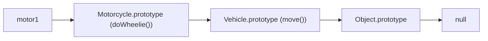
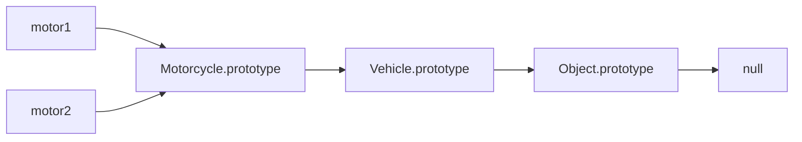

<style>
    .columns {
    display: flex;
  }
  .column {
    flex: 1;
    padding: 10px;
  }
  .column.large{
    flex: 2;
  }
  .small-font {
    font-size: 0.8em;
  }

  section > header,
section > footer {
  position: absolute;
  left: auto;
  right: 90px;
  height: 20px;
}

header {
  top: 30px;
}

footer {
  bottom: 30px;
}

</style>

# Chapter 7 Classes, Prototypes, and Inheritance

## Covered Topics

- Objects and Classes
- Inheritance
- Prototypes and Prototype Chain


## Review of Objects 

### Create an object
- An object contains properties and methods.
- Use object literal to create an object

Example: Create a dog object with properties `name` and `age` and a method `bark`.

```javascript
const dog = {
  name: 'Dogy-Dogy',
  age: 3,
  bark: function() {
    console.log('Wang Wang');
  }
};
```

### Access properties and methods

- To access properties and methods, Use the dot `.` or square bracket `[ ]` operators.

```javascript
// get the name
console.log(dog.name); // Dogy-Dogy
console.log(dog['age']); // 3
// call the bark method
dog.bark(); // Wang Wang
```

### Add and delete properties

- Object's properties are dynamic. 
- You can add or delete them during the runtime.
- You can also check if a property exists in an object.

Example: Add and delete properties from the dog object.

```javascript
//Add a new property
dog.color = 'brown';
console.log(dog.color); // brown
// delete a property
delete dog.color;
console.log(dog.color); // undefined
```

### Check if a property exists

- Use the `in` operator or the `hasOwnProperty` method of the object.

Example: Check if the dog object has the property `name.`

```javascript
console.log('name' in dog); // true
console.log(dog.hasOwnProperty('name')); // true
```

## Classes and Objects 

### Use a class to instantiate an object

- A class is a blueprint for creating objects.
  - An object is an instance of a class.
  - Use the class to define the properties and methods of an object.
  - Use the `class` keyword to define a class (ES6).

### Define a class 

- Each class must have a constructor method to initialize the object.
  - The constructor method is a special method to initialize the object.
  - The constructor method has no return value.

```js
class ClassName {
  constructor(arg1, arg2, ...) {
    // initialize the object's properties
    this.property1 = arg1;
    ...
  }
}
```

### Create an object from a class

- Use the `new` keyword with the class name to call the constructor method.

```js
const object = new ClassName(parameters);
```


### Example: Create a class `Dog` with properties `name` and `age` and a method `bark.`

```javascript
class Dog {
    // constructor is a special method to initialize the object
  constructor(name, age) {
    this.name = name;
    this.age = age;
  }

  bark() {
    console.log('Wang Wang');
  }
}
```
--- 

Instantiate the `Dog` class to create a dog object.

```javascript
// 1. Create a new object. 2. Initialize the object by calling the constructor. 
// 3. Assign the object to the variable dog.
const dog = new Dog('Dogy-Dogy', 3);
console.log(dog.name); // Dogy-Dogy
console.log(dog.age); // 3
dog.bark(); // Wang Wang
```

---


###  Best Practice: Naming conventions for the class, object, and method names:

- Class name: should be nouns, in mixed case, with the first letter of each internal word capitalized
  - e.g. Dog, ImageSprite
- Object name: should be nouns, in mixed case with the first letter lowercase and the first letter of each internal word capitalized.
  - e.g. dog, imageSprite
- Method name: should be verbs, in mixed case with the first letter lowercase and the first letter of each internal word capitalized.
  - e.g. run(); runFast(); getBackground();

## Private properties, setters, and getters

Why use private properties?
- Encapsulation: hide the implementation details of the class.
  - Prevent direct access to the property.
- Add validation or logic when accessing the property.


### How to make a property private?

- Use the `#` symbol to annotate a property to be private.
- You must declare the private properties in the class. 
  - Not required for the public properties.

Example: make the `name` and `age` properties private for the `Dog` class.

```javascript
class Dog {
    #name;
    #age;
    constructor(name, age) {
        // direct access to the private properties
        this.#name = name;
        this.#age = age;
        this.bark = function() {
            console.log('Wang Wang');
        };
    }
}
```

### How to access private properties? Getter and Setter methods

Add the getter and setter methods for the private properties.
- Use the `get` and `set` keywords to define the getter and setter methods.

```javascript
class Dog {
    #name;
    #age;
    constructor(name, age) {...}
    // getter method
    get name(){
        return this.#name;
    }
    // setter method
    set name(name){
        this.#name = name;
    }
}
```

### Add validation logic in the setter method
- and use them in the constructor to initialize the private properties.
- You can add the validation logic in the setter method.

```javascript
class Dog {
    #name;
    #age;
    constructor(name, age) {...}
    ...
    set age(age){
        // validate age not negative
        age = age < 0 ? 0 : age;
        console.log('Age is less than 0. Set to 0.');
        this.#age = age;
    }
```

### Use the getter and setter methods to access the private properties.

Use them as if they are public properties.
- don't need to use `()` to call the getter method.
- use the assignment operator `=` to call the setter method.
- The getter and setter methods are called automatically when you access the property.

```javascript
const dog = new Dog('Dogy-Dogy', -1);
console.log(dog.name); // Dogy-Dogy
console.log(dog.age); // 0
// set the name through the setter method.
dog.name = 'Dogy'; // auto call the setter method
console.log(dog.name); // Dogy; auto call the getter method
```

### Quick Practice 

- Create a class `Person` with private properties `name` and `age`.
- Add getter and setter methods for the properties.
- Add validation logic in the setter method to check if the age is negative.
  - Log a message to the console if the age is negative.
- Create the `p1` object of the `Person` class. 
  - The person's name is `John` and age is `-1`.
- Create the `p2` object of the `Person` class. 
  - The person's name is `Mary` and age is `20`.
  - Log the name and age of the `p2` object to the console.

<details>
<summary>Answer</summary>

```javascript
class Person {
    #name;
    #age;
    constructor(name, age) {
        this.#name = name;
        this.age = age; // call the setter method
    }
    get name(){
        return this.#name;
    }
    set name(name){
        this.#name = name;
    }
    set age(age){
        if (age < 0){
            console.log("Age is less than 0. Set to 0.");
            age = 0;
        }
        this.#age = age;
    }
}

// 
let p1 = new Person("John", -1);
let p2 = new Person("Mary", 20);
console.log(`{p2.name} is ${p2.age} years old.`); // Mary is 20 years old.

```
</details>

## Inheritance

### Inherit from a parent class

- Inheritance is a mechanism to create a new class (child) from an existing class (parent).
- The parent class represents the general properties and methods of the child class.
  - e.g., a Motorcycle is a kind of vehicle. So, the Motorcycle inherits the properties and methods of the Vehicle.
  - Vehicle is the parent class. Motorcycle is the child class.
- The child class can 
  - call the parent class's properties and methods.
  - override the parent class's properties and methods to provide its own implementation.
  - add new properties and methods 

- Inheritance promotes code reusability and reduces code duplication.


### Example: Inheritance

- e.g. All vehicles have common properties and methods
  - Properties: color, current speed, max speed
  - Methods: move, accelerate
- The motorcycle can have additional properties and methods
  - Property: fuel 
  - Method: wheelie

### Process to instantiate a child class

1. Choose the parent class to inherit from:
   - The child class specifies the parent class using the `extends` keyword. 
2. The child class instantiates the parent class:
- The child (derived) class's must instantiate its parent object. 
  - The child class must first call the parent class's constructor (`super()`) to initialize the parent's properties. 
1. The child class initialize its properties:


### Example: Create a Motorcycle class that inherits from the Vehicle class

S1. Create the `Vehicle` class with properties `color`, `currentSpeed`, and `maxSpeed` and methods `move` and `accelerate`.

```javascript
class Vehicle {
    // Add properties to the `this` object directly in the constructor
    constructor(color, currentSpeed, maxSpeed){
        this.color = color;
        this.currentSpeed = currentSpeed;
        this.maxSpeed = maxSpeed;
    }

    move(){
        console.log("moving at", this.currentSpeed, "km/h");
    }

    accelerate(amount){
        this.currentSpeed += amount;
        // max speed limitation
        if (this.currentSpeed > this.maxSpeed){
            this.currentSpeed = this.maxSpeed;
        }
    }
}
```

---

S2. Create the `Motorcycle` class that inherits from the `Vehicle` class.

1. Specify the parent class using the `extends` keyword.
2. Write the constructor for the `Motorcycle` class:
   1. Call `super()` to initialize the parent's properties (Child class's responsibility ).
   2. Add and initialize the additional properties of the child class.

```javascript
class Motorcycle extends Vehicle{
    constructor(color, currentSpeed, maxSpeed, fuel){
        // MUST call the parent class constructor
        super(color, currentSpeed, maxSpeed);
        // Add and initialize additional properties to the `this` object
        this.fuel = fuel;
    }
}
```
---

S3. Add the `wheelie` method to the `Motorcycle` class.
- The `wheelie` method is a new method that is specific to the `Motorcycle` class.

```javascript
class Motorcycle extends Vehicle{
    // constructor ...

    // Additional method
    doWheelie(){
        console.log("Driving on one wheel");       
    }
}
```

Refer [ex_07_inheritance.js](http://lecture_notes/ch7/ex_07_inheritance.js) for the complete code.

--- 

S4. Instantiate the `Motorcycle` object and call its methods.

```javascript
let motor = new Motorcycle("red", 0, 200, "gasoline");

console.log(motor.color); 
motor.accelerate(30);  // Vehicle class method
motor.move(); // Vehicle class method
motor.doWheelie();  // Motorcycle class method
```

## Lab01: Create a Rabbit class extended from the Animal class

[Lab01: Create a Rabbit class extended from the Animal class](lab_07_01.md)

## Prototypes and Prototype Chain

### Prototype

- JavaScript does not have classes as in the Class-based languages like Java or C++.
- JavaScript uses objects to implement inheritance.
- The object that serves as the blueprint to create other objects is called a **prototype**.
- In other words,
  - A **prototype is an object** that is used to create other objects.
- Every object has a `[[Prototype]]` property that tells you its prototype object.


### Example: View the prototype of the vehicle object.

Open the browser console, then do the following:
1. Copy the Vehicle class definition to the console to create the Vehicle class.
2. Copy the Motorcycle class definition to the console to create the Motorcycle class.
3. Create a Motorcycle object: `let motor1 = new Motorcycle('red', 0, 200, 'gasoline');`
4. Type `motor1` in the console to display the vehicle object.

---

Motorcycle object `motor1`


--- 

- The `motor1` object is a type of `Motorcycle` (The first line of the hierarchy).
- The `motor1` object has four properties: `color`, `currentSpeed`, `maxSpeed`, and `fuel`.
- Expand the `[[Prototype]]` node to see the methods from its prototype (`Motorcycle.prototype`), including:
  - the constructor method
  - the `doWheelie()` method
- The name next to the `[[Prototype]]` property tells the parent prototype of the `Motorcycle.prototype` object.
  - reflecting the syntax `Motorcycle extends Vehicle`
- The `[[]]` indicates it is a hidden and internal property that is not directly accessible.
  


---


- Expand the `[[Prototype]]` property of the `Motorcycle` object to see the methods from its parent prototype (`Vehicle.prototype`), including:
  - the constructor method
  - the `move()` and `accelerate()` methods

### Access object's prototype property

Use the `__proto__` property or the Object's class method: `Object.getPrototypeOf()` to access the `[[Prototype]]` property.

Example: Access the `[[Prototype]]` property of the `motor1` object.
```javascript
console.log(motor1.__proto__); // or
console.log(Object.getPrototypeOf(motor1));
```

### Quick Question

What is the parent object of the `Vehicle` object?

What is the parent object of `Object`?

<details>
<summary>Answer</summary>

- The parent object of the `Vehicle` object is the `Object.prototype` object.
- The parent object of the `Object.prototype` object is `null`.
- The `Object.prototype` object is the root object of all objects in JavaScript.

</details>

### Prototype Chain

- JavaScript uses prototype chains to implement inheritance.
1. Each object has a `[[Prototype]]` property that points to its parent object.
2. The top-level parent object is the `Object.prototype` object.
   - Its `[[Prototype]]` property points to `null.`
3. That forms a chain of objects to create the target object, called the **prototype chain**.

The prototype chain for the `motor1` object is:

```
motor1 -> Motorcycle.prototype -> Vehicle.prototype -> Object.prototype -> null
```

### Call methods and access properties in the prototype chain

- When you call a method or access a property of an object, JavaScript first checks if the method or property exists in the **object**.
- If it does, it calls the method or accesses the property.
- If it does not, JavaScript looks for the method or property in the **object's prototype chain** until it finds it or reaches the end of the chain (null).
- If it reaches the end of the chain and does not find the method or property, it returns `undefined`.

### Example: Searching a method in the prototype chain

```javascript
// Define a parent class Vehicle
class Vehicle {
  move() {
    console.log("Vehicle is moving");
  }
}

// Define a child class Motorcycle that extends Vehicle
class Motorcycle extends Vehicle {
  doWheelie() {
    console.log("Motorcycle is doing a wheelie");
  }
}

// Create an instance of Motorcycle
const motor1 = new Motorcycle();

// Call the move method, which is not defined in Motorcycle
// JavaScript will search for the method in the prototype chain
motor1.move(); // Output: "Vehicle is moving"

// Call the doWheelie method, which is defined in Motorcycle
motor1.doWheelie(); // Output: "Motorcycle is doing a wheelie"

// Try to call a non-existent method
motor1.fly(); // Output: undefined (method not found in the prototype chain)
```

---

The diagram below shows the prototype chain for the `motor1` object.




### Advantages of Prototype Chain

- Save the memory space
- Dynamic behavior

### Save the memory space 

- Multiple objects of the same class own property values but share the same methods.
  - Save the memory space.

Example: The two dogs Daisy and Jack share the same method `bark()`, but have different property values.


---

- Two dog objects are created. 
- Each dog object has its name, breed, and color property values.
- But, since they are a kind of Dog, they have the same behavior.
  - which means they share the same methods: `bark()`
- This can save the memory space.


<!-- Fig Source: [JavaScript Object Prototype Pro Trick](https://medium.com/@kaklotarrahul79/javascript-object-prototype-pro-trick-7e7501bf2d35)  -->


### Dynamic behavior

- You can add new methods to the **prototype object** at runtime to expand its behavior.
- The objects that belong to the prototype object will have the new methods
- To get the prototype object of an class, use
  - `ClassName.prototype` or 
- To get the prototype object from an object, use
  - `Object.getPrototypeOf(object)`, or
  - `object.__proto__`


### Example: Add a new method `turbo()` to the `Vehicle` class.

For example, we add a new method, `turbo()`, to the `Vehicle` class, which is the parent of the `Motorcycle` class.
- This will make all the objects of the `Motorcycle` class have the `turbo()` method.

```javascript
let motor1 = new Motorcycle("red", 10, 200, "gasoline");
let motor2 = new Motorcycle("blue", 40, 120, "diesel");

//Get the prototype of the motor1 object
let motorcyclePrototype = Object.getPrototypeOf(motor1);
// get the prototype of the motorcyclePrototype object, which is the Vehicle object
let vehiclePrototype = Object.getPrototypeOf(motorcyclePrototype);
// add the turbo() method to the Vehicle object
vehiclePrototype.turbo = function(){
     console.log("Turbo() in Vehicle prototype");
    this.currentSpeed *= 2;
};
```

---

- Now, when your call the `turbo()` method on the `motor1` object, it will call the `turbo()` method in the `Vehicle` prototype object.
- The `turbo()` method is also available to the `motor2` object, because it is also a type of `Motorcycle` object that inherits from the `Vehicle` prototype object.

The prototype chain for the `motor1` and `motor2` objects is:



---

```javascript
console.log("motor1 current speed: ", motor1.currentSpeed); 
motor1.turbo();
console.log("motor1 speed after turning on turbo: ",motor1.currentSpeed);

console.log("motor2 current speed: ", motor2.currentSpeed); 
motor2.turbo();
console.log("motor2 speed after turing on turbo: ",motor2.currentSpeed);
```

---

The output will be:

```
motor1 current speed:  10
Turbo() in Vehicle prototype
motor1 speed after turning on turbo:  20
motor2 current speed:  40
Turbo() in Vehicle prototype
motor2 speed after turning on turbo:  80
```

See [ex_07_prototype_add_method.js](./ex_07_prototype_add_method.js) for the complete code.


### Conclusion of the above example 

1. Objects of the same prototype share the same methods, although they have their property values.
2. JS can add new methods at runtime to the prototype object to expand the object's behavior, providing developers with more flexibility.


---

Advanced reading: 
- [Object prototypes - Learn web development | MDN](https://developer.mozilla.org/en-US/docs/Learn/JavaScript/Objects/Object_prototypes)
- [Inheritance and the prototype chain - JavaScript | MDN](https://developer.mozilla.org/en-US/docs/Web/JavaScript/Guide/Inheritance_and_the_prototype_chain)


## Summary 

- Objects vs Classes 
  - Objects: contain properties and methods.
  - Classes: a blueprint to create objects.
- Inheritance 
  - A child class inherits the properties and methods of the parent class.
  - The child class can add new properties and methods.
- Prototypes and Prototype Chain
  - Prototype is the blueprint to create objects.
  - Each object has a `[[Prototype]]` property that points to its prototype object.
  - JavaScript uses prototypes to implement inheritance.
  - Inheritance is implemented through the prototype chain.


<script>
    // add the following script at the end of your marp slide file.
    const h2s = document.querySelectorAll('h2');
    h2s.forEach(function(h2, idx){
        h2.innerHTML = `<span class="small-font">${idx + 1}</span> ${h2.innerHTML}`
    })
</script>
  
