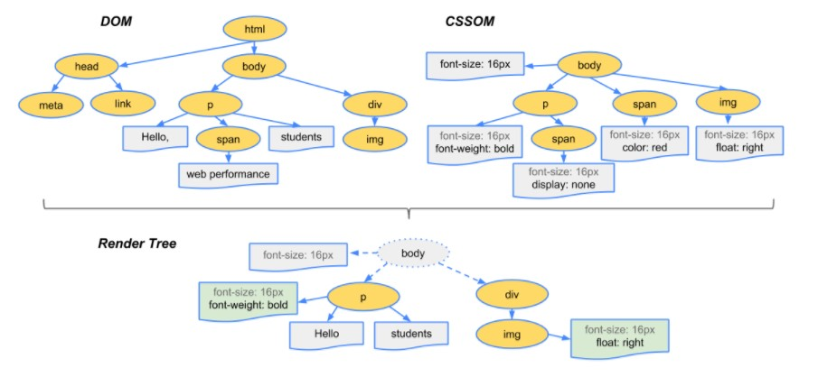

# Chapter 9 The DOM Object Model 

## BOM 

Browser Object Model (BOM):

- referring to all the objects exposed by the web browser
- provides the means to interact with the browser.


BOM is a hierarchy of objects that represent the browser window and its components.

The top level object in the BOM is the `window` object. 

<figure>


<figcaption>Browser Object Model <br/> 
Source: https://itwebtutorials.mga.edu/js/chp1/browser-object-model.aspx
</figcaption>
</figure>


<figure>


<figcaption>Browser Object Model <br/>

Source: https://medium.com/@reettikgoswami97/document-object-model-dom-c19d66abd235

</figure>

Some of the important second-level objects in the BOM are:
- History: allowing to manipulate the browser session history
- Navigator: information about the browser
- Location: reading and manipulating the URL on the browser’s address bar.


## Window Object

The `window` object is the top-level object in the BOM. It represents the browser window or tab.

All global variables and functions declared with `var` becomes properties and methods of the window object, this is not the case with let and const variables.

The `window` object is the global object and is the **default object** for JavaScript.
- It represents the window in which the script is running.

That is, if you do not specify an object, the property or method is assumed to be a property or method of the `window` object.

```javascript
alert('Hello, World!'); // same as window.alert('Hello, World!');
window.alert('Hello, World!'); // same as alert('Hello, World!');
```

`window` object provide methods to interact with the browser window, including:
- opening, closing, and resizing the window
- scrolling viewport
- prompting, alerting, confirming with dialog boxes
- and others ...

See more about the `window` object at: [Window - Web APIs | MDN](https://developer.mozilla.org/en-US/docs/Web/API/Window)


### Example 9-1 : Write a script to open a new window with a specific size and location.

```html
<script>
    // show a new window with the URL "https://example.com" 
    let exampleWin = window.open("https://example.com", "exampleWin", "resizable");
    // Resize the pop-up window to 500 pixels wide and 500 pixels high and set the window title to "Example Window" and position it to the center of the screen.
    exampleWin.resizeTo(500, 500);
    // the window.screen object contains information about the user's screen
    exampleWin.moveTo((screen.width - 500) / 2, (screen.height - 500) / 2);
</script>
```
In the above code:
- The second argument of the `open()` method is the name of the browsing context the resource is being loaded into.

## History Object

- The [`History` object](https://developer.mozilla.org/en-US/docs/Web/API/History) provides an interface for manipulating the browser session history.
- Use `window.history` property to access the `History` object.
- Use the `back()` and `forward()` methods to navigate through the history programmatically.

### Example 9-2: Navigate back to the previous page by calling the `back()` method in the console.

Open a page and navigate to another page. Then, open the browser console and type the following code to navigate back to the previous page.

```javascript
window.history.back(); 
// or simply 
history.back(); // the default object is window
```

## Location Object

- The `Location` object represents the URL of the current page.
- Use `window.location` property or `location` to get the `Location` object.
- The `Location` object provides properties to get and set the parts of the URL.
  - e.g. location.href: the full URL of the current page.
  - e.g. location.hostname: the domain name of the server.

<figure>


<figcaption>Location Object cheat sheet <br/>

Source: https://www.samanthaming.com/tidbits/86-window-location-cheatsheet/

</figcaption>
</figure>

You can find more information at [window.location Cheatsheet | SamanthaMing.com](https://www.samanthaming.com/tidbits/86-window-location-cheatsheet/) or [Location - Web APIs | MDN](https://developer.mozilla.org/en-US/docs/Web/API/Location).

## Navigator Object

- The `Navigator` object represents the state and the identity of the user agent.
- Use `window.navigator` property to access the `Navigator` object.

Typical scenarios to use the `Navigator` object include:
- Detecting the browser type and version by checking the `navigator.userAgent` property.
- Get the geographical location of the user by using the `navigator.geolocation` property.

### Example 9-3: Display the user agent string in the console.

Open the browser console and type the following code to display the user agent string.

```javascript
console.log(navigator.userAgent);
```

If you are interesting, go to [Window: navigator property - Web APIs | MDN](https://developer.mozilla.org/en-US/docs/Web/API/Window/navigator) to see how to detect the user's browser. 

## Document Object Model (DOM) 

- The `Document` object represents the HTML document loaded in the browser window.
- Whenever we modify the DOM, the browser re-renders the web page.
  - e.g. adding a new element to the DOM will cause the browser to display the new element on the web page, or
  - applying a new CSS style to an element will cause the browser to update the element's appearance.
- Use `window.document` property to access the `Document` object.

### Structure of the DOM:

- The DOM is a tree-like structure that represents the HTML document.
- The DOM comprises NODE objects.
- The `node.nodeType` property indicates the type of the node [2].
- Common node types:
    - document node (nodeType = 9)
    - element node (nodeType = 1)
    - attribute node (nodeType = 2) of an element
    - text node (nodeType = 3) of an element
    - comment node (nodeType = 8)

### Representing a HTML document via the DOM:

Consider the following HTML document:

```html
<!DOCTYPE html>
<html lang="en">
<head>
    <title>My title</title>
</head>
<body>
    <a href="">My link</a>
    <h1>My Header</h1>
</body>
</html>
```

The DOM representation of the above HTML document is as follows:


If you are interested, go to [Live DOM viewer [11]](http://software.hixie.ch/utilities/js/live-dom-viewer/) to generate a DOM tree for your HTML document.

## Selecting page elements

We must get the reference to the elements in the DOM before we can manipulate them.

The `document` object provides several `getElement...` methods to select elements in the DOM.

You can get one or more elements by id attribute, name attribute, class name, tag name or CSS selector:

- `document.getElementById(your_id)`:  Return the found HTML element (Element object) with the specified id.
- `document.getElementsByName(“your_name”)`: Return the set of elements that have the specified name attribute in an array-like object (NodeList).
- `document.getElementsByClassName(“your_class_name”)`: Return the set of elements that meet the specified class name in an array-like object (HTMLCollection).
- `document.getElementsByTagName(“your_tag_name”)`: Return the set of elements that meet the specified tag name in an array-like object (HTMLCollection).
- `document.querySelector(“your_css_selector”)`: 回傳符合 CSS 選擇器條件的第一個元素. Return the first element (Element object) that meets the specified CSS selector.
- `document.querySelectorAll(“your_css_selector”)`: Return all elements that meet the specified CSS selector in an array-like object (NodeList).

### Q: Element and Node objects?

- Element object inherits from Node object.
- Element object is the general base object for all HTML elements.
- Other specific html elements inherit from the Element object, such as HTMLDivElement, [HTMLAnchorElement](https://developer.mozilla.org/en-US/docs/Web/API/HTMLAnchorElement), HTMLInputElement, etc.

### Example: 9-4: inheritance hierarchy of the HTMLAnchorElement object.

<figure>


<figcaption>HTMLAnchorElement object inheritance hierarchy <br/> 

source: https://developer.mozilla.org/en-US/docs/Web/API/HTMLAnchorElement

</figcaption>

</figure>


### Example 9-5: Show the favorite colors.

Consider the following HTML document. We need to complete the `showColors()` function to display the selected favorite colors in the paragraph with the id "display".

```html
<!DOCTYPE html>
<html>
    <head>
    <title> Show the favorite colors </title>
    </head>
    <body>
        <!-- Checkbox group showing a list of colors -->
       <fieldset>
            <legend>Select one or more favorite colors</legend>
            <input type="checkbox" name="color" value="Red"/> <label for="Red">Red</label><br>
            <input type="checkbox" name="color" value="Yellow"/> <label for="Yellow">Yellow</label><br>
            <input type="checkbox" name="color" value="Green"/> <label for="Green">Green</label><br>
            <input type="checkbox" name="color" value="Blue"/> <label for="Blue">Blue</label><br>
        </fieldset>
        <button onclick="showColors()">Show the favorite colors</button>
        <p>Your favorite colors:</p>
        <p id="display" ></p>
    </body>
    <script>
        function showColors(){
           //TBD
        }
    </script> 
</html>
```

The steps in the `showColors()` function are as follows:
1. Select all the checkboxes with the name "color" by using the `document.getElementsByName()` method. 
   - The method returns a NodeList object which is an array-like object.
   - The NodeList object contains all the checkboxes (HtmlInputElement objects) with the name "color".
2. Iterate through the NodeList object to get the values of the checked checkboxes.
   - the `checked` property of the HtmlInputElement object indicates whether the checkbox is checked.
   - the `value` property of the HtmlInputElement object returns the value of the checkbox.
3. Append the values of the checked checkboxes to the paragraph with the id "display".
  - Use the `innerHTML` property of the paragraph to set the content with html tags.

The resultant code is as follows:

```javascript
function showColors(){
            // Get all the checkboxes
            let checkboxes = document.getElementsByName("color");  // NodeList<HtmlElement>
            // Get the display element and clear it
            const displayElement = document.getElementById("display");
            displayElement.innerHTML = "";
                // Iterate the checkboxes
            checkboxes.forEach(checkbox => {
                // If the checkbox is checked
                console.log(checkbox);
                if(checkbox.checked){
                    // Display the value of the checkbox
                    displayElement.innerHTML += checkbox.value + "<br>";
                }
            });
        }
```

## Navigating the DOM

Sometimes, we need to navigate the DOM to access the parent, child, or sibling elements of a specific element.

Use the following properties of the `Element` object to navigate the DOM:

- `element.parentElement`: returns the parent element of the element.
- `element.children`: returns a HTMLCollection of child elements of the element.
- `element.firstElementChild`: returns the first child node of the element.
- `element.lastElementChild`: returns the last child node of the element.
- `element.previousElementSibling`: returns the previous sibling node of the element.
- `element.nextElementSibling`: returns the next sibling node of the element.

<figure>


<figcaption>Element-only navigation <br/>

Source: https://javascript.info/dom-navigation#element-only-navigation

</figure>

### Example 9-6: Navigate the DOM and apply inline styles to elements

Modify the above example. In addition to showing the selected favorite colors, apply the inline style to the texts of the selected favorite colors. Change the text of the selected checkbox's label to the color it represents. For example, if the user selects the "Red" checkbox, the text of the label should be displayed in red color.


The idea to come up with the solution is as follows:
- While iterating through the checkboxes NodeList, we can access the label elements of the visited checkbox by using its `nextElementSibling` property.
- To change the text color of the label, we can set the `style.color` property of the label element to the value of the checkbox.
  - the `element.style` property returns the inline style of the element.
- For the non-selected checkboxes, we set the text color of its label to black.

The modified arrow function for the `forEach()` method is as follows:

```javascript
checkboxes.forEach(checkbox => {
                // If the checkbox is checked
                console.log(checkbox);
                if(checkbox.checked){
                    // Display the value of the checkbox
                    displayElement.innerHTML += checkbox.value + "<br>";
                    // Apply the inline style to the checkbox
                    const colorName = checkbox.value.toLowerCase();
                    const labelElement = checkbox.nextElementSibling;
                    labelElement.style.color = colorName;
                } else {
                    checkbox.nextElementSibling.style.color = "black";
                }
            });
```

## Behind the Scene: What happens when a web page is loaded?


The browser parses HTML content, then build the DOM and CSSOM. Finally, DOM and  CSS Object Model(CSSOM) are merged to create the Render Tree. The browser uses the Render Tree to render the web page [1]
 
The details are as follows[1]:

S1. The browser requests and parses the HTML file from the server.

S2. The browser requests resources, such as images, CSS files, and JavaScript files, from the server.

S3. The browser builds the following models by combining the HTML content and the resources:

- Document Object Model (DOM): A tree-like model based on the HTML content for the browser to render the web page.
- CSS Object Model (CSSOM): A tree-like model based on the CSS content for the browser to render the web page.
- Rendering Tree: A combination of the DOM and CSSOM. The browser uses the Rendering Tree to render the web page, including knowing the nodes to display in the DOM, the position and size of each node, and the computed style of each node.

S4. The browser renders the web page based on the Rendering Tree.




Refer to the following video to learn more: [The process to build the render tree (Youtube 3:04)](https://www.youtube.com/watch?v=lvb06W_VKVE)

## Summary 

- The Browser Object Model (BOM) provides objects to interact with the browser.
- The `window` object is the top-level object in the BOM.
- Other important objects in the BOM include the `History`, `Location`, and `Navigator` objects.
- The Document Object Model (DOM) represents the HTML document loaded in the browser window.
- The `document` object provides methods to select elements in the DOM.
- You can select elements by id, name, class name, tag name, or CSS selector.


## References 

[1] https://developers.google.com/web/fundamentals/performance/critical-rendering-path/constructing-the-object-model?hl=zh-tw

[2] Node.nodeType, https://developer.mozilla.org/en-US/docs/Web/API/Node/nodeType
