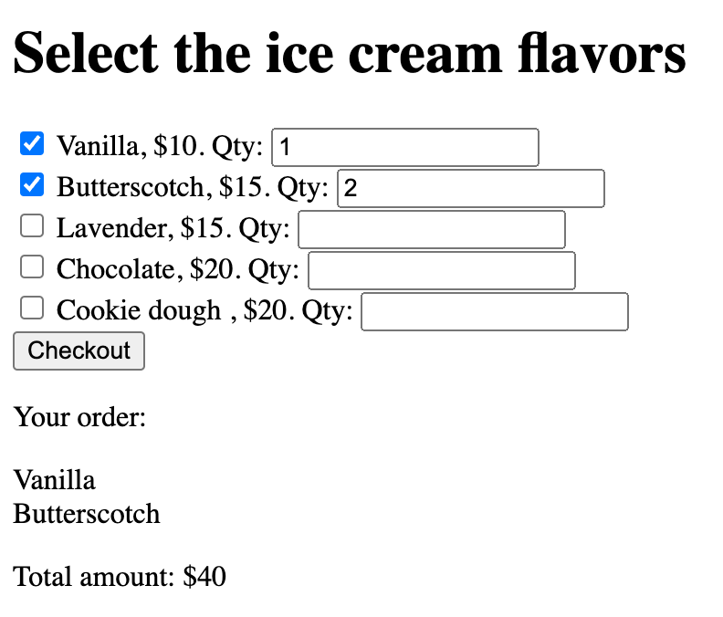

# Chapter 9 Practices 

## Practice 9.1

Consider the following HTML code:

```html
<html>
<head>
   <title> lab_03_02 </title>
</head>
<body>
    <div id="divBegin" style="color: red;" >
     Begin
        <ul id="ul1">
            <li>item 1</li>
            <li>item 2</li>
            <li>item 3 (#1) </li>
        </ul>

        <p id="par1">A
            <b> paragraph </b>
        </p>

        <ul>
            <li>Information (#2) </li>
        </ul>

        <div>End (#3) </div>
    </div>
</body>

</html>
```

Write JavaScript code to answer the following questions:

1. Log the the content of the element marked with `#1`, including the HTML tags. The output should be `item 3 <span style="color: red;"> (#1) </span> `.
2. Log the the content of the element marked with `#2`. The output should be `Information (#2)`.
3. Log the the content of the element marked with `#3`. The output should be `End (#3)`.

Note that you CANNOT modify the HTML code. You can only write JavaScript code to access the elements.

Example outputs:

```
Q1: item 3 <span style="color: red;"> (#1) </span> 
Q2: Information (#2)
Q3: End (#3) 
```

## Practice 9.2

You are going to create a simple web page that show the selected flavors and calculate their the total amount. 

The given HTML page is as follows:

```html
<!DOCTYPE html>
<html lang="en">
<head>
    <meta charset="UTF-8">
    <meta name="viewport" content="width=device-width, initial-scale=1.0">
    <meta http-equiv="X-UA-Compatible" content="ie=edge">
    <title>Practice 03_03 </title>
</head>
<body>
    <h1>Select the ice cream flavors</h1>
    <div id="flavor-list">
        <input type="checkbox" name="flavor" id="f1" value="10"/> <span>Vanilla</span>, $10. Qty: <input type="text" value="1" /> <br>
        <input type="checkbox" name="flavor" id="f2" value="15"/> <span>Butterscotch</span>, $15. Qty: <input type="text" value="1"/> <br>
        <input type="checkbox" name="flavor" id="f3" value="15"> <span>Lavender</span>, $15. Qty: <input type="text" value="1"/> <br>
        <input type="checkbox" name="flavor" id="f4" value="20"> <span>Chocolate</span>, $20. Qty: <input type="text" value="1"/> <br>
        <input type="checkbox" name="flavor" id="f5" value="20"> <span>Cookie dough</span> , $20. Qty: <input type="text" value="1"/> <br>
    </div>
    <input type="button" value="Checkout" onclick="checkout()"/>
    <div>
        <p>Your order:</p>
        <p id="flavors"></p>
        <p id="total_amount"></p>
    </div>
</body>

<script>
// Write the checkout function
function checkout(){
    // Your code here
}

</script>

</html>
```

You cannot modify the HTML code. Under this constraint, write the `checkout` function to do the following:
1. Display the selected flavors in the paragraph with the id `flavors`, each flavor should be in a new line.
2. Calculate the total amount of the selected flavors and display it in the paragraph with the id `total_amount`. The subtotal of each flavor is the product of the price and the quantity.

Example outputs:



## Practice 9.3

Consider the following HTML code:

```html
<html lang="en">
<head>
    <title>My title</title>
    <style>
    h1 {
      text-transform: uppercase;
    }
  </style>
</head>
<body>
    <a href="">My link</a>
    Lorem Ipsum is simply dummy text of the printing and typesetting industry.
    <h1>My Header</h1>
    <script>
        console.log('Hello World');
    </script>
</body>
</html>
```

1. Depict the DOM tree of the HTML code.
2. With the above html code, explain and illustrate the differences between the `nextSibling` and `nextElementSibling` properties.
3. With the above html code, explain and illustrate the differences between the `body.textContent`, `body.innerHTML`, and `body.outerHTML`, `body.innerText` and `body.outerText` properties for the `body` HTMLElement object. 
