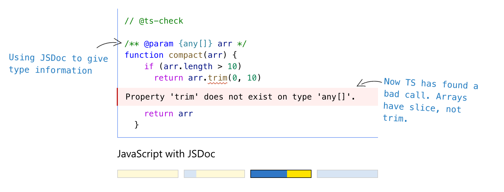
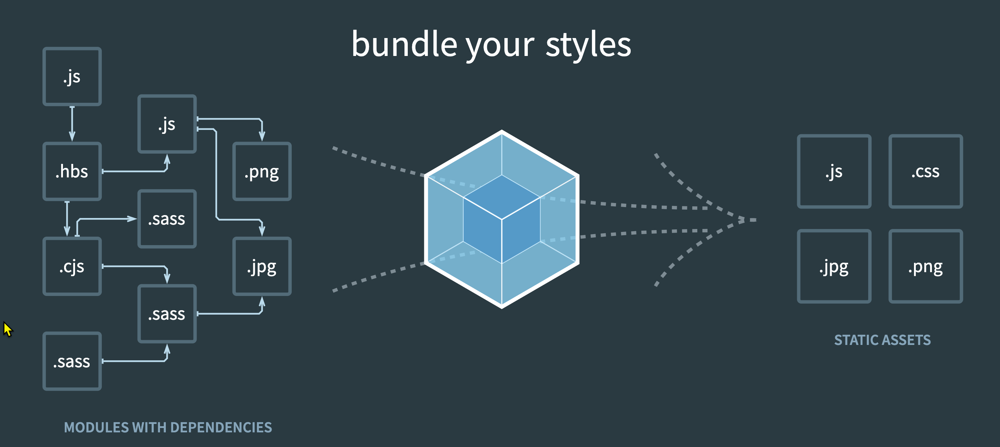
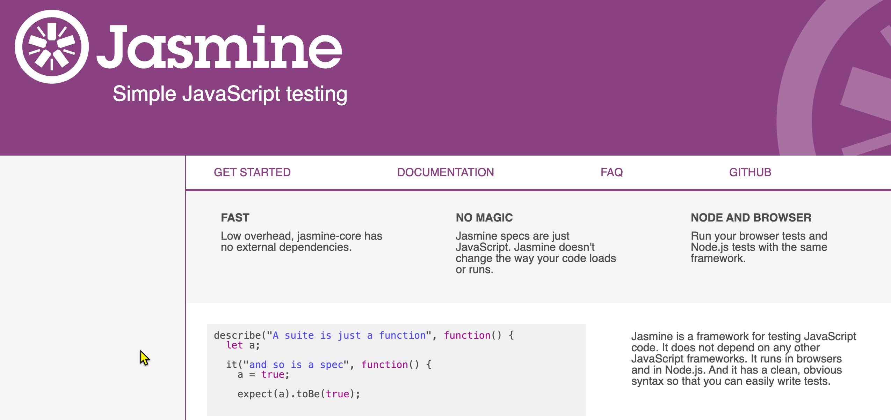

# Next Journey in the Javascript

## What we covered in the courses

- Javascript essentials: Variable, Primitive data types, operators
- Array and Objects
- Functions: basic functions, recursive functions, nested functions, Anonymous functions
- Classes: constructor, methods, inheritance, prototype
- Asynchronous programming: Callback, Promise, async/await
- DOM Event Handling 
- DOM events: keyboard events, mouse events, drag and drop events, form events
- Web APIs: DOM manipulation, fetch API, timer API

## What you should continue in your JS developer journey

Goal: develop large scale applications using Javascript

### Learn more about Javascript ES6 features
  - Modules feature: decompose your code into modules
  - Iterator and Generator: improve performance and reduce memory usage for large collections.
  - JS Standard Library: Set and Map, JSON related API, URL API, Fetch API, etc.
  - ... and more

### JS Frameworks and Libraries
  - Angular (Google) : a platform for building mobile and desktop web applications
  - Vue: a progressive framework for building user interfaces
  - React (Facebook) : a library for building user interfaces

### Typed Javascript
  - TypeScript: a superset of JavaScript that adds optional static typing
  - Check your code in the editor and compile it to JavaScript 

--- 

### Code Bundling 
  - Bundling the small modules into a single file for production
  - Tools such as Webpack, Rollup, Parcel

### Package Management
  - NPM: Node Package Manager
  - Yarn: a faster and more secure package manager

### Unit Testing
  - Test your code to ensure it works as expected so that you can integrate it into your application with confidence
  - Tools: Jest, Mocha, Jasmine

### Server-side Javascript
  - Node.js: a JavaScript runtime built on Chrome's V8 JavaScript engine
  - Express: a fast, unopinionated, minimalist web framework for Node.js

### Version Control
  - Git: a distributed version control system
  - GitHub: a web-based Git repository hosting service

## Keep learning and coding!

Learning and Master a programming language is not a sprint, it's a marathon.

## Good luck and have fun!

God bless you! 🙏

"Hold on to instruction, do not let it go; guard it well, for it is your life." Proverbs 4:13 (NIV)

